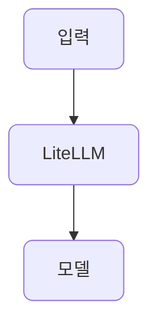

# 프로젝트 규칙

## 문서(`*.md`) 작성 문체

강의 문서를 작성·수정할 때 다음 문체 규칙을 따릅니다.

### 1. 존댓말(합니다체)로 씁니다

설명 문장은 모두 존댓말로 끝맺습니다. 평어체(`-한다`)나 명사 종결로 쓰지 않습니다.

- 나쁜 예: `여러 모델 출력을 점수화한다`
- 좋은 예: `여러 모델 출력을 점수화합니다`

### 2. 명사로 끝내지 않고, 끝에 마침표를 위해 개조식을 쓰지 않습니다

항목을 명사(`점수화`, `주의`)로 끊지 말고 완전한 서술문으로 풀어 씁니다.

- 나쁜 예: `평가 기준을 정의하고 여러 모델 출력을 점수화.`
- 좋은 예: `평가 기준을 정의하고 여러 모델 출력을 점수화합니다`

### 3. 문장을 `).` 로 끝내지 않습니다

괄호 부연을 문장 맨 끝에 두고 그 뒤에 마침표를 찍는 형태(`...연장).`)를 쓰지 않습니다.
본문은 `...합니다.` 로 끝내고, 괄호 부연이 필요하면 마침표 **뒤에** 붙이며 괄호 안에는 마침표를 찍지 않습니다.

코드가 아닌 부분에서 `).`으로 검색할 때 나오는 것이 없어야 합니다.

- 나쁜 예: `스키마 위반·잘린 JSON 등을 파싱 가드·재시도로 복구 (1단위 §5.7 retry의 연장).`
- 좋은 예: `스키마 위반·잘린 JSON 등을 파싱 가드·재시도로 복구합니다. (1단위 §5.7 retry의 연장)`
- 기타 허용되는 예: `print(chat.send_message("내 이름은 Alice야.").text)`

### 4. 강조(`**`) 안에 괄호·문장부호를 넣고 한글을 바로 붙이지 않습니다

닫는 `**` 바로 앞이 `)`나 `.` 같은 문장부호이고 그 뒤에 한글이 바로 붙으면, CommonMark flanking 규칙상 강조가 닫히지 않아 미리보기에 `**`가 그대로 노출됩니다.
강조는 글자로 끝내고, 괄호나 부연은 강조 밖으로 뺍니다.

- 나쁜 예: `**개략(outline)**입니다`
- 좋은 예: `**개략**(outline)입니다`
- 강조의 마지막이 글자이면 뒤에 한글이 바로 붙어도 정상입니다. (`**LiteLLM**을` 처럼)

### 적용 범위

- 본문 서술 문장에 적용합니다.
- 표 셀의 짧은 키워드 나열, 체크리스트 항목, 코드 주석에는 강제하지 않습니다.

## 문서 구조

### 제목에 번호를 붙입니다

`##` 이하 제목에는 계층 번호를 붙입니다. 최상위 절은 `## 1. 목표`처럼, 그 아래는 `### 1.1. ...`, 다시 그 아래는 `#### 1.1.1. ...`처럼 상위 번호를 이어받아 매깁니다.

- 문서 제목인 `#` 한 줄에는 번호를 붙이지 않습니다.
- 번호는 본문 안에서 순서대로 이어지게 유지합니다. 절을 추가·삭제하면 뒤따르는 번호도 함께 고쳐 빈 번호나 중복이 없게 합니다.

### 저장소를 공유해 실행하는 전제로 씁니다

이 과정은 VOD이고, 학습자는 코드를 한 줄씩 따라 치는 대신 이 저장소를 그대로 받아 devcontainer에서 실행합니다. 문서는 그 전제로 씁니다.

- 예제 코드는 "공유된 예제를 실행합니다", "저장소의 파일을 열어 읽습니다"처럼 받아서 실행·관찰하는 톤으로 안내합니다. "이 코드를 입력하세요", "따라 작성합니다" 같은 따라치기 지시를 쓰지 않습니다.
- 학습자가 손으로 바꿔보는 부분은 각 단위의 "직접 해보기"로 한정하고, 공유된 예제를 조금 고쳐 결과를 관찰하는 선택 실험으로 표현합니다.
- 집필 과정 메모(가령 "문서가 먼저 자리를 잡은 뒤 코드를 채웁니다")는 학습자용 문서에 남기지 않습니다.

### 다음 단원 소개는 넣지 않습니다

문서 끝에 다음 강의를 안내하는 절(가령 `## 다음 단위`)을 두지 않습니다. 각 문서는 그 단원의 내용으로 끝맺습니다.

- 본문 흐름상 "다음 단위에서 다룬다"처럼 자연스럽게 언급하는 문장은 괜찮습니다. 금지하는 것은 다음 강의로 넘기는 별도의 절입니다.

## 목록·표·그림 위주로 씁니다

강의 문서는 길게 늘어지는 산문 대신 목록, 표, 다이어그램으로 구조를 드러냅니다.

- 묶을 수 있는 항목, 순서, 비교, 조건 분기는 목록이나 표로 보여줍니다.
- 구조나 흐름은 가능하면 mermaid 다이어그램을 함께 제공합니다. 그림을 아끼지 않습니다.
- 산문은 항목과 항목을 잇는 설명, 맥락 정도로 짧게 남깁니다.

다만 한 문장 한 문장을 불릿으로 쪼개 기계적으로 나열하지는 않습니다. 목록은 정말 목록다운 내용에만 씁니다.

## Mermaid 다이어그램

구조나 흐름을 보일 때 mermaid 다이어그램을 활용합니다.

### 노드에 radius를 넣습니다

mermaid 노드는 모서리를 둥글게(radius) 그립니다. flowchart에서는 다이어그램 끝에 `classDef default` 한 줄을 넣어 모든 노드에 한 번에 radius를 적용합니다.

- `rx`, `ry`로 가로·세로 모서리 반경을 지정합니다. 기본값은 8 정도로 둡니다.
- 특정 노드만 다르게 주고 싶으면 별도 `classDef`를 만들어 `class 노드 클래스명;`으로 지정합니다.

## 사람이 쓴 글처럼

AI가 쓴 티가 심하게 나지 않게, 담백하게 씁니다.

- 굵게(`**`)·이탤릭·em 대시(—)·불릿을 과하게 쓰지 않습니다. 강조는 꼭 필요한 핵심에만 씁니다.
- 한 문장에 강조를 여러 번 박지 않습니다.
- 같은 구조의 문장을 반복하거나, 군더더기 수식어·상투어를 늘어놓지 않습니다.
- 이모지는 쓰지 않습니다.
