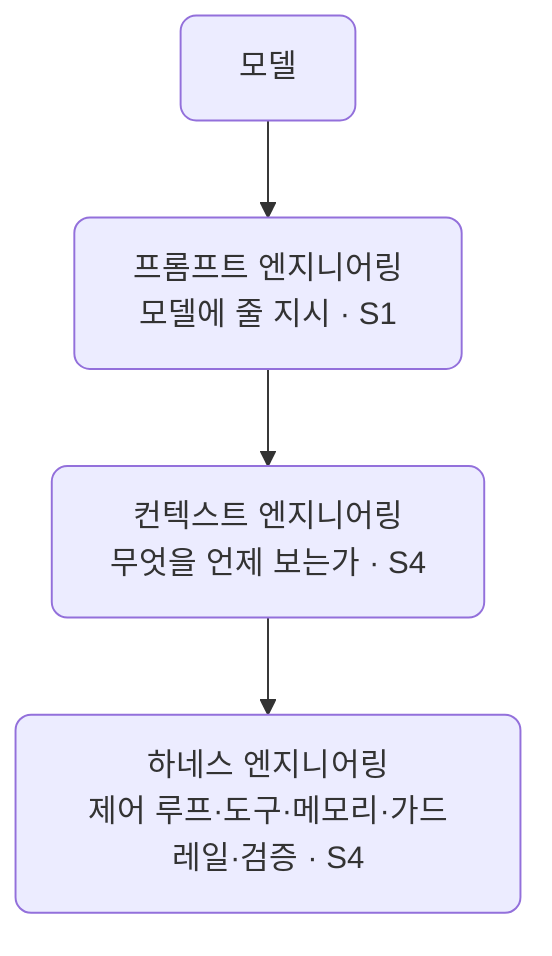
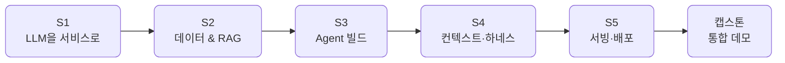

# AI 서비스 엔지니어링 — 공통 VOD

모델을 만드는 법이 아니라, 모델(들)을 조립·오케스트레이션해 **신뢰성 있는 AI 서비스를 만드는 법**을 다루는 공통 선행 VOD의 강의 자료 및 예제 코드 저장소입니다.

> 전체 강의 계획안은 [docs/plan/vod_plan.md](docs/plan/vod_plan.md)에서 확인할 수 있습니다.

## 개요

- 대상: AI 직무 전환을 희망하는 주니어 수준 현업 개발자 (재직 1~3년차)
- 형식: VOD (사전 녹화, 비동기 학습)
- 분량: 8시간 / 6개 섹션 / 30개 단위
- 위치: A·B반 분반 이전에 모두가 먼저 수강하는 공통 선행 교육

## 설계 원칙

모델 위에 세 겹의 엔지니어링 사다리가 쌓이며, 이 사다리가 과정 전체를 관통합니다.

- 프롬프트 엔지니어링 — 모델에 줄 지시 (S1)
- 컨텍스트 엔지니어링 — 모델이 무엇을 언제 보는가 (S4)
- 하네스 엔지니어링 — 그걸 돌리는 제어 루프·도구·메모리·가드레일·검증 (S4)



프로바이더 독립 원칙 (LiteLLM-first, Ollama-verified):

- 모든 생성(LLM) 호출은 반드시 LiteLLM을 경유합니다. 프로바이더별 SDK 직접 호출은 하지 않습니다.
- 모든 데모는 클라우드 모델과 Ollama 로컬 모델 양쪽에서 동작하는 것을 원칙으로 합니다. 모델 교체는 문자열 하나로 끝납니다.
- 임베딩은 예외입니다. sentence-transformers로 HF 모델을 직접 실행합니다. (소형·CPU·로컬)

## 사용 Stack

- Python 3.13+
- Docker / devcontainer (전 섹션 공통 실행 환경)
- LiteLLM — provider-agnostic LLM 호출 / tool calling / routing
- 기본 프로바이더: Google AI Studio (Gemini, 무료) / 보조: OpenAI, Claude / 옵션: Ollama (로컬)
- Pydantic v2 + instructor — 구조화 출력
- sentence-transformers (`bge-m3`) — 임베딩 (LiteLLM 미경유)
- Chroma — vector DB (RAG)
- LangGraph — 에이전트 오케스트레이션
- FastAPI — 서빙

## 커리큘럼 요약

| 섹션 | 주제 | 분 | 단위 |
| --- | --- | --- | --- |
| S1 | LLM을 서비스로 (멀티 프로바이더·프롬프트·구조화 출력) | 120 | 9 |
| S2 | 데이터 & RAG 코어 (수집·청킹·임베딩·검색 평가) | 110 | 7 |
| S3 | Agent 빌드 (function calling·multi-tool·LangGraph) | 102 | 6 |
| S4 | 컨텍스트 & 하네스 엔지니어링 (신뢰성) | 86 | 5 |
| S5 | 서빙 & 배포 (FastAPI → Render/Railway) | 40 | 2 |
| 캡스톤 | end-to-end 미니 데모 | 22 | 1 |
| 합계 | | 480 | 30 |



각 단위의 상세 내용은 [docs/plan/vod_plan.md](docs/plan/vod_plan.md)를 참고하시기 바랍니다.

## 선행학습 권장 사항

- Python 중급 (함수/클래스, decorator, 기본 async)
- Git / GitHub 기본 사용 경험
- HTTP / REST API · JSON 이해
- Docker Desktop 설치 + `docker run` / `docker build` 동작 확인
- VSCode + Dev Containers 확장 설치
- Google Gemini API key 발급 완료 (무료 티어 권장)

## 개발 환경 셋업

이 저장소는 강사·학생 전원이 OS·Python 버전과 무관하게 동일한 환경을 쓰도록 devcontainer로 구성되어 있습니다.

1. Docker Desktop과 VSCode Dev Containers 확장을 설치합니다.
2. VSCode에서 이 폴더를 열고 "Reopen in Container"를 실행합니다. 첫 빌드 때 `uv sync`가 자동으로 의존성을 설치합니다.
3. API key를 채웁니다.

```bash
# 저장소 루트에서
cp .env.sample .env
# .env를 열어 GEMINI_API_KEY=... 를 채웁니다.
# (OPENAI/ANTHROPIC/Ollama는 선택)
```

`.env`는 gitignore되어 있어 절대 커밋되지 않습니다. 키는 이미지에 굽지 않고 실행 시점에 주입합니다.

## 저장소 구조

```plaintext
ai_service_engineering/
├── .devcontainer/           # 전 섹션 공통 개발 환경 (Reopen in Container)
│   ├── devcontainer.json
│   └── Dockerfile
├── .vscode/                 # 에디터·pytest 설정
├── docs/
│   └── plan/
│       └── vod_plan.md      # 공통 VOD 계획안
├── .env.sample              # 루트 — 공통 API key 템플릿
├── pyproject.toml           # uv 기반 의존성 (통합)
├── .gitignore
└── README.md
```

> `src/`, `tests/`, 강의 문서(`docs/`)는 vod_plan에 맞춰 이후 추가됩니다. 섹션별 예제 코드(S1~S5 + 캡스톤)와 단위 테스트가 여기에 채워집니다.

## License

강의 자료의 라이선스는 추후 명시 예정입니다.
