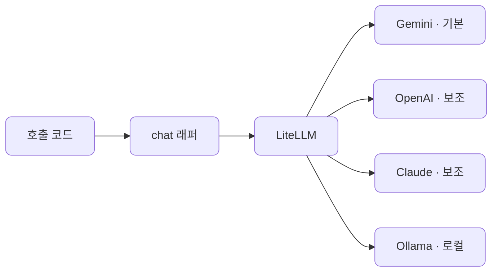
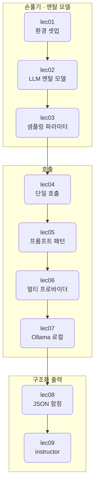

# S1 — LLM을 서비스로

> 상위 계획: [docs/plan/vod_plan.md](../plan/vod_plan.md)의 S1 항목

멀티 프로바이더 호출부터 신뢰할 수 있는 구조화 출력까지, 서비스 소비자 관점의 기본기를 다룹니다. 모델을 직접 만들지 않고, 이미 있는 모델을 호출해 서비스의 한 부품으로 쓰는 감각을 잡는 것이 이 섹션의 목표입니다.

이 섹션을 마치면 클라우드 모델과 로컬 Ollama 모델을 같은 코드로 부르고, 출력이 깨질 때 이를 검증·교정하는 작은 함수까지 손에 들어옵니다.

## 관통하는 원칙

S1의 모든 예제는 LiteLLM을 경유합니다. 첫 호출부터 프로바이더별 SDK를 직접 부르지 않고 `litellm.completion` 하나로 시작합니다. 그래야 뒤에서 모델을 바꿀 때 코드가 아니라 문자열만 바뀝니다. 이 결정이 lec04부터 lec09까지를 하나로 꿰는 축입니다.

임베딩만 예외입니다. S1에서는 임베딩을 다루지 않으므로 이 예외는 S2에서 처음 등장합니다.

## 단위 구성

| 단위 | 분 | 주제 | 산출물 |
| --- | --- | --- | --- |
| [lec01](lec01/README.md) | 12 | 환경 셋업 | 동작하는 개발 컨테이너 |
| [lec02](lec02/README.md) | 15 | LLM 멘탈 모델 | 개념 |
| [lec03](lec03/README.md) | 10 | 샘플링 파라미터 | 비교 노트북 |
| [lec04](lec04/README.md) | 12 | 단일 provider 호출 | 호출 스니펫 |
| [lec05](lec05/README.md) | 18 | 프롬프트 패턴 | 프롬프트 템플릿 |
| [lec06](lec06/README.md) | 16 | LiteLLM 멀티 프로바이더 | 멀티 프로바이더 래퍼 |
| [lec07](lec07/README.md) | 12 | Ollama 로컬 | 로컬 호출 예제 |
| [lec08](lec08/README.md) | 13 | 구조화 출력 1 | Pydantic 모델 |
| [lec09](lec09/README.md) | 12 | 구조화 출력 2 | 안전한 추출 함수 |

합계 120분, 9단위입니다.

## 흐름

앞의 세 단위는 손을 풀고 머릿속 모델을 세우는 구간입니다. lec01에서 환경을 맞추고, lec02에서 LLM을 어떻게 바라볼지, lec03에서 출력을 어디까지 흔들 수 있는지 감을 잡습니다.

lec04부터 실제 호출이 시작됩니다. 단일 모델 호출(lec04)에서 출발해 프롬프트를 설계하고(lec05), 같은 코드로 프로바이더를 바꾼 다음(lec06) lec07에서 로컬 모델까지 끌어옵니다. 마지막 두 단위는 자연어 응답을 프로그램이 믿고 쓸 수 있는 구조화 데이터로 바꾸는 방법입니다. lec08에서 함정을 보고, lec09에서 instructor로 해결합니다.

## 코드와 테스트

각 단위의 실습 코드는 [src/section1](../../src/section1)에, 테스트는 [tests/section1](../../tests/section1)에 같은 `lecNN` 구조로 들어갑니다. 문서가 먼저 자리를 잡은 뒤 코드를 채웁니다.
