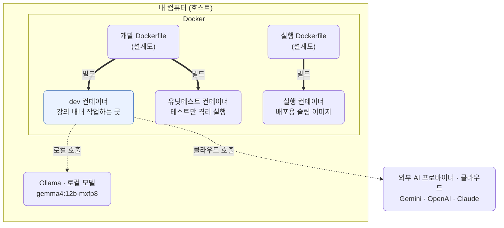
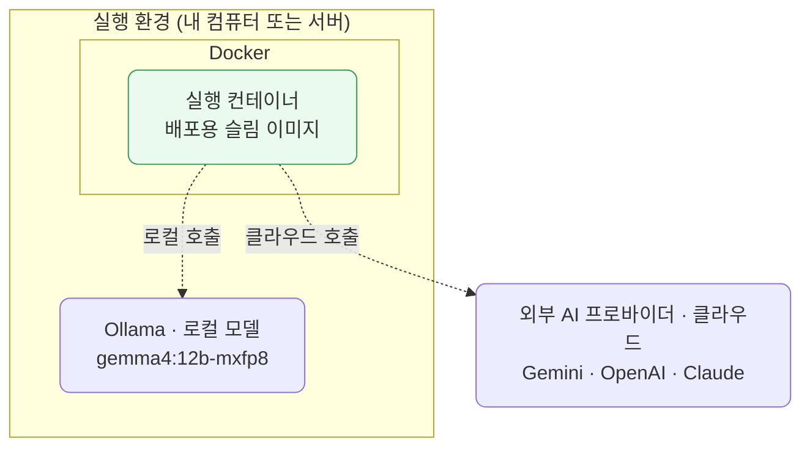

# lec01 — 환경 셋업

> S1 개요: [docs/section1/README.md](../README.md) · 분량 12분 · 산출물: 동작하는 개발 컨테이너

## 목표

이 강의를 마치면 다음을 갖게 됩니다.

- OS나 파이썬 버전과 무관하게 강사와 똑같이 도는 개발 컨테이너
- 그 안에서 공유된 예제 코드를 실행해 로컬 모델과 클라우드 모델에 모두 닿는 상태

이번 단위는 코드를 작성하는 단위가 아닙니다. 환경을 맞추고 공유된 예제 하나를 실행해 연결을 확인하는 것이 산출물입니다.



그림은 두 가지 흐름으로 읽습니다. 굵은 화살표는 Dockerfile이라는 설계도로 컨테이너를 찍어내는 빌드 흐름이고, 점선은 컨테이너가 모델을 호출하는 흐름입니다. 우리가 강의 내내 실제로 들어가 작업하는 곳은 파란색으로 강조한 dev 컨테이너입니다. 이 컨테이너가 호스트의 Ollama(로컬)와 외부 프로바이더(클라우드)를 모두 부릅니다. 실행 컨테이너도 출하 뒤 같은 방식으로 모델을 부르며, 클라우드 프로바이더만 내 컴퓨터 바깥에 있습니다.

## 개발 컨테이너와 실행 컨테이너

위 그림의 컨테이너 셋은 두 종류의 Dockerfile에서 나옵니다.

- 개발 Dockerfile로 개발 컨테이너(devcontainer)와 유닛테스트 컨테이너를 만듭니다. devcontainer는 우리가 코드를 읽고 실행하고 문법을 확인하는, 강의 내내 들어가 있는 작업 공간입니다. 유닛테스트 컨테이너는 같은 개발 환경에서 테스트만 격리해 돌릴 때 씁니다.
- 실행 Dockerfile로 실행 컨테이너를 만듭니다. 실제 서비스로 출하할 때 쓰는, 그 코드에 필요한 의존성만 담은 슬림한 이미지입니다.

핵심은 개발 환경과 실행 환경을 나눈다는 점입니다. devcontainer는 어디까지나 개발을 위한 컨테이너일 뿐이고, 실제 서비스는 실행 Dockerfile로 만든 별도의 컨테이너에서 돕니다. 지금 단위에서 준비하는 것은 개발 컨테이너(devcontainer)뿐이며, 실행 Dockerfile은 각 단위의 코드를 다룰 때 함께 등장합니다. 이 구분을 머리에 넣어두면 뒤에서 "왜 Dockerfile이 여러 개죠"라는 혼란이 없습니다.

실행 컨테이너도 출하된 뒤에는 같은 방식으로 모델을 부릅니다. 호출하는 코드는 dev에서 보던 것과 같고, 들어가는 컨테이너만 바뀝니다.



dev 컨테이너에서 보던 호출 구조가 그대로 실행 컨테이너로 옮겨온 모습입니다. LiteLLM을 거치므로 백엔드 선택은 여전히 모델 문자열 하나로 끝납니다. 배포 환경에 로컬 Ollama가 없으면 클라우드 프로바이더만 부르게 됩니다.

## 사전 준비

다음 세 가지는 호스트(여러분의 실제 OS)에 설치되어 있어야 합니다.

- Docker Desktop. 설치 후 `docker run hello-world`가 도는지 확인합니다.
- VSCode.
- VSCode 확장 Dev Containers를 설치합니다. (확장 ID `ms-vscode-remote.remote-containers`)

## 컨테이너 열기

1. 강사가 공유한 저장소를 받아 VSCode로 엽니다.
2. 명령 팔레트에서 "Dev Containers: Reopen in Container"를 실행합니다.
3. 첫 빌드는 이미지를 받느라 몇 분 걸립니다. 빌드가 끝나면 `postCreateCommand`로 `uv sync`가 자동 실행되며 의존성이 `/workspace/.venv`에 설치됩니다.

빌드가 끝나면 VSCode 좌하단에 컨테이너 이름이 보입니다. 통합 터미널을 열어 `python --version`이 3.13으로 나오면 성공입니다.

이 환경 설정의 실제 파일은 [.devcontainer/devcontainer.json](../../../.devcontainer/devcontainer.json)과 [.devcontainer/Dockerfile](../../../.devcontainer/Dockerfile)에 있습니다. 한 번 열어보면 무엇이 고정되는지 감이 잡힙니다.

## Ollama 설치와 모델 받기

이 과정의 모든 데모는 클라우드 모델과 로컬 Ollama 모델 양쪽에서 도는 것을 원칙으로 합니다. 로컬 모델은 키가 필요 없어 가장 먼저 연결을 확인하기에 좋습니다.

Ollama는 컨테이너 안이 아니라 호스트에 설치합니다. <https://ollama.com> 에서 각 OS용 설치본을 받아 설치하면 백그라운드 서비스로 11434 포트에서 돕니다. 설치 후 이 과정에서 쓸 모델을 받습니다.

```bash
# 호스트에서
ollama pull gemma4:12b-mxfp8      # 모델 받기 (용량이 커서 시간이 걸립니다)
ollama list                       # 받은 모델 확인
ollama run gemma4:12b-mxfp8 "안녕"  # 한 번 직접 호출해 응답이 오는지 확인
```

`ollama run`에서 답이 돌아오면 호스트의 Ollama는 정상입니다. devcontainer 안에서는 호스트의 11434 포트에 `host.docker.internal` 주소로 닿습니다. devcontainer 설정에 `--add-host=host.docker.internal:host-gateway`가 들어 있어 Linux 호스트에서도 동작합니다.

## 첫 실행으로 연결 확인

환경이 맞춰졌는지 공유된 예제 하나를 실행해 확인합니다. 이 예제는 로컬 Ollama를 부르므로 키 없이 바로 돕니다.

```bash
# devcontainer 터미널에서
uv run python src/section1/lec01/smoke_test.py
```

Ollama의 응답이 출력되면 devcontainer와 uv 환경, 호스트 Ollama 연결까지 한 번에 확인된 것입니다. 코드를 직접 입력할 필요 없이, 받은 코드를 실행만 했다는 점에 주목합니다. 이것이 앞으로의 기본 흐름입니다.

## 클라우드 키 준비

클라우드 모델은 키가 필요합니다. 키는 개인 비밀이라 저장소로 공유되지 않으므로, 직접 발급해 넣어야 합니다. 이 과정에서 여러분이 손으로 채우는 몇 안 되는 부분 중 하나입니다.

기본 프로바이더는 Google AI Studio의 Gemini이고 무료 티어로 충분합니다. OpenAI와 Claude는 프로바이더 교체를 보일 때 쓰는 보조라 없어도 진행에 지장이 없습니다.

- Google AI Studio: <https://aistudio.google.com/api-keys> 에서 키를 발급합니다. 필수입니다.
- OpenAI Platform: <https://platform.openai.com/api-keys> 에서 발급합니다. 선택입니다.
- Claude Platform: <https://console.anthropic.com/settings/keys> 에서 발급합니다. 선택입니다.

발급한 키는 저장소 루트에 `.env`를 만들어 채웁니다. 이 파일은 gitignore되어 있어 커밋되지 않습니다.

```bash
cp .env.sample .env
# .env를 열어 GEMINI_API_KEY= 뒤에 발급받은 키를 채웁니다.
```

키가 들어가면 다음 단위부터 클라우드 모델도 같은 코드로 부를 수 있습니다. 키 발급이 늦어지면 우선 Ollama만으로 진행해도 됩니다.

## 확인 체크리스트

- "Reopen in Container"가 성공했고 터미널에서 `python --version`이 3.13으로 나옵니다.
- 호스트에서 `ollama run`이 응답합니다.
- `uv run python src/section1/lec01/smoke_test.py`가 Ollama의 답을 출력합니다.
- (선택) `.env`에 `GEMINI_API_KEY`를 채워 클라우드도 쓸 준비가 됐습니다.

여기까지 되면 다음 단위로 넘어갈 준비가 끝났습니다.

## 다음 단위

[lec02 — LLM 멘탈 모델](../lec02/README.md)에서 호출에 앞서 LLM을 어떻게 바라봐야 하는지 정리합니다.
