# lec01 — 환경 셋업

> - S1 개요: [docs/section1/README.md](../README.md)
> - 분량 12분
> - 산출물: 동작하는 개발 컨테이너

## 1. 목표

이 강의를 마치면 다음을 갖게 됩니다.

- OS나 파이썬 버전과 무관하게 강사와 똑같이 도는 개발 컨테이너
- 그 안에서 공유된 예제 코드를 실행해 로컬 모델과 클라우드 모델에 모두 닿는 상태

이번 단위는 코드를 작성하는 단위가 아닙니다. 환경을 맞추고 공유된 예제 하나를 실행해 연결을 확인하는 것이 산출물입니다.

## 2. 사전 준비

다음 세 가지는 호스트(여러분의 실제 OS)에 설치되어 있어야 합니다.

- Docker Desktop. 설치 후 `docker run hello-world`가 도는지 확인합니다.
- VSCode.
- VSCode 확장 Dev Containers를 설치합니다. (확장 ID `ms-vscode-remote.remote-containers`)

## 3. 개발 컨테이너와 실행 컨테이너

내 컴퓨터 위에서 Docker가 컨테이너를 띄웁니다. 컨테이너는 두 종류의 Dockerfile에서 나옵니다.

- 개발 Dockerfile로 개발 컨테이너(devcontainer)와 유닛테스트 컨테이너를 만듭니다.
- 실행 Dockerfile로 실행 컨테이너를 만듭니다.

핵심은 개발 환경과 실행 환경을 나눈다는 점입니다. devcontainer는 어디까지나 개발을 위한 컨테이너일 뿐이고, 실제 서비스는 실행 Dockerfile로 만든 별도의 컨테이너에서 돕니다. 지금 단위에서 준비하는 것은 개발 컨테이너(devcontainer)뿐이며, 실행 Dockerfile은 각 단위의 코드를 다룰 때 함께 등장합니다.

아래 두 그림은 읽는 법이 같습니다. Dockerfile은 저장소에 있는 설계도 파일이라 Docker 박스 밖에 있고, Docker가 그것을 읽어 만든 컨테이너는 Docker 안에 있습니다. 굵은 화살표는 빌드, 점선은 컨테이너가 모델을 호출하는 흐름입니다.

### 3.1. 개발 컨테이너

우리가 강의 내내 들어가 작업하는 곳입니다. 코드를 읽고 실행하고 문법을 확인하며, 호스트의 Ollama(로컬)와 외부 프로바이더(클라우드)를 모두 부릅니다. 아래 그림에서 파란색으로 강조한 곳입니다. 유닛테스트 컨테이너도 같은 개발 Dockerfile에서 나와, 테스트만 격리해 돌릴 때 씁니다.

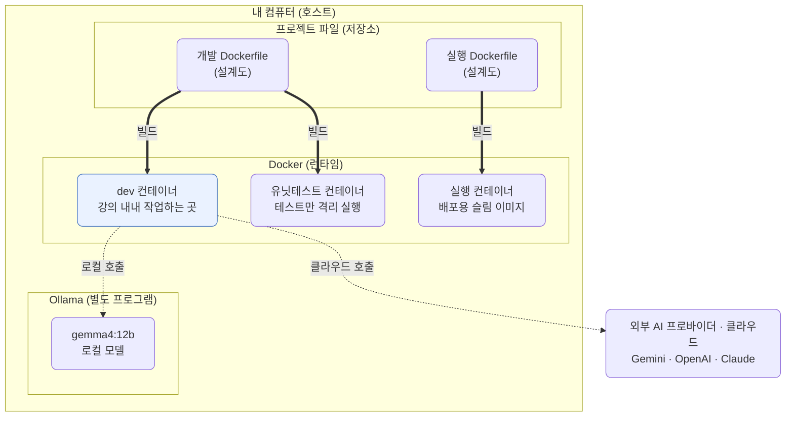

이 컨테이너의 설계도가 [.devcontainer/Dockerfile](../../../.devcontainer/Dockerfile)입니다. 도구는 깔되 코드는 굽지 않는 것이 특징입니다.

```dockerfile
# .devcontainer/Dockerfile — 개발용
FROM python:3.13-slim

# 개발에 필요한 도구까지 설치한다 (git, 빌드 도구, uv)
RUN apt-get update && apt-get install -y --no-install-recommends \
        git curl ca-certificates build-essential \
    && rm -rf /var/lib/apt/lists/*
COPY --from=ghcr.io/astral-sh/uv:latest /uv /uvx /usr/local/bin/

WORKDIR /workspace
# 코드를 COPY하지 않는다. devcontainer.json이 호스트 저장소를 /workspace에 마운트하고,
# 컨테이너 생성 뒤 postCreateCommand의 `uv sync`가 의존성을 깐다.
```

코드를 이미지에 넣지 않고 호스트 저장소를 그대로 마운트하므로, 파일을 고치면 컨테이너 안에 즉시 반영됩니다. 다시 빌드할 필요가 없습니다.

### 3.2. 실행 컨테이너

실제 서비스로 출하할 때 쓰는, 그 코드에 필요한 의존성만 담은 슬림한 이미지입니다. 출하된 뒤에도 같은 방식으로 모델을 부릅니다. 그림은 위와 똑같고 강조되는 컨테이너만 dev에서 실행 컨테이너로 바뀝니다. 호출하는 코드도 dev에서 보던 것과 같습니다.

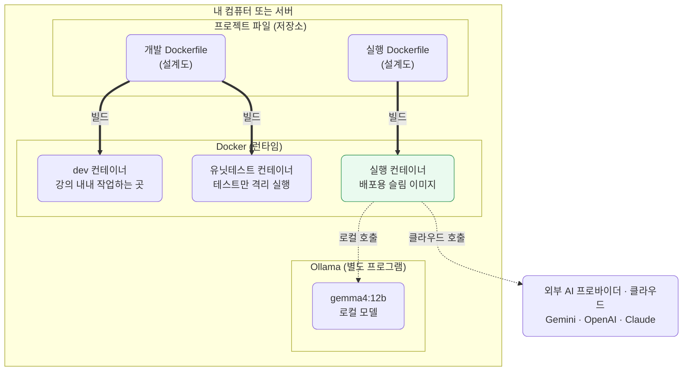

실행 컨테이너의 Dockerfile은 반대로, 코드를 이미지 안에 복사해 자기완결적으로 만듭니다. 아래는 예시이며, 실제 파일은 각 단위의 코드와 함께 추가됩니다.

```dockerfile
# src/section1/lecNN/Dockerfile — 실행용 (예시)
FROM python:3.13-slim

WORKDIR /app

# 그 코드에 필요한 런타임 의존성만 설치한다 (개발 도구는 넣지 않는다)
COPY requirements.txt .
RUN pip install --no-cache-dir -r requirements.txt

# 코드를 이미지 안으로 복사한다. 호스트 없이도 이 이미지 하나로 돈다
COPY . .
CMD ["python", "main.py"]
```

호스트 저장소에 의존하지 않으므로 어디서든 이 이미지 하나로 돌릴 수 있고, 그래서 배포에 적합합니다. LiteLLM을 거치므로 백엔드 선택은 여전히 모델 문자열 하나로 끝납니다. 배포 환경에 로컬 Ollama가 없으면 클라우드 프로바이더만 부르게 됩니다.

### 3.3. 두 Dockerfile의 차이

설치하는 베이스나 파이썬은 비슷하지만, 코드를 다루는 방식과 무게가 다릅니다.

| 항목 | 개발 컨테이너 (`.devcontainer/Dockerfile`) | 실행 컨테이너 (`lecNN/Dockerfile`) |
| --- | --- | --- |
| 코드 | 호스트 저장소를 마운트, 편집 즉시 반영 | 이미지에 복사(COPY), 자기완결 |
| 의존성 | 개발 도구까지 포함 (git·빌드 도구·uv) | 그 코드에 필요한 런타임만, 슬림 |
| 실행 | 사람이 들어가 작업하고 `uv sync`로 구성 | `CMD`로 앱을 바로 실행 |
| 코드 변경 시 | 마운트라 리빌드 불필요 | 다시 빌드해 출하 |
| 목적 | 개발·실습 | 배포 |

## 4. 컨테이너 열기

1. 강사가 공유한 저장소를 받아 VSCode로 엽니다.
2. 명령 팔레트에서 "Dev Containers: Reopen in Container"를 실행합니다.
3. 첫 빌드는 이미지를 받느라 몇 분 걸립니다. 빌드가 끝나면 `postCreateCommand`로 `uv sync`가 자동 실행되며 의존성이 `/workspace/.venv`에 설치됩니다.

빌드가 끝나면 VSCode 좌하단에 컨테이너 이름이 보입니다. 통합 터미널을 열어 `python --version`이 3.13으로 나오면 성공입니다.

이 환경 설정의 실제 파일은 [.devcontainer/devcontainer.json](../../../.devcontainer/devcontainer.json)과 [.devcontainer/Dockerfile](../../../.devcontainer/Dockerfile)에 있습니다. 한 번 열어보면 무엇이 고정되는지 감이 잡힙니다.

## 5. 모델 프로바이더 준비 — 넷 중 하나 이상

LLM을 부르려면 다음 네 가지 중 적어도 하나가 준비되어 있어야 합니다. 모두 LiteLLM을 거치므로, 무엇을 고르든 호출 코드는 같고 모델 문자열만 달라집니다.

| 프로바이더 | 종류 | 비용 | 준비물 |
| --- | --- | --- | --- |
| Google AI Studio (Gemini) | 클라우드 | 무료 티어 또는 유료 | API 키 |
| OpenAI Platform | 클라우드 | 유료 | API 키 |
| Claude Platform | 클라우드 | 유료 | API 키 |
| Ollama | 로컬(기본) | 무료 또는 유료(Ollama Cloud) | 호스트 설치 + 모델 |

가장 빠르게 시작하려면 무료인 둘, 즉 Gemini(클라우드)나 Ollama(로컬) 중 하나를 권장합니다. 다만 이 과정의 데모는 클라우드와 로컬 양쪽에서 도는 것을 원칙으로 하므로, 여유가 되면 클라우드 하나와 Ollama를 함께 준비해 두는 편이 좋습니다. 여러 개를 준비했다면 어느 것을 먼저 쓸지는 `.env`의 `DEFAULT_PROVIDER`로 정합니다.

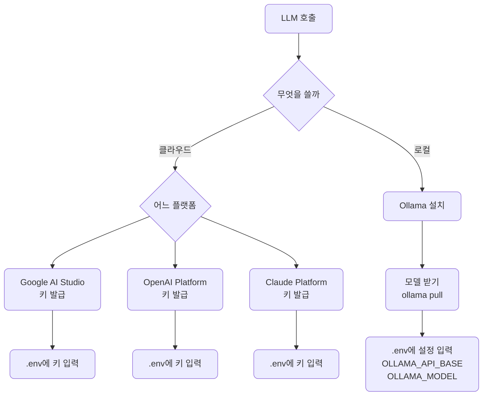

### 5.1. 클라우드 프로바이더 — 키 발급

클라우드 모델은 키가 필요합니다. 키는 개인 비밀이라 저장소로 공유되지 않으므로 직접 발급해 넣습니다. 클라우드를 쓴다면 아래에서 하나 이상 발급합니다.

- Google AI Studio: <https://aistudio.google.com/api-keys> 에서 발급합니다. 무료 티어로 강의 전체를 진행할 수 있어 가장 권장합니다.
- OpenAI Platform: <https://platform.openai.com/api-keys> 에서 발급합니다. 유료입니다.
- Claude Platform: <https://console.anthropic.com/settings/keys> 에서 발급합니다. 유료입니다.

발급한 키는 저장소 루트에 `.env`를 만들어 채웁니다. 이 파일은 gitignore되어 있어 커밋되지 않습니다.

```bash
cp .env.sample .env
# .env를 열어 사용할 프로바이더의 키를 채웁니다. 예: GEMINI_API_KEY=...
```

각 플랫폼의 콘솔 화면과 무료 한도는 시점에 따라 바뀌므로, 막히는 부분은 강의 영상의 화면을 따라가시기 바랍니다.

#### 5.1.1. Google AI Studio 화면으로 따라 하기

권장 프로바이더인 Google AI Studio를 예로 화면을 따라가 봅니다. 화면은 시점에 따라 바뀌므로 버튼 위치가 달라도 흐름만 같으면 됩니다. 프로젝트를 만들고 키를 발급해 `.env`에 넣는 1·2단계까지만 하면 무료 티어로 바로 호출됩니다. 한도를 늘리거나 최신 모델을 쓰려면 3단계에서 결제를 붙이고, 그때는 4단계로 지출 한도를 걸어 과금을 막아 둡니다.

##### 5.1.1.1. 프로젝트 만들기

[aistudio.google.com](https://aistudio.google.com/)에서 프로젝트 목록을 열고 새 프로젝트를 만듭니다. 이름은 나중에 알아보기 쉬운 것으로 정합니다.

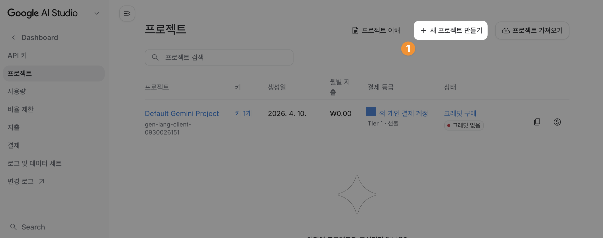
*프로젝트 목록 화면입니다. 우상단의 "새 프로젝트 만들기"를 누릅니다.*

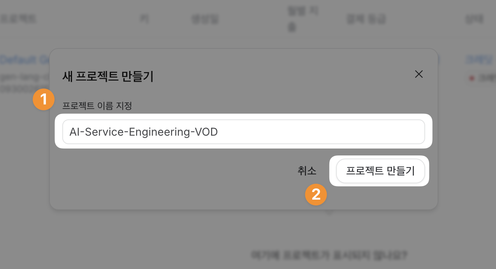
*프로젝트 이름을 입력하고 "프로젝트 만들기"를 누릅니다.*

##### 5.1.1.2. API 키 발급해 `.env`에 넣기

만든 프로젝트에서 API 키를 만들고 키 이름을 정한 뒤 생성합니다. 세부정보 창에서 키를 복사해 저장소 루트 `.env`의 `GEMINI_API_KEY`에 붙여넣습니다. 키는 한 번 닫으면 다시 전체가 보이지 않으니 이때 복사해 둡니다. 여기까지면 무료 티어로 호출이 됩니다.

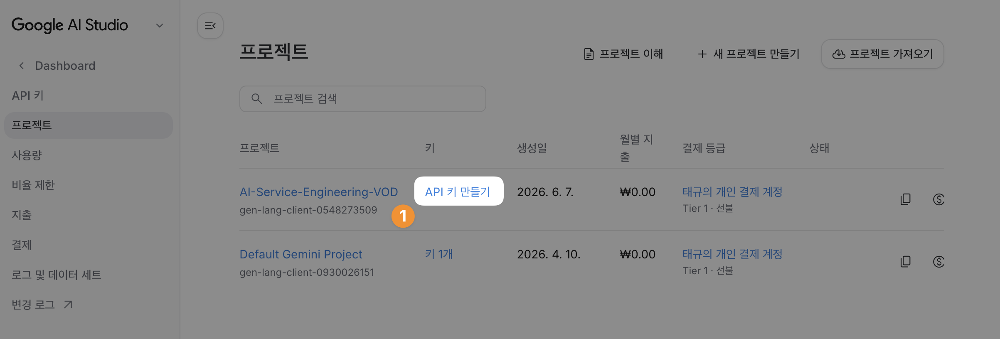
*방금 만든 프로젝트 행에서 "API 키 만들기"를 누릅니다.*

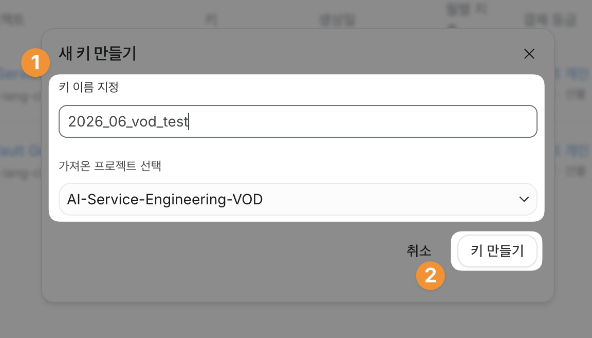
*키 이름을 정하고 대상 프로젝트를 고른 뒤 "키 만들기"를 누릅니다.*

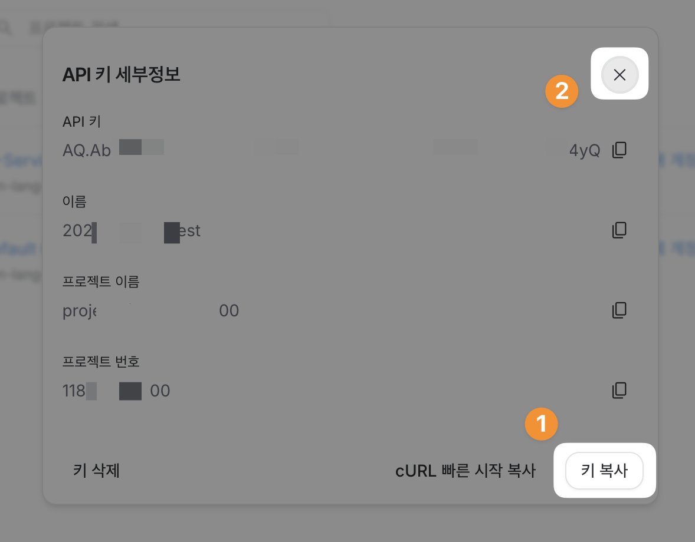
*세부정보 창에서 "키 복사"로 키를 복사합니다. 이 값은 창을 닫으면 다시 전체가 보이지 않습니다.*

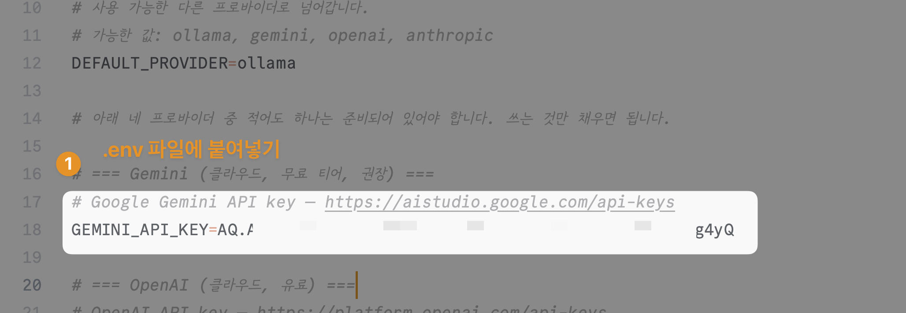
*복사한 키를 저장소 루트 `.env`의 `GEMINI_API_KEY` 값으로 붙여넣습니다.*

##### 5.1.1.3. 결제를 붙여 유료 등급 켜기 (선택)

무료 티어 한도에 자주 막히거나 더 높은 한도·모델이 필요하면 결제 계정을 연결하고 크레딧을 구매합니다. 결제가 끝나면 유료(Tier 1) 등급이 켜집니다. 결제를 붙인 프로젝트는 크레딧이 0이 되면 무료 티어로 돌아가지 않고 호출이 막히므로, 유료로 쓸 생각이면 크레딧을 채워 둡니다.

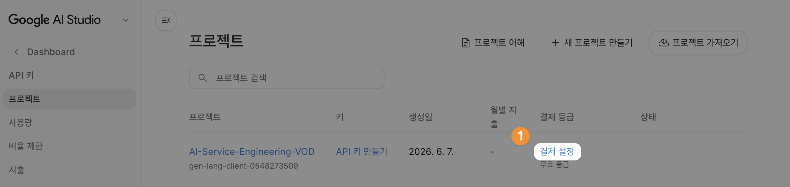
*유료로 쓰려면 프로젝트의 "결제 설정"을 엽니다. 지금은 무료 등급 상태입니다.*

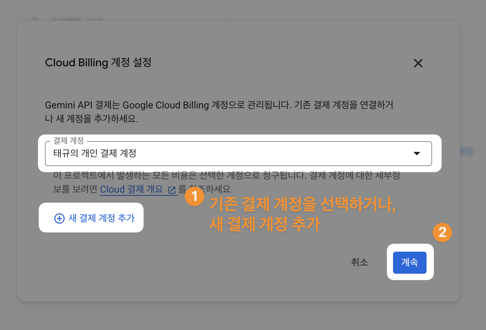
*기존 Cloud Billing 계정을 고르거나 새로 추가한 뒤 "계속"을 누릅니다.*

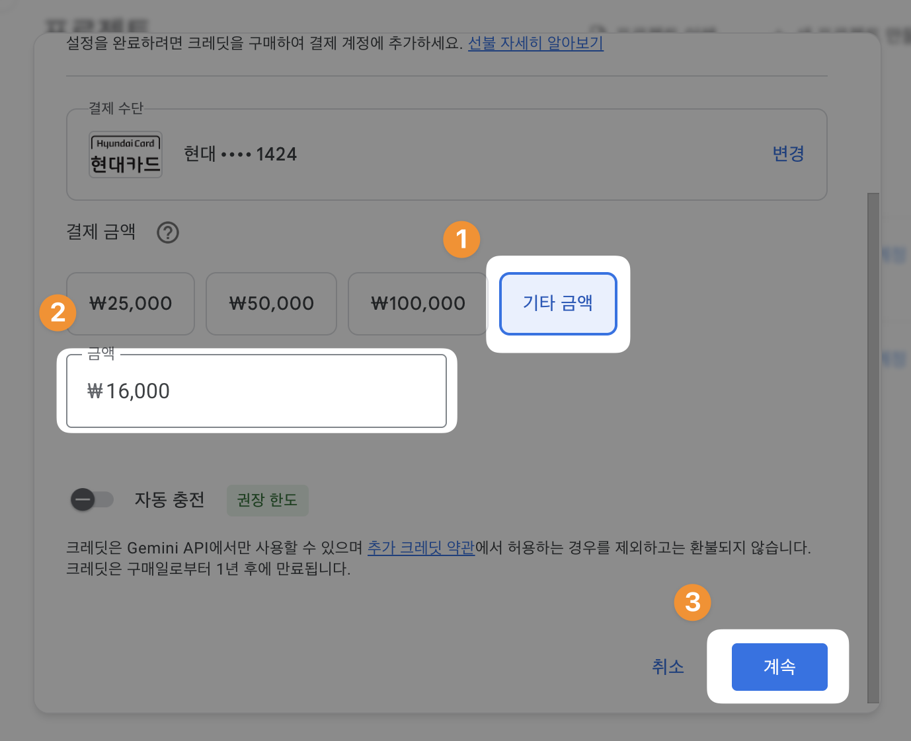
*결제 수단을 확인하고 충전할 크레딧 금액을 골라 결제를 진행합니다.*

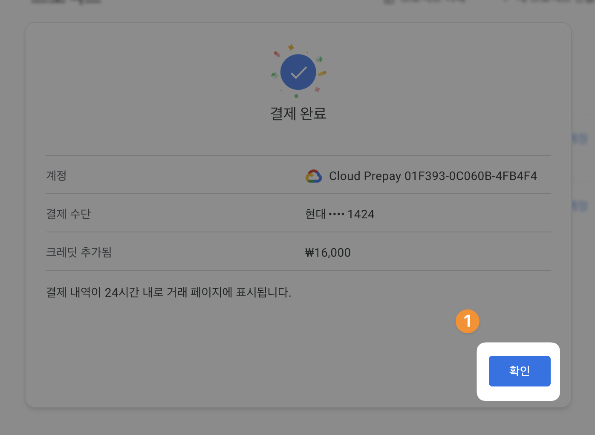
*결제가 끝나면 선불(Cloud Prepay) 계정에 크레딧이 충전됩니다.*

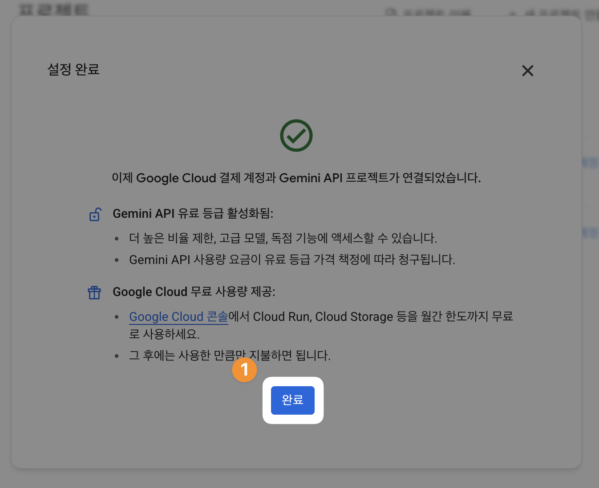
*결제 계정과 프로젝트가 연결되어 유료(Tier 1) 등급이 켜집니다.*

##### 5.1.1.4. 지출 한도 걸기 (결제를 붙였다면 권장)

결제를 붙였다면 월 지출 한도를 정해 둡니다. 한도에 닿으면 사용이 멈춰, 실수로 과금이 불어나는 것을 막는 안전장치입니다.

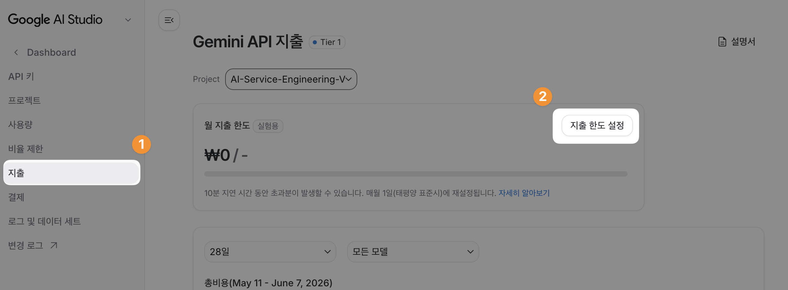
*좌측 "지출" 메뉴로 들어가 "지출 한도 설정"을 엽니다.*

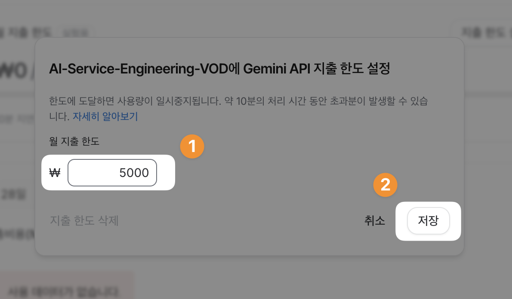
*월 지출 한도 금액을 입력하고 "저장"을 누릅니다.*

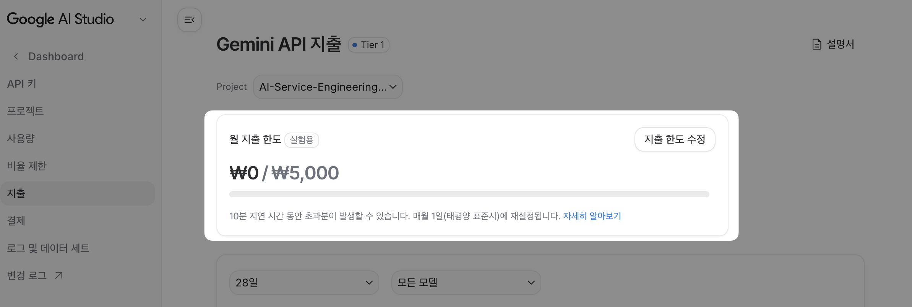
*한도가 걸린 상태입니다. 사용액이 이 한도에 닿으면 호출이 멈춥니다.*

### 5.2. 로컬 모델 — Ollama

Ollama는 키 없이 무료로 도는 로컬 모델입니다. 컨테이너 안이 아니라 호스트에 설치합니다. <https://ollama.com> 에서 각 OS용 설치본을 받아 설치하면 백그라운드 서비스로 11434 포트에서 돕니다. 설치 후 이 과정에서 쓸 모델을 받습니다.

```bash
# 호스트에서
ollama pull gemma4:12b      # 모델 받기 (양자화판 gemma4:12b-mxfp8도 가능, 용량이 커서 시간이 걸립니다)
ollama list                       # 받은 모델 확인
ollama run gemma4:12b "안녕"  # 한 번 직접 호출해 응답이 오는지 확인
```

`ollama run`에서 답이 돌아오면 호스트의 Ollama는 정상입니다. devcontainer 안에서는 `host.docker.internal` 주소로 호스트의 11434 포트에 닿습니다. devcontainer 설정에 `--add-host=host.docker.internal:host-gateway`가 들어 있어 Linux 호스트에서도 동작합니다.

클라우드와 마찬가지로 로컬도 `.env`에 설정을 넣습니다. 키는 없지만 주소와 모델 이름이 필요합니다.

```bash
# .env
OLLAMA_API_BASE=http://host.docker.internal:11434   # 위 주소가 기본값
OLLAMA_MODEL=gemma4:12b                              # 방금 받은 모델 이름과 같게
```

모델은 받는 데 시간이 걸리므로 로컬을 쓸 계획이면 지금 미리 받아둡니다.

## 6. 첫 실행으로 연결 확인

준비한 프로바이더로 공유된 예제 하나를 실행해 환경을 확인합니다.

```bash
# devcontainer 터미널에서
uv run python src/section1/lec01/smoke_test.py
```

예제는 `.env`의 `DEFAULT_PROVIDER`가 가리키는 프로바이더를 먼저 시도하고, 그것이 준비되어 있지 않으면 사용 가능한 다른 프로바이더로 넘어갑니다. 기본값은 `ollama`라 Ollama만 준비했어도 키 없이 로컬로 응답이 나오고, 클라우드 키만 넣었다면 그 모델로 넘어가 응답합니다. 응답이 출력되면 devcontainer와 uv 환경, 그리고 고른 프로바이더 연결까지 한 번에 확인된 것입니다. 코드를 직접 입력하지 않고 받은 코드를 실행만 했다는 점에 주목합니다. 이것이 앞으로의 기본 흐름입니다.

### 6.1. 예제 코드가 하는 일

[smoke_test.py](../../../src/section1/lec01/smoke_test.py)를 통째로 읽을 필요는 없습니다. 골격은 "준비된 프로바이더를 찾아 순서대로 한 번씩 호출해 보고, 처음 성공한 곳에서 멈춘다"입니다. 아래 그림에서 파란 칸 두 개만 보면 됩니다.

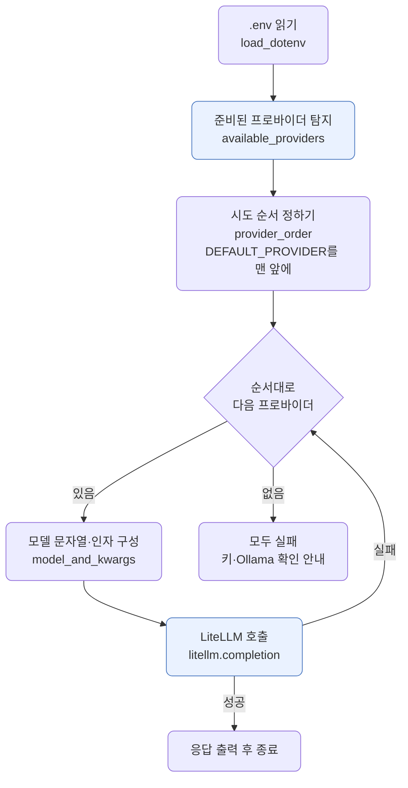

여기서 중요한 두 가지는 다음과 같습니다.

- `available_providers`는 환경변수만 보고 준비 여부를 판단합니다. 클라우드는 API 키가 채워져 있으면, Ollama는 `OLLAMA_API_BASE`가 있으면 후보로 봅니다.
- `litellm.completion`은 어떤 프로바이더든 같은 한 줄입니다. 모델 문자열(`gemini/...`, `ollama/...`)만 달라질 뿐 호출 코드는 바뀌지 않습니다. 이것이 LiteLLM을 경유하는 이유입니다.

나머지 부분, 즉 `.env` 파싱이나 시도 순서를 만드는 `provider_order`, 예외를 잡아 다음으로 넘기는 처리는 위 골격을 거드는 배선일 뿐이라 지금은 그림으로 넘어가도 됩니다.

준비된 프로바이더가 여럿이라 전부 닿는지 한 번에 확인하고 싶으면, 첫 성공에서 멈추지 않고 준비된 곳을 모두 호출해 성패를 모아 보여주는 [smoke_test_2.py](../../../src/section1/lec01/smoke_test_2.py)를 실행합니다.

```bash
uv run python src/section1/lec01/smoke_test_2.py
```

## 7. 확인 체크리스트

- "Reopen in Container"가 성공했고 터미널에서 `python --version`이 3.13으로 나옵니다.
- 네 프로바이더 중 적어도 하나가 준비됐습니다. 클라우드 키를 `.env`에 넣었거나, 호스트에서 `ollama run`이 응답하면 됩니다.
- `uv run python src/section1/lec01/smoke_test.py`가 응답을 출력합니다.

여기까지 되면 다음 단위로 넘어갈 준비가 끝났습니다.

## 8. 다음 단위

[lec02 — LLM 멘탈 모델](../lec02/README.md)에서 호출에 앞서 LLM을 어떻게 바라봐야 하는지 정리합니다.
