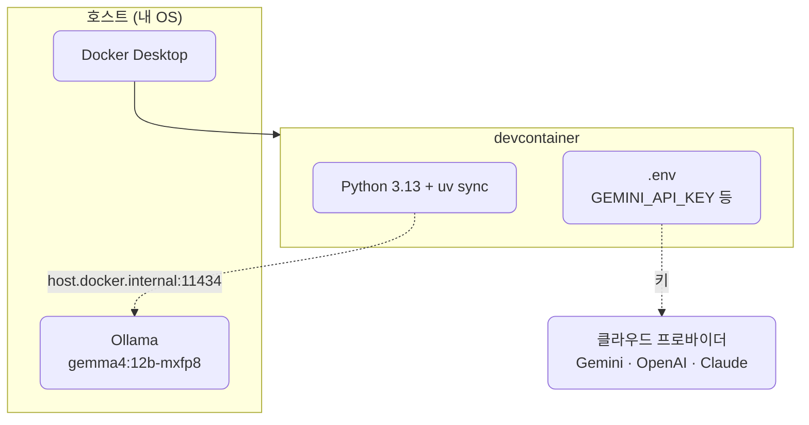

# lec01 — 환경 셋업

> S1 개요: [docs/section1/README.md](../README.md) · 분량 12분 · 산출물: 동작하는 개발 컨테이너

## 목표

이 강의를 따라오면 OS나 파이썬 버전과 무관하게 강사와 똑같이 도는 개발 컨테이너를 갖게 되고, 강의 전체에서 쓸 API 키와 로컬 모델까지 준비해 컨테이너 안에서 곧바로 호출할 수 있는 상태가 됩니다.

코드는 아직 작성하지 않습니다. 이번 단위의 산출물은 세 가지가 갖춰진 환경입니다. "Reopen in Container"가 성공한 개발 컨테이너, 키가 채워진 `.env`, 그리고 호스트에서 응답하는 Ollama입니다.



## 왜 devcontainer인가

강의 예제는 LiteLLM, Chroma, sentence-transformers 같은 라이브러리에 의존합니다. 각자 노트북의 파이썬 버전과 OS가 다르면 "제 환경에선 됩니다" 문제가 반복됩니다. 그래서 실행 환경 자체를 Docker 이미지로 고정하고, VSCode가 그 안에 들어가서 작업하도록 합니다. 이것이 devcontainer입니다.

devcontainer 자체가 컨테이너이므로, 그 안에서 돌리는 `python`이나 `pytest`도 전부 컨테이너 위에서 돕니다. 별도로 가상환경을 신경 쓸 필요가 줄어듭니다.

## Dockerfile은 세 종류로 나뉩니다

처음에 헷갈리기 쉬운 지점을 먼저 짚습니다. 이 과정에서 Dockerfile은 역할이 다른 세 종류로 나뉩니다.

- `.devcontainer/Dockerfile`은 개발 환경입니다. 우리가 코드를 짜고, 문법 오류를 확인하고, `import`를 돌리고, 테스트를 실행하는 통로입니다. 강의 내내 들어가 있는 곳이 여기입니다.
- 각 단위의 runtime Dockerfile은 그 단위의 코드를 배포 가능한 형태로 패키징한 이미지입니다. 이후 코드 단계에서 `src/section1/lecNN/Dockerfile` 식으로 단위별로 따로 둡니다. 개발 환경과 달리 그 단위에 필요한 의존성만 담은 슬림한 이미지입니다.
- 테스트 러너 Dockerfile은 devcontainer 없이 호스트에서 한 줄로 테스트를 돌리고 싶을 때 쓰는 이미지입니다.

지금 단위에서 다루는 것은 첫 번째, 개발 환경뿐입니다. runtime과 테스트 러너 Dockerfile은 코드를 채우는 단계에서 등장합니다. 이 구분을 머리에 넣어두면 뒤에서 "왜 Dockerfile이 여러 개죠"라는 혼란이 없습니다.

## 사전 준비

다음 세 가지는 호스트(여러분의 실제 OS)에 설치되어 있어야 합니다.

- Docker Desktop. 설치 후 `docker run hello-world`가 도는지 확인합니다.
- VSCode.
- VSCode 확장 Dev Containers를 설치합니다. (확장 ID `ms-vscode-remote.remote-containers`)

## 컨테이너 열기

1. VSCode로 이 저장소 폴더를 엽니다.
2. 명령 팔레트에서 "Dev Containers: Reopen in Container"를 실행합니다.
3. 첫 빌드는 이미지를 받느라 몇 분 걸립니다. 빌드가 끝나면 `postCreateCommand`로 `uv sync`가 자동 실행되며 의존성이 `/workspace/.venv`에 설치됩니다.

빌드가 끝나면 VSCode 좌하단에 컨테이너 이름이 보입니다. 통합 터미널을 열어 `python --version`이 3.13으로 나오면 성공입니다.

이 환경 설정의 실제 파일은 [.devcontainer/devcontainer.json](../../../.devcontainer/devcontainer.json)과 [.devcontainer/Dockerfile](../../../.devcontainer/Dockerfile)에 있습니다. 한 번 열어보면 무엇이 고정되는지 감이 잡힙니다.

## API 키 발급

이 과정의 기본 프로바이더는 Google AI Studio의 Gemini입니다. 무료 티어로 강의 전체를 진행할 수 있습니다. OpenAI와 Claude는 프로바이더 교체를 시연할 때 쓰는 보조이며, 키가 없어도 진행에 지장은 없습니다.

- Google AI Studio: <https://aistudio.google.com/api-keys> 에서 키를 발급합니다. 필수입니다.
- OpenAI Platform: <https://platform.openai.com/api-keys> 에서 발급합니다. 선택입니다.
- Claude Platform: <https://console.anthropic.com/settings/keys> 에서 발급합니다. 선택입니다.

각 플랫폼의 콘솔 화면과 무료 한도는 시점에 따라 바뀌므로, 막히는 부분은 강의 영상의 화면을 따라가시기 바랍니다.

## Ollama 설치와 모델 받기

이 과정의 모든 데모는 클라우드 모델과 로컬 Ollama 모델 양쪽에서 도는 것을 원칙으로 합니다. 로컬 모델은 lec07에서 처음 호출하지만, 받는 데 시간이 걸리므로 환경 셋업 단계에서 미리 준비해 둡니다.

Ollama는 컨테이너 안이 아니라 호스트에 설치합니다. <https://ollama.com> 에서 각 OS용 설치본을 받아 설치하면 백그라운드 서비스로 11434 포트에서 돕니다. 설치 후 tool calling을 지원하는 모델을 받습니다. 어떤 모델을 받을지는 녹화 시점에 확정하지만, Llama 3.x나 Qwen2.5 계열처럼 tool calling을 지원하는 모델을 고릅니다.

```bash
# 호스트에서
ollama pull gemma4:12b-mxfp8      # 모델 받기 (용량이 커서 시간이 걸립니다)
ollama list                       # 받은 모델 확인
ollama run gemma4:12b-mxfp8 "안녕"  # 한 번 직접 호출해 응답이 오는지 확인
```

`ollama run`에서 답이 돌아오면 호스트의 Ollama는 정상입니다. 우리는 devcontainer 안에서 이 호스트의 Ollama에 닿아야 하므로 `host.docker.internal` 주소를 씁니다. devcontainer 설정에 `--add-host=host.docker.internal:host-gateway`를 넣어 Linux 호스트에서도 닿도록 해두었습니다. 실제로 컨테이너에서 호출하는 코드는 lec07에서 다룹니다.

## 키와 설정을 `.env`에 넣기

저장소에는 키 템플릿인 `.env.sample`만 들어 있습니다. 실제 키가 담긴 `.env`는 직접 만들어야 하며, 이 파일은 gitignore되어 있어 커밋되지 않습니다.

```bash
# 저장소 루트에서
cp .env.sample .env
```

`.env`를 열어 발급받은 키와 Ollama 설정을 채웁니다. Gemini 키는 필수이고, 나머지는 선택입니다.

```bash
GEMINI_API_KEY=발급받은_키
OLLAMA_API_BASE=http://host.docker.internal:11434
OLLAMA_MODEL=gemma4:12b-mxfp8      # ollama pull로 받은 모델 이름과 같게
```

키는 코드에 직접 적지 않고 항상 `.env`에서 읽습니다. 뒤 단위에서 `python-dotenv`로 이 값을 환경변수로 불러옵니다. 키를 소스에 적거나 깃에 올리는 일은 사고로 이어지므로 처음부터 습관을 들입니다.

## 확인 체크리스트

- "Reopen in Container"가 성공했고 터미널에서 `python --version`이 3.13으로 나옵니다.
- `uv sync`가 끝나 `litellm`을 `import`해도 오류가 없습니다.
- 루트에 `.env`가 있고 `GEMINI_API_KEY`가 채워져 있습니다.
- 호스트에서 `ollama run`이 응답하고, `.env`에 `OLLAMA_API_BASE`와 `OLLAMA_MODEL`이 채워져 있습니다.

여기까지 되면 다음 단위로 넘어갈 준비가 끝났습니다.

## 다음 단위

[lec02 — LLM 멘탈 모델](../lec02/README.md)에서 호출에 앞서 LLM을 어떻게 바라봐야 하는지 정리합니다.
