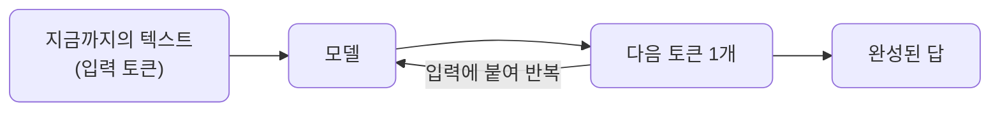
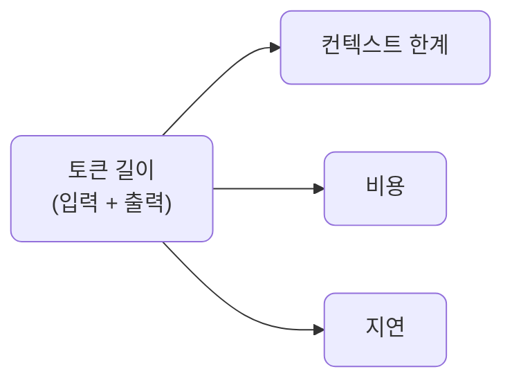
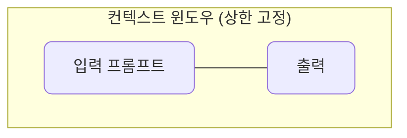
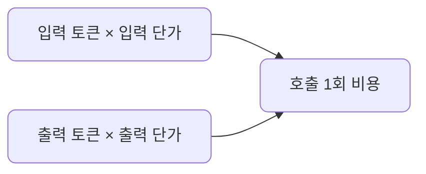

# lec02 — LLM 멘탈 모델

> S1 개요: [docs/section1/README.md](../README.md) · 분량 15분 · 산출물: 개념

## 목표

코드를 짜기 전에, LLM을 서비스 부품으로 다룰 때 필요한 최소한의 머릿속 모델을 세웁니다. 수식이나 내부 구조는 다루지 않고, 다음을 직관 수준에서 잡습니다.

- 토큰이 무엇이고 왜 의식해야 하는지 이해합니다.
- 왜 출력이 매번 달라지고 때로 자신 있게 틀리는지 이해합니다.
- 컨텍스트 한계와 비용, 지연이 어디서 생기는지 이해합니다.

## LLM은 다음 토큰 예측기입니다

LLM은 지금까지의 텍스트를 보고 다음에 올 조각을 확률적으로 고르는 기계입니다. 이 조각의 단위가 토큰입니다. 한 번에 문장 전체를 떠올리는 것이 아니라, 토큰을 하나 고르고 그것을 다시 입력에 붙여 다음 토큰을 고르는 일을 반복합니다. 우리가 보는 매끄러운 답변은 이 한 토큰씩의 선택이 쌓인 결과입니다.

이 단순한 그림에서 LLM의 중요한 성질 두 가지가 곧바로 따라옵니다.

| 성질 | 원인 | 그래서 |
| --- | --- | --- |
| 출력이 매번 달라집니다 | 다음 토큰을 확률 분포에서 뽑습니다 | 무작위성은 고장이 아니라 기본 성질입니다 |
| 자신 있게 틀립니다 | 사실을 조회하지 않고 그럴듯한 토큰을 잇습니다 | 출력은 신뢰할 사실이 아니라 검증 대상입니다 |

## 왜 출력이 매번 달라지나

다음 토큰은 확률 분포에서 뽑힙니다. 가장 확률 높은 토큰만 늘 고르는 것이 아니라, 확률에 따라 다른 토큰이 선택될 수 있습니다. 그래서 같은 입력에도 호출할 때마다 답이 조금씩 달라집니다.

- 이 무작위성의 정도는 우리가 조절할 수 있습니다. 그 방법이 다음 단위의 샘플링 파라미터입니다.
- 지금은 출력이 흔들리는 것은 고장이 아니라 기본 성질이라는 점만 챙깁니다.

## 왜 자신 있게 틀리나

모델은 사실을 어딘가에서 조회해 오는 것이 아니라, 그럴듯한 다음 토큰을 잇습니다. 그래서 학습 데이터에 없거나 모호한 내용을 물으면, 모른다고 말하기보다 그럴듯한 문장을 만들어내는 경향이 있습니다. 이것이 환각입니다. 표현은 매끄럽고 자신 있어 보여도 내용이 틀릴 수 있습니다.

환각은 프롬프트를 잘 쓴다고 완전히 사라지지 않습니다. 그래서 서비스에서는 모델의 말을 그대로 믿는 대신 두 갈래로 대응합니다.

| 대응 | 방식 | 이어지는 단원 |
| --- | --- | --- |
| 근거 자료를 함께 줍니다 | RAG로 답의 출처를 붙입니다 | S2 |
| 출력을 검증합니다 | 결과를 확인하는 장치를 둡니다 | S4 |

지금은 LLM의 출력은 검증 대상이지 무조건 신뢰할 사실이 아니라는 점을 받아들입니다.

## 토큰

토큰은 단어보다 작은 조각입니다. 정확한 분해는 모델마다 다른 토크나이저가 결정하므로, 같은 문장이라도 모델에 따라 토큰 수가 다릅니다. 언어별 감각은 대략 다음과 같습니다.

| 언어 | 쪼개지는 단위 | 같은 의미일 때 토큰 수 |
| --- | --- | --- |
| 영어 | 한 단어가 대략 1~2토큰 | 상대적으로 적습니다 |
| 한국어 | 글자나 그보다 작은 단위로 더 잘게 | 상대적으로 많습니다 |

토큰 수를 의식해야 하는 이유는 단순합니다. 입력과 출력의 길이가 토큰으로 환산되어 컨텍스트 한계와 비용, 지연을 한꺼번에 결정하기 때문입니다.

한국어가 영어보다 토큰을 더 먹는다는 점은 비용을 가늠할 때 실제로 차이를 만듭니다.

## 컨텍스트 윈도우

모델이 한 번의 호출에서 볼 수 있는 토큰의 총량에 상한이 있습니다. 이것이 컨텍스트 윈도우입니다. 입력 프롬프트와 모델이 생성할 출력이 이 한도를 함께 나눠 씁니다. 입력이 길면 출력에 쓸 여유가 줄어듭니다.

대화가 길어지거나 문서를 통째로 밀어 넣으면 이 한계에 부딪힙니다. 그래서 무엇을 윈도우에 넣고 무엇을 뺄지를 설계하는 일이 중요해집니다.

- 이 주제가 S4의 컨텍스트 엔지니어링으로 이어집니다.
- RAG도 결국 필요한 조각만 골라 넣는다는 점에서 같은 문제의 한 갈래입니다.

## 비용

API 모델의 과금은 보통 토큰 단위입니다. 입력 토큰과 출력 토큰에 각각 단가가 매겨지며, 출력 단가가 더 비싼 경우가 많습니다. 호출 한 번의 비용은 두 항을 더한 값입니다.

여기서 실무 감각이 나옵니다.

- 프롬프트에 불필요하게 긴 맥락을 매번 붙이면 모든 호출에서 입력 비용이 누적됩니다.
- 출력이 길어질수록 비용과 지연이 함께 늘어납니다.
- 그래서 짧고 정확한 프롬프트와 필요한 만큼만의 출력이 품질뿐 아니라 비용 면에서도 이득입니다.

구체적인 단가와 컨텍스트 한도는 모델과 시점에 따라 계속 바뀌므로 외우지 않습니다. 대신 길이가 곧 비용이자 한계라는 관계만 몸에 익히면 됩니다. 실제 호출에서 토큰 수를 어떻게 확인하는지는 lec04에서 응답의 `usage` 필드로 직접 봅니다.

## 지연

출력은 토큰을 하나씩 생성하므로, 출력이 길수록 응답이 끝나기까지 더 오래 걸립니다. 사용자에게 한참 뒤에 완성된 답을 한 번에 주는 대신, 생성되는 토큰을 즉시 흘려보내면 체감 속도가 크게 좋아집니다. 이 스트리밍은 S5 서빙에서 다루지만, 지연이 출력 길이에 비례한다는 직관은 지금 잡아둡니다.

## 정리

- LLM은 토큰을 하나씩 잇는 확률적 예측기라 출력이 흔들리고 때로 자신 있게 틀립니다.
- 그래서 출력은 무조건 믿을 사실이 아니라 근거를 대거나 검증할 대상입니다.
- 입력과 출력의 길이는 토큰으로 환산되어 컨텍스트 한계와 비용, 지연을 함께 결정합니다.
- 무엇을 넣고 무엇을 뺄지, 얼마나 길게 받을지를 설계하는 일이 서비스 품질의 핵심입니다.

## 다음 단위

[lec03 — 샘플링 파라미터](../lec03/README.md)에서 출력의 무작위성을 우리가 어디까지 조절할 수 있는지 봅니다.
