# lec02 — LLM 멘탈 모델

> - S1 개요: [docs/section1/README.md](../README.md)
> - 분량 15분
> - 산출물: 개념

## 1. 목표

호출 예제를 보기 전에, LLM을 서비스 부품으로 다룰 때 필요한 최소한의 머릿속 모델을 세웁니다. 수식이나 내부 구조는 다루지 않고, 다음을 직관 수준에서 잡습니다.

- 토큰이 무엇이고 왜 의식해야 하는지 이해합니다.
- 왜 출력이 매번 달라지고 때로 자신 있게 틀리는지 이해합니다.
- 모델의 지식이 학습 시점에 멈춰 있고 외부에 스스로 닿지 못한다는 점을 이해합니다.
- 컨텍스트 한계와 비용, 지연이 어디서 생기는지 이해합니다.
- 모델이 대화를 기억하지 않는다는 점과 그 파장을 이해합니다.
- 과금 구조(API 종량제·로컬·정액제)가 어떻게 다른지 이해합니다.

이 단위에서 만드는 것은 코드가 아니라 이 그림 한 장입니다. 토큰을 가운데 두고, 거기서 무작위성·환각·컨텍스트 한계·비용·지연이 어떻게 갈라져 나오는지를 봅니다.

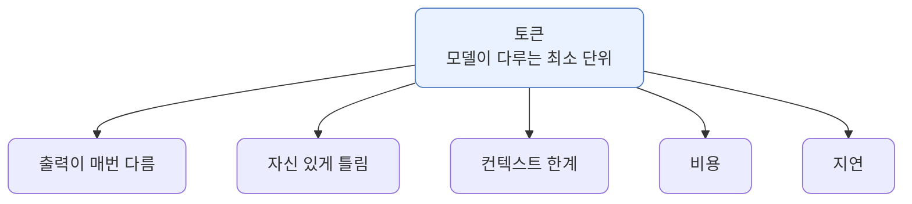

## 2. LLM은 다음 토큰 예측기입니다

LLM은 지금까지의 텍스트를 보고 다음에 올 조각을 확률적으로 고르는 기계입니다. 이 조각의 단위가 토큰입니다. 한 번에 문장 전체를 떠올리는 것이 아니라, 토큰을 하나 고르고 그것을 다시 입력에 붙여 다음 토큰을 고르는 일을 반복합니다. 우리가 보는 매끄러운 답변은 이 한 토큰씩의 선택이 쌓인 결과입니다.

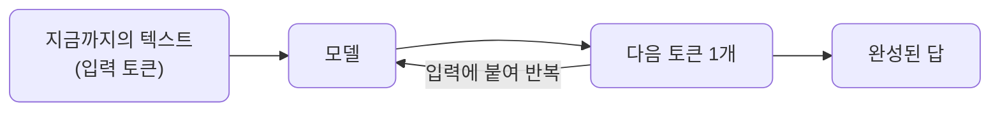

실제로는 이렇게 굴러갑니다. "대한민국의 수도는"이라는 입력에서 토큰 하나를 고르고, 그 결과를 다시 입력에 붙여 다음 토큰을 고릅니다. 끝을 뜻하는 토큰이 나올 때까지 이어집니다.

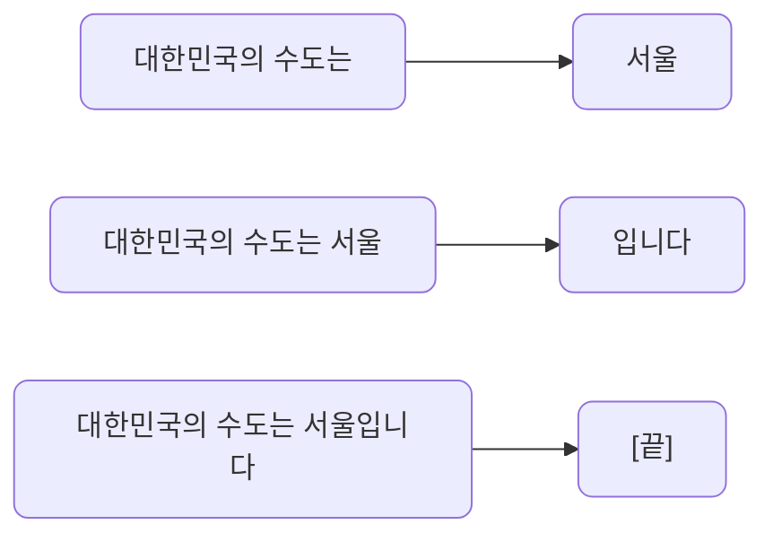

이 단순한 그림에서 LLM의 중요한 성질 두 가지가 곧바로 따라옵니다.

| 성질 | 원인 | 그래서 |
| --- | --- | --- |
| 출력이 매번 달라집니다 | 다음 토큰을 확률 분포에서 뽑습니다 | 무작위성은 고장이 아니라 기본 성질입니다 |
| 자신 있게 틀립니다 | 사실을 조회하지 않고 그럴듯한 토큰을 잇습니다 | 출력은 신뢰할 사실이 아니라 검증 대상입니다 |

## 3. 왜 출력이 매번 달라지나

다음 토큰은 하나로 정해져 있지 않습니다. 모델은 후보 토큰마다 확률을 매기고, 그 분포에서 하나를 뽑습니다. 가장 확률 높은 토큰만 늘 고르는 것이 아니라 확률에 따라 다른 토큰이 선택될 수 있어서, 같은 입력에도 호출할 때마다 답이 조금씩 달라집니다.

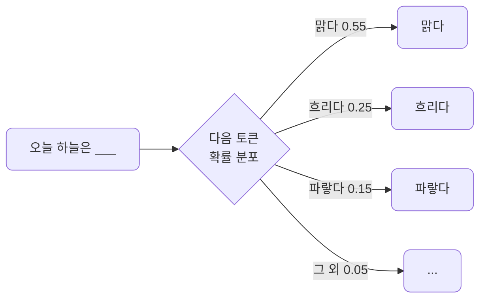

같은 프롬프트를 세 번 부르면 이렇게 갈릴 수 있습니다. 틀린 동작이 아니라 분포에서 뽑는다는 성질이 드러난 것입니다.

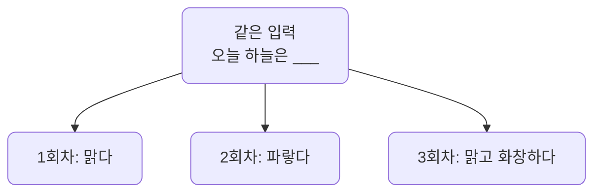

- 이 무작위성의 정도는 우리가 조절할 수 있습니다. 그 방법이 lec03의 샘플링 파라미터입니다.
- 지금은 출력이 흔들리는 것은 고장이 아니라 기본 성질이라는 점만 챙깁니다.

## 4. 왜 자신 있게 틀리나

사람은 질문을 받으면 어딘가에서 답을 조회해 온다고 기대합니다. 모델은 그렇게 동작하지 않습니다. 사실을 찾아오는 것이 아니라 그럴듯한 다음 토큰을 이어 붙일 뿐입니다. 두 동작의 차이가 환각의 뿌리입니다.

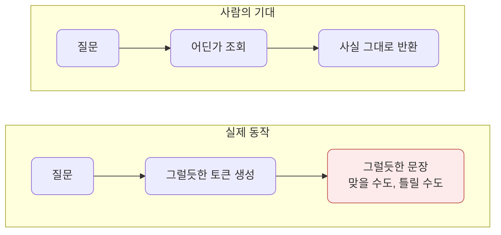

그래서 학습 데이터에 없거나 모호한 내용을 물으면, 모른다고 말하기보다 그럴듯한 문장을 만들어내는 경향이 있습니다. 이것이 환각입니다. 표현은 매끄럽고 자신 있어 보여도 내용이 틀릴 수 있습니다.

환각은 프롬프트를 잘 쓴다고 완전히 사라지지 않습니다. 그래서 서비스에서는 모델의 말을 그대로 믿는 대신 두 갈래로 대응합니다.

| 대응 | 방식 | 이어지는 단원 |
| --- | --- | --- |
| 근거 자료를 함께 줍니다 | RAG로 답의 출처를 붙입니다 | S2 |
| 출력을 검증합니다 | 결과를 확인하는 장치를 둡니다 | S4 |

지금은 LLM의 출력은 검증 대상이지 무조건 신뢰할 사실이 아니라는 점을 받아들입니다.

## 5. 지식은 학습 시점에 멈춰 있습니다

환각과 짝을 이루는 한계가 하나 더 있습니다. 모델의 지식은 학습 데이터가 모인 어느 시점, 즉 컷오프까지입니다. 그 이후에 벌어진 일은 모릅니다. 게다가 모델은 기본적으로 바깥세상에 스스로 접속하지 않습니다. 웹을 검색하거나 파일을 열거나 계산기를 돌리지 않고, 오직 이번 호출에 담아 준 텍스트만 봅니다.

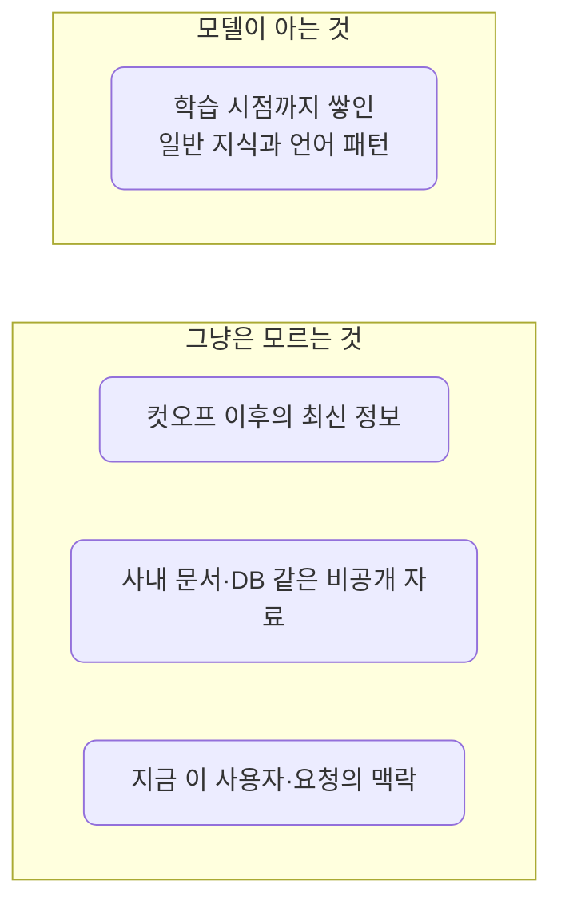

그래서 오늘 환율, 방금 올라온 사내 문서, 이 고객의 주문 내역 같은 것은 모델이 알 길이 없습니다. 그런데도 물으면 모른다고 하기보다 그럴듯하게 지어내기 쉽습니다. 환각과 만나는 지점이 바로 여기입니다.

해결은 모델을 더 좋은 것으로 바꾸는 일이 아니라, 모델에게 필요한 것을 호출에 실어 주는 일입니다. 크게 두 갈래입니다.

| 모델이 스스로 못 하는 것 | 보완 방법 | 이어지는 단원 |
| --- | --- | --- |
| 컷오프 이후·외부의 사실을 모릅니다 | 필요한 자료를 찾아 입력에 함께 넣습니다 (RAG) | S2 |
| 검색·계산·조회 같은 행동을 못 합니다 | 도구를 호출하도록 모델을 연결합니다 (에이전트) | S3 |

지금 챙길 직관은 하나입니다. 모델은 호출에 담아 준 것만 보고 답하므로, 최신 정보든 우리 데이터든 모델이 알아야 할 것은 우리가 입력에 실어 줘야 한다는 점입니다.

## 6. 토큰

토큰은 단어보다 작은 조각입니다. 정확한 분해는 모델마다 다른 토크나이저가 결정하므로, 같은 문장이라도 모델에 따라 토큰 수가 다릅니다. 영어는 한 단어가 대략 한두 토큰이지만, 한국어는 글자나 그보다 작은 단위로 더 잘게 쪼개지는 경향이 있습니다.

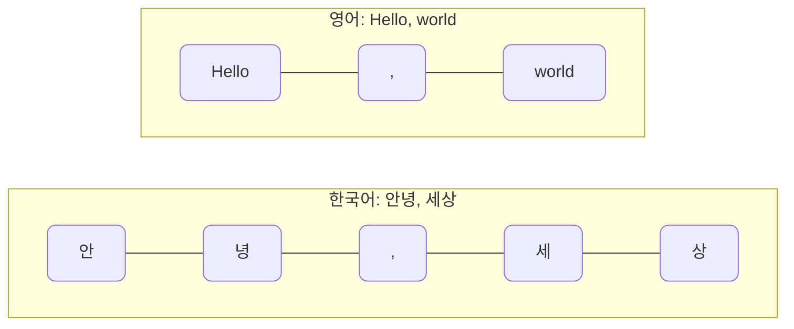

위 쪼개짐은 감을 잡기 위한 예시이며 실제 경계는 토크나이저마다 다릅니다. 요지는 같은 뜻이라도 한국어가 토큰을 더 먹는 쪽이라는 점입니다.

분량을 토큰으로 가늠하는 감각도 미리 잡아 둡니다. 아래는 영어 기준의 대략값이며, 한국어는 같은 분량이라도 토큰이 더 많이 나옵니다.

| 분량 | 대략 토큰 수 |
| --- | --- |
| 한 문단 (약 100단어) | 약 130 |
| 블로그 글 한 편 (약 1,000단어) | 약 1,300 |
| 책 한 권 (약 10만 단어) | 약 13만 |

토큰 수를 의식해야 하는 이유는 단순합니다. 입력과 출력의 길이가 토큰으로 환산되어 컨텍스트 한계와 비용, 지연을 한꺼번에 결정하기 때문입니다.

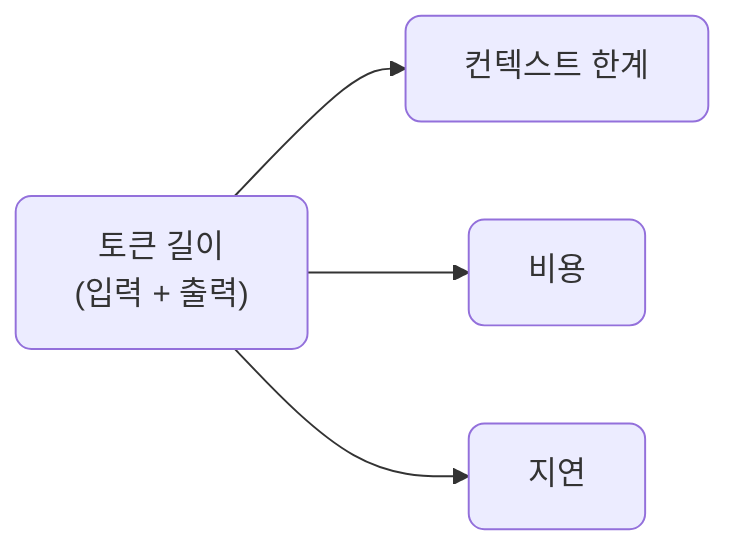

## 7. 컨텍스트 윈도우

모델이 한 번의 호출에서 볼 수 있는 토큰의 총량에 상한이 있습니다. 이것이 컨텍스트 윈도우입니다. 입력 프롬프트와 모델이 생성할 출력이 이 한도를 함께 나눠 씁니다. 그래서 입력이 길어지면 출력에 쓸 여유가 줄어듭니다.

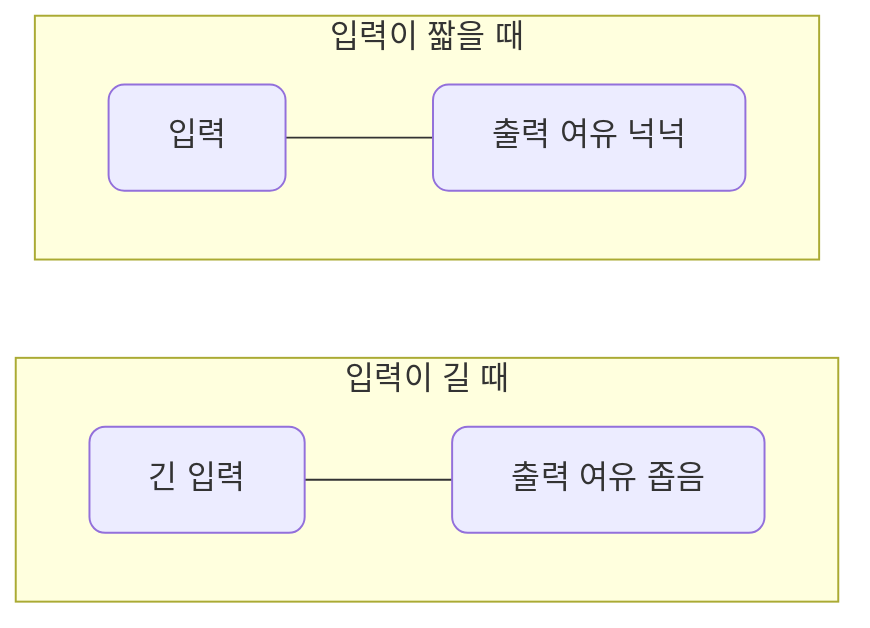

두 막대의 전체 길이는 같습니다. 윈도우 총량이 고정이라, 한쪽을 키우면 다른 쪽이 줄어든다는 뜻입니다.

윈도우 크기는 모델마다 크게 다릅니다. 작은 윈도우와 큰 윈도우가 같은 일을 얼마나 다르게 처리하는지가 핵심입니다. 수백 쪽짜리 매뉴얼 전체를 주고 "환불 정책이 뭐야?"를 묻는 상황을 예로 들어 봅니다. 매뉴얼이 약 15만 토큰이라고 하면, 작은 윈도우에는 통째로 들어가지 않습니다.

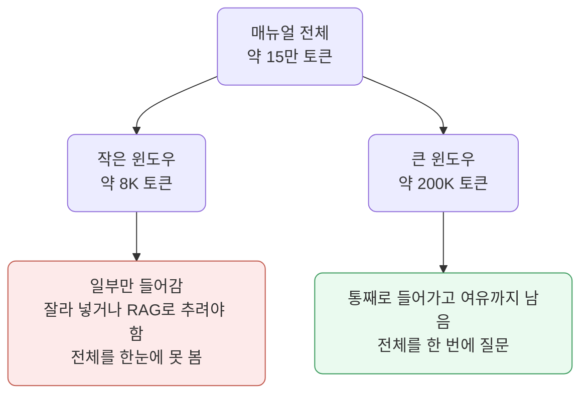

| | 작은 윈도우 (약 8K) | 큰 윈도우 (약 200K) |
| --- | --- | --- |
| 블로그 글 몇 편 | 들어감 | 들어감 |
| 책 한 권 (약 13만 토큰) | 안 들어감 | 통째로 들어감 |
| 매뉴얼 전체에 질문 | 잘라 넣거나 RAG 필요 | 한 번에 질문 가능 |

큰 윈도우가 항상 공짜는 아닙니다. 입력 토큰이 많아질수록 호출 비용과 지연이 같이 커지고, 너무 길게 넣으면 모델이 중간 내용을 흘리는 경향도 있습니다. 그래서 "넣을 수 있다"와 "넣는 게 낫다"는 다른 문제입니다.

- 무엇을 윈도우에 넣고 무엇을 뺄지를 설계하는 일이 S4의 컨텍스트 엔지니어링으로 이어집니다.
- RAG도 결국 필요한 조각만 골라 넣는다는 점에서 같은 문제의 한 갈래입니다.

## 8. 모델은 대화를 기억하지 않습니다

흔한 오해 하나를 짚고 갑니다. 모델은 이전 대화를 스스로 기억하지 않습니다. 매 호출은 서로 독립이며, 모델이 보는 것은 그 호출에 담아 보낸 텍스트뿐입니다. 챗봇이 맥락을 이어가는 것처럼 보이는 이유는, 애플리케이션이 지금까지의 대화 전체를 매번 입력에 다시 실어 보내기 때문입니다.

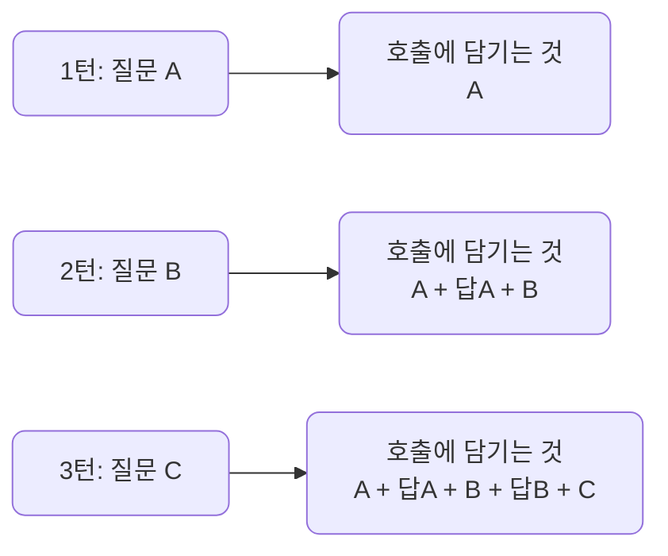

이 그림에서 실무적으로 중요한 결과가 따라옵니다.

- 대화가 길어질수록 매 호출의 입력이 계속 커집니다. 그래서 비용과 지연이 같이 늘어납니다.
- 입력이 계속 자라면 언젠가 컨텍스트 윈도우에 부딪힙니다.
- 그때는 오래된 메시지를 요약하거나 잘라내는 처리가 필요합니다. 이것이 S4에서 다루는 compaction입니다.

지금 챙길 직관은 하나입니다. 멀티턴 대화의 맥락은 모델의 기억이 아니라 우리가 매번 다시 실어 보내는 입력이라는 점입니다.

## 9. 비용

API 모델의 과금은 보통 토큰 단위입니다. 입력 토큰과 출력 토큰에 각각 단가가 매겨지며, 출력 단가가 더 비싼 경우가 많습니다. 호출 한 번의 비용은 두 항을 더한 값입니다.

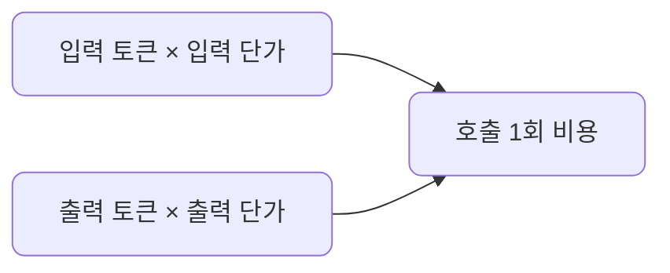

숫자로 한 번 그려 보면 감이 또렷해집니다. 아래 단가는 시점에 따라 바뀌는 예시일 뿐이며, 외울 필요는 없습니다.

| 항목 | 토큰 | 예시 단가 | 비용 |
| --- | --- | --- | --- |
| 입력 | 2,000 | 100만 토큰당 $0.15 | $0.0003 |
| 출력 | 500 | 100만 토큰당 $0.60 | $0.0003 |
| 합계 | | | 약 $0.0006 |

여기에 또 하나의 축이 있습니다. 같은 길이의 호출이라도 어떤 모델을 쓰느냐에 따라 비용이 크게 달라집니다. 단가는 모델마다 다르고, 고성능 모델일수록 토큰당 단가가 높습니다. 그래서 호출 비용은 토큰 길이와 모델 단가라는 두 손잡이로 정해집니다.

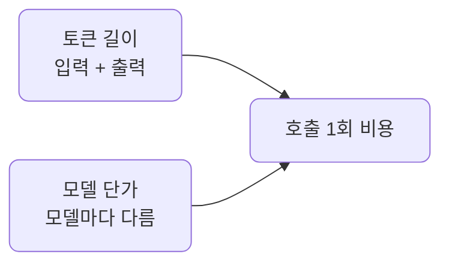

위와 똑같이 입력 2,000 / 출력 500 토큰을 쓰는 호출을 여러 모델로 돌리면 이렇게 갈립니다. 아래 단가는 시점에 따라 바뀌는 예시이며, 정확한 값은 각 프로바이더의 가격 페이지에서 확인합니다.

| 모델 | 입력 단가 (100만 토큰당, 예시) | 출력 단가 (100만 토큰당, 예시) | 같은 호출 비용 |
| --- | --- | --- | --- |
| OpenAI GPT-4o mini | $0.15 | $0.60 | 약 $0.0006 |
| Gemini 2.5 Flash | $0.30 | $2.50 | 약 $0.0019 |
| Claude Haiku 4.5 | $1.00 | $5.00 | 약 $0.0045 |
| OpenAI GPT-4o | $2.50 | $10.00 | 약 $0.01 |
| Claude Sonnet 4.5 | $3.00 | $15.00 | 약 $0.014 |

같은 일을 시켜도 모델 선택만으로 비용이 열 배 넘게 벌어지기도 합니다. 이 과정에서 기본으로 쓰는 세 모델(Gemini 2.5 Flash, GPT-4o mini, Claude Haiku 4.5)은 모두 저렴한 축입니다. 그래서 작업 난이도에 맞는 모델을 고르는 것이 비용의 큰 축입니다. 단순한 분류나 추출에는 저렴한 모델로 충분한 경우가 많고, 어려운 추론에만 고성능 모델을 씁니다. 이 선택을 코드 변경 없이 모델 문자열만 바꿔 시험하는 방법은 lec06에서 다룹니다.

호출 하나는 보잘것없어 보입니다. 그런데 같은 호출을 하루 10만 번 하면 약 $60이 되고, 입력에 매번 긴 맥락을 붙이면 그 곱이 통째로 커집니다. 여기서 실무 감각이 나옵니다.

- 프롬프트에 불필요하게 긴 맥락을 매번 붙이면 모든 호출에서 입력 비용이 누적됩니다.
- 출력이 길어질수록 비용과 지연이 함께 늘어납니다.
- 같은 작업에 과한 모델을 쓰지 않습니다. 난이도에 맞는 모델을 고르면 같은 결과를 더 싸게 얻습니다.
- 그래서 짧고 정확한 프롬프트와 필요한 만큼만의 출력, 그리고 알맞은 모델 선택이 품질뿐 아니라 비용 면에서도 이득입니다.

구체적인 단가와 컨텍스트 한도는 모델과 시점에 따라 계속 바뀌므로 외우지 않습니다. 대신 길이가 곧 비용이자 한계라는 관계만 몸에 익히면 됩니다. 실제 호출에서 토큰 수를 어떻게 확인하는지는 lec04에서 응답의 `usage` 필드로 직접 봅니다.

## 10. 비용 구조 비교

지금까지의 토큰 과금은 클라우드 API의 이야기입니다. 그런데 같은 LLM 호출이라도 어디서 돌리느냐에 따라 과금 구조 자체가 달라집니다. 크게 세 가지입니다.

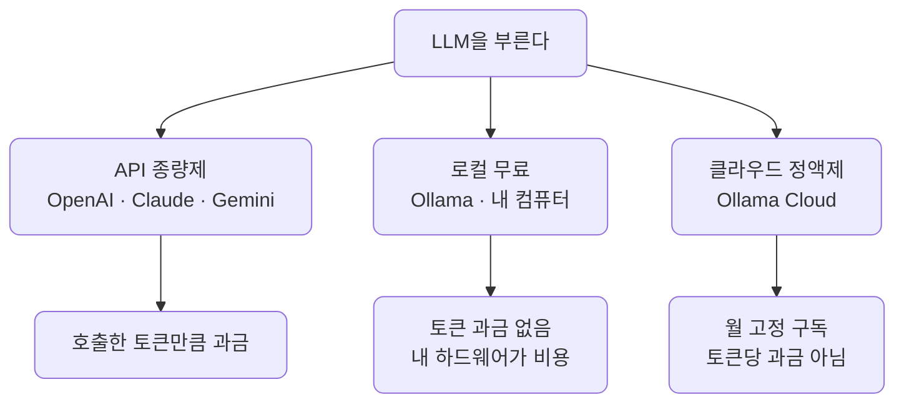

세 구조의 성격은 이렇게 갈립니다.

| 구조 | 예 | 과금 방식 | 비용이 드는 곳 | 성격 |
| --- | --- | --- | --- | --- |
| API 종량제 | OpenAI, Claude, Gemini | 호출한 입력·출력 토큰만큼 | 쓴 만큼 비례 | 시작이 쉽고 확장이 자유롭지만, 호출이 늘면 비용도 비례해 늘어납니다 |
| 로컬 무료 | Ollama, 내 컴퓨터 | 토큰 과금 없음 | 내 장비와 전기 | 데이터가 밖으로 안 나가고 호출이 공짜지만, 큰 모델은 장비 성능에 막힙니다 |
| 클라우드 정액제 | Ollama Cloud의 Pro·Max | 월 고정 구독에 사용량 한도 | 정해진 월 요금 | 큰 모델을 외부 GPU로 돌리되 토큰당이 아니라 월정액이라 비용이 예측 가능합니다 |

세 번째가 처음 듣기엔 낯설 수 있어 조금 더 풀어 봅니다. 로컬 Ollama는 내 컴퓨터에서 도는 대신 장비가 감당할 수 있는 크기의 모델까지만 쓸 수 있습니다. Ollama Cloud는 이 한계를 외부 GPU로 넘깁니다. 큰 모델을 Ollama의 서버에서 돌리되 호출 방식은 로컬 때와 같고, 요금은 ChatGPT나 Claude 구독처럼 월정액입니다. 토큰마다 청구되는 것이 아니라 고정 요금 안에서 사용량 한도를 나눠 씁니다. 한도를 넘으면 추가 청구 대신 사용이 제한되므로, 종량제와 달리 쓰다 보니 청구서가 불어나는 일이 없습니다. 요금은 시점에 따라 바뀌지만, 글을 쓰는 시점에는 무료와 월 $20, 월 $100의 단계가 있습니다.

과금이 사용량에 따라 어떻게 움직이는지를 나란히 두면 차이가 분명해집니다.

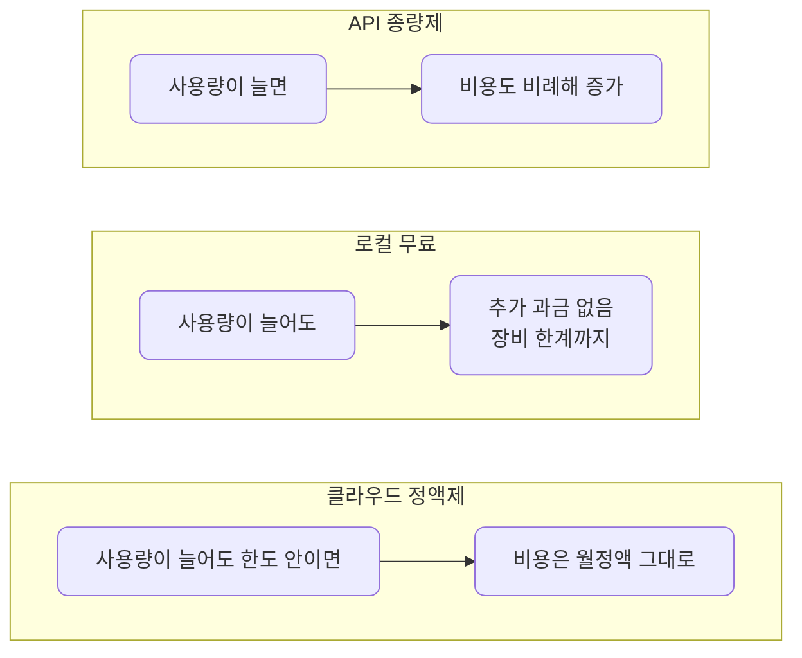

어느 하나가 항상 정답은 아니고 상황에 맞춰 고릅니다.

- 빠르게 시작하고 트래픽이 들쭉날쭉하며 최신 대형 모델이 필요하면 API 종량제가 맞습니다.
- 데이터를 밖에 내보낼 수 없거나, 개발 중 호출을 무한정 반복하거나, 고정비를 선호하면 로컬 Ollama가 맞습니다.
- 로컬 장비로는 버거운 큰 모델을 예측 가능한 월정액으로 쓰고 싶으면 Ollama Cloud가 맞습니다.

이 과정은 클라우드 API 종량제와 로컬 Ollama 무료를 함께 씁니다. LiteLLM을 경유하므로 어느 구조를 고르든 호출 코드는 같고 모델 문자열만 달라집니다. 그래서 과금 구조는 코드가 아니라 운영의 선택 문제가 됩니다.

## 11. 지연

출력은 토큰을 하나씩 생성하므로, 출력이 길수록 응답이 끝나기까지 더 오래 걸립니다. 여기서 체감 속도를 살리는 방법이 스트리밍입니다. 완성된 답을 한참 뒤에 한 번에 주는 대신, 생성되는 토큰을 즉시 흘려보내면 사용자는 첫 글자를 훨씬 빨리 봅니다.

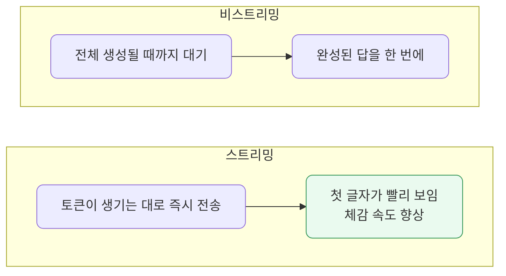

총 생성 시간이 줄어드는 것은 아닙니다. 같은 토큰을 같은 속도로 만들어도, 기다리는 경험이 달라지는 것입니다. 이 스트리밍은 S5 서빙에서 다루지만, 지연이 출력 길이에 비례한다는 직관은 지금 잡아둡니다.

## 12. 정리

- LLM은 토큰을 하나씩 잇는 확률적 예측기라 출력이 흔들리고 때로 자신 있게 틀립니다.
- 그래서 출력은 무조건 믿을 사실이 아니라 근거를 대거나 검증할 대상입니다.
- 모델의 지식은 학습 시점에 멈춰 있고 외부에 스스로 닿지 못하므로, 필요한 자료·도구는 우리가 붙여 줍니다.
- 입력과 출력의 길이는 토큰으로 환산되어 컨텍스트 한계와 비용, 지연을 함께 결정합니다.
- 같은 호출도 어디서 돌리느냐에 따라 과금이 다릅니다. 클라우드 API는 종량제, 로컬 Ollama는 무료, Ollama Cloud는 월정액입니다.
- 모델은 대화를 기억하지 않으므로, 멀티턴 맥락은 매번 입력에 다시 실어 보내는 토큰입니다.
- 무엇을 넣고 무엇을 뺄지, 얼마나 길게 받을지를 설계하는 일이 서비스 품질의 핵심입니다.
