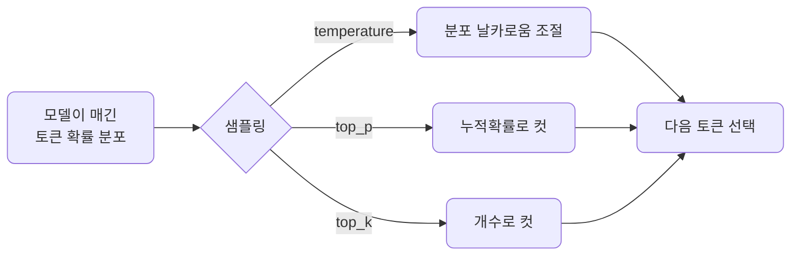

# lec03 — 샘플링 파라미터

> S1 개요: [docs/section1/README.md](../README.md) · 분량 10분 · 산출물: 비교 노트북

## 목표

앞 단위에서 LLM의 출력이 확률적이라고 했습니다. 이번에는 그 무작위성을 우리가 어디까지 조절할 수 있는지 봅니다. `temperature`, `top_p`, `top_k` 세 가지를 같은 프롬프트에 바꿔 넣어보며 효과를 눈으로 비교합니다.

## 다음 토큰은 확률 분포에서 뽑힙니다

모델은 매 스텝에서 가능한 모든 토큰에 확률을 매깁니다. 그다음 이 분포에서 토큰 하나를 고릅니다. 샘플링 파라미터는 이 "고르는 방식"을 조절하는 손잡이입니다. 분포를 더 뾰족하게 만들어 가장 확률 높은 토큰에 쏠리게 할 수도, 더 평평하게 만들어 덜 확률적인 토큰도 나오게 할 수도 있습니다.

## temperature

temperature는 분포의 날카로움을 조절합니다. 값이 낮으면 분포가 뾰족해져 거의 항상 가장 확률 높은 토큰이 뽑힙니다. 출력이 결정적이고 보수적이 됩니다. 값이 높으면 분포가 평평해져 덜 흔한 토큰도 선택되며, 출력이 다양하고 창의적이지만 동시에 엇나갈 위험도 커집니다.

대략의 감각은 이렇습니다. 추출, 분류, 코드처럼 정답이 분명한 작업에는 낮은 값을 씁니다. 브레인스토밍이나 카피 초안처럼 다양성이 가치인 작업에는 높은 값을 씁니다. 실무에서는 낮게 시작해 필요한 만큼만 올리는 편이 안전합니다.

## top_p

top_p는 누적 확률 기준으로 후보를 자릅니다. 확률이 높은 토큰부터 더해가다 누적이 top_p에 도달하면 거기까지만 후보로 남기고 나머지는 버립니다. 예를 들어 0.9면 상위 확률의 90%까지만 후보로 두는 셈입니다. 분포가 뾰족한 상황에서는 후보가 몇 개로 좁혀지고, 평평한 상황에서는 더 많이 남습니다. 상황에 따라 후보 폭이 달라진다는 점이 고정 개수로 자르는 방식과 다릅니다.

## top_k

top_k는 단순히 확률 상위 k개만 후보로 두고 나머지를 버립니다. k가 1이면 항상 최상위 토큰만 뽑혀 사실상 결정적이 됩니다. k가 크면 더 많은 후보가 살아남습니다. top_p가 누적 확률로 자르는 것과 달리 top_k는 개수로 자릅니다.

## 함께 쓸 때

세 파라미터는 동시에 적용될 수 있습니다. 보통 temperature 하나만 만져도 충분하며, 여러 개를 한꺼번에 극단으로 주면 효과가 겹쳐 예측이 어려워집니다. 프로바이더에 따라 지원하는 파라미터가 다를 수 있다는 점도 기억해 둡니다. 예를 들어 어떤 모델은 top_k를 받지 않습니다. 이 차이는 lec06에서 LiteLLM으로 프로바이더를 바꿀 때 다시 만납니다.

## 실습에서 볼 것

이 단위의 비교 노트북에서는 같은 프롬프트를 temperature만 0에 가깝게, 그리고 높게 줘서 여러 번 호출합니다. 낮을 때는 응답이 거의 똑같이 반복되고, 높을 때는 호출마다 달라지는 것을 직접 확인합니다. 재현이 필요한 평가에서는 무작위성을 낮춰 출력을 안정시키는 것이 왜 중요한지도 이때 체감하게 됩니다.

## 정리

- 샘플링 파라미터는 다음 토큰을 고르는 방식을 조절하는 손잡이입니다.
- temperature는 분포의 날카로움, top_p는 누적 확률 컷, top_k는 개수 컷입니다.
- 정답이 분명한 작업은 낮은 무작위성, 다양성이 가치인 작업은 높은 무작위성으로 시작합니다.

## 다음 단위

[lec04 — 단일 provider 호출](../lec04/README.md)에서 드디어 첫 API 호출을 LiteLLM으로 보냅니다.
