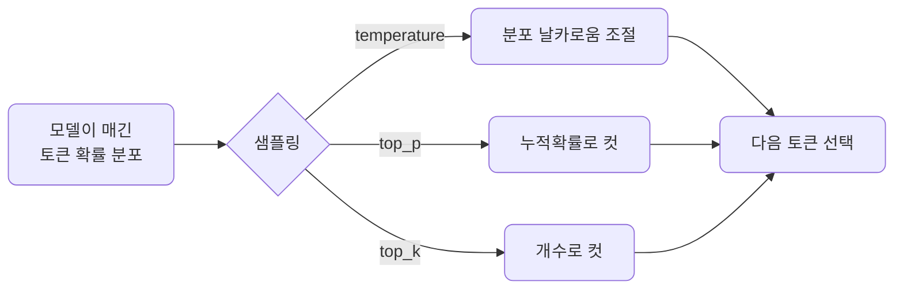
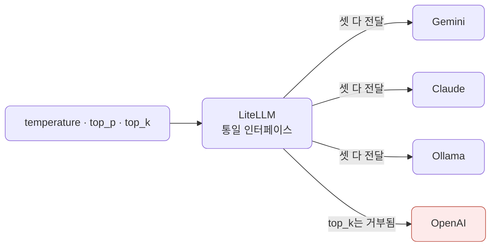
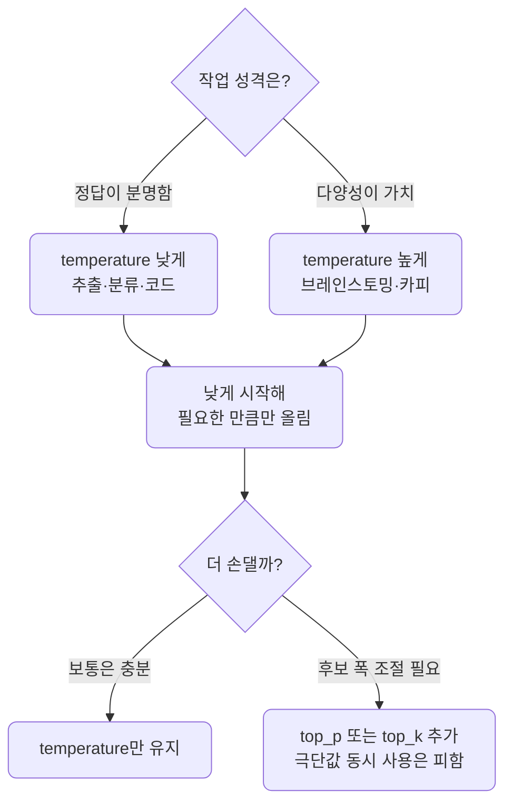
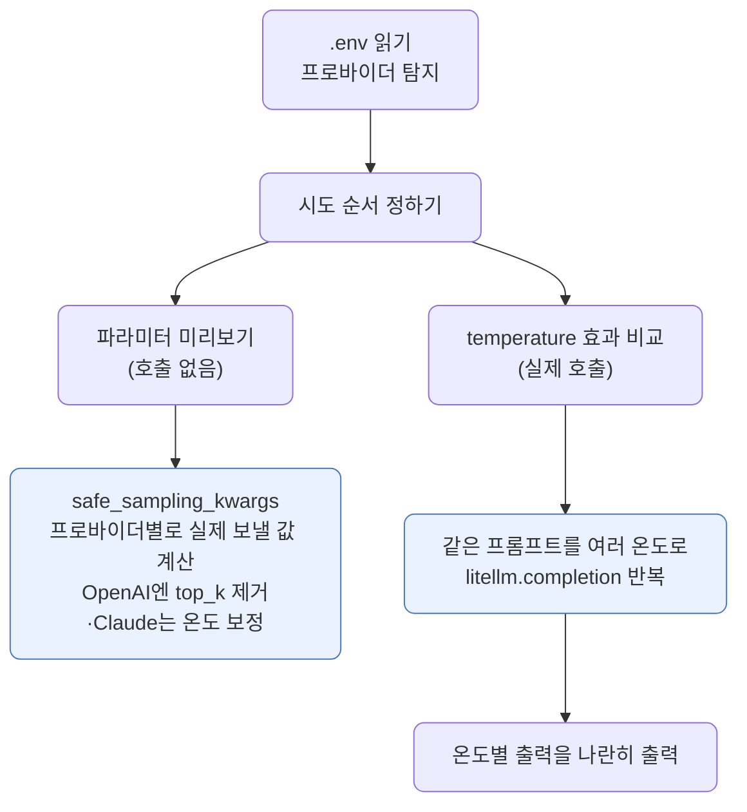

# lec03 — 샘플링 파라미터

> - S1 개요: [docs/section1/README.md](../README.md)
> - 분량 10분
> - 산출물: 비교 스크립트

## 1. 목표

앞 단위에서 LLM의 출력이 확률적이라고 했습니다. 이번에는 그 무작위성을 우리가 어디까지 조절할 수 있는지 봅니다. 같은 프롬프트에 세 파라미터를 바꿔 넣어보며 효과를 눈으로 비교합니다.

- `temperature`로 분포의 날카로움을 조절합니다.
- `top_p`로 누적 확률을 기준으로 후보를 자릅니다.
- `top_k`로 후보 개수를 기준으로 자릅니다.



## 2. 다음 토큰은 확률 분포에서 뽑힙니다

모델은 매 스텝에서 가능한 모든 토큰에 확률을 매기고, 그 분포에서 토큰 하나를 고릅니다. 샘플링 파라미터는 이 "고르는 방식"을 조절하는 손잡이입니다.

- 분포를 더 뾰족하게 만들면 가장 확률 높은 토큰에 쏠립니다.
- 분포를 더 평평하게 만들면 덜 확률적인 토큰도 나옵니다.

## 3. 세 파라미터 비교

세 파라미터는 "무엇을 자르거나 바꾸는가"가 서로 다릅니다.

| 파라미터 | 무엇을 조절·자르나 | 효과 | 언제 쓰나 |
| --- | --- | --- | --- |
| `temperature` | 분포의 날카로움 자체를 조절합니다 | 낮으면 결정적·보수적, 높으면 다양·창의적이지만 엇나갈 위험이 큽니다 | 다양성을 키우거나 줄이는 기본 손잡이로 씁니다 |
| `top_p` | 누적 확률이 임계값에 닿을 때까지만 후보로 남깁니다 | 분포 모양에 따라 후보 폭이 자동으로 달라집니다 | 상황별로 후보 폭이 유연하게 변하길 원할 때 씁니다 |
| `top_k` | 확률 상위 k개만 후보로 남깁니다 | 후보 개수가 항상 고정됩니다 | 후보 수를 단순하고 고정된 값으로 제한하고 싶을 때 씁니다 |

### 3.1. temperature

temperature는 분포의 날카로움을 조절합니다.

- 값이 낮으면 분포가 뾰족해져 거의 항상 가장 확률 높은 토큰이 뽑히고, 출력이 결정적이고 보수적이 됩니다.
- 값이 높으면 분포가 평평해져 덜 흔한 토큰도 선택되고, 출력이 다양해지지만 엇나갈 위험도 커집니다.

대략의 감각은 작업 성격에 따라 다릅니다.

| 작업 | 권장 방향 | 예 |
| --- | --- | --- |
| 정답이 분명한 작업 | 낮은 값 | 추출, 분류, 코드 |
| 다양성이 가치인 작업 | 높은 값 | 브레인스토밍, 카피 초안 |

실무에서는 낮게 시작해 필요한 만큼만 올리는 편이 안전합니다.

### 3.2. top_p

top_p는 누적 확률 기준으로 후보를 자릅니다. 확률이 높은 토큰부터 더해가다 누적이 top_p에 도달하면 거기까지만 후보로 남기고 나머지는 버립니다.

- 예를 들어 0.9면 상위 확률의 90%까지만 후보로 두는 셈입니다.
- 분포가 뾰족하면 후보가 몇 개로 좁혀지고, 평평하면 더 많이 남습니다.

상황에 따라 후보 폭이 달라진다는 점이 고정 개수로 자르는 방식과 다릅니다.

### 3.3. top_k

top_k는 확률 상위 k개만 후보로 두고 나머지를 버립니다.

- k가 1이면 항상 최상위 토큰만 뽑혀 사실상 결정적이 됩니다.
- k가 크면 더 많은 후보가 살아남습니다.

top_p가 누적 확률로 자르는 것과 달리 top_k는 개수로 자릅니다.

## 4. 프로바이더마다 다 통하지는 않습니다

여기서 미리 알아둘 함정이 하나 있습니다. 같은 파라미터라도 프로바이더마다 받는 것이 다릅니다. 네 프로바이더에 직접 호출해 확인한 결과는 다음과 같습니다.

| 파라미터 | Gemini | OpenAI | Claude | Ollama |
| --- | --- | --- | --- | --- |
| `temperature` | O (0~2) | O (0~2) | O (0~1) | O |
| `top_p` | O | O | O | O |
| `top_k` | O | X | O | O |

- `top_k`는 OpenAI에서 안 됩니다. OpenAI Chat API에 `top_k`가 없어, 보내면 거부됩니다. Claude·Gemini·Ollama는 모두 받습니다.
- `temperature`의 유효 범위도 다릅니다. OpenAI·Gemini는 0~2지만 Claude는 0~1이라, 1.5 같은 값은 Claude에서 거부됩니다.

LiteLLM이 호출 인터페이스는 하나로 통일해 주지만, 프로바이더에 없는 기능까지 만들어 주지는 않습니다. OpenAI에 `top_k`를 보내면 `drop_params=True`로도 빠지지 않고 그대로 거부됩니다. LiteLLM이 `top_k`를 OpenAI 표준 파라미터가 아니라 프로바이더 고유 값으로 보고 그대로 실어 보내기 때문입니다. 그래서 OpenAI에는 `top_k`를 아예 빼고 보내야 합니다.



이 "인터페이스는 같아도 기능까지 같진 않다"는 lec06에서 LiteLLM으로 프로바이더를 바꿀 때 다시 만납니다.

## 5. 함께 쓸 때

세 파라미터는 동시에 적용될 수 있지만, 보통 temperature 하나만 만져도 충분합니다.

- 여러 개를 한꺼번에 극단으로 주면 효과가 겹쳐 예측이 어려워집니다.
- 정답이 분명한 작업은 낮게, 다양성이 가치인 작업은 높게 시작합니다.



## 6. 예제 코드가 하는 일

[sampling_compare.py](../../../src/section1/lec03/sampling_compare.py)는 두 부분으로 나뉩니다. 앞부분은 호출 없이 순수 계산으로, 뒷부분은 실제 호출로 보여줍니다.



여기서 핵심은 `safe_sampling_kwargs`입니다. 원하는 샘플링 값을 그대로 보내지 않고, 프로바이더가 받을 수 있는 형태로 보정합니다. top_k를 받지 않는 OpenAI에는 top_k를 빼고, temperature는 프로바이더 상한을 넘지 않게 잘라 줍니다. §4의 표를 코드로 옮긴 것이 이 함수입니다.

## 7. 실행

공유된 비교 예제를 실행합니다. 앞부분은 호출 없이 프로바이더별로 실제 보낼 인자를 보여주고, 뒷부분은 같은 질문을 temperature만 바꿔 여러 번 호출합니다. 변화를 또렷하게 보려고 "1부터 100 사이의 정수 하나"를 묻습니다. 숫자는 같고 다름이 한눈에 보이기 때문입니다.

```bash
uv run python src/section1/lec03/sampling_compare.py
```

실제 출력 예시입니다.

```text
=== 파라미터 미리보기 (원하는 값: temperature=1.5, top_p=0.9, top_k=40) ===
  ollama     -> {'temperature': 1.5, 'top_p': 0.9, 'top_k': 40}
  gemini     -> {'temperature': 1.5, 'top_p': 0.9, 'top_k': 40}
  openai     -> {'temperature': 1.5, 'top_p': 0.9}   (top_k 미지원이라 제거)
  anthropic  -> {'temperature': 1.0, 'top_p': 0.9, 'top_k': 40}

=== temperature 효과 비교 (gemini / gemini/gemini-2.5-flash) ===
질문: 1부터 100 사이의 정수 하나를 골라줘.  (온도만 바꿔 4번씩)
  temperature=0.0        73  73  73  73
  temperature=1.0        42  42  73  73
  temperature=1.8        42  73  73  47
```

읽어낼 점은 두 가지입니다.

- 미리보기에서 OpenAI 줄에만 top_k가 빠져 있습니다. §4에서 본 차이가 그대로 드러납니다.
- temperature가 0이면 매번 같은 숫자가 나오고, 높일수록 값이 갈립니다. 무작위성을 우리가 조절한다는 것이 이렇게 눈에 보입니다. 재현이 필요한 평가에서 무작위성을 낮춰 출력을 안정시키는 이유도 여기서 체감합니다.

뒷부분 비교는 클라우드 프로바이더에서 돌립니다. temperature 0.0의 greedy 디코딩에서 응답이 멈추는 로컬 모델이 있어, 전 구간을 안정적으로 처리하는 클라우드를 골라 비교합니다. 참고로 요즘 호스티드 모델은 짧은 숫자에는 0에서 같은 값을 주지만, 긴 문장 생성에서는 0이어도 완전히 똑같지 않을 수 있습니다.

샘플링을 비교할 것 없이 그냥 한 번 물어보고 싶을 때는 [ask.py](../../../src/section1/lec03/ask.py)를 씁니다. `DEFAULT_PROVIDER`로 한 번 호출해 답만 출력하고, 질문을 인자로 넘길 수도 있습니다.

```bash
uv run python src/section1/lec03/ask.py
uv run python src/section1/lec03/ask.py "LiteLLM을 한 문장으로 설명해줘"
```

## 8. 직접 해보기

공유된 예제 코드에서 `TEMPERATURES` 값을 바꿔 다시 실행해봅니다.

- 0에 가깝게 줬다가 높게 줘보며 출력이 얼마나 흔들리는지 비교합니다.
- top_k를 받는 프로바이더(Claude·Gemini·Ollama)를 기본으로 두고 top_k를 1로 줘봅니다. 후보가 하나로 좁혀져 출력이 거의 고정되는 것을 봅니다.

값 하나가 결과를 얼마나 바꾸는지 손으로 확인하는 것이 이 단위의 핵심입니다.

## 9. 정리

- 샘플링 파라미터는 다음 토큰을 고르는 방식을 조절하는 손잡이입니다.
- temperature는 분포의 날카로움, top_p는 누적 확률 컷, top_k는 개수 컷입니다.
- 같은 파라미터라도 프로바이더마다 받는 것이 다릅니다. top_k는 OpenAI가 받지 않고, temperature 범위도 제각각입니다.
- 정답이 분명한 작업은 낮은 무작위성, 다양성이 가치인 작업은 높은 무작위성으로 시작합니다.
