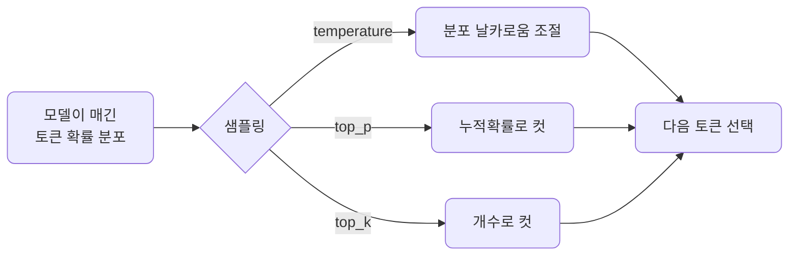
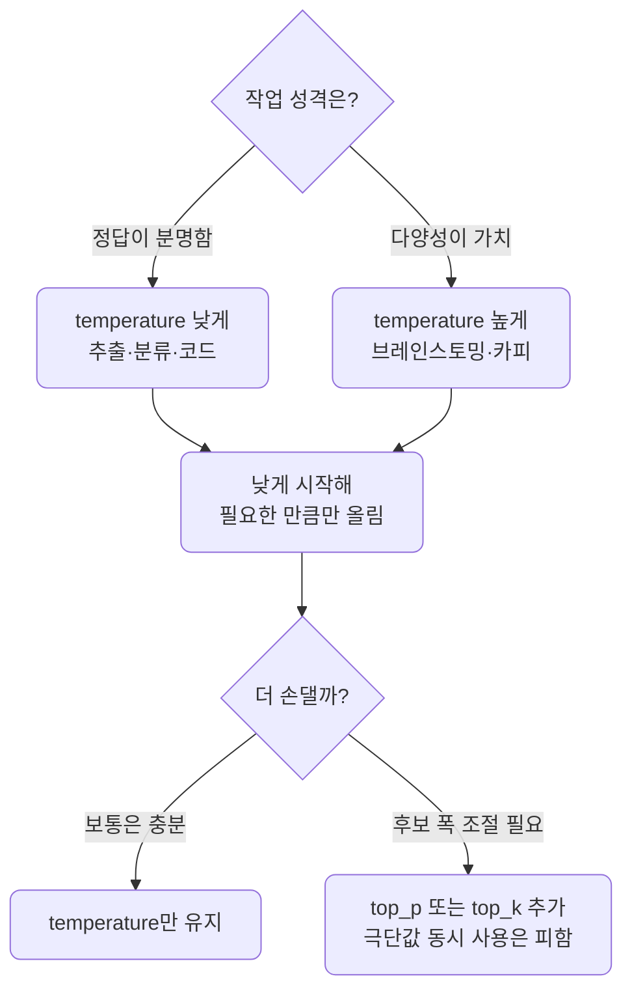

# lec03 — 샘플링 파라미터

> - S1 개요: [docs/section1/README.md](../README.md)
> - 분량 10분
> - 산출물: 비교 노트북

## 목표

앞 단위에서 LLM의 출력이 확률적이라고 했습니다. 이번에는 그 무작위성을 우리가 어디까지 조절할 수 있는지 봅니다. 같은 프롬프트에 세 파라미터를 바꿔 넣어보며 효과를 눈으로 비교합니다.

- `temperature`로 분포의 날카로움을 조절합니다.
- `top_p`로 누적 확률을 기준으로 후보를 자릅니다.
- `top_k`로 후보 개수를 기준으로 자릅니다.



## 다음 토큰은 확률 분포에서 뽑힙니다

모델은 매 스텝에서 가능한 모든 토큰에 확률을 매기고, 그 분포에서 토큰 하나를 고릅니다. 샘플링 파라미터는 이 "고르는 방식"을 조절하는 손잡이입니다.

- 분포를 더 뾰족하게 만들면 가장 확률 높은 토큰에 쏠립니다.
- 분포를 더 평평하게 만들면 덜 확률적인 토큰도 나옵니다.

## 세 파라미터 비교

세 파라미터는 "무엇을 자르거나 바꾸는가"가 서로 다릅니다.

| 파라미터 | 무엇을 조절·자르나 | 효과 | 언제 쓰나 |
| --- | --- | --- | --- |
| `temperature` | 분포의 날카로움 자체를 조절합니다 | 낮으면 결정적·보수적, 높으면 다양·창의적이지만 엇나갈 위험이 큽니다 | 다양성을 키우거나 줄이는 기본 손잡이로 씁니다 |
| `top_p` | 누적 확률이 임계값에 닿을 때까지만 후보로 남깁니다 | 분포 모양에 따라 후보 폭이 자동으로 달라집니다 | 상황별로 후보 폭이 유연하게 변하길 원할 때 씁니다 |
| `top_k` | 확률 상위 k개만 후보로 남깁니다 | 후보 개수가 항상 고정됩니다 | 후보 수를 단순하고 고정된 값으로 제한하고 싶을 때 씁니다 |

### temperature

temperature는 분포의 날카로움을 조절합니다.

- 값이 낮으면 분포가 뾰족해져 거의 항상 가장 확률 높은 토큰이 뽑히고, 출력이 결정적이고 보수적이 됩니다.
- 값이 높으면 분포가 평평해져 덜 흔한 토큰도 선택되고, 출력이 다양해지지만 엇나갈 위험도 커집니다.

대략의 감각은 작업 성격에 따라 다릅니다.

| 작업 | 권장 방향 | 예 |
| --- | --- | --- |
| 정답이 분명한 작업 | 낮은 값 | 추출, 분류, 코드 |
| 다양성이 가치인 작업 | 높은 값 | 브레인스토밍, 카피 초안 |

실무에서는 낮게 시작해 필요한 만큼만 올리는 편이 안전합니다.

### top_p

top_p는 누적 확률 기준으로 후보를 자릅니다. 확률이 높은 토큰부터 더해가다 누적이 top_p에 도달하면 거기까지만 후보로 남기고 나머지는 버립니다.

- 예를 들어 0.9면 상위 확률의 90%까지만 후보로 두는 셈입니다.
- 분포가 뾰족하면 후보가 몇 개로 좁혀지고, 평평하면 더 많이 남습니다.

상황에 따라 후보 폭이 달라진다는 점이 고정 개수로 자르는 방식과 다릅니다.

### top_k

top_k는 확률 상위 k개만 후보로 두고 나머지를 버립니다.

- k가 1이면 항상 최상위 토큰만 뽑혀 사실상 결정적이 됩니다.
- k가 크면 더 많은 후보가 살아남습니다.

top_p가 누적 확률로 자르는 것과 달리 top_k는 개수로 자릅니다.

## 함께 쓸 때

세 파라미터는 동시에 적용될 수 있지만, 보통 temperature 하나만 만져도 충분합니다.

- 여러 개를 한꺼번에 극단으로 주면 효과가 겹쳐 예측이 어려워집니다.
- 프로바이더에 따라 지원하는 파라미터가 다릅니다. 예를 들어 어떤 모델은 top_k를 받지 않습니다.
- 이 차이는 lec06에서 LiteLLM으로 프로바이더를 바꿀 때 다시 만납니다.



## 실행

공유된 비교 예제를 실행합니다. 같은 프롬프트를 temperature만 낮게, 그리고 높게 줘서 여러 번 호출하는 코드입니다.

```bash
uv run python src/section1/lec03/sampling_compare.py
```

출력에서 다음을 확인합니다.

- temperature가 낮을 때는 응답이 거의 똑같이 반복됩니다.
- temperature가 높을 때는 호출마다 응답이 달라집니다.

재현이 필요한 평가에서는 무작위성을 낮춰 출력을 안정시키는 것이 왜 중요한지도 이때 체감하게 됩니다.

## 직접 해보기

코드에서 `temperature` 값만 바꿔 다시 실행해봅니다.

- 0에 가깝게 줬다가 2에 가깝게 줘봅니다.
- 같은 프롬프트의 출력이 얼마나 흔들리는지 비교합니다.

값 하나가 결과를 얼마나 바꾸는지 손으로 확인하는 것이 이 단위의 핵심입니다.

## 정리

- 샘플링 파라미터는 다음 토큰을 고르는 방식을 조절하는 손잡이입니다.
- temperature는 분포의 날카로움, top_p는 누적 확률 컷, top_k는 개수 컷입니다.
- 정답이 분명한 작업은 낮은 무작위성, 다양성이 가치인 작업은 높은 무작위성으로 시작합니다.
