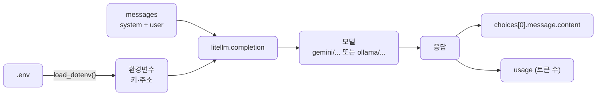
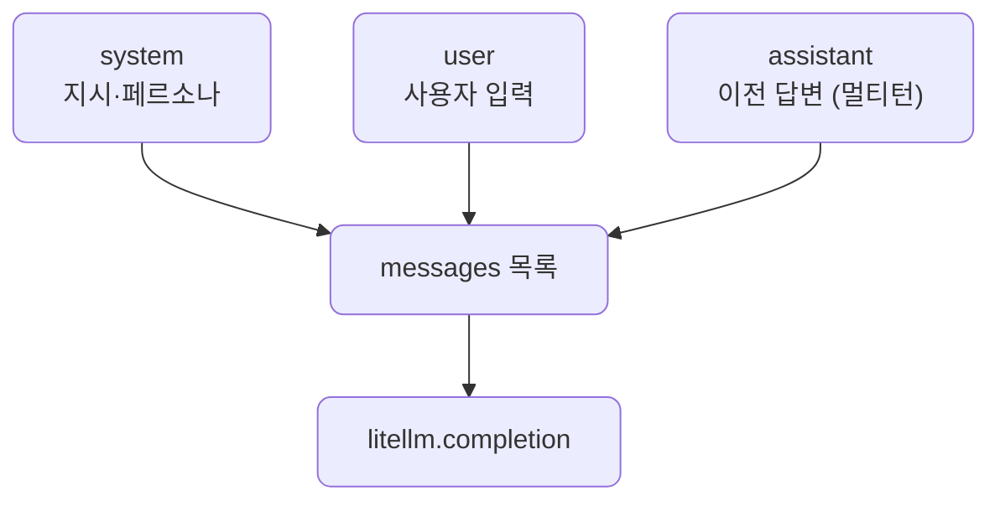
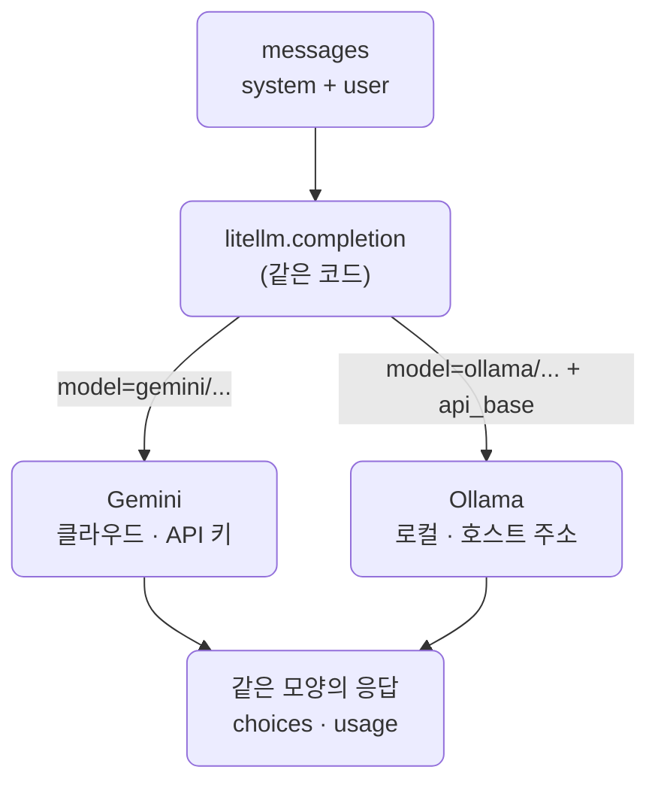
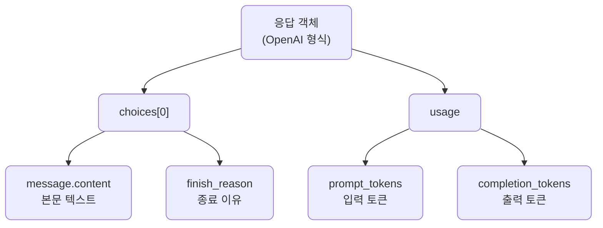
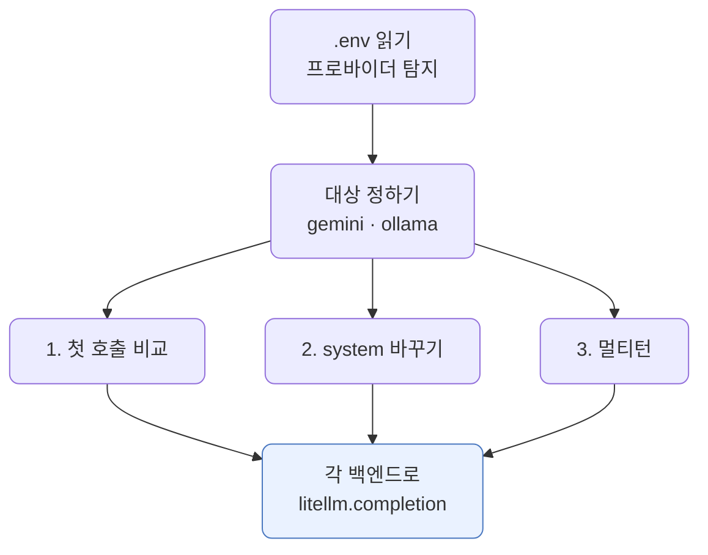
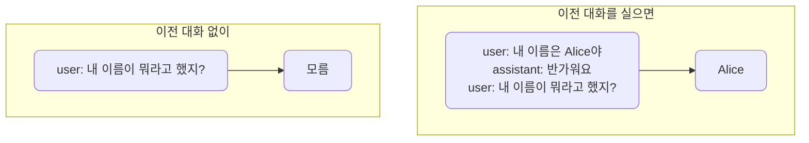

# lec04 — 단일 provider 호출

> - S1 개요: [docs/section1/README.md](../README.md)
> - 분량 12분
> - 산출물: 호출 스니펫

## 1. 목표

첫 LLM 호출을 보냅니다. lec01·lec03에서 호출을 잠깐 맛봤다면, 여기서는 호출 한 번을 제대로 들여다봅니다. 익히는 것은 셋입니다.

- 메시지가 어떤 구조로 구성되는지 봅니다.
- 응답에서 무엇을 꺼내 쓰는지 익힙니다.
- 같은 코드를 클라우드(gemini)와 로컬(ollama) 두 백엔드로 돌려 결과를 비교합니다.

중요한 결정 하나를 처음부터 적용합니다. 첫 호출이라도 프로바이더 SDK를 직접 부르지 않고 LiteLLM을 경유합니다. 그래야 백엔드를 바꿀 때 코드가 아니라 모델 문자열만 바뀝니다. 이 단위에서 gemini와 ollama를 같은 코드로 부르는 것이 그 첫 증거입니다.



## 2. 메시지 구조

대화형 LLM API는 보통 메시지의 목록을 입력으로 받습니다. 각 메시지는 역할(`role`)과 내용(`content`)을 가집니다. 역할은 크게 셋입니다.

| 역할 | 무엇을 담나 | 언제 |
| --- | --- | --- |
| `system` | 모델에게 주는 전반적인 지시나 페르소나 | 대화 맨 앞에 한 번 |
| `user` | 사용자의 입력 | 사용자가 말할 때마다 |
| `assistant` | 모델이 이전에 한 답변 | 멀티턴에서 직전 맥락을 이어줄 때 |

단일 호출에서는 보통 `system` 하나와 `user` 하나면 충분합니다. 멀티턴에서는 이 목록에 지난 대화를 차곡차곡 쌓아 보냅니다.



## 3. 같은 코드, 두 백엔드 — gemini와 ollama

이 단위는 클라우드 gemini와 로컬 ollama를 함께 씁니다. 둘은 도는 곳도 과금도 다르지만, 부르는 코드는 똑같습니다. `litellm.completion` 한 줄에서 모델 문자열만 달라질 뿐입니다.



| 항목 | Gemini | Ollama |
| --- | --- | --- |
| 도는 곳 | 클라우드 | 내 컴퓨터(호스트) |
| 필요한 것 | `GEMINI_API_KEY` | `OLLAMA_API_BASE`와 받은 모델 |
| 모델 문자열 | `gemini/gemini-2.5-flash` | `ollama/gemma4:12b-mxfp8` |
| 비용 | 토큰 종량제 | 무료(내 장비) |

호출 코드는 그대로 두고 이 둘을 오갈 수 있다는 점이, lec06에서 본격적으로 다룰 멀티 프로바이더의 맛보기입니다.

## 4. 첫 호출

아래는 공유된 예제의 핵심입니다. 직접 타이핑하기보다 저장소의 파일을 열어 함께 읽습니다. 흐름은 다음과 같습니다.

- `.env`의 키와 주소를 환경변수로 불러옵니다.
- `litellm.completion`을 부릅니다.
- 모델은 `프로바이더/모델` 형식의 문자열로 지정합니다.

```python
import litellm
from dotenv import load_dotenv

load_dotenv()  # .env의 키·주소를 환경변수로 로드

resp = litellm.completion(
    model="gemini/gemini-2.5-flash",  # 로컬이면 "ollama/gemma4:12b-mxfp8"
    messages=[
        {"role": "system", "content": "너는 간결하게 답하는 도우미야."},
        {"role": "user", "content": "한 문장으로 자기소개를 해줘."},
    ],
)

print(resp.choices[0].message.content)
```

`load_dotenv()`가 키를 환경변수로 올려두면, LiteLLM은 모델 문자열의 프로바이더 부분을 보고 알아서 맞는 키를 찾아 씁니다. 키를 코드에 넣거나 함수 인자로 넘길 필요가 없습니다. ollama로 바꿀 때는 모델 문자열을 `ollama/...`로 바꾸고 호스트 주소(`api_base`)만 함께 넘기면 됩니다.

## 5. 응답에서 무엇을 꺼내나

LiteLLM의 응답은 OpenAI 형식을 따릅니다. 프로바이더가 무엇이든 같은 모양으로 돌려준다는 점이 LiteLLM을 쓰는 큰 이유입니다. gemini든 ollama든 아래 경로가 똑같습니다.



| 꺼낼 값 | 경로 | 무엇인가 |
| --- | --- | --- |
| 본문 텍스트 | `resp.choices[0].message.content` | 모델이 돌려준 답변 |
| 종료 이유 | `resp.choices[0].finish_reason` | 정상 종료(`stop`)인지 길이 제한인지 |
| 토큰 사용량 | `resp.usage` | `prompt_tokens`, `completion_tokens`, `total_tokens` |

`usage`의 입력·출력 토큰 수로 lec02에서 말한 비용 감각을 실제 숫자로 확인합니다. 처음에는 `content`와 `usage` 둘만 확실히 잡아도 충분합니다.

## 6. 예제 코드가 하는 일 및 결과

[first_call.py](../../../src/section1/lec04/first_call.py)는 준비된 백엔드(gemini와 ollama)를 골라 같은 코드로 세 가지를 보여줍니다. 호출 코드는 하나뿐이고, 모델 문자열만 백엔드마다 다릅니다.



```bash
uv run python src/section1/lec04/first_call.py
```

### 6.1. 첫 호출 비교

같은 메시지를 두 백엔드로 보내 본문·토큰 수·종료 이유를 나란히 봅니다.

```text
=== 1. 첫 호출 — 같은 메시지, 두 백엔드 ===

[gemini / gemini/gemini-2.5-flash]
  본문: 저는 정보를 제공하고 작업을 돕는 AI 어시스턴트입니다.
  usage: prompt=23 completion=41 total=64
  finish_reason: stop

[ollama / ollama/gemma4:12b-mxfp8]
  본문: 질문에 대해 간결하게 답변해 드리는 도움니다.
  usage: prompt=47 completion=319 total=366
  finish_reason: stop
```

- 본문은 `choices[0].message.content`로 똑같이 꺼냅니다. 모델만 다를 뿐 코드는 같습니다.
- 토큰 수가 눈에 띄게 다릅니다. 같은 입력인데 `prompt`가 gemini 23, ollama 47입니다. 토크나이저가 달라 같은 글도 다르게 쪼개기 때문이며, lec02에서 말한 "모델마다 토큰 수가 다르다"가 실제 숫자로 드러난 것입니다. 출력 토큰과 합계는 답 길이와 모델에 따라 더 크게 갈립니다.

### 6.2. system 메시지 바꾸기

같은 질문에 `system`만 바꿔 답이 어떻게 달라지는지 봅니다. 응답 본문은 길어서 줄였습니다.

```text
=== 2. system 메시지의 힘 — 같은 질문, 다른 지시 ===

[gemini]
  (간결) LiteLLM은 여러 LLM 공급자를 위한 통합 API 인터페이스를 제공하는 오픈 소스 라이브러리입니다.
  (초등학생용) 마치 하나의 리모컨으로 여러 대의 TV를 조종하듯이, 어떤 챗봇이든 똑같은 방법으로 질문하고 대답을 들을 수 있게 도와주는 거야.

[ollama]
  (간결) LiteLLM은 여러 LLM API를 단일화된 인터페이스로 호출하게 해주는 유니버설 프록시 서버입니다.
  (초등학생용) 어떤 인공지능을 쓰더라도 똑같은 버튼만 누르면 되어서 아주 편리한 도구예요.
```

- user 메시지는 그대로인데 system 한 줄만 바꿨더니 말투와 깊이가 달라집니다. "초등학생용"에서는 두 모델 모두 비유를 들어 쉽게 풉니다.
- system은 모델의 전반적인 태도를 잡는 자리입니다. 출력 형식을 강제하거나 페르소나를 주는 본격적인 설계는 lec05 프롬프트 패턴에서 다룹니다.

### 6.3. 멀티턴과 기억 없음

모델은 대화를 스스로 기억하지 않습니다. 이전 대화를 messages에 직접 실어 줄 때만 맥락이 이어집니다.



```text
=== 3. 멀티턴 — 모델은 스스로 기억하지 않는다 ===

[gemini]
  이전 대화 없이: 저는 당신의 이름을 기억하지 못합니다. 이전 대화를 기억할 수 없어요.
  이전 대화를 실으면: 당신 이름은 Alice입니다.

[ollama]
  이전 대화 없이: 죄송하지만, 아직 저에게 이름을 알려주시지 않았어요.
  이전 대화를 실으면: 네 이름은 Alice라고 하셨어요!
```

- 이전 대화 없이 후속만 물으면 두 모델 다 모른다고 답합니다. 모델이 기억을 가진 것이 아니기 때문입니다.
- 지난 user·assistant 메시지를 함께 실어 보내면 그제야 "Alice"라고 답합니다. lec02에서 본 "멀티턴 맥락은 매번 다시 실어 보내는 입력"이 이렇게 동작합니다. 대화가 길어질수록 이 입력이 쌓여 토큰과 비용이 늘어납니다.

## 7. 자주 만나는 오류

| 증상 | 원인 | 대응 |
| --- | --- | --- |
| 인증 오류 | 클라우드 키가 비었거나 틀림 | `.env`의 `GEMINI_API_KEY`를 다시 확인 |
| 프로바이더 판단 실패 | 모델 문자열에 접두사 누락 | `gemini/`나 `ollama/` 접두사가 붙었는지 확인 |
| 연결 실패(ollama) | 호스트 Ollama 미실행이나 주소 틀림 | Ollama 실행과 `OLLAMA_API_BASE`를 확인 |
| 모델 없음(ollama) | 모델을 아직 안 받음 | `ollama pull`로 모델을 받았는지 확인 |
| 일시적 거절 | 무료 티어 호출 한도 초과 | 잠시 뒤 다시 시도 |

호출 한도로 인한 거절을 코드로 어떻게 다룰지는 뒤 섹션에서 정식으로 다룹니다.

## 8. 정리

- 입력은 역할과 내용을 가진 메시지의 목록입니다. 단일 호출은 `system`+`user`, 멀티턴은 지난 대화를 쌓아 보냅니다.
- 첫 호출부터 `litellm.completion`을 쓰고, 모델은 `프로바이더/모델` 문자열로 지정합니다. 모델 문자열만 바꾸면 클라우드 gemini와 로컬 ollama를 같은 코드로 오갑니다.
- 응답은 OpenAI 형식이라 `choices[0].message.content`와 `usage`로 본문과 토큰 수를 꺼냅니다. 같은 입력도 백엔드마다 토큰 수가 다릅니다.
- 모델은 대화를 기억하지 않으므로, 멀티턴 맥락은 우리가 messages에 직접 실어 보냅니다.
