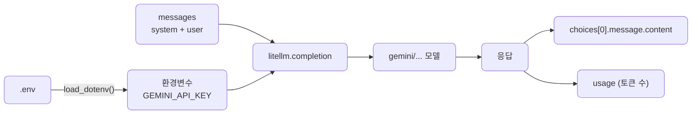

# lec04 — 단일 provider 호출

> S1 개요: [docs/section1/README.md](../README.md) · 분량 12분 · 산출물: 호출 스니펫

## 목표

첫 LLM 호출을 보냅니다. 메시지가 어떤 구조로 구성되는지, 응답에서 무엇을 꺼내 쓰는지 익힙니다. 프로바이더는 기본인 Gemini 하나만 씁니다.

중요한 결정 하나를 처음부터 적용합니다. 첫 호출이라도 프로바이더 SDK를 직접 부르지 않고 LiteLLM을 경유합니다. 지금은 모델이 하나뿐이라 굳이 추상화가 필요 없어 보일 수 있지만, lec06에서 모델을 바꿀 때 코드가 아니라 문자열만 바꾸려면 시작부터 LiteLLM 위에 서 있어야 합니다.



## 메시지 구조

대화형 LLM API는 보통 메시지의 목록을 입력으로 받습니다. 각 메시지는 역할(`role`)과 내용(`content`)을 가집니다. 역할은 크게 셋입니다.

- `system`은 모델에게 주는 전반적인 지시나 페르소나입니다. 대화 맨 앞에 한 번 둡니다.
- `user`는 사용자의 입력입니다.
- `assistant`는 모델이 이전에 한 답변입니다. 멀티턴 대화에서 직전 맥락을 이어줄 때 씁니다.

단일 호출에서는 보통 `system` 하나와 `user` 하나면 충분합니다.

## 첫 호출

`.env`의 키를 환경변수로 불러온 뒤 `litellm.completion`을 부릅니다. 모델은 `"gemini/gemini-..."`처럼 `프로바이더/모델` 형식의 문자열로 지정합니다. 구체 모델명은 녹화 시점 최신으로 확정하므로, 강의 영상의 문자열을 그대로 따라 쓰시기 바랍니다.

```python
import os
from dotenv import load_dotenv
import litellm

load_dotenv()  # .env의 GEMINI_API_KEY를 환경변수로 로드

resp = litellm.completion(
    model="gemini/gemini-2.0-flash",  # 모델명은 녹화 시점 최신으로 확정
    messages=[
        {"role": "system", "content": "너는 간결하게 답하는 도우미야."},
        {"role": "user", "content": "한 문장으로 자기소개를 해줘."},
    ],
)

print(resp.choices[0].message.content)
```

`load_dotenv()`가 키를 환경변수로 올려두면, LiteLLM은 모델 문자열의 프로바이더 부분을 보고 알아서 `GEMINI_API_KEY`를 찾아 씁니다. 키를 코드에 넣거나 함수 인자로 넘길 필요가 없습니다.

## 응답에서 무엇을 꺼내나

LiteLLM의 응답은 OpenAI 형식을 따릅니다. 프로바이더가 무엇이든 같은 모양으로 돌려준다는 점이 LiteLLM을 쓰는 큰 이유입니다.

- 본문 텍스트는 `resp.choices[0].message.content`에 있습니다.
- 토큰 사용량은 `resp.usage`에 들어 있습니다. 입력·출력 토큰 수가 여기 담기며, lec02에서 말한 비용 감각을 실제 숫자로 확인할 수 있습니다.

```python
print(resp.usage)  # prompt_tokens, completion_tokens, total_tokens
```

응답 객체에는 이 밖에도 종료 이유 등 여러 필드가 있습니다. 처음에는 `content`와 `usage` 두 가지만 확실히 잡아도 충분합니다.

## 자주 만나는 오류

- 키가 비어 있거나 틀리면 인증 오류가 납니다. `.env`의 `GEMINI_API_KEY`를 다시 확인합니다.
- 모델 문자열의 프로바이더 접두사를 빠뜨리면 LiteLLM이 어느 프로바이더인지 판단하지 못합니다. `gemini/` 접두사가 붙었는지 봅니다.
- 무료 티어의 호출 한도를 넘기면 일시적으로 거절될 수 있습니다. 잠시 뒤 다시 시도합니다. 이 재시도를 어떻게 코드로 다룰지는 뒤 섹션에서 정식으로 다룹니다.

## 정리

- 입력은 역할과 내용을 가진 메시지의 목록입니다.
- 첫 호출부터 `litellm.completion`을 쓰고, 모델은 `프로바이더/모델` 문자열로 지정합니다.
- 응답은 OpenAI 형식이라 `choices[0].message.content`와 `usage`로 본문과 토큰 수를 꺼냅니다.

## 다음 단위

[lec05 — 프롬프트 패턴](../lec05/README.md)에서 이 메시지 안에 무엇을 어떻게 담아야 원하는 출력이 나오는지 설계합니다.
