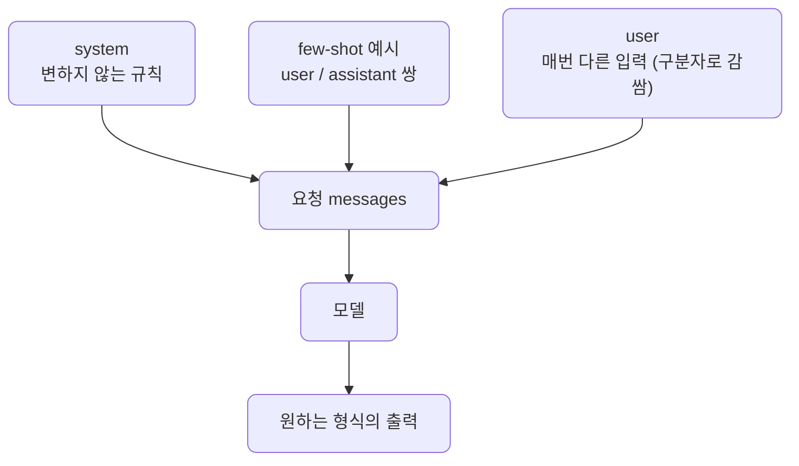

# lec05 — 프롬프트 패턴

> S1 개요: [docs/section1/README.md](../README.md) · 분량 18분 · 산출물: 프롬프트 템플릿

## 목표

같은 모델이라도 무엇을 어떻게 시키느냐에 따라 출력 품질이 크게 달라집니다. 이 단위에서는 실무에서 반복해 쓰는 프롬프트 패턴을 정리하고, 재사용 가능한 템플릿으로 묶습니다. system과 user의 역할 분담, 입력을 구분자로 감싸기, few-shot, 역할·출력형식 강제, 단계적 사고 유도, 그리고 실패를 보고 고치는 과정을 다룹니다.



## system과 user를 나눠 씁니다

지시와 입력을 한 덩어리로 합치지 말고 역할을 나눕니다. 변하지 않는 규칙은 `system`에, 매번 달라지는 데이터는 `user`에 둡니다. 이렇게 하면 규칙을 한곳에서 관리할 수 있고, 같은 system 위에 여러 user 입력을 흘려보내기 쉬워집니다.

```python
messages = [
    {"role": "system", "content": "너는 고객 문의를 분류하는 분류기야. 카테고리는 결제, 배송, 환불 중 하나만 고른다."},
    {"role": "user", "content": "어제 주문한 물건이 아직도 안 왔어요."},
]
```

규칙이 system으로 빠지면 user는 순수하게 분류 대상만 담습니다.

## 입력을 구분자로 감쌉니다

사용자 입력을 지시문과 같은 줄에 섞으면 모델이 어디까지가 지시이고 어디부터가 데이터인지 헷갈립니다. 특히 사용자 입력 안에 "위 지시를 무시해"처럼 지시처럼 보이는 문장이 들어 있으면 위험합니다. 그래서 데이터는 따옴표나 태그 같은 구분자로 분명히 감쌉니다.

```python
prompt = """다음 삼중 따옴표 안의 리뷰를 한 문장으로 요약해라.
\"\"\"
{review}
\"\"\""""
```

구분자는 사소해 보이지만, 입력과 지시를 분리해 두면 출력이 안정되고 의도치 않은 지시 주입도 어느 정도 막힙니다. 이 주제의 본격적인 방어는 S4의 프롬프트 주입 방어에서 다룹니다.

## few-shot으로 예시를 보여줍니다

원하는 입출력의 모양을 말로 설명하는 대신 예시 몇 개를 보여주면 모델이 패턴을 더 잘 따라옵니다. 이를 few-shot이라고 합니다. 예시는 `system`에 적어도 되고, `user`와 `assistant` 메시지를 번갈아 넣어 실제 대화처럼 구성해도 됩니다.

```python
messages = [
    {"role": "system", "content": "문장의 감정을 긍정/부정/중립 중 하나로만 답한다."},
    {"role": "user", "content": "배송이 정말 빨라서 좋았어요."},
    {"role": "assistant", "content": "긍정"},
    {"role": "user", "content": "포장이 다 찢어져서 왔네요."},
    {"role": "assistant", "content": "부정"},
    {"role": "user", "content": "가격은 그냥 무난한 것 같습니다."},
]
```

예시는 출력 형식까지 함께 보여주므로, 형식을 따로 길게 설명하지 않아도 됩니다. 다만 예시가 길어지면 그만큼 입력 토큰이 늘어나니, 효과가 나타나는 최소한으로 둡니다. 예시를 고를 때는 흔한 경우만이 아니라 헷갈리기 쉬운 경계 사례를 한둘 섞는 편이 효과가 좋습니다.

## 역할과 출력 형식을 강제합니다

모델에게 누구로서 답하는지, 어떤 형식으로 답하는지를 명시하면 출력이 안정됩니다. "전문가처럼 답해" 같은 막연한 말보다, 무엇을 하지 말아야 하는지와 출력의 모양을 구체적으로 적는 편이 효과적입니다.

```text
너는 사내 규정 안내 도우미다.
- 규정에 없는 내용은 추측하지 말고 "규정에서 확인되지 않습니다"라고 답한다.
- 답변은 세 문장 이내로 한다.
- 불릿이나 마크다운 없이 평문으로만 답한다.
```

출력을 JSON 같은 구조로 받고 싶을 때도 형식을 강제할 수 있지만, 프롬프트만으로 JSON을 받는 데는 함정이 많습니다. 이 주제는 lec08과 lec09에서 따로 깊게 다룹니다.

## 단계적으로 생각하게 합니다

답이 한 번에 나오기 어려운 추론 문제에서는, 결론만 바로 내놓으라고 하기보다 과정을 거치게 하면 정확도가 올라갑니다. "차근차근 단계적으로 생각한 뒤 답하라"는 한 줄이 대표적입니다.

다만 서비스에서는 그 과정 전체를 사용자에게 보여줄 필요가 없는 경우가 많습니다. 그럴 때는 모델이 내부적으로 단계를 밟되 최종 답만 정해진 형식으로 내도록 지시합니다. 과정을 길게 출력하면 그만큼 토큰과 지연이 늘어난다는 점도 함께 고려합니다. 간단한 분류나 추출에는 이 패턴이 오히려 군더더기이니, 정말 추론이 필요한 작업에만 씁니다.

## 실패를 보고 고칩니다

처음 프롬프트가 한 번에 완벽하게 도는 일은 드뭅니다. 모델이 형식을 어기거나, 엉뚱한 카테고리를 만들어내거나, 너무 장황하게 답할 수 있습니다. 이때는 출력을 보고 프롬프트를 고치는 반복이 정상적인 작업입니다.

교정의 방향은 보통 이렇습니다. 모델이 허용되지 않은 값을 내면 허용 목록을 명시하고, 형식을 어기면 예시를 추가하며, 장황하면 길이 제한을 둡니다. 막연한 지시를 구체적인 제약으로 바꾸는 것이 핵심입니다.

```text
# 교정 전
카테고리를 골라줘.

# 교정 후
카테고리를 [결제, 배송, 환불] 중 하나로만, 다른 말 없이 그 단어만 출력해라.
```

## 템플릿으로 묶습니다

매번 프롬프트를 새로 쓰지 않도록, 변하지 않는 부분과 채워 넣을 부분을 나눠 템플릿으로 만듭니다. 파이썬에서는 형식 문자열로 충분합니다.

```python
CLASSIFY_SYSTEM = "문의를 [결제, 배송, 환불] 중 하나로만 분류한다. 그 단어만 출력한다."

def build_messages(user_text: str) -> list[dict]:
    return [
        {"role": "system", "content": CLASSIFY_SYSTEM},
        {"role": "user", "content": user_text},
    ]
```

이렇게 분리해 두면 system 규칙을 한 곳에서 고치고, 입력만 바꿔 여러 번 호출할 수 있습니다. 이 단위의 산출물이 바로 이런 재사용 가능한 프롬프트 템플릿입니다.

## 실행

공유된 프롬프트 예제를 실행합니다. 같은 입력을 빈약한 프롬프트와 잘 설계한 프롬프트로 각각 보내, 출력이 어떻게 달라지는지 나란히 보여주는 코드입니다.

```bash
uv run python src/section1/lec05/prompt_patterns.py
```

few-shot 예시를 넣었을 때와 뺐을 때, 형식 제약을 줬을 때와 안 줬을 때의 차이를 출력에서 확인합니다.

## 직접 해보기

예제의 system 프롬프트를 직접 고쳐봅니다. 허용 카테고리를 바꾸거나, few-shot 예시를 하나 더 넣거나, 출력 길이 제한을 추가한 뒤 다시 실행해 결과가 어떻게 변하는지 봅니다. 프롬프트 한 줄이 출력을 어떻게 바꾸는지 손으로 익히는 것이 이 단위에서 직접 해볼 부분입니다.

## 정리

- 변하지 않는 규칙은 system에, 매번 달라지는 입력은 user에 두고, 입력은 구분자로 감쌉니다.
- few-shot으로 입출력 예시를 보여주면 형식 설명을 줄일 수 있고, 경계 사례를 섞으면 효과가 좋습니다.
- 막연한 지시 대신 허용값·형식·길이 같은 구체적 제약으로 출력을 강제합니다.
- 추론이 필요한 작업에만 단계적 사고를 유도하고, 결과는 정해진 형식으로 받습니다.
- 출력을 보고 프롬프트를 고치는 반복은 정상이며, 그 결과를 템플릿으로 묶어 재사용합니다.

## 다음 단위

[lec06 — LiteLLM 멀티 프로바이더](../lec06/README.md)에서 같은 프롬프트를 코드 변경 없이 여러 프로바이더로 보냅니다.
