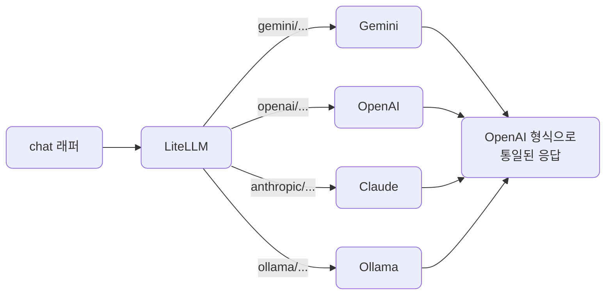
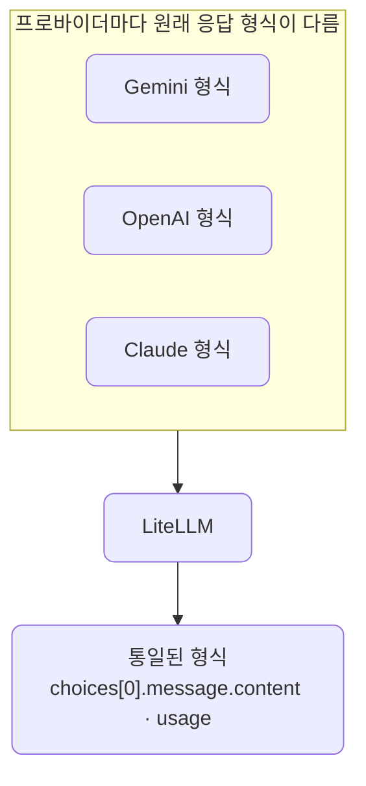
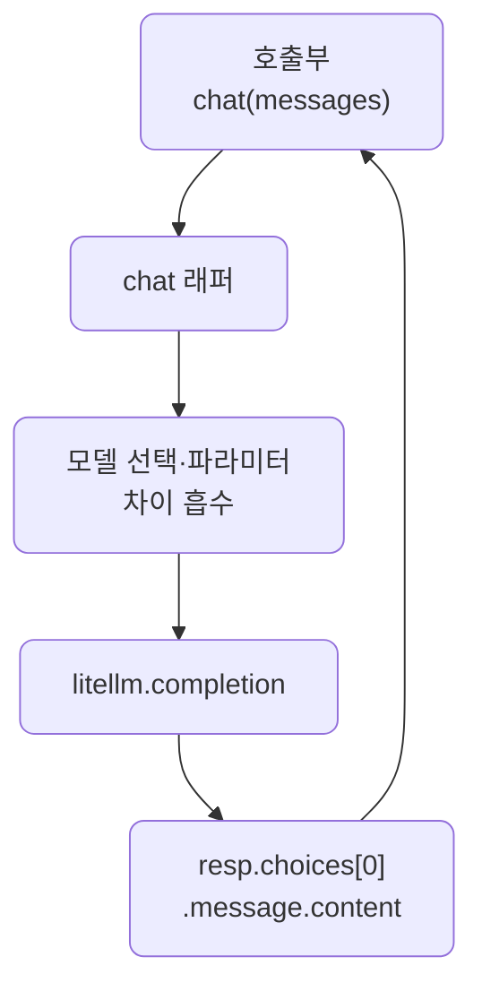
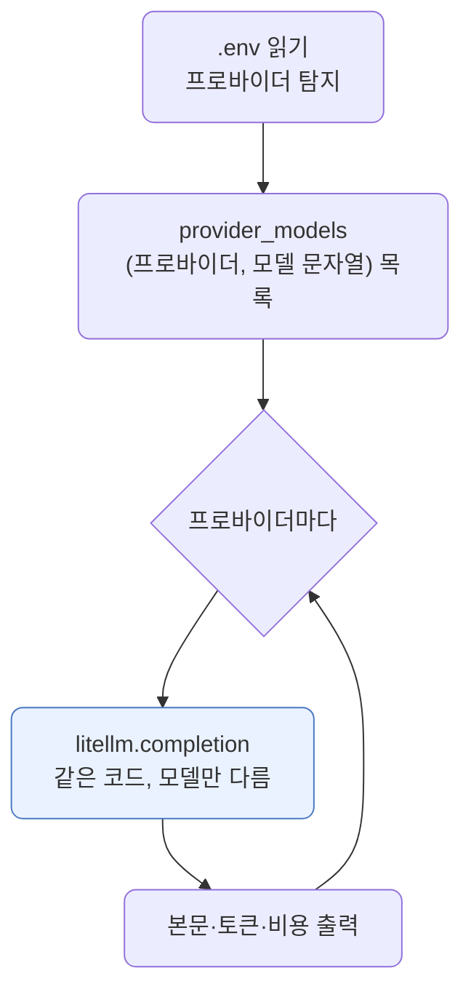

# lec06 — LiteLLM 멀티 프로바이더

> - S1 개요: [docs/section1/README.md](../README.md)
> - 분량 16분
> - 산출물: 멀티 프로바이더 래퍼

## 1. 목표

lec04부터 이미 LiteLLM을 써왔습니다. 이번에는 그 선택이 주는 이득을 거둡니다. 이 단위에서 다루는 것은 다음과 같습니다.

- 같은 코드에서 모델 문자열만 바꿔 Gemini·OpenAI·Claude·Ollama를 오가는 것을 시연합니다.
- 프로바이더별 키 처리와 차이를 한 겹 감싸는 작은 래퍼를 만듭니다.
- 같은 프롬프트의 토큰과 비용을 프로바이더끼리 비교하는 감각을 잡습니다.



## 2. 모델 문자열로 수렴합니다

LiteLLM의 핵심은 프로바이더 선택이 코드가 아니라 문자열 하나로 끝난다는 점입니다. 다음 세 가지를 그대로 두고 `model` 인자만 바꿉니다.

- 호출하는 함수
- 메시지 구조
- 응답을 꺼내는 방식

```python
import litellm

messages = [{"role": "user", "content": "LiteLLM을 한 문장으로 설명해줘."}]

for model in ["gemini/gemini-2.5-flash", "openai/gpt-4o-mini", "anthropic/claude-haiku-4-5"]:
    resp = litellm.completion(model=model, messages=messages)
    print(model, "->", resp.choices[0].message.content)
```

각 모델 문자열은 `프로바이더/모델` 형식입니다. LiteLLM은 접두사를 보고 어느 프로바이더로 보낼지, 어떤 환경변수의 키를 쓸지 정합니다.

## 3. 키는 환경변수로 알아서 찾습니다

프로바이더마다 LiteLLM이 읽는 환경변수 이름이 정해져 있습니다. 접두사와 환경변수, 예시 모델 문자열을 정리하면 다음과 같습니다.

| 프로바이더 접두사 | 읽는 환경변수 | 예시 모델 문자열 |
| --- | --- | --- |
| `gemini/` | `GEMINI_API_KEY` | `gemini/gemini-2.5-flash` |
| `openai/` | `OPENAI_API_KEY` | `openai/gpt-4o-mini` |
| `anthropic/` | `ANTHROPIC_API_KEY` | `anthropic/claude-haiku-4-5` |
| `ollama/` | 로컬 실행이라 키 불필요 | `ollama/gemma4:12b` |

lec01에서 `.env`에 채워둔 키가 `load_dotenv()`로 환경변수에 올라가 있으면, 우리는 키를 코드에 넘기지 않아도 됩니다. 모델 문자열만 바꾸면 LiteLLM이 그에 맞는 키를 골라 씁니다.

그래서 보조 프로바이더 키가 `.env`에 없으면 그 줄에서만 인증 오류가 나고, 나머지는 정상 동작합니다. 위 반복문을 돌렸을 때 Gemini만 답하고 나머지가 실패한다면, 그것은 코드 문제가 아니라 해당 키가 비어 있다는 뜻입니다.

## 4. 응답 형식이 통일됩니다

프로바이더마다 원래 응답 형식은 다릅니다. LiteLLM은 이를 OpenAI 형식으로 통일해 돌려줍니다.



- 본문은 어느 모델이든 `resp.choices[0].message.content`로 꺼냅니다.
- 토큰 사용량은 `resp.usage`로 같은 자리에서 읽습니다.
- 프로바이더를 바꿨다고 파싱 코드를 다시 짜지 않아도 됩니다.

## 5. 토큰과 비용을 비교합니다

토큰 사용량을 같은 자리에서 읽을 수 있으니 프로바이더끼리 나란히 비교할 수 있습니다. 같은 프롬프트라도 모델마다 결과가 달라지는 이유는 다음과 같습니다.

- 모델마다 토큰화 방식이 달라 같은 프롬프트의 토큰 수가 다르게 나옵니다.
- 토큰 단가까지 다르므로 비용도 달라집니다.

```python
for model in ["gemini/gemini-2.5-flash", "openai/gpt-4o-mini"]:
    resp = litellm.completion(model=model, messages=messages)
    u = resp.usage
    print(model, u.prompt_tokens, u.completion_tokens)
```

LiteLLM은 토큰뿐 아니라 호출 비용도 응답에서 계산해 줍니다. `litellm.completion_cost(completion_response=resp)`가 모델 단가를 적용한 USD 비용을 돌려줍니다. 어떤 작업에 어떤 모델이 품질 대비 저렴한지는 이렇게 직접 재봐야 감이 옵니다. 비싼 모델이 항상 정답인 것은 아니며, 단순한 분류·추출에는 저렴한 모델로 충분한 경우가 많습니다.

## 6. 프로바이더 차이를 감싸는 래퍼

문자열만 바꾸면 된다고 했지만, 현실에는 프로바이더별 미묘한 차이가 남습니다.

- 어떤 모델은 특정 샘플링 파라미터를 받지 않습니다. lec03에서 본 OpenAI의 top_k가 그 예입니다.
- system 메시지 처리 방식이 프로바이더마다 조금씩 다릅니다.

이런 차이를 호출부 곳곳에 흩뿌리지 않고 한 함수에 모읍니다.

```python
import litellm

DEFAULT_MODEL = "gemini/gemini-2.5-flash"

def chat(messages: list[dict], model: str = DEFAULT_MODEL, **kwargs) -> str:
    """프로바이더 무관하게 호출하고 본문 텍스트만 돌려준다."""
    resp = litellm.completion(model=model, messages=messages, **kwargs)
    return resp.choices[0].message.content
```

이 작은 함수가 이 단위의 산출물입니다. 호출하는 쪽은 `chat(messages)`만 알면 되고, 기본 모델을 바꾸거나 프로바이더별 예외를 처리할 일이 생기면 이 함수 안에서만 손봅니다. 뒤 단위들도 이 래퍼 위에 쌓입니다.



## 7. 폴백과 라우팅은 맛만 봅니다

LiteLLM에는 신뢰성을 위한 기능도 있습니다. 이 단위에서는 있다는 정도만 짚고, 본격적인 처리는 S4에서 다룹니다.

| 기능 | 하는 일 | 쓰는 상황 |
| --- | --- | --- |
| 폴백 | 한 모델이 실패하면 다음 모델로 넘깁니다 | 한 프로바이더가 일시적으로 거절하거나 한도를 넘겼을 때 |
| 라우팅 | 여러 모델에 부하를 나눕니다 | 요청을 여러 모델로 분산하고 싶을 때 |

## 8. 예제 코드가 하는 일 및 결과

[provider_swap.py](../../../src/section1/lec06/provider_swap.py)는 준비된 프로바이더를 골라 같은 메시지를 보내고, 본문·토큰·비용을 나란히 출력합니다. 호출 코드는 하나뿐이고 모델 문자열만 프로바이더마다 다릅니다.



```bash
uv run python src/section1/lec06/provider_swap.py
```

실제 출력 예시입니다. 본문은 모델마다 조금씩 다르지만, 같은 코드로 꺼냈습니다.

```text
=== 모델 문자열만 바꿔 여러 프로바이더로 ===
질문: LiteLLM을 한 문장으로 설명해줘.

[gemini] gemini/gemini-2.5-flash
  본문: LiteLLM은 다양한 LLM API를 하나의 일관된 인터페이스로 통합해 주는 라이브러리입니다.
  토큰: prompt=13 completion=1211
  비용: $0.003031

[openai] openai/gpt-4o-mini
  본문: LiteLLM은 경량화된 언어 모델로, 효율성과 속도를 중시하도록 설계되었습니다.
  토큰: prompt=19 completion=37
  비용: $0.000025

[anthropic] anthropic/claude-haiku-4-5
  본문: 다양한 LLM API(OpenAI, Claude, Gemini 등)를 통일된 인터페이스로 쓰게 해주는 Python 라이브러리입니다.
  토큰: prompt=27 completion=69
  비용: $0.000372

[ollama] ollama/gemma4:12b-mxfp8
  본문: LiteLLM은 다양한 LLM을 동일한 코드로 호출하게 해주는 통합 인터페이스 라이브러리입니다.
  토큰: prompt=32 completion=437
  비용: -(로컬·무료)
```

읽어낼 점은 셋입니다.

- 모델 문자열만 바꿔 네 곳이 모두 답합니다. 호출·파싱 코드는 한 줄도 바뀌지 않았습니다.
- 같은 질문인데 입력 토큰이 13·19·27·32로 제각각입니다. 토크나이저가 달라 같은 글도 다르게 쪼개기 때문이며, lec02·lec04에서 본 차이가 네 모델로 한눈에 보입니다.
- 비용은 직관과 다를 수 있습니다. gemini 2.5 flash는 답을 길게 "생각"해 출력 토큰이 1211까지 가서 약 $0.003이 됐고, gpt-4o-mini는 $0.000025로 100배 넘게 쌌습니다. "flash라서 싸다"가 항상 맞지는 않으니, 작업별로 직접 재봐야 합니다. ollama는 로컬이라 토큰 비용이 없고, 대신 lec04에서 본 것처럼 시간을 치릅니다.

## 9. 정리

- 프로바이더 선택은 `model` 문자열 하나로 끝나고, 호출·파싱 코드는 그대로입니다.
- 키는 프로바이더별 환경변수로 자동으로 찾으므로 코드에 넣지 않습니다.
- LiteLLM이 응답을 OpenAI 형식으로 통일해, 본문과 토큰을 모델 무관하게 같은 자리에서 읽고 비용까지 계산해 줍니다.
- 같은 프롬프트라도 토큰·비용이 모델마다 달라, 작업에 맞는 모델은 직접 재서 고릅니다.
- 프로바이더별 차이는 호출부에 흩뿌리지 말고 작은 chat 래퍼 한곳에 모읍니다. 뒤 단위들이 이 위에 쌓입니다.
