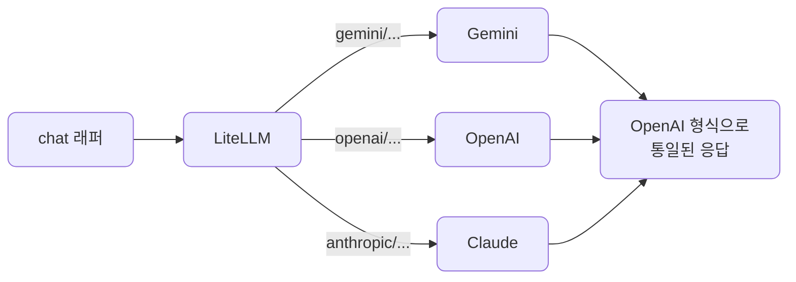

# lec06 — LiteLLM 멀티 프로바이더

> S1 개요: [docs/section1/README.md](../README.md) · 분량 16분 · 산출물: 멀티 프로바이더 래퍼

## 목표

lec04부터 이미 LiteLLM을 써왔습니다. 이번에는 그 선택이 주는 이득을 거둡니다. 같은 코드에서 모델 문자열만 바꿔 Gemini, OpenAI, Claude를 오가는 것을 시연하고, 프로바이더별 키 처리와 차이를 한 겹 감싸는 작은 래퍼를 만듭니다. 같은 프롬프트의 토큰과 비용을 프로바이더끼리 비교하는 감각도 잡습니다.



## 모델 문자열로 수렴합니다

LiteLLM의 핵심은 프로바이더 선택이 코드가 아니라 문자열 하나로 끝난다는 점입니다. 호출하는 함수도, 메시지 구조도, 응답을 꺼내는 방식도 그대로 두고 `model` 인자만 바꿉니다.

```python
import litellm

messages = [{"role": "user", "content": "LiteLLM을 한 문장으로 설명해줘."}]

for model in ["gemini/gemini-2.0-flash", "openai/gpt-4o-mini", "anthropic/claude-3-5-haiku-latest"]:
    resp = litellm.completion(model=model, messages=messages)
    print(model, "->", resp.choices[0].message.content)
```

각 모델 문자열은 `프로바이더/모델` 형식입니다. LiteLLM은 접두사를 보고 어느 프로바이더로 보낼지, 어떤 환경변수의 키를 쓸지 정합니다.

## 키는 환경변수로 알아서 찾습니다

프로바이더마다 LiteLLM이 읽는 환경변수 이름이 정해져 있습니다. `gemini/`는 `GEMINI_API_KEY`, `openai/`는 `OPENAI_API_KEY`, `anthropic/`는 `ANTHROPIC_API_KEY`를 봅니다. lec01에서 `.env`에 채워둔 키가 `load_dotenv()`로 환경변수에 올라가 있으면, 우리는 키를 코드에 넘기지 않아도 됩니다. 모델 문자열만 바꾸면 LiteLLM이 그에 맞는 키를 골라 씁니다.

그래서 보조 프로바이더 키가 `.env`에 없으면 그 줄에서만 인증 오류가 나고, 나머지는 정상 동작합니다. 위 반복문을 돌렸을 때 Gemini만 답하고 나머지가 실패한다면, 그것은 코드 문제가 아니라 해당 키가 비어 있다는 뜻입니다.

## 응답 형식이 통일됩니다

프로바이더마다 원래 응답 형식은 다릅니다. LiteLLM은 이를 OpenAI 형식으로 통일해 돌려줍니다. 그래서 위 반복문에서 보듯 어느 모델이든 `resp.choices[0].message.content`로 본문을 꺼냅니다. 프로바이더를 바꿨다고 파싱 코드를 다시 짜지 않아도 됩니다.

## 토큰과 비용을 비교합니다

토큰 사용량도 `resp.usage`로 같은 자리에서 읽습니다. 모델마다 토큰화 방식이 달라 같은 프롬프트라도 토큰 수가 다르게 나오고, 단가까지 다르므로 비용도 달라집니다. 이를 같은 코드로 나란히 비교할 수 있다는 점이 멀티 프로바이더의 실질적 이득입니다.

```python
for model in ["gemini/gemini-2.0-flash", "openai/gpt-4o-mini"]:
    resp = litellm.completion(model=model, messages=messages)
    u = resp.usage
    print(model, u.prompt_tokens, u.completion_tokens)
```

어떤 작업에 어떤 모델이 품질 대비 저렴한지는 이렇게 직접 재봐야 감이 옵니다. 비싼 모델이 항상 정답인 것은 아니며, 단순한 분류·추출에는 저렴한 모델로 충분한 경우가 많습니다.

## 프로바이더 차이를 감싸는 래퍼

문자열만 바꾸면 된다고 했지만, 현실에는 프로바이더별 미묘한 차이가 남습니다. 어떤 모델은 특정 샘플링 파라미터를 받지 않고, system 메시지 처리 방식이 조금씩 다릅니다. 이런 차이를 호출부 곳곳에 흩뿌리지 않고 한 함수에 모읍니다.

```python
import litellm

DEFAULT_MODEL = "gemini/gemini-2.0-flash"

def chat(messages: list[dict], model: str = DEFAULT_MODEL, **kwargs) -> str:
    """프로바이더 무관하게 호출하고 본문 텍스트만 돌려준다."""
    resp = litellm.completion(model=model, messages=messages, **kwargs)
    return resp.choices[0].message.content
```

이 작은 함수가 이 단위의 산출물입니다. 호출하는 쪽은 `chat(messages)`만 알면 되고, 기본 모델을 바꾸거나 프로바이더별 예외를 처리할 일이 생기면 이 함수 안에서만 손봅니다. 뒤 단위들도 이 래퍼 위에 쌓입니다.

## 폴백과 라우팅은 맛만 봅니다

LiteLLM에는 한 모델이 실패하면 다음 모델로 넘기는 폴백, 여러 모델에 부하를 나누는 라우팅 기능도 있습니다. 한 프로바이더가 일시적으로 거절하거나 한도를 넘겼을 때 자동으로 다른 모델로 넘기는 식입니다. 이 단위에서는 그런 기능이 있다는 정도만 짚고, 신뢰성 관점의 본격적인 처리는 S4에서 다룹니다.

## 정리

- 프로바이더 선택은 `model` 문자열 하나로 끝나고, 호출·파싱 코드는 그대로입니다.
- 키는 프로바이더별 환경변수로 자동으로 찾으므로 코드에 넣지 않습니다.
- LiteLLM이 응답을 OpenAI 형식으로 통일해, 본문과 토큰을 모델 무관하게 같은 자리에서 읽습니다.
- 같은 프롬프트의 토큰·비용을 비교해 작업에 맞는 모델을 고르는 감각을 잡습니다.
- 프로바이더별 차이는 호출부에 흩뿌리지 말고 작은 래퍼 함수 한곳에 모읍니다.

## 다음 단위

[lec07 — Ollama 로컬](../lec07/README.md)에서 같은 래퍼로 로컬 모델까지 끌어옵니다.
