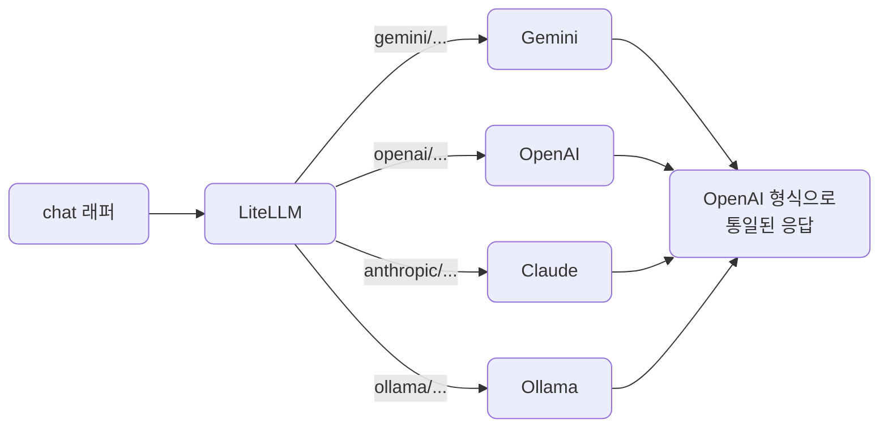
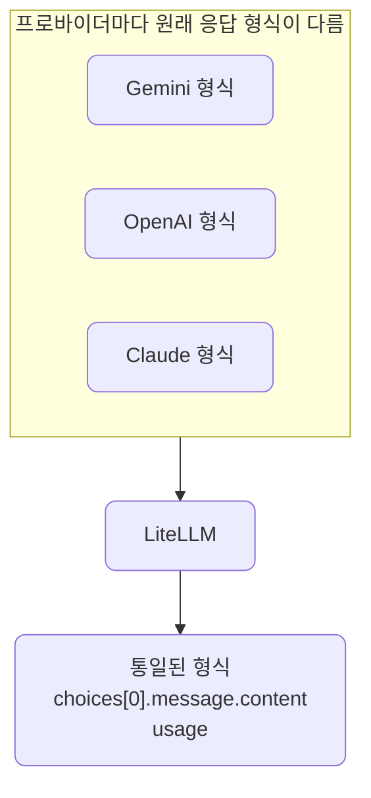
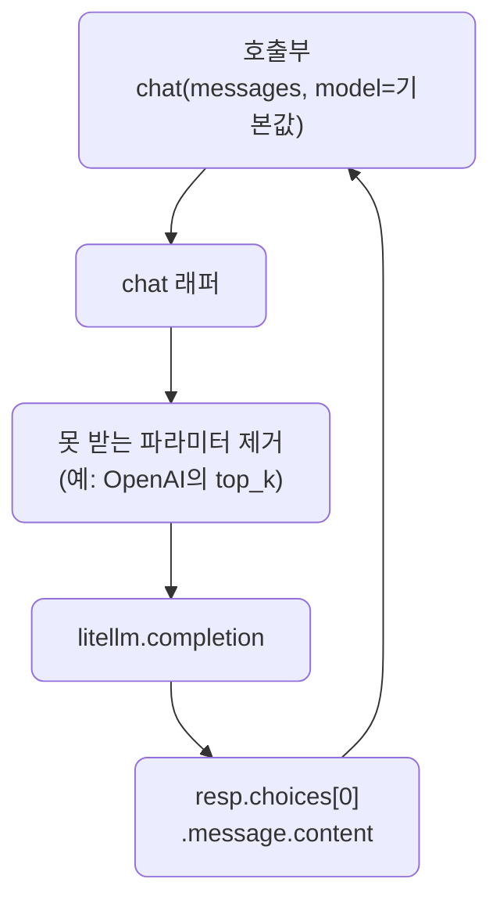
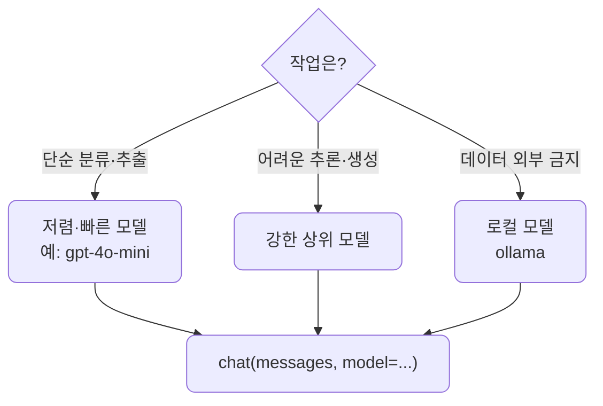
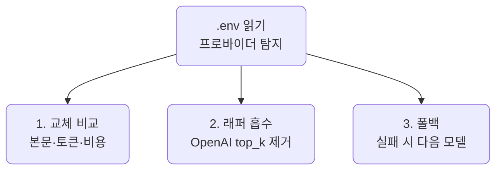

# lec06 — LiteLLM 멀티 프로바이더

> - S1 개요: [docs/section1/README.md](../README.md)
> - 분량 16분
> - 산출물: 멀티 프로바이더 래퍼

## 1. 목표

lec04부터 이미 LiteLLM을 써왔습니다. 모델 문자열 하나로 프로바이더가 정해지고, 키는 환경변수에서 자동으로 찾고, 응답은 한 모양으로 통일된다는 것을 봤습니다. 이번 단위는 그 이점을 본격적으로 활용합니다.

- 같은 코드에서 모델 문자열만 바꿔 Gemini·OpenAI·Claude·Ollama를 오가는 것을 시연합니다.
- 프로바이더별 키와 차이를 한 겹 감싸는 작은 래퍼를 만듭니다.
- 같은 프롬프트의 토큰·비용을 비교하고, 실패 시 갈아타는 폴백까지 봅니다.

2~5절은 지금까지 써온 내용을 빠르게 정리하는 부분입니다. 6절부터가 이 단위의 새로운 내용입니다. 차이를 흡수하는 래퍼, 실패 시 갈아타는 폴백, 작업에 맞는 모델 선택입니다.



## 2. 모델 문자열로 수렴합니다

LiteLLM의 핵심은 프로바이더 선택이 코드가 아니라 문자열 하나로 끝난다는 점입니다. 다음 세 가지를 그대로 두고 `model` 인자만 바꿉니다.

- 호출하는 함수
- 메시지 구조
- 응답을 꺼내는 방식

```python
import litellm

messages = [{"role": "user", "content": "LiteLLM을 한 문장으로 설명해줘."}]

for model in ["gemini/gemini-2.5-flash", "openai/gpt-4o-mini", "anthropic/claude-haiku-4-5"]:
    resp = litellm.completion(model=model, messages=messages)
    print(model, "->", resp.choices[0].message.content)
```

각 모델 문자열은 `프로바이더/모델` 형식입니다. LiteLLM은 접두사를 보고 어느 프로바이더로 보낼지, 어떤 환경변수의 키를 쓸지 정합니다.

## 3. 키는 환경변수로 알아서 찾습니다

프로바이더마다 LiteLLM이 읽는 환경변수 이름이 정해져 있습니다.

| 프로바이더 접두사 | 읽는 환경변수 | 예시 모델 문자열 |
| --- | --- | --- |
| `gemini/` | `GEMINI_API_KEY` | `gemini/gemini-2.5-flash` |
| `openai/` | `OPENAI_API_KEY` | `openai/gpt-4o-mini` |
| `anthropic/` | `ANTHROPIC_API_KEY` | `anthropic/claude-haiku-4-5` |
| `ollama/` | 로컬 실행이라 키 불필요 | `ollama/gemma4:12b` |

lec01에서 `.env`에 채워둔 키가 `load_dotenv()`로 환경변수에 올라가 있으면 키를 코드에 넘기지 않아도 됩니다. 보조 프로바이더 키가 비어 있으면 그 줄에서만 인증 오류가 나고 나머지는 정상 동작합니다. Gemini만 답하고 나머지가 실패한다면 코드 문제가 아니라 해당 키가 비어 있다는 뜻입니다.

## 4. 응답 형식이 통일됩니다

프로바이더마다 원래 응답 형식은 다릅니다. LiteLLM은 이를 OpenAI 형식으로 통일해 돌려줍니다.



본문은 어느 모델이든 `resp.choices[0].message.content`로, 토큰은 `resp.usage`로 같은 자리에서 읽습니다. 프로바이더를 바꿨다고 파싱 코드를 다시 짜지 않아도 됩니다.

## 5. 토큰과 비용을 비교합니다

토큰을 같은 자리에서 읽으니 프로바이더끼리 나란히 비교할 수 있습니다. 같은 프롬프트라도 모델마다 토큰화 방식이 달라 토큰 수가 다르고, 단가까지 다르므로 비용도 갈립니다. LiteLLM은 비용도 응답에서 계산해 줍니다. `litellm.completion_cost(completion_response=resp)`가 모델 단가를 적용한 USD 비용을 돌려줍니다.

비싼 모델이 항상 정답은 아닙니다. 어떤 작업에 어떤 모델이 품질 대비 저렴한지는 직접 재봐야 감이 옵니다. 실제 숫자는 9절에서 봅니다.

## 6. 프로바이더 차이를 감싸는 래퍼

문자열만 바꾸면 된다고 했지만, 현실에는 프로바이더별 미묘한 차이가 남습니다.

- 어떤 모델은 특정 샘플링 파라미터를 받지 않습니다. lec03에서 본 OpenAI의 `top_k`가 그 예입니다.
- system 메시지 처리 방식이 프로바이더마다 조금씩 다릅니다.

이런 차이를 호출부 곳곳에 흩뿌리지 않고 한 함수에 모읍니다. 아래 래퍼는 OpenAI에 `top_k`가 섞여 들어오면 알아서 빼고 부릅니다.

```python
import litellm

DEFAULT_MODEL = "gemini/gemini-2.5-flash"
PROVIDER_UNSUPPORTED = {"openai": {"top_k"}}  # 프로바이더가 못 받는 파라미터

def chat(messages: list[dict], model: str = DEFAULT_MODEL, **kwargs) -> str:
    """프로바이더 무관하게 호출하고 본문만 돌려준다. 못 받는 파라미터는 알아서 뺀다."""
    drop = PROVIDER_UNSUPPORTED.get(model.split("/")[0], set())
    safe = {k: v for k, v in kwargs.items() if k not in drop}
    resp = litellm.completion(model=model, messages=messages, **safe)
    return resp.choices[0].message.content
```

이 작은 함수가 이 단위의 산출물입니다. 호출부는 `chat(messages)`만 알면 되고, 기본 모델을 바꾸거나 프로바이더별 예외를 처리할 일이 생기면 이 함수 안에서만 손봅니다. `model` 인자로 호출마다 다른 모델을 끼울 수도 있습니다. 뒤 단위들도 이 래퍼 위에 쌓입니다.



## 7. 폴백으로 갈아탑니다

한 프로바이더가 일시적으로 거절하거나 모델이 사라지면 호출이 실패합니다. 여러 프로바이더를 쓰는 김에, 실패하면 다음 모델로 자동으로 넘어가게 할 수 있습니다. LiteLLM은 `fallbacks` 인자로 이를 지원합니다.

```python
resp = litellm.completion(
    model="anthropic/claude-does-not-exist",   # primary (실패한다고 가정)
    messages=messages,
    fallbacks=["gemini/gemini-2.5-flash"],     # 실패하면 이 모델로
)
print(resp.model)  # 실제로 답한 모델
```

primary가 거절·오류·모델 없음으로 실패하면 `fallbacks`의 모델로 넘어가고, `resp.model`로 실제 응답 모델을 확인합니다.

| 기능 | 하는 일 | 쓰는 상황 |
| --- | --- | --- |
| 폴백 | 한 모델이 실패하면 다음 모델로 넘깁니다 | 한 프로바이더가 거절하거나 한도를 넘겼을 때 |
| 라우팅 | 여러 모델에 부하를 나눕니다 | 요청을 여러 모델로 분산하고 싶을 때 |

여기서는 폴백이 된다는 것까지만 봅니다. 재시도 정책·타임아웃·관찰 같은 본격적인 신뢰성은 S4에서 다룹니다.

## 8. 작업에 맞는 모델을 고릅니다

9절에서 보겠지만 같은 질문도 모델마다 비용·속도·품질이 다릅니다. 그러니 한 모델만 고집할 이유가 없습니다. 작업 난이도에 맞춰 고르고, 래퍼의 `model` 인자로 갈아끼웁니다. 코드는 그대로입니다.



| 작업 | 권장 | 이유 |
| --- | --- | --- |
| 분류·추출·짧은 응답 | 저렴·빠른 모델 | 쉬운 작업은 작은 모델로 충분합니다 |
| 복잡한 추론·긴 생성 | 강한 모델 | 품질 차이가 비용을 정당화할 때만 씁니다 |
| 외부로 못 내보내는 데이터 | 로컬 모델 | 비용 대신 시간을 치르고 데이터를 지킵니다 |

## 9. 예제 코드가 하는 일 및 결과

[provider_swap.py](../../../src/section1/lec06/provider_swap.py)는 앞에서 본 셋을 한 번에 보여줍니다. 프로바이더 교체 비교, 래퍼의 차이 흡수, 폴백입니다.



```bash
uv run python src/section1/lec06/provider_swap.py
```

실제 출력 예시입니다. 본문은 길어서 일부 줄였습니다.

```text
=== 1. 모델 문자열만 바꿔 여러 프로바이더로 ===
질문: LiteLLM을 한 문장으로 설명해줘.

[gemini] gemini/gemini-2.5-flash
  본문: LiteLLM은 다양한 LLM 제공업체를 단일화된 OpenAI 호환 API로 연결해 주는 라이브러리입니다.
  토큰: prompt=13 completion=1440
  비용: $0.003604

[openai] openai/gpt-4o-mini
  본문: LiteLLM은 효율적인 자연어 처리를 위해 설계된 작은 언어 모델입니다.
  토큰: prompt=19 completion=34
  비용: $0.000023

[anthropic] anthropic/claude-haiku-4-5
  본문: 다양한 LLM API를 통일된 인터페이스로 쓰게 해주는 Python 라이브러리입니다.
  토큰: prompt=27 completion=69
  비용: $0.000372

[ollama] ollama/gemma4:12b-mxfp8
  본문: LiteLLM은 다양한 LLM 서비스를 단일화된 인터페이스로 호출하게 해주는 파이썬 라이브러리입니다.
  토큰: prompt=32 completion=428
  비용: -(로컬·무료)

=== 2. 래퍼가 차이를 흡수 — OpenAI에 top_k ===
  chat(..., top_k=5) -> 청록색.
  (top_k는 래퍼가 제거하고 호출했다)

=== 3. 폴백 — primary가 실패하면 다음 모델로 ===
  primary: anthropic/claude-does-not-exist  (실패)
  실제 응답 모델: gemini-2.5-flash
  본문: 바다 색을 한 단어로 표현하면 쪽빛입니다.
```

읽어낼 점입니다.

- 모델 문자열만 바꿔 네 곳이 모두 답합니다. 호출·파싱 코드는 한 줄도 바뀌지 않았습니다.
- 같은 질문인데 입력 토큰이 13·19·27·32로 제각각입니다. 토크나이저가 달라 같은 글도 다르게 쪼개기 때문입니다.
- 비용은 직관과 다를 수 있습니다. gemini 2.5 flash는 답을 길게 "생각"해 출력이 1440토큰까지 가서 약 $0.0036이 됐고, gpt-4o-mini는 $0.000023으로 100배 넘게 쌌습니다. "flash라서 싸다"가 항상 맞지는 않습니다.
- 래퍼에 `top_k`를 줘도 OpenAI 호출이 성공합니다. 래퍼가 그 프로바이더에서 못 받는 값을 빼 줬기 때문입니다.
- 없는 모델을 primary로 줬는데도 답이 옵니다. 폴백이 gemini로 넘어갔고, `resp.model`이 그 사실을 알려줍니다.

## 10. 정리

- 프로바이더 선택은 `model` 문자열 하나로 끝나고, 호출·파싱 코드는 그대로입니다.
- 키는 프로바이더별 환경변수로 자동으로 찾으므로 코드에 넣지 않습니다.
- LiteLLM이 응답을 OpenAI 형식으로 통일해 본문·토큰을 같은 자리에서 읽고, 비용까지 계산해 줍니다.
- 프로바이더별 차이는 chat 래퍼 한곳에 모으고, 실패는 폴백으로 갈아탑니다.
- 같은 질문도 모델마다 토큰·비용·속도가 달라, 작업에 맞는 모델을 골라 래퍼의 `model`로 끼웁니다.
