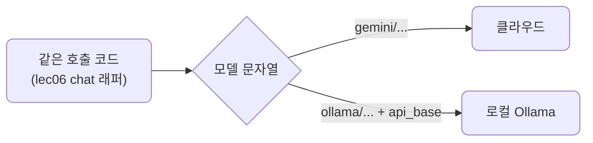
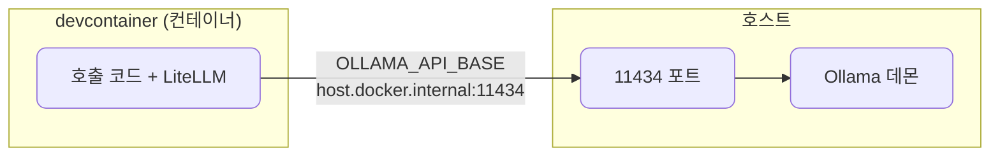
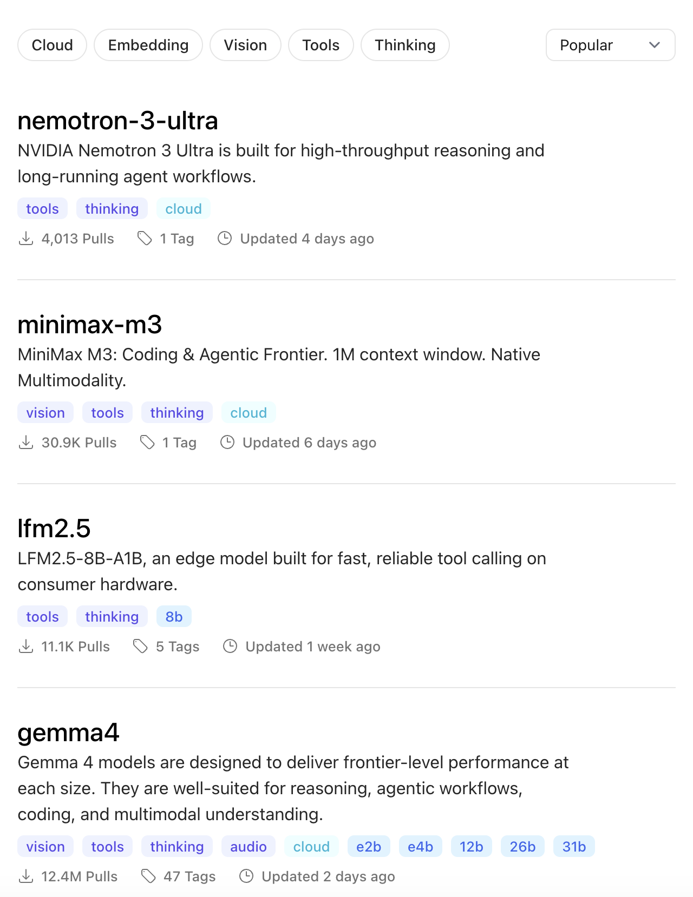
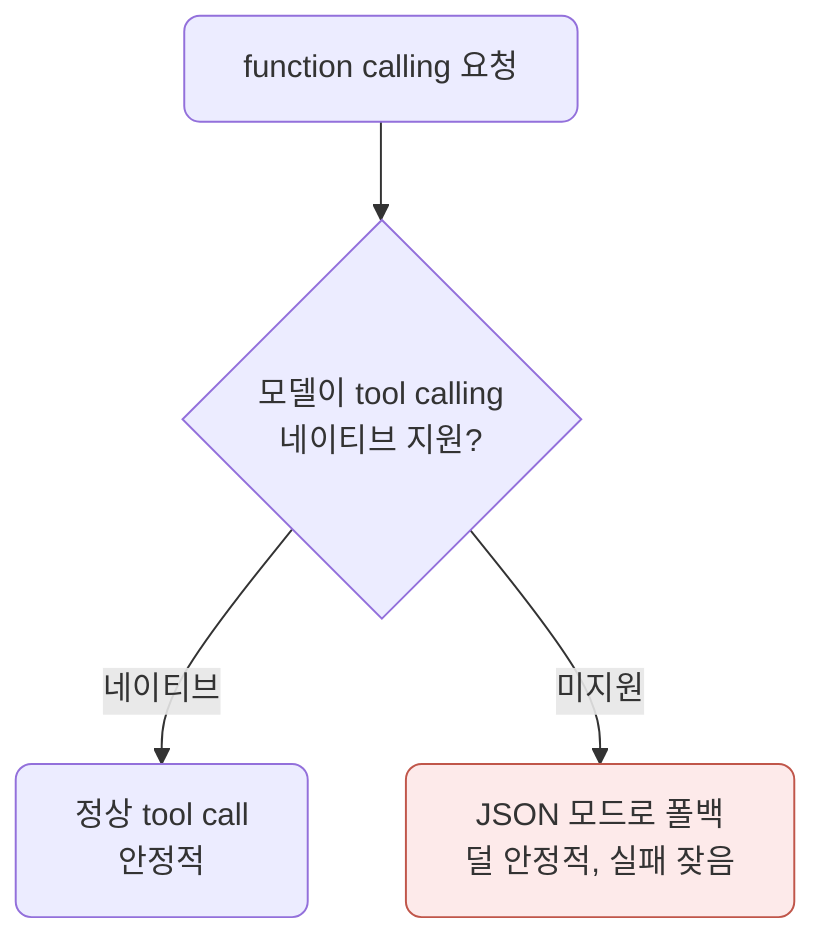
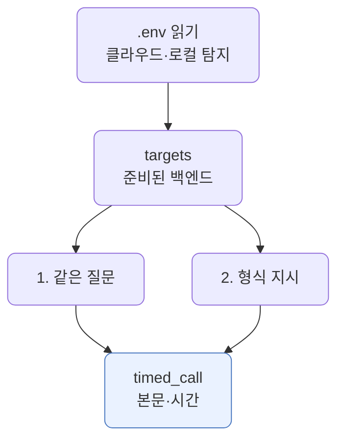

# lec07 — Ollama 로컬

> - S1 개요: [docs/section1/README.md](../README.md)
> - 분량 12분
> - 산출물: 로컬 호출 예제

## 1. 목표

클라우드 모델과 똑같은 코드로 로컬 모델을 부릅니다. lec06에서 만든 래퍼에 모델 문자열만 바꿔 넣어 Ollama로 보냅니다. 이 단위에서 정리할 것은 다음과 같습니다.

- 컨테이너 안에서 호스트의 Ollama에 어떻게 닿는지 봅니다.
- 같은 코드로 클라우드와 로컬을 번갈아 부르고 출력이 어떻게 다른지 확인합니다.
- 로컬 모델의 한계를 어떻게 받아들이고 기록할지 정리합니다.



설치와 모델 받기는 lec01에서 이미 끝냈습니다. 다음 상태를 전제로 합니다.

| 전제 | 확인 방법 |
| --- | --- |
| 호스트에 Ollama가 설치됨 | `ollama run`이 응답 |
| `.env`에 접속 주소가 채워짐 | `OLLAMA_API_BASE` 값 존재 |
| `.env`에 모델이 지정됨 | `OLLAMA_MODEL` 값 존재 |

준비가 안 됐다면 [lec01](../lec01/README.md)의 Ollama 절로 돌아갑니다.

## 2. 왜 로컬 모델인가

이 과정의 원칙은 모든 데모가 클라우드와 로컬 양쪽에서 도는 것입니다. 클라우드 모델과 로컬 Ollama 모델은 다음과 같이 갈립니다.

| 관점 | 클라우드 모델 | 로컬 Ollama 모델 |
| --- | --- | --- |
| API 키 | 필요 | 불필요 |
| 비용 | 호출량에 따라 과금 | 무료 |
| 데이터 | 외부로 나감 | 외부로 나가지 않음 |
| 사용 한도 | 한도·쿼터 있음 | 한도 걱정 없음 |
| 속도 | 보통 빠름 | 내 장비에 좌우, 보통 느림 |
| 품질 | 큰 모델로 더 높음 | 작은 모델로 더 낮음 |
| function calling | 안정적으로 동작 | 더 자주 흔들림 |

로컬은 키·비용·데이터·한도에서 유리하고, 클라우드는 속도·품질·기능에서 유리합니다. 이 강점과 약점을 둘 다 직접 보는 것이 목적입니다.

## 3. 컨테이너에서 호스트의 Ollama에 닿기

우리는 devcontainer 안에서 작업하고, Ollama는 호스트에서 돕니다. 컨테이너가 호스트의 11434 포트에 닿아야 하므로 `host.docker.internal` 주소를 씁니다. 닿는 경로는 두 가지 설정으로 이미 깔려 있습니다.

- 주소는 lec01에서 `.env`의 `OLLAMA_API_BASE`로 넣어두었습니다.
- devcontainer 설정에 `--add-host=host.docker.internal:host-gateway`가 들어 있어 Linux 호스트에서도 닿습니다.



## 4. 같은 코드로 호출하기

LiteLLM에서 Ollama 모델은 `ollama/<모델>` 형식으로 부릅니다. lec06의 래퍼를 그대로 쓰고 모델 문자열만 바꿉니다. 호출하는 쪽 코드는 클라우드일 때와 거의 다르지 않으며, 호스트 주소를 알려주는 `api_base`만 더 넘깁니다.

```python
import os
from dotenv import load_dotenv
import litellm

load_dotenv()

resp = litellm.completion(
    model=f"ollama/{os.environ['OLLAMA_MODEL']}",
    messages=[{"role": "user", "content": "한 문장으로 자기소개를 해줘."}],
    api_base=os.environ["OLLAMA_API_BASE"],
)
print(resp.choices[0].message.content)
```

코드에서 클라우드와 달라지는 점은 두 가지뿐입니다.

- 모델 문자열을 `ollama/<모델>` 형식으로 줍니다.
- 호스트 주소를 `api_base`로 더 넘깁니다.

응답은 여전히 OpenAI 형식이라 `choices[0].message.content`로 본문을 꺼냅니다. lec06의 `chat` 래퍼를 쓴다면 모델 문자열과 `api_base`만 넘겨주면 됩니다.

## 5. function calling은 로컬에서 약해집니다

뒤 섹션에서 다룰 function calling은 로컬 모델에서 자주 약점을 드러냅니다. 모델의 tool calling 지원 여부에 따라 동작이 갈립니다. 이 지원 여부는 모델마다 다르고, Ollama 모델 목록에서 기능 태그로 확인할 수 있습니다.


*Ollama 모델 목록은 각 모델이 지원하는 기능을 태그로 보여줍니다. `tools` 태그가 tool calling 지원을 뜻하고, 상단 "Tools" 탭으로 지원 모델만 추려볼 수 있습니다. 로컬에서 도구 호출을 쓰려면 이 태그를 보고 모델을 고릅니다.*



폴백은 모델에게 정해진 JSON을 내도록 요청하고 그 결과를 도구 호출처럼 해석하는 방식으로 우회합니다.

중요한 것은 이 강등을 숨기지 않는다는 점입니다. 능력이 부족한 모델을 만났을 때 우아하게 한 단계 낮춰 동작시키는 처리 자체가 S4 하네스 엔지니어링의 실제 예제가 됩니다. 지금은 "로컬은 같은 코드로 돌지만 기능과 품질이 다르고, 그 차이를 다루는 법은 뒤에서 배운다"고 기억해 둡니다.

## 6. 한계는 메모로 남깁니다

이 과정의 수용 기준은 모든 데모를 클라우드와 로컬 양쪽에서 돌려보는 것입니다. 로컬에서 품질이나 기능이 떨어지는 지점을 만나면 그냥 넘기지 말고, 무엇이 어떻게 안 됐는지 한 줄로 남깁니다. 이 메모가 쌓이면 어떤 작업에 로컬이 충분하고 어떤 작업엔 클라우드가 필요한지에 대한 판단 근거가 됩니다.

## 7. 예제 코드가 하는 일 및 결과

[local_call.py](../../../src/section1/lec07/local_call.py)는 같은 프롬프트를 클라우드와 로컬에 보내 본문과 응답 시간을 나란히 보여줍니다. 호출 코드는 하나뿐이고, 라벨만 클라우드·로컬로 갈립니다.



```bash
uv run python src/section1/lec07/local_call.py
```

실제 출력 예시입니다. 본문의 마크다운 표시는 줄였습니다.

```text
=== 1. 같은 질문 — 클라우드 vs 로컬 ===
프롬프트: AI 서비스 엔지니어링을 한 문장으로 설명해줘.

  [클라우드] gemini/gemini-2.5-flash  (5.9초)
    AI 서비스 엔지니어링은 개발된 AI 모델이 사용자에게 안정적이고 효율적으로 가치를 제공하도록 서비스를 설계·구축·배포·운영하는 과정입니다.

  [로컬] ollama/gemma4:12b-mxfp8  (23.4초)
    AI 서비스 엔지니어링은 AI 모델을 실제 사용자가 편리하게 쓸 제품으로 구현·운영하는 소프트웨어 공학 프로세스입니다.

=== 2. 형식 지시 — 마크다운·설명 없이 한 문장만 ===
프롬프트: 마크다운이나 군더더기 없이 딱 한 문장으로만 답해. 바다가 파란 이유는?

  [클라우드] gemini/gemini-2.5-flash  (7.1초)
    바닷물 분자가 태양광의 푸른색을 더 많이 산란시키고 붉은색은 흡수하기 때문입니다.

  [로컬] ollama/gemma4:12b-mxfp8  (41.4초)
    바다는 태양 빛 중 붉은 파장을 흡수하고 푸른색 짧은 파장을 산란시키기 때문이다.
```

읽어낼 점입니다.

- 같은 코드인데 라벨만 클라우드·로컬입니다. 모델 문자열과 `api_base`만 다를 뿐, 호출·파싱 코드는 그대로입니다.
- 가장 큰 차이는 속도입니다. 같은 질문에 클라우드는 6~7초, 로컬은 23~41초가 걸렸습니다. 로컬은 내 장비에서 도므로 GPU와 모델 크기에 좌우됩니다. lec04 지연, lec06 비용 구조와 이어집니다. 로컬은 비용 대신 시간을 치릅니다.
- 품질은 둘 다 쓸 만하지만 로컬이 더 들쭉날쭉합니다. 같은 질문이라도 어떤 때는 깔끔하게, 어떤 때는 마크다운과 군더더기를 덧붙입니다. 실측 중 한 번은 연결이 끊기기도 했습니다. 형식이 까다로워지고 도구 호출로 갈수록 이 흔들림이 커지며, 그 본격적인 문제가 lec08·09 구조화 출력에서 등장합니다.

## 8. 정리

- 로컬 모델은 키 없이 무료로 돌고 데이터가 밖으로 나가지 않지만, 속도·품질·기능에서 한계가 있습니다.
- 컨테이너에서 호스트의 Ollama에 닿으려면 `host.docker.internal` 주소를 씁니다.
- LiteLLM에서 `ollama/<모델>` 문자열과 `api_base`만 주면 클라우드와 같은 코드로 호출됩니다.
- function calling 같은 기능은 로컬에서 폴백으로 우회하며 덜 안정적이고, 그 처리는 S4로 이어집니다.
- 로컬의 품질·기능 저하는 한계 메모로 남겨 판단 근거로 삼습니다.
