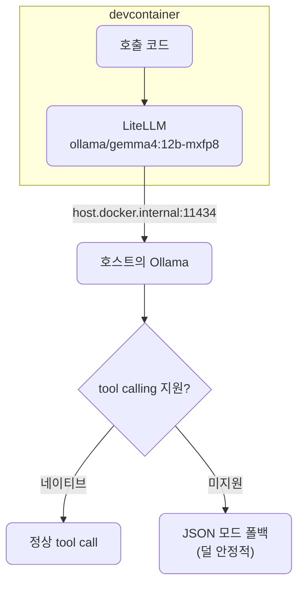

# lec07 — Ollama 로컬

> S1 개요: [docs/section1/README.md](../README.md) · 분량 12분 · 산출물: 로컬 호출 예제

## 목표

클라우드 모델과 똑같은 코드로 로컬 모델을 부릅니다. lec06에서 만든 래퍼에 모델 문자열만 바꿔 넣어 Ollama로 보냅니다. 컨테이너 안에서 호스트의 Ollama에 어떻게 닿는지, 클라우드와 출력이 어떻게 다른지, 로컬 모델의 한계를 어떻게 받아들일지를 정리합니다.

설치와 모델 받기는 lec01에서 이미 끝냈습니다. 호스트에 Ollama가 깔려 있고 `ollama run`이 응답하며 `.env`에 `OLLAMA_API_BASE`와 `OLLAMA_MODEL`이 채워진 상태를 전제로 합니다. 준비가 안 됐다면 [lec01](../lec01/README.md)의 Ollama 절로 돌아갑니다.



## 왜 로컬 모델인가

이 과정의 원칙은 모든 데모가 클라우드와 로컬 양쪽에서 도는 것입니다. 로컬 모델은 키 없이 무료로 돌고, 데이터가 외부로 나가지 않으며, 한도 걱정이 없습니다. 대신 작은 로컬 모델은 큰 클라우드 모델보다 품질이 낮고, 특히 function calling 같은 기능에서 더 자주 흔들립니다. 이 강점과 약점을 둘 다 직접 보는 것이 목적입니다.

## 컨테이너에서 호스트의 Ollama에 닿기

우리는 devcontainer 안에서 작업하고, Ollama는 호스트에서 돕니다. 컨테이너가 호스트의 11434 포트에 닿아야 하므로 `host.docker.internal` 주소를 씁니다. 이 주소는 lec01에서 `.env`의 `OLLAMA_API_BASE`로 넣어두었고, devcontainer 설정에 `--add-host=host.docker.internal:host-gateway`가 들어 있어 Linux 호스트에서도 닿습니다.

## 같은 코드로 호출하기

LiteLLM에서 Ollama 모델은 `ollama/<모델>` 형식으로 부릅니다. lec06의 래퍼를 그대로 쓰고 모델 문자열만 바꿉니다. 호출하는 쪽 코드는 클라우드일 때와 거의 다르지 않으며, 호스트 주소를 알려주는 `api_base`만 더 넘깁니다.

```python
import os
from dotenv import load_dotenv
import litellm

load_dotenv()

resp = litellm.completion(
    model=f"ollama/{os.environ['OLLAMA_MODEL']}",
    messages=[{"role": "user", "content": "한 문장으로 자기소개를 해줘."}],
    api_base=os.environ["OLLAMA_API_BASE"],
)
print(resp.choices[0].message.content)
```

응답은 여전히 OpenAI 형식이라 `choices[0].message.content`로 본문을 꺼냅니다. lec06의 `chat` 래퍼를 쓴다면 모델 문자열과 `api_base`만 넘겨주면 됩니다. 같은 프롬프트를 클라우드 모델과 로컬 모델에 번갈아 보내보면, 코드는 그대로인데 모델만 바뀐다는 LiteLLM의 이점이 분명해집니다.

## 클라우드와 출력을 비교합니다

같은 프롬프트를 양쪽에 보내보면 차이가 보입니다. 로컬 모델은 더 짧거나 덜 정확하게 답하고, 형식 지시를 덜 지키기도 합니다. 응답 속도와 첫 토큰까지의 지연도 다릅니다. 이 차이를 숨기지 않고 눈으로 확인하는 것이 이 단위의 핵심입니다.

## function calling은 로컬에서 약해집니다

뒤 섹션에서 다룰 function calling은 로컬 모델에서 자주 약점을 드러냅니다. tool calling을 네이티브로 지원하는 모델은 클라우드처럼 동작하지만, 지원하지 않는 모델에서는 LiteLLM이 JSON 모드 호출로 폴백합니다. 즉 모델에게 정해진 JSON을 내도록 요청하고 그 결과를 도구 호출처럼 해석하는 방식으로 우회합니다. 이 폴백은 네이티브 지원보다 덜 안정적이라 실패가 더 잦습니다.

중요한 것은 이 강등을 숨기지 않는다는 점입니다. 능력이 부족한 모델을 만났을 때 우아하게 한 단계 낮춰 동작시키는 처리 자체가 S4 하네스 엔지니어링의 실제 예제가 됩니다. 지금은 "로컬은 같은 코드로 돌지만 기능과 품질이 다르고, 그 차이를 다루는 법은 뒤에서 배운다"고 기억해 둡니다.

## 한계는 메모로 남깁니다

이 과정의 수용 기준은 모든 데모를 클라우드와 로컬 양쪽에서 돌려보는 것입니다. 로컬에서 품질이나 기능이 떨어지는 지점을 만나면 그냥 넘기지 말고, 무엇이 어떻게 안 됐는지 한 줄로 남깁니다. 이 메모가 쌓이면 어떤 작업에 로컬이 충분하고 어떤 작업엔 클라우드가 필요한지에 대한 판단 근거가 됩니다.

## 정리

- 로컬 모델은 키 없이 무료로 돌고 데이터가 밖으로 나가지 않지만, 품질과 기능에서 한계가 있습니다.
- 컨테이너에서 호스트의 Ollama에 닿으려면 `host.docker.internal` 주소를 씁니다.
- LiteLLM에서 `ollama/<모델>` 문자열과 `api_base`만 주면 클라우드와 같은 코드로 호출됩니다.
- function calling 같은 기능은 로컬에서 폴백으로 우회하며 덜 안정적이고, 그 처리는 S4로 이어집니다.
- 로컬의 품질·기능 저하는 한계 메모로 남겨 판단 근거로 삼습니다.

## 다음 단위

[lec08 — 구조화 출력 1](../lec08/README.md)에서 자연어 응답을 프로그램이 믿고 쓸 데이터로 바꾸는 일의 어려움부터 봅니다.
