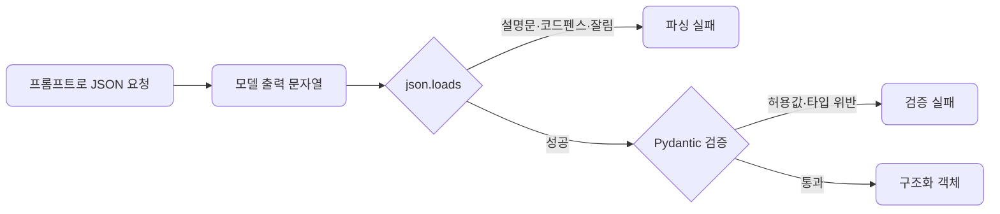

# lec08 — 구조화 출력 1

> S1 개요: [docs/section1/README.md](../README.md) · 분량 13분 · 산출물: Pydantic 모델

## 목표

LLM의 답을 사람이 읽는 것을 넘어 프로그램이 받아 쓰려면, 자유로운 문장이 아니라 정해진 구조의 데이터여야 합니다. 이 단위에서는 원하는 출력 구조를 Pydantic 모델로 정의하고, 프롬프트만으로 JSON을 받으려 할 때 부딪히는 함정을 직접 봅니다. 해결은 다음 단위로 미루고, 여기서는 문제를 분명히 하는 데 집중합니다.



## 왜 구조화 출력인가

서비스 안에서 LLM의 출력은 보통 다음 단계의 입력이 됩니다. 분류 결과로 분기하고, 추출한 값을 DB에 넣고, 점수로 정렬합니다. 이때 "긍정인 것 같아요"라는 문장이 아니라 `{"sentiment": "긍정", "confidence": 0.9}` 같은 구조가 필요합니다. 코드가 키로 접근해 바로 쓸 수 있어야 하기 때문입니다.

## Pydantic으로 구조를 정의합니다

먼저 받고 싶은 데이터의 모양을 Pydantic 모델로 적습니다. 모델은 어떤 필드가 어떤 타입으로 있어야 하는지를 선언하고, 들어온 값이 그 약속을 지키는지 검증해 줍니다.

```python
from pydantic import BaseModel
from typing import Literal

class Review(BaseModel):
    sentiment: Literal["긍정", "부정", "중립"]
    confidence: float
    keywords: list[str]
```

이 선언만으로 우리는 출력 계약을 갖게 됩니다. `sentiment`는 셋 중 하나여야 하고, `confidence`는 실수여야 하며, `keywords`는 문자열 목록이어야 합니다.

## 프롬프트로 JSON을 받아봅니다

가장 단순한 시도는 프롬프트로 "이런 JSON으로 답해"라고 부탁하는 것입니다.

```python
import json
import litellm

prompt = """다음 리뷰를 분석해 JSON으로만 답해라.
형식: {"sentiment": "긍정|부정|중립", "confidence": 0~1 실수, "keywords": [문자열]}
리뷰: 배송은 빨랐는데 포장이 너무 허술했어요."""

resp = litellm.completion(
    model="gemini/gemini-2.0-flash",
    messages=[{"role": "user", "content": prompt}],
)
text = resp.choices[0].message.content
data = json.loads(text)          # 여기서 자주 깨진다
review = Review(**data)          # 통과해도 값이 계약을 어길 수 있다
```

작은 입력에서는 이 코드가 잘 도는 것처럼 보입니다. 문제는 항상 그렇지는 않다는 데 있습니다.

## 프롬프트만으로 받을 때의 함정

여러 번 호출하다 보면 다음과 같은 실패를 만납니다.

- 모델이 JSON 앞뒤에 설명 문장을 붙입니다. 그러면 `json.loads`가 바로 실패합니다.
- 코드블록 표시를 감싸서 돌려줍니다. 가장 바깥의 백틱 펜스 때문에 파싱이 깨집니다.
- 출력이 길어지다 토큰 한계에서 잘려 JSON이 닫히지 않습니다.
- 형식은 맞는데 값이 계약을 어깁니다. `sentiment`에 "약간 부정" 같은 허용되지 않은 값이 들어오거나, `confidence`가 문자열로 옵니다.
- 로컬 모델일수록 이런 실패가 더 잦습니다.

즉 문제는 두 층입니다. 하나는 문자열이 애초에 유효한 JSON이 아닌 파싱 문제이고, 다른 하나는 파싱은 되는데 우리가 정한 구조를 어기는 검증 문제입니다. Pydantic의 `Review(**data)`는 두 번째 층 일부를 잡아 주지만, 잘못된 값에 대해 예외를 던질 뿐 스스로 고쳐주지는 않습니다.

## 직접 가드를 짜보면

이 함정들을 손으로 막으려면 코드가 금세 지저분해집니다. 설명 문장을 떼어내고, 코드블록 펜스를 벗기고, 파싱에 실패하면 다시 호출하고, 검증에 실패하면 무엇이 틀렸는지 모델에 알려 재시도해야 합니다. 이걸 호출할 때마다 반복할 수는 없습니다.

바로 이 반복을 라이브러리가 대신해 주는 것이 다음 단위의 instructor입니다. 여기서는 "프롬프트만으로 구조화 출력을 받는 것은 생각보다 깨지기 쉽다"는 점과, 우리가 원하는 구조를 Pydantic 모델로 미리 선언해 둔다는 점을 챙겨갑니다.

## 정리

- 서비스 안에서 LLM 출력은 다음 단계의 입력이라, 자유 문장이 아니라 구조화 데이터가 필요합니다.
- 원하는 구조는 Pydantic 모델로 선언해 출력 계약으로 삼습니다.
- 프롬프트만으로 JSON을 받으면 파싱이 깨지거나 값이 계약을 어기는 실패가 잦고, 로컬 모델에서 더 심합니다.
- 이 가드와 재시도를 매번 손으로 짜는 대신 다음 단위에서 도구로 해결합니다.

## 다음 단위

[lec09 — 구조화 출력 2](../lec09/README.md)에서 instructor로 검증과 재시도를 한 번에 처리합니다.
