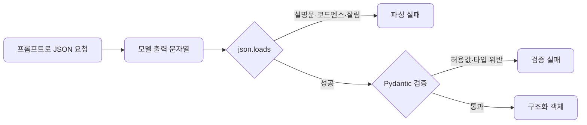
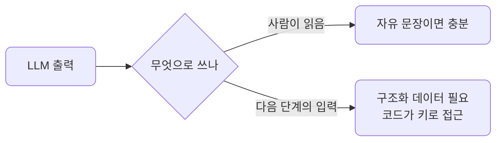
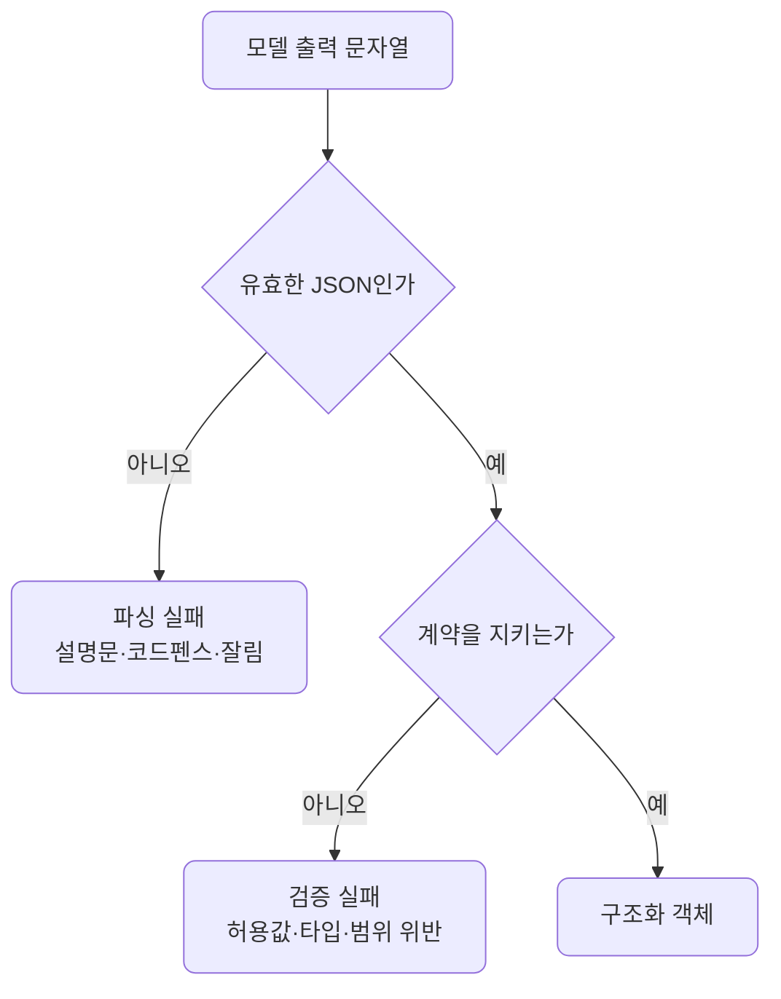
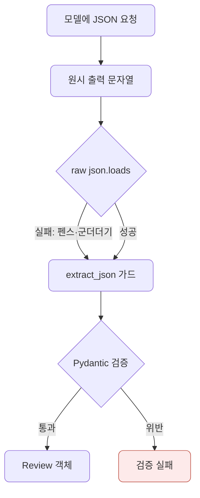
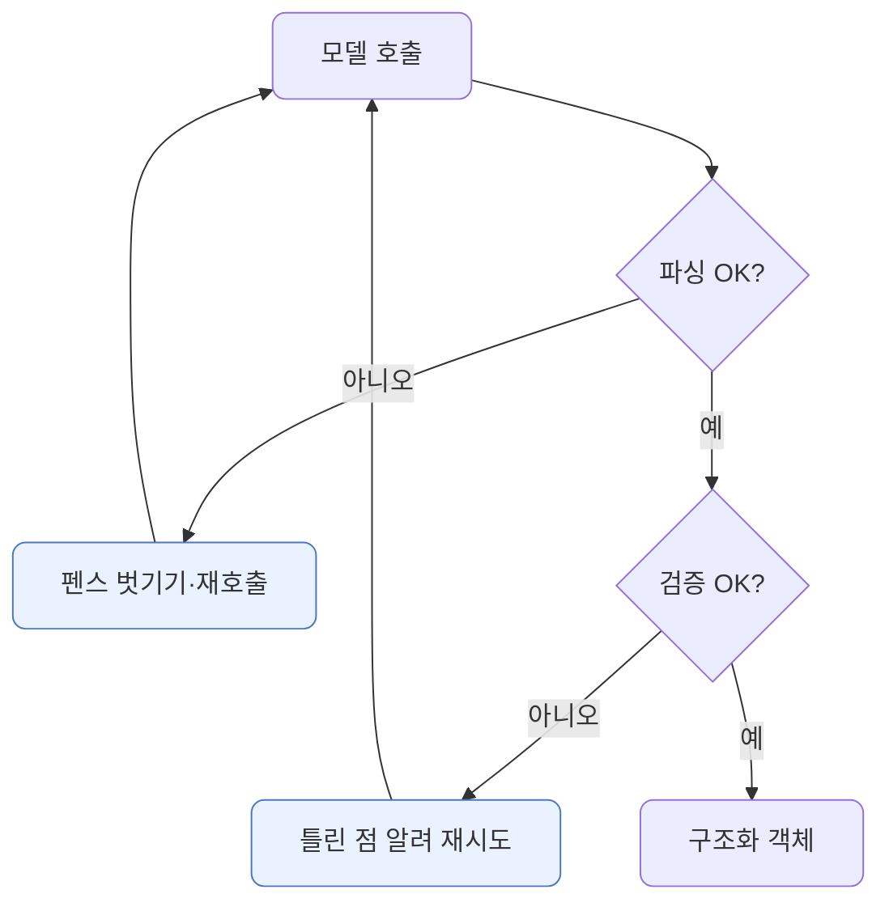

# lec08 — 구조화 출력 1

> - S1 개요: [docs/section1/README.md](../README.md)
> - 분량 22분
> - 산출물: Pydantic 모델

## 1. 목표

LLM의 답을 사람이 읽는 것을 넘어 프로그램이 받아 쓰려면, 자유로운 문장이 아니라 정해진 구조의 데이터여야 합니다. 이 단위에서 다루는 것은 다음과 같습니다.

- 원하는 출력 구조를 Pydantic 모델로 정의합니다.
- 프롬프트만으로 JSON을 받으려 할 때 부딪히는 함정을 직접 봅니다.
- 해결은 다음 단위로 미루고, 여기서는 문제를 분명히 하는 데 집중합니다.



## 2. 왜 구조화 출력인가

서비스 안에서 LLM의 출력은 보통 다음 단계의 입력이 됩니다. 이때 필요한 것은 문장이 아니라 코드가 키로 접근해 바로 쓸 수 있는 구조입니다.

| 다음 단계 | 필요한 형태 | 문장으로는 안 되는 이유 |
| --- | --- | --- |
| 분류 결과로 분기 | `{"sentiment": "긍정"}` | "긍정인 것 같아요"는 조건문에 못 넣습니다 |
| 추출 값을 DB에 저장 | `{"confidence": 0.9}` | 컬럼에 넣을 타입이 정해져야 합니다 |
| 점수로 정렬 | 실수 필드 | 정렬하려면 비교 가능한 값이어야 합니다 |



## 3. Pydantic으로 구조를 정의합니다

먼저 받고 싶은 데이터의 모양을 Pydantic 모델로 적습니다. 모델은 어떤 필드가 어떤 타입으로 있어야 하는지를 선언하고, 들어온 값이 그 약속을 지키는지 검증해 줍니다.

```python
from typing import Literal
from pydantic import BaseModel, Field

class Review(BaseModel):
    sentiment: Literal["긍정", "부정", "중립"]
    confidence: float = Field(ge=0.0, le=1.0)  # 타입뿐 아니라 0~1 범위까지
    keywords: list[str]
```

이 선언만으로 우리는 출력 계약을 갖게 됩니다. 타입만이 아니라 허용값·범위까지 계약에 넣을 수 있습니다.

| 필드 | 타입 | 계약 |
| --- | --- | --- |
| `sentiment` | `Literal["긍정","부정","중립"]` | 셋 중 하나여야 합니다 |
| `confidence` | `float` (0~1) | 0과 1 사이 실수여야 합니다 |
| `keywords` | `list[str]` | 문자열 목록이어야 합니다 |

이 `Review`가 이 단위의 산출물입니다. 다음 단위에서도 이 계약 위에 쌓습니다.

## 4. 프롬프트로 JSON을 받아봅니다

가장 단순한 시도는 프롬프트로 "이런 JSON으로 답해"라고 부탁하는 것입니다.

```python
import json
import litellm

prompt = """다음 리뷰를 분석해 JSON으로만 답해라.
형식: {"sentiment": "긍정|부정|중립", "confidence": 0~1 실수, "keywords": [문자열]}
리뷰: 배송은 빨랐는데 포장이 너무 허술했어요."""

resp = litellm.completion(model="gemini/gemini-2.5-flash", messages=[{"role": "user", "content": prompt}])
text = resp.choices[0].message.content
data = json.loads(text)   # 여기서 자주 깨진다
review = Review(**data)   # 통과해도 값이 계약을 어길 수 있다
```

작은 입력에서는 이 코드가 잘 도는 것처럼 보입니다. 문제는 항상 그렇지는 않다는 데 있습니다.

## 5. 두 층의 함정 — 파싱과 검증

여러 번 호출하다 보면 실패가 두 층에서 나타납니다. 하나는 문자열이 애초에 유효한 JSON이 아닌 파싱 문제이고, 다른 하나는 파싱은 되지만 우리가 정한 구조를 어기는 검증 문제입니다.

| 층 | 원인 | 예 |
| --- | --- | --- |
| 파싱 실패 | JSON 앞뒤에 설명 문장이 붙음 | `이 리뷰는... {"sentiment": ...}` |
| 파싱 실패 | 코드블록 펜스로 감쌈 | 백틱 세 개로 둘러싼 ```json ... ``` |
| 파싱 실패 | 토큰 한계에서 잘려 JSON이 닫히지 않음 | `{"sentiment": "부정", "conf` |
| 검증 실패 | 허용되지 않은 값 | `sentiment`에 `" 중립"`(앞에 공백) |
| 검증 실패 | 타입·범위 위반 | `confidence`가 문자열이거나 1.5 |



## 6. 임시 가드로 일부만 막힙니다

파싱 실패는 임시 가드로 어느 정도 막을 수 있습니다. 코드펜스를 벗기고 첫 `{`부터 마지막 `}`까지 잘라내는 식입니다.

```python
import re

def extract_json(text: str) -> str:
    fenced = re.search(r"```(?:json)?\s*(.*?)```", text, re.S)
    if fenced:
        text = fenced.group(1)
    start, end = text.find("{"), text.rfind("}")
    return text[start : end + 1] if start != -1 and end > start else text.strip()
```

하지만 가드가 고쳐 주는 것은 모양까지입니다. 값이 계약을 어기는 검증 실패는 가드로 못 막습니다. 그건 Pydantic이 잡아내고, 진짜로 고치려면 모델에게 "틀렸으니 다시"라고 알려 재호출해야 합니다.

## 7. 예제 코드가 하는 일 및 결과

[json_traps.py](../../../src/section1/lec08/json_traps.py)는 같은 프롬프트를 클라우드와 로컬에 보내, 원시 파싱 → 가드 후 파싱 → Pydantic 검증의 세 단계를 거치며 어디서 깨지는지 보여줍니다.



```bash
uv run python src/section1/lec08/json_traps.py
```

실제 출력입니다.

````text
=== 프롬프트만으로 JSON 받기 ===
리뷰: 배송은 빨랐는데 포장이 너무 허술했어요.

[클라우드] gemini/gemini-2.5-flash
  원시 출력: ```json {"sentiment": "부정", "confidence": 0.8, "keywords": ["배송", "포장", "빠른", "허술한"]} ```
  raw json.loads: 실패
  가드 후 파싱: 성공 / Pydantic 검증: 성공
  → Review(sentiment='부정', confidence=0.8, keywords=['배송', '포장', '빠른', '허술한'])

[로컬] ollama/gemma4:12b-mxfp8
  원시 출력: ```json {   "sentiment": " 중립",   "confidence": 0.9,   "keywords": ["배송", "포장"] } ```
  raw json.loads: 실패
  가드 후 파싱: 성공 / Pydantic 검증: 실패 — sentiment: Input should be '긍정', '부정' or '중립'
````

읽어낼 점입니다.

- 두 모델 다 JSON을 코드펜스로 감쌌습니다. 그래서 `raw json.loads`가 둘 다 실패합니다. 파싱 함정이 실제로 재현됩니다.
- 가드가 펜스를 벗기니 둘 다 파싱은 됩니다. 가드는 모양 문제를 막아 줍니다.
- 그런데 로컬은 `sentiment`를 `" 중립"`으로, 앞에 공백을 붙여 냈습니다. 파싱은 됐지만 계약의 허용값(`"중립"`)과 달라 Pydantic이 막았습니다. 검증 함정까지 한 번에 드러납니다.
- 같은 코드인데 클라우드는 통과하고 로컬은 검증에서 걸렸습니다. lec07에서 본 "로컬은 형식이 더 흔들린다"가 여기서 데이터 계약 위반으로 이어집니다.

## 8. 손으로 다 짜기엔 지저분합니다

이 함정들을 매번 손으로 막으려면 호출할 때마다 다음을 반복해야 합니다.

- 앞뒤 설명 문장을 떼어내고 코드펜스를 벗깁니다.
- 파싱에 실패하면 다시 호출합니다.
- 검증에 실패하면 무엇이 틀렸는지 모델에 알려 재시도합니다.



파란 칸의 반복을 손으로 짜야 한다는 점이 부담입니다. 위 예제는 첫 두 가지의 일부만 했고, 검증 실패를 자동으로 고치는 재시도는 아직 없습니다. 바로 이 반복을 라이브러리가 대신해 주는 것이 다음 단위의 instructor입니다. 여기서는 프롬프트만으로 구조화 출력을 받는 것은 생각보다 깨지기 쉽다는 점과, 원하는 구조를 Pydantic 모델로 미리 선언해 둔다는 점을 챙겨갑니다.

## 9. 정리

- 서비스 안에서 LLM 출력은 다음 단계의 입력이라, 자유 문장이 아니라 구조화 데이터가 필요합니다.
- 원하는 구조는 Pydantic 모델로 선언해 출력 계약으로 삼습니다. 타입뿐 아니라 허용값·범위까지 계약에 넣습니다.
- 실패는 두 층입니다. 파싱(모양)과 검증(값)이며, 가드는 파싱 일부만 막고 검증은 Pydantic이 잡습니다.
- 같은 코드라도 로컬 모델에서 실패가 더 잦습니다. 형식 흔들림이 데이터 계약 위반으로 드러납니다.
- 이 가드와 재시도를 매번 손으로 짜는 대신 다음 단위에서 instructor로 해결합니다.
