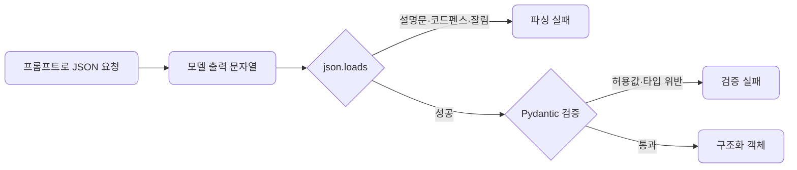
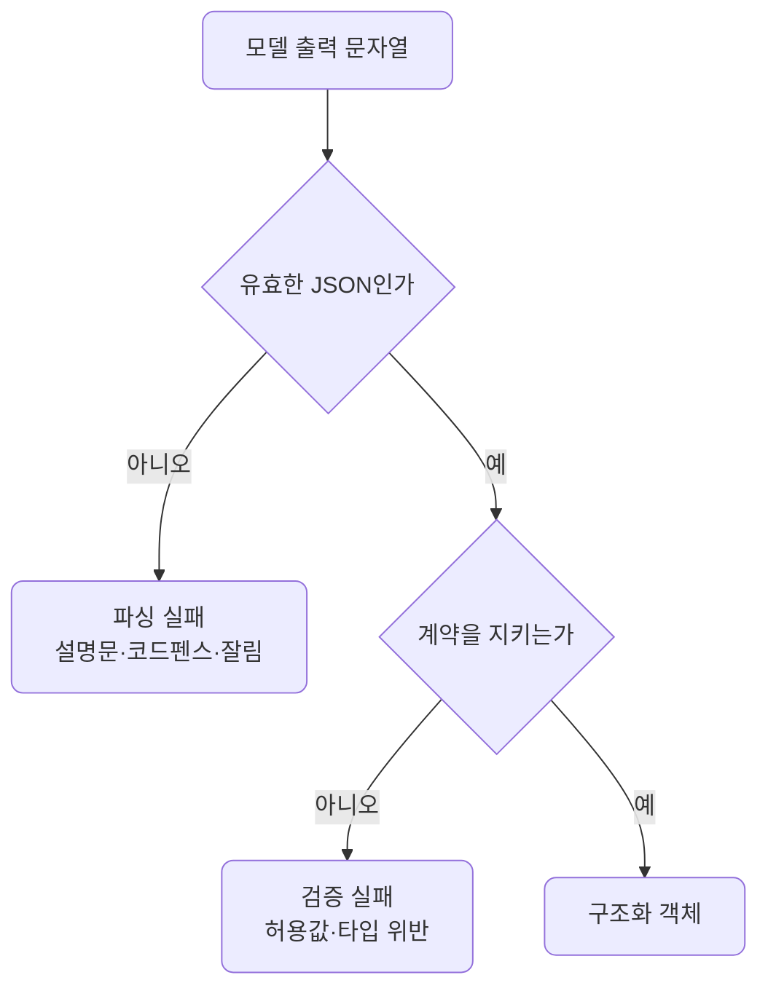

# lec08 — 구조화 출력 1

> S1 개요: [docs/section1/README.md](../README.md) · 분량 13분 · 산출물: Pydantic 모델

## 목표

LLM의 답을 사람이 읽는 것을 넘어 프로그램이 받아 쓰려면, 자유로운 문장이 아니라 정해진 구조의 데이터여야 합니다. 이 단위에서 다루는 것은 다음과 같습니다.

- 원하는 출력 구조를 Pydantic 모델로 정의합니다.
- 프롬프트만으로 JSON을 받으려 할 때 부딪히는 함정을 직접 봅니다.
- 해결은 다음 단위로 미루고, 여기서는 문제를 분명히 하는 데 집중합니다.



## 왜 구조화 출력인가

서비스 안에서 LLM의 출력은 보통 다음 단계의 입력이 됩니다. 이때 필요한 것은 문장이 아니라 코드가 키로 접근해 바로 쓸 수 있는 구조입니다.

| 다음 단계 | 필요한 형태 | 문장으로는 안 되는 이유 |
| --- | --- | --- |
| 분류 결과로 분기 | `{"sentiment": "긍정"}` | "긍정인 것 같아요"는 조건문에 못 넣습니다 |
| 추출 값을 DB에 저장 | `{"confidence": 0.9}` | 컬럼에 넣을 타입이 정해져야 합니다 |
| 점수로 정렬 | 실수 필드 | 정렬하려면 비교 가능한 값이어야 합니다 |

## Pydantic으로 구조를 정의합니다

먼저 받고 싶은 데이터의 모양을 Pydantic 모델로 적습니다. 모델은 어떤 필드가 어떤 타입으로 있어야 하는지를 선언하고, 들어온 값이 그 약속을 지키는지 검증해 줍니다.

```python
from pydantic import BaseModel
from typing import Literal

class Review(BaseModel):
    sentiment: Literal["긍정", "부정", "중립"]
    confidence: float
    keywords: list[str]
```

이 선언만으로 우리는 출력 계약을 갖게 됩니다.

| 필드 | 타입 | 계약 |
| --- | --- | --- |
| `sentiment` | `Literal["긍정","부정","중립"]` | 셋 중 하나여야 합니다 |
| `confidence` | `float` | 실수여야 합니다 |
| `keywords` | `list[str]` | 문자열 목록이어야 합니다 |

## 프롬프트로 JSON을 받아봅니다

가장 단순한 시도는 프롬프트로 "이런 JSON으로 답해"라고 부탁하는 것입니다.

```python
import json
import litellm

prompt = """다음 리뷰를 분석해 JSON으로만 답해라.
형식: {"sentiment": "긍정|부정|중립", "confidence": 0~1 실수, "keywords": [문자열]}
리뷰: 배송은 빨랐는데 포장이 너무 허술했어요."""

resp = litellm.completion(
    model="gemini/gemini-2.0-flash",
    messages=[{"role": "user", "content": prompt}],
)
text = resp.choices[0].message.content
data = json.loads(text)          # 여기서 자주 깨진다
review = Review(**data)          # 통과해도 값이 계약을 어길 수 있다
```

작은 입력에서는 이 코드가 잘 도는 것처럼 보입니다. 문제는 항상 그렇지는 않다는 데 있습니다.

## 프롬프트만으로 받을 때의 함정

여러 번 호출하다 보면 실패가 두 층에서 나타납니다. 하나는 문자열이 애초에 유효한 JSON이 아닌 파싱 문제이고, 다른 하나는 파싱은 되지만 우리가 정한 구조를 어기는 검증 문제입니다.

| 층 | 원인 | 예 |
| --- | --- | --- |
| 파싱 실패 | JSON 앞뒤에 설명 문장이 붙음 | `이 리뷰는... {"sentiment": ...}` |
| 파싱 실패 | 코드블록 펜스로 감쌈 | ```` ```json ... ``` ```` |
| 파싱 실패 | 토큰 한계에서 잘려 JSON이 닫히지 않음 | `{"sentiment": "부정", "conf` |
| 검증 실패 | 허용되지 않은 값 | `sentiment`에 `"약간 부정"` |
| 검증 실패 | 타입 불일치 | `confidence`가 문자열로 옴 |

로컬 모델일수록 이런 실패가 더 잦습니다. Pydantic의 `Review(**data)`는 검증 층의 일부를 잡아 주지만, 잘못된 값에 예외를 던질 뿐 스스로 고쳐주지는 않습니다.



## 직접 가드를 짜보면

이 함정들을 손으로 막으려면 코드가 금세 지저분해집니다. 호출할 때마다 다음을 반복해야 하기 때문입니다.

- 앞뒤 설명 문장을 떼어냅니다.
- 코드블록 펜스를 벗깁니다.
- 파싱에 실패하면 다시 호출합니다.
- 검증에 실패하면 무엇이 틀렸는지 모델에 알려 재시도합니다.

바로 이 반복을 라이브러리가 대신해 주는 것이 다음 단위의 instructor입니다. 여기서는 프롬프트만으로 구조화 출력을 받는 것은 생각보다 깨지기 쉽다는 점과, 우리가 원하는 구조를 Pydantic 모델로 미리 선언해 둔다는 점을 챙겨갑니다.

## 실행

공유된 예제를 실행합니다. 프롬프트만으로 JSON을 받아 파싱·검증을 시도하는 코드이며, 일부러 깨지기 쉬운 입력을 섞어 실패를 드러냅니다.

```bash
uv run python src/section1/lec08/json_traps.py
```

출력에서 다음을 직접 봅니다.

- 설명 문장이 붙거나 코드펜스에 감싸여 파싱이 깨지는 경우를 봅니다.
- 값이 계약을 어겨 검증에서 걸리는 경우를 봅니다.
- 같은 코드를 로컬 모델로 돌리면 실패가 더 잦아지는 것을 확인합니다.

## 정리

- 서비스 안에서 LLM 출력은 다음 단계의 입력이라, 자유 문장이 아니라 구조화 데이터가 필요합니다.
- 원하는 구조는 Pydantic 모델로 선언해 출력 계약으로 삼습니다.
- 프롬프트만으로 JSON을 받으면 파싱이 깨지거나 값이 계약을 어기는 실패가 잦고, 로컬 모델에서 더 심합니다.
- 이 가드와 재시도를 매번 손으로 짜는 대신 다음 단위에서 도구로 해결합니다.

## 다음 단위

[lec09 — 구조화 출력 2](../lec09/README.md)에서 instructor로 검증과 재시도를 한 번에 처리합니다.
</content>
</invoke>
