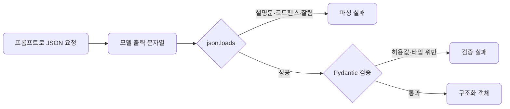
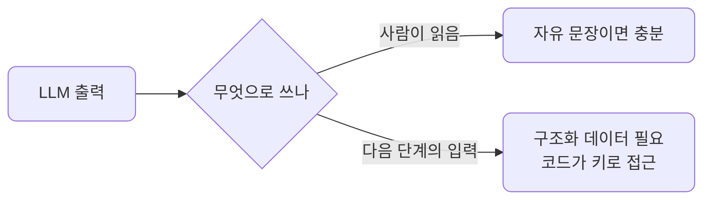
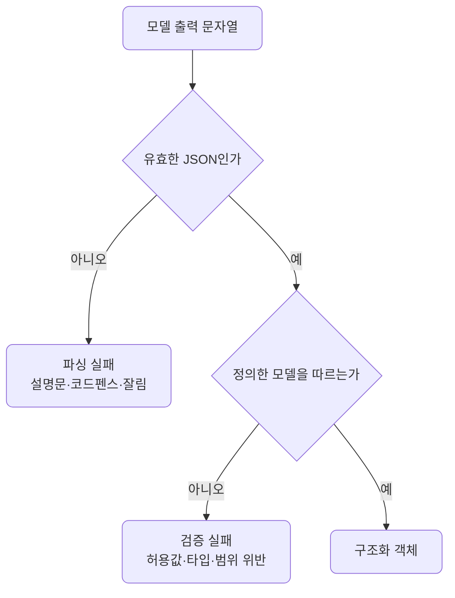
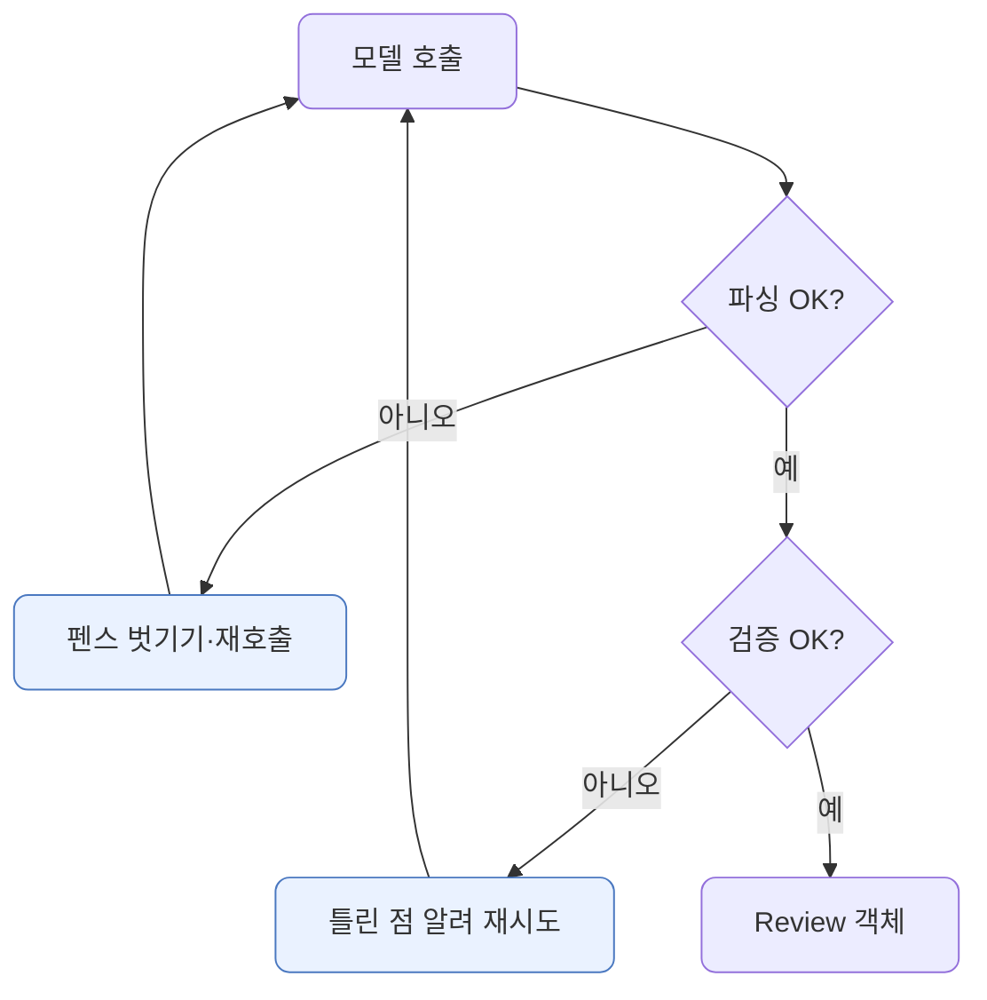

# lec08 — 구조화 출력 1

> - S1 개요: [docs/section1/README.md](../README.md)
> - 분량 22분
> - 산출물: Pydantic 모델

## 1. 목표

LLM의 답을 사람이 읽는 것을 넘어 프로그램이 받아 쓰려면, 자유로운 문장이 아니라 정해진 구조의 데이터여야 합니다. 이 단위에서 다루는 것은 다음과 같습니다.

- 원하는 출력 구조를 Pydantic 모델로 정의합니다.
- 프롬프트만으로 JSON을 받으려 할 때 부딪히는 함정을 직접 봅니다.
- 스키마 주입·JSON 모드·재시도로 함정을 어디까지 줄일 수 있는지 봅니다.

해결의 끝(검증 실패까지 자동으로 고치는 일)은 다음 단위 instructor로 미루고, 여기서는 문제를 분명히 하고 손으로 어디까지 막을 수 있는지를 봅니다.



## 2. 왜 구조화 출력인가

서비스 안에서 LLM의 출력은 보통 다음 단계의 입력이 됩니다. 이때 필요한 것은 문장이 아니라 코드가 키로 접근해 바로 쓸 수 있는 구조입니다.

| 다음 단계 | 필요한 형태 | 문장으로는 안 되는 이유 |
| --- | --- | --- |
| 분류 결과로 분기 | `{"sentiment": "긍정"}` | "긍정인 것 같아요"는 조건문에 못 넣습니다 |
| 추출 값을 DB에 저장 | `{"confidence": 0.9}` | 컬럼에 넣을 타입이 정해져야 합니다 |
| 점수로 정렬 | 실수 필드 | 정렬하려면 비교 가능한 값이어야 합니다 |



## 3. Pydantic으로 구조를 정의합니다

먼저 받고 싶은 데이터의 모양을 Pydantic 모델로 적습니다. 모델은 어떤 필드가 어떤 타입으로 있어야 하는지를 선언하고, 들어온 값이 그 약속을 지키는지 검증해 줍니다.

```python
from typing import Literal
from pydantic import BaseModel, Field

class Review(BaseModel):
    sentiment: Literal["긍정", "부정", "중립"]
    confidence: float = Field(ge=0.0, le=1.0)  # 타입뿐 아니라 0~1 범위까지
    keywords: list[str]
```

이 `Review`가 이 단위의 산출물입니다. 타입만이 아니라 허용값·범위까지 모델에 담깁니다.

| 필드 | 타입 | 따라야 할 약속 |
| --- | --- | --- |
| `sentiment` | `Literal["긍정","부정","중립"]` | 셋 중 하나여야 합니다 |
| `confidence` | `float` (0~1) | 0과 1 사이 실수여야 합니다 |
| `keywords` | `list[str]` | 문자열 목록이어야 합니다 |

## 4. 스키마를 프롬프트에 넣습니다

형식을 프롬프트에 손으로 적으면 모델 정의와 어긋나기 쉽습니다. Pydantic은 모델에서 JSON 스키마를 뽑아 주므로, 그것을 그대로 프롬프트에 넣으면 한곳만 고치면 됩니다.

```python
import json

schema = json.dumps(Review.model_json_schema(), ensure_ascii=False)
prompt = f"아래 JSON 스키마를 그대로 따르는 JSON으로만 답해라.\n스키마: {schema}\n리뷰: {REVIEW_TEXT}"
```

`model_json_schema()`가 만들어 주는 스키마에는 타입뿐 아니라 허용값과 범위까지 들어 있습니다.

```text
스키마: {"properties": {
  "sentiment":  {"enum": ["긍정", "부정", "중립"], "type": "string"},
  "confidence": {"minimum": 0.0, "maximum": 1.0, "type": "number"},
  "keywords":   {"items": {"type": "string"}, "type": "array"}},
  "required": ["sentiment", "confidence", "keywords"], "type": "object"}
```

스키마를 줘도 모델이 항상 지키는 것은 아니지만, 형식 설명을 모델 정의와 일치시키는 첫걸음입니다.

## 5. 두 층의 함정 — 파싱과 검증

가장 단순한 시도는 프롬프트로 "이런 JSON으로 답해"라고 부탁하는 것입니다. 작은 입력에서는 잘 도는 듯 보이지만, 여러 번 호출하면 실패가 두 층에서 나타납니다. 하나는 문자열이 애초에 유효한 JSON이 아닌 파싱 문제이고, 다른 하나는 파싱은 되지만 우리가 정의한 모델을 어기는 검증 문제입니다.

| 층 | 원인 | 예 |
| --- | --- | --- |
| 파싱 실패 | JSON 앞뒤에 설명 문장이 붙음 | `이 리뷰는... {"sentiment": ...}` |
| 파싱 실패 | 코드블록 펜스로 감쌈 | 백틱 세 개로 둘러싼 ```json ... ``` |
| 파싱 실패 | 토큰 한계에서 잘려 JSON이 닫히지 않음 | `{"sentiment": "부정", "conf` |
| 검증 실패 | 허용되지 않은 값 | `sentiment`에 `" 중립"`(앞에 공백) |
| 검증 실패 | 타입·범위 위반 | `confidence`가 문자열이거나 1.5 |



[json_traps.py](../../../src/section1/lec08/json_traps.py)로 이 두 층을 재현합니다. 원시 파싱 → 가드 후 파싱 → Pydantic 검증을 거치며 어디서 깨지는지 봅니다.

````text
=== 1. 프롬프트만으로 JSON 받기 — 두 층의 함정 ===
리뷰: 배송은 빨랐는데 포장이 너무 허술했어요.

[클라우드] gemini/gemini-2.5-flash
  원시 출력: ```json {"sentiment": "중립", "confidence": 0.75, "keywords": ["배송","포장","빠른","허술한"]} ```
  raw json.loads: 실패
  가드 후 파싱: 성공 / Pydantic 검증: 성공

[로컬] ollama/gemma4:12b-mxfp8
  원시 출력: ```json {"sentiment": " 중립", "confidence": 0.95, "keywords": ["배송","포장"," 빠름"," 허설함"]} ```
  raw json.loads: 실패
  가드 후 파싱: 성공 / Pydantic 검증: 실패 — sentiment: Input should be '긍정', '부정' or '중립'
````

- 두 모델 다 JSON을 코드펜스로 감쌌습니다. 그래서 `raw json.loads`가 둘 다 실패합니다. 파싱 함정이 실제로 재현됩니다.
- 로컬은 `sentiment`를 `" 중립"`으로, 앞에 공백을 붙여 냈습니다. 파싱은 됐지만 모델의 허용값(`"중립"`)과 달라 검증에서 막혔습니다. lec07의 "로컬은 형식이 더 흔들린다"가 여기서 데이터 위반으로 이어집니다.

## 6. 임시 가드로 일부만 막힙니다

파싱 실패는 임시 가드로 어느 정도 막을 수 있습니다. 코드펜스를 벗기고 첫 `{`부터 마지막 `}`까지 잘라내는 식입니다.

```python
import re

def extract_json(text: str) -> str:
    fenced = re.search(r"```(?:json)?\s*(.*?)```", text, re.S)
    if fenced:
        text = fenced.group(1)
    start, end = text.find("{"), text.rfind("}")
    return text[start : end + 1] if start != -1 and end > start else text.strip()
```

위 출력에서 가드를 거치면 둘 다 파싱은 됩니다. 하지만 가드가 고쳐 주는 것은 모양까지입니다. 값이 모델을 어기는 검증 실패는 가드로 못 막고, 그건 Pydantic이 잡아냅니다.

## 7. JSON 모드로 코드펜스를 줄입니다

코드펜스 문제는 프로바이더의 JSON 모드로 줄일 수 있습니다. `response_format={"type": "json_object"}`를 주면 모델이 JSON 본문만 내도록 강제합니다.

```python
resp = litellm.completion(
    model="gemini/gemini-2.5-flash",
    messages=messages,
    response_format={"type": "json_object"},
)
```

같은 호출을 일반 모드와 JSON 모드로 비교한 결과입니다.

````text
=== 2. JSON 모드(response_format)로 코드펜스 줄이기 ===

[클라우드] gemini/gemini-2.5-flash
  일반:     raw json.loads 실패 :: ```json {"sentiment": "부정", ...
  JSON 모드: raw json.loads 성공 :: {"sentiment": "부정", ...

[로컬] ollama/gemma4:12b-mxfp8
  일반:     raw json.loads 실패 :: ```json {"sentiment": " 중립", ...
  JSON 모드: raw json.loads 실패 :: ```json {"sentiment": " 중립", ...
````

- 클라우드는 JSON 모드에서 코드펜스가 사라져 `raw json.loads`가 바로 성공합니다. 파싱 함정이 거의 사라집니다.
- 로컬 모델은 JSON 모드를 줘도 여전히 펜스를 붙였습니다. 모든 백엔드가 JSON 모드를 똑같이 지원하지는 않습니다. 그래서 가드는 여전히 필요합니다.
- JSON 모드는 모양(파싱)을 도와줄 뿐, 값(검증)까지 보장하지는 않습니다. 검증은 여전히 우리 몫입니다.

## 8. 재시도로 고칩니다

가드와 JSON 모드로도 검증 실패는 남습니다. 진짜로 고치려면 모델에게 "무엇이 틀렸는지" 알려 다시 묻습니다. 파싱·검증 결과를 보고 실패하면 오류를 되먹여 재호출하는 루프입니다.

```python
def request_with_retry(model, kwargs, max_retries=2):
    messages = [{"role": "user", "content": PROMPT}]
    for attempt in range(1, max_retries + 2):
        text = litellm.completion(model=model, messages=messages, **kwargs).choices[0].message.content
        data = parse_with_guard(text)
        if data is not None:
            ok, err = validate(data)
            if ok:
                return Review(**data)
            feedback = f"방금 답은 틀렸다: {err}. 스키마를 지켜 JSON만 다시 답해라."
        else:
            feedback = "JSON만, 코드펜스 없이 다시 답해라."
        messages += [{"role": "assistant", "content": text}, {"role": "user", "content": feedback}]
    return None
```



5절에서 로컬이 낸 `" 중립"`은 1회차에 `sentiment: Input should be '긍정', '부정' or '중립'`으로 걸립니다. 그 오류를 되먹여 다시 물으면 다음 회차에 고쳐집니다. 다만 로컬의 실패는 간헐적이라, 어떤 실행은 한 번에 통과하고 어떤 실행은 한두 번 더 물어야 합니다.

## 9. 손으로 다 짜기엔 지저분합니다

여기까지 우리는 가드(파싱)·JSON 모드(파싱)·재시도(검증)를 손으로 엮었습니다. 호출마다 이걸 다 챙기면 코드가 금세 지저분해집니다.

- 앞뒤 설명을 떼고 코드펜스를 벗깁니다.
- 파싱에 실패하면 다시 호출합니다.
- 검증에 실패하면 무엇이 틀렸는지 알려 재시도합니다.

바로 이 반복을 라이브러리가 대신해 주는 것이 다음 단위의 instructor입니다. 여기서는 프롬프트만으로 구조화 출력을 받는 것은 생각보다 깨지기 쉽다는 점과, 원하는 구조를 Pydantic 모델로 미리 선언해 둔다는 점을 챙겨갑니다.

## 10. 정리

- 서비스 안에서 LLM 출력은 다음 단계의 입력이라, 자유 문장이 아니라 구조화 데이터가 필요합니다.
- 원하는 구조는 Pydantic 모델로 선언해 출력의 기준으로 삼고, 스키마는 `model_json_schema()`로 뽑아 프롬프트에 넣습니다.
- 실패는 두 층입니다. 파싱(모양)과 검증(값)이며, 가드와 JSON 모드는 파싱을 돕고 검증은 Pydantic이 잡습니다.
- 같은 코드라도 로컬 모델에서 실패가 더 잦고, JSON 모드도 백엔드마다 지원이 다릅니다.
- 가드·재시도를 매번 손으로 짜는 대신 다음 단위에서 instructor로 해결합니다.
