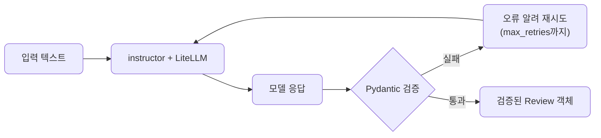
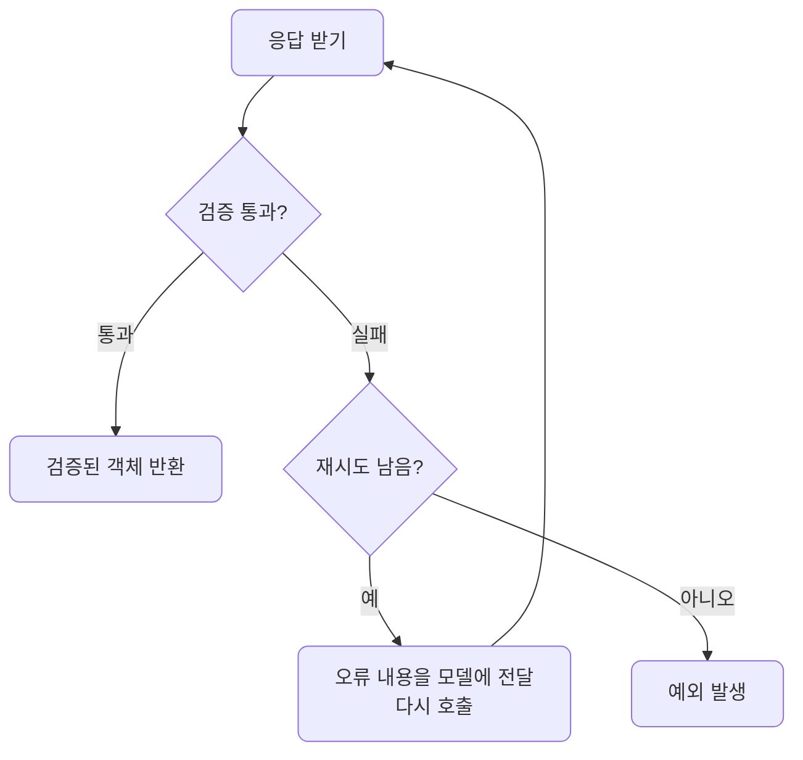
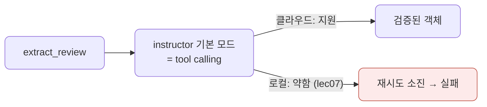
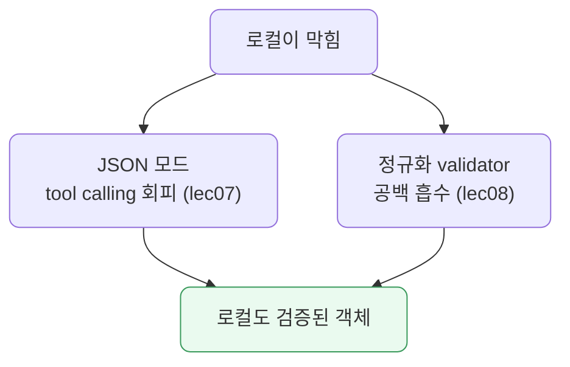

# lec09 — 구조화 출력 2

> - S1 개요: [docs/section1/README.md](../README.md)
> - 분량 18분
> - 산출물: 안전한 추출 함수

## 1. 목표

lec08에서 본 함정을 instructor로 해결합니다. Pydantic 모델을 출력 스키마로 넘기면 instructor가 파싱·검증·재시도를 대신 처리하므로, 호출 한 번으로 검증된 Pydantic 객체를 돌려받는 추출 함수를 만들 수 있습니다. 그리고 같은 함수를 로컬 모델로 돌릴 때 부딪히는 한계와, 그것을 lec07·lec08에서 배운 것으로 넘는 법까지 봅니다.



## 2. instructor가 하는 일

instructor는 LLM 호출을 감싸서, 응답을 우리가 준 Pydantic 모델로 파싱하고 검증까지 해줍니다. lec08에서 손으로 짜야 했던 가드와 재시도 루프가 라이브러리 안으로 들어간 셈입니다.

- 응답을 우리가 넘긴 Pydantic 모델로 파싱합니다.
- 모델의 필드 제약까지 포함해 검증합니다.
- 파싱이 깨지거나 검증에 실패하면 무엇이 틀렸는지를 모델에 다시 알려 재시도합니다.

중요한 점은 instructor도 LiteLLM 위에서 돈다는 것입니다. 프로바이더 SDK가 아니라 LiteLLM을 백엔드로 쓰므로, lec06에서 세운 프로바이더 독립 원칙이 구조화 출력에서도 유지됩니다.

| 단계 | lec08 수작업 가드 | lec09 instructor |
| --- | --- | --- |
| 파싱 | 모델 응답 문자열을 직접 `json.loads` | `response_model`로 자동 파싱 |
| 정리 | 코드블록·잡텍스트를 직접 잘라냄 | 라이브러리가 내부 처리 |
| 검증 | 필드·타입·범위를 손으로 확인 | Pydantic 모델 제약으로 자동 검증 |
| 재시도 | 실패 시 루프와 프롬프트를 직접 작성 | `max_retries`로 오류 피드백까지 자동 |
| 결과 타입 | dict 또는 직접 만든 객체 | 검증된 Pydantic 객체 |

## 3. 추출 함수 만들기

받고 싶은 구조는 lec08의 `Review`를 그대로 씁니다. instructor를 LiteLLM에 붙이고 `response_model`로 그 모델을 넘기면, 검증된 객체를 바로 돌려받는 함수가 됩니다.

```python
import instructor
import litellm

client = instructor.from_litellm(litellm.completion)

def extract_review(text: str, model: str = "gemini/gemini-2.5-flash") -> Review:
    return client.chat.completions.create(
        model=model,
        messages=[{"role": "user", "content": f"다음 리뷰를 분석해줘.\n{text}"}],
        response_model=Review,
        max_retries=2,
    )

review = extract_review("배송은 빨랐는데 포장이 너무 허술했어요.")
print(review.sentiment, review.confidence, review.keywords)
```

돌려받는 `review`는 문자열이나 dict가 아니라 검증을 통과한 `Review` 객체입니다. 속성으로 바로 접근할 수 있고, 타입이 보장되며, lec08에서 직접 짜야 했던 파싱·정리·검증·재시도가 이 한 함수 안에 다 들어갑니다. 이 함수가 이 단위의 산출물입니다.

## 4. 재시도가 작동하는 방식

`max_retries`는 검증 실패 시 몇 번까지 다시 시도할지를 정합니다. 모델이 잘못된 값을 내면 instructor가 그 오류를 모델에 전달해 고쳐 답하도록 다시 호출하며, 지정한 횟수까지만 시도합니다.



끝내 실패하면 예외가 납니다. 서비스에서는 이 예외를 잡아 기본값으로 처리하거나 사용자에게 알리는 식으로 대응합니다.

## 5. 같은 함수로 클라우드와 로컬 — 그런데 로컬이 막힙니다

이 추출 함수도 `model` 인자만 바꾸면 프로바이더가 바뀝니다. [extract.py](../../../src/section1/lec09/extract.py)로 클라우드와 로컬에 같은 추출을 돌려, 재시도 횟수까지 세어 봅니다.

```bash
uv run python src/section1/lec09/extract.py
```

```text
=== 1. 기본 모드(tool calling) + Review ===
리뷰: 배송은 빨랐는데 포장이 너무 허술했어요.

[클라우드] gemini/gemini-2.5-flash  (재시도 0회)
  → Review(sentiment='부정', confidence=0.9, keywords=['배송', '포장', '허술'])

[로컬] ollama/gemma4:12b-mxfp8
  최종 실패: InstructorRetryException (max_retries 소진)
```

클라우드는 한 번에 검증된 객체를 돌려주지만, 로컬은 재시도를 다 쓰고도 실패합니다. 원인은 instructor의 기본 모드에 있습니다. instructor는 기본으로 tool calling으로 스키마를 받아내는데, lec07에서 봤듯 로컬 모델은 tool calling이 약합니다. tool call이 안 되니 재시도를 거듭해도 못 건집니다.



## 6. 로컬을 살리는 두 손질 — JSON 모드와 validator

로컬을 살리려면 S1에서 배운 두 가지를 함께 씁니다.

- JSON 모드: instructor를 `mode=instructor.Mode.JSON`으로 붙여 tool calling을 피합니다. lec07에서 본 로컬의 약점을 우회하는 것입니다.
- 정규화 validator: lec08의 `field_validator`로 `" 중립"` 같은 공백 흔들림을 검증 전에 흡수하는 `NormalizedReview`를 씁니다.



둘을 함께 적용한 결과입니다.

```text
=== 2. JSON 모드 + 정규화 validator (로컬에 안정적) ===

[클라우드] gemini/gemini-2.5-flash  (재시도 0회)
  → NormalizedReview(sentiment='중립', confidence=0.8, keywords=['배송', '포장'])

[로컬] ollama/gemma4:12b-mxfp8  (재시도 0회)
  → NormalizedReview(sentiment='부정', confidence=0.85, keywords=['배송', '포장'])
```

이제 로컬도 검증된 객체를 돌려줍니다. JSON 모드가 tool calling 문제를, validator가 공백 흔들림을 막아, 재시도 없이도 통과합니다. instructor 하나만으로는 부족했고, lec07의 JSON 모드와 lec08의 validator가 함께여야 약한 로컬 모델까지 닿았습니다. 그래도 로컬이 끝내 안 되는 작업은 한계로 메모해, 클라우드로 폴백하는 등의 판단 근거로 삼습니다.

## 7. S1을 마치며

이로써 S1의 한 바퀴가 끝납니다. 지금까지 거쳐 온 길은 다음과 같습니다.

- 환경을 맞추고 LLM을 어떻게 바라볼지 정했습니다.
- 출력을 조절하고 첫 호출을 보냈습니다.
- 프롬프트를 설계하고, 같은 코드로 프로바이더와 로컬 모델을 오갔습니다.
- 마지막으로 자연어 응답을 검증된 데이터로 바꾸는 데까지 왔습니다.

이 추출 함수는 다음 섹션부터 데이터와 에이전트를 다룰 때 반복해 쓰는 기본 부품이 됩니다.

## 8. 정리

- instructor는 Pydantic 모델을 출력 스키마로 받아 파싱·검증·재시도를 대신 처리합니다.
- instructor도 LiteLLM 백엔드로 붙여, 구조화 출력에서도 프로바이더 독립 원칙을 지킵니다.
- 결과로 검증된 Pydantic 객체를 바로 돌려받는 안전한 추출 함수를 얻습니다.
- 기본 모드는 tool calling이라 로컬에선 막힐 수 있습니다. JSON 모드(lec07)와 정규화 validator(lec08)를 함께 쓰면 로컬까지 닿습니다.

## 9. 다음 섹션

[S2 — 데이터 & RAG 코어](../../plan/vod_plan.md)로 이어집니다. 여기서 만든 호출·추출 부품 위에 데이터 처리와 검색을 쌓습니다.
