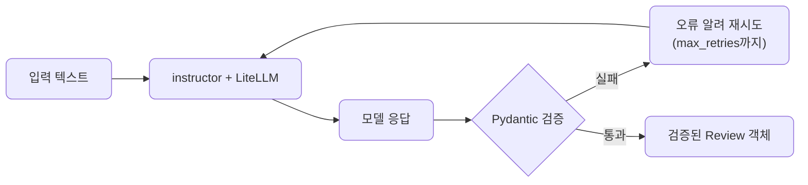
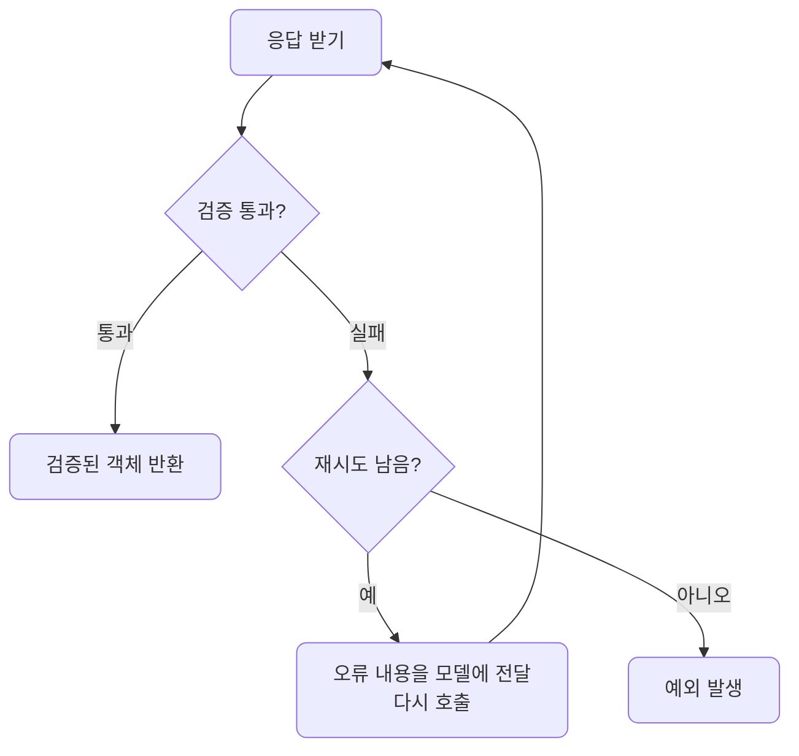

# lec09 — 구조화 출력 2

> S1 개요: [docs/section1/README.md](../README.md) · 분량 12분 · 산출물: 안전한 추출 함수

## 목표

lec08에서 본 함정을 instructor로 해결합니다. Pydantic 모델을 출력 스키마로 넘기면 instructor가 검증과 재시도를 대신 처리하므로, 호출 한 번으로 검증된 Pydantic 객체를 돌려받는 추출 함수를 만들 수 있습니다.



## instructor가 하는 일

instructor는 LLM 호출을 감싸서, 응답을 우리가 준 Pydantic 모델로 파싱하고 검증까지 해줍니다. lec08에서 손으로 짜야 했던 가드와 재시도 루프가 라이브러리 안으로 들어간 셈입니다.

- 응답을 우리가 넘긴 Pydantic 모델로 파싱합니다.
- 모델의 필드 제약까지 포함해 검증합니다.
- 파싱이 깨지거나 검증에 실패하면 무엇이 틀렸는지를 모델에 다시 알려 재시도합니다.

중요한 점은 instructor도 LiteLLM 위에서 돈다는 것입니다. 프로바이더 SDK가 아니라 LiteLLM을 백엔드로 쓰도록 instructor를 붙이므로, lec06에서 세운 프로바이더 독립 원칙이 구조화 출력에서도 유지됩니다.

### lec08 수작업 가드 vs lec09 instructor

lec08에서는 파싱·정리·검증·재시도를 모두 직접 짰지만, lec09에서는 같은 일을 instructor가 대신합니다.

| 단계 | lec08 수작업 가드 | lec09 instructor |
| --- | --- | --- |
| 파싱 | 모델 응답 문자열을 직접 `json.loads` | `response_model`로 자동 파싱 |
| 정리 | 코드블록·잡텍스트를 직접 잘라냄 | 라이브러리가 내부 처리 |
| 검증 | 필드·타입·범위를 손으로 확인 | Pydantic 모델 제약으로 자동 검증 |
| 재시도 | 실패 시 루프와 프롬프트를 직접 작성 | `max_retries`로 오류 피드백까지 자동 |
| 결과 타입 | dict 또는 직접 만든 객체 | 검증된 Pydantic 객체 |

## 추출 함수 만들기

먼저 받고 싶은 구조를 Pydantic 모델로 선언합니다. lec08의 `Review`를 그대로 씁니다.

```python
from pydantic import BaseModel, Field
from typing import Literal

class Review(BaseModel):
    sentiment: Literal["긍정", "부정", "중립"]
    confidence: float = Field(ge=0, le=1)
    keywords: list[str]
```

`confidence`에 0과 1 사이라는 제약을 붙였습니다. instructor는 이 제약까지 검증에 포함하므로, 범위를 벗어난 값이 오면 재시도를 유발합니다.

이제 instructor를 LiteLLM에 붙이고, `response_model`로 위 모델을 넘깁니다.

```python
import instructor
from litellm import completion

client = instructor.from_litellm(completion)

def extract_review(text: str, model: str = "gemini/gemini-2.0-flash") -> Review:
    return client.chat.completions.create(
        model=model,
        messages=[{"role": "user", "content": f"다음 리뷰를 분석해줘.\n{text}"}],
        response_model=Review,
        max_retries=2,
    )

review = extract_review("배송은 빨랐는데 포장이 너무 허술했어요.")
print(review.sentiment, review.confidence, review.keywords)
```

돌려받는 `review`는 문자열이나 dict가 아니라 검증을 통과한 `Review` 객체입니다.

- `review.sentiment`처럼 속성으로 바로 접근할 수 있습니다.
- 필드 타입이 보장됩니다.
- lec08에서 직접 짜야 했던 파싱·정리·검증·재시도가 이 한 함수 안에 다 들어갑니다.

## 재시도가 작동하는 방식

`max_retries`는 검증 실패 시 몇 번까지 다시 시도할지를 정합니다. 모델이 잘못된 값을 내면 instructor가 그 오류를 모델에 전달해 고쳐 답하도록 다시 호출하며, 지정한 횟수까지만 시도합니다.



검증을 깨는 대표적인 경우는 다음과 같습니다.

- 허용되지 않은 `sentiment` 값을 내는 경우입니다.
- `confidence`를 0과 1 범위 밖으로 주는 경우입니다.

끝내 실패하면 예외가 납니다. 서비스에서는 이 예외를 잡아 기본값으로 처리하거나 사용자에게 알리는 식으로 대응합니다.

## 모델을 바꿔 확인합니다

이 추출 함수도 `model` 인자만 바꾸면 프로바이더가 바뀝니다.

| 환경 | 검증 통과 | 재시도 빈도 |
| --- | --- | --- |
| 클라우드 모델 | 보통 한 번에 통과 | 드뭅니다 |
| 로컬 Ollama 모델 | 검증 실패가 더 잦음 | 더 자주 일어납니다 |

같은 함수로 양쪽을 돌려보면 lec07에서 본 품질 차이가 재시도 횟수라는 숫자로 드러납니다. 로컬에서 통과율이 낮은 지점은 한계로 메모해 둡니다.

## 실행

공유된 추출 예제를 실행합니다. instructor를 LiteLLM에 붙여, 리뷰 문장을 검증된 `Review` 객체로 뽑아내는 코드입니다.

```bash
uv run python src/section1/lec09/extract.py
```

lec08에서 깨지던 입력을 같은 예제에 넣어도, instructor의 재시도 덕에 검증된 객체가 나오는 것을 출력에서 확인합니다. 로컬 모델로 돌리면 재시도가 더 자주 일어나는 것도 함께 봅니다.

## 직접 해보기

`Review` 모델에 필드를 하나 더 추가해봅니다. 예를 들어 한 줄 요약을 담을 `summary: str`를 넣고 다시 실행하면, 프롬프트를 따로 고치지 않아도 instructor가 그 필드까지 채워 돌려주는 것을 봅니다. 스키마를 바꾸는 것만으로 추출 대상이 바뀐다는 점이 이 방식의 힘입니다.

## S1을 마치며

이로써 S1의 한 바퀴가 끝납니다. 지금까지 거쳐 온 길은 다음과 같습니다.

- 환경을 맞추고 LLM을 어떻게 바라볼지 정했습니다.
- 출력을 조절하고 첫 호출을 보냈습니다.
- 프롬프트를 설계하고, 같은 코드로 프로바이더와 로컬 모델을 오갔습니다.
- 마지막으로 자연어 응답을 검증된 데이터로 바꾸는 데까지 왔습니다.

이 추출 함수는 다음 섹션부터 데이터와 에이전트를 다룰 때 반복해 쓰는 기본 부품이 됩니다.

## 정리

- instructor는 Pydantic 모델을 출력 스키마로 받아 파싱·검증·재시도를 대신 처리합니다.
- instructor도 LiteLLM 백엔드로 붙여, 구조화 출력에서도 프로바이더 독립 원칙을 지킵니다.
- 결과로 검증된 Pydantic 객체를 바로 돌려받는 안전한 추출 함수를 얻습니다.
- 로컬 모델에서는 재시도가 더 잦으며, 이는 모델 품질 차이를 숫자로 보여줍니다.

## 다음 섹션

[S2 — 데이터 & RAG 코어](../../plan/vod_plan.md)로 이어집니다. 여기서 만든 호출·추출 부품 위에 데이터 처리와 검색을 쌓습니다.
