# lec09 — 구조화 출력 2

> - S1 개요: [docs/section1/README.md](../README.md)
> - 분량 21분
> - 산출물: 안전한 추출 함수

## 1. 목표

lec08에서 본 함정을 instructor로 해결합니다. Pydantic 모델을 출력 스키마로 넘기면 instructor가 파싱·검증·재시도를 대신 처리하므로, 호출 한 번으로 검증된 Pydantic 객체를 돌려받는 추출 함수를 만들 수 있습니다. 그 위에서 우리 규칙으로 재시도를 부르고, 여러 개·중첩 구조를 받고, 실패를 폴백으로 다루는 데까지 봅니다.

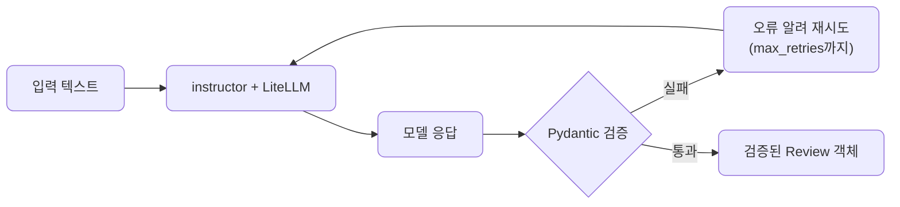

## 2. instructor가 하는 일

instructor는 LLM 호출을 감싸서, 응답을 우리가 준 Pydantic 모델로 파싱하고 검증까지 해줍니다. lec08에서 손으로 짜야 했던 가드와 재시도 루프가 라이브러리 안으로 들어간 셈입니다. instructor도 LiteLLM 위에서 도므로, lec06에서 세운 프로바이더 독립 원칙이 구조화 출력에서도 유지됩니다.

| 단계 | lec08 수작업 가드 | lec09 instructor |
| --- | --- | --- |
| 파싱 | 모델 응답 문자열을 직접 `json.loads` | `response_model`로 자동 파싱 |
| 정리 | 코드블록·잡텍스트를 직접 잘라냄 | 라이브러리가 내부 처리 |
| 검증 | 필드·타입·범위를 손으로 확인 | Pydantic 모델 제약으로 자동 검증 |
| 재시도 | 실패 시 루프와 프롬프트를 직접 작성 | `max_retries`로 오류 피드백까지 자동 |
| 결과 타입 | dict 또는 직접 만든 객체 | 검증된 Pydantic 객체 |

lec08의 한 단위가 instructor에서는 인자 하나로 줄어듭니다. 그래서 이 단위는 모델·가드를 다시 만들지 않고, 그 위에서 무엇을 더 할 수 있는지에 집중합니다.

## 3. 추출 함수 만들기

[extract.py](../../../src/section1/lec09/extract.py)의 구조입니다. `main`이 추출 세 가지를 보여주고, 모든 추출은 `make_client`로 instructor를 붙여 `response_model`로 검증합니다.

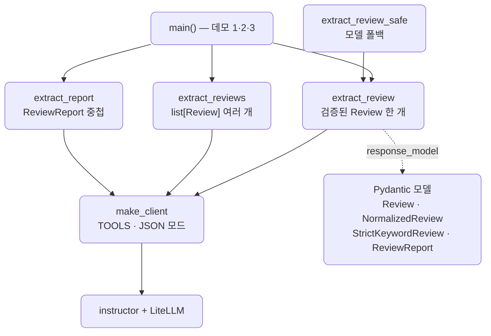

받고 싶은 구조는 lec08의 `Review`를 그대로 씁니다. instructor를 LiteLLM에 붙이고 `response_model`로 그 모델을 넘기면, 검증된 객체를 바로 돌려받는 함수가 됩니다.

```python
import instructor
import litellm

client = instructor.from_litellm(litellm.completion)

def extract_review(text: str, model: str = "gemini/gemini-2.5-flash") -> Review:
    return client.chat.completions.create(
        model=model,
        messages=[{"role": "user", "content": f"다음 리뷰를 분석해줘.\n{text}"}],
        response_model=Review,
        max_retries=2,
    )
```

돌려받는 값은 문자열이나 dict가 아니라 검증을 통과한 `Review` 객체입니다. 속성으로 바로 접근할 수 있고 타입이 보장되며, lec08에서 직접 짜야 했던 파싱·정리·검증·재시도가 이 한 함수 안에 다 들어갑니다. 이 함수가 이 단위의 산출물입니다. [extract.py](../../../src/section1/lec09/extract.py)를 클라우드와 ollama에 돌린 결과입니다.

```text
=== 1. 검증된 Review 한 개 뽑기 ===
리뷰: 배송은 빨랐는데 포장이 너무 허술했어요.

[클라우드] gemini/gemini-2.5-flash  (재시도 0회)
  → Review(sentiment='부정', confidence=0.85, keywords=['배송', '포장', '허술'])

[Ollama Cloud] ollama/gemma4:31b-cloud  (재시도 0회)
  → NormalizedReview(sentiment='부정', confidence=0.85, keywords=['배송', '포장 허술'])
```

`model` 인자만 바꾸면 같은 함수가 클라우드와 ollama를 오갑니다. ollama에 쓰인 모드와, 로컬·클라우드 차이는 7절과 8절에서 다룹니다.

## 4. 검증과 재시도

### 4.1. max_retries로 자동 재시도

`max_retries`는 검증 실패 시 몇 번까지 다시 시도할지를 정합니다. 모델이 잘못된 값을 내면 instructor가 그 오류를 모델에 전달해 고쳐 답하도록 다시 호출하며, 지정한 횟수까지만 시도합니다.

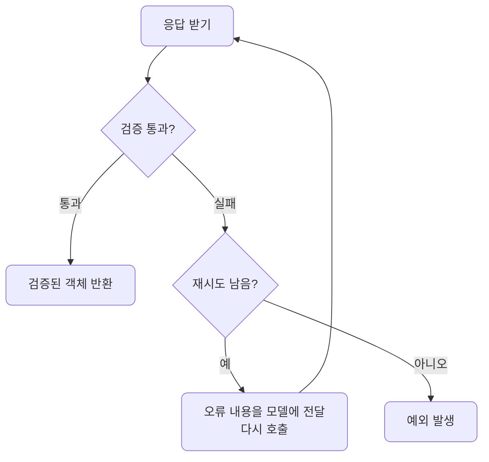

끝내 실패하면 예외가 납니다. 이 예외를 어떻게 다룰지는 6절에서 봅니다.

### 4.2. 검증 규칙을 더해 재시도를 유도합니다

재시도는 타입·허용값만이 아니라, 우리가 정한 규칙으로도 부를 수 있습니다. Pydantic의 `field_validator`로 도메인 규칙을 넣으면, 그 규칙을 어긴 출력에 instructor가 같은 방식으로 재시도합니다.

```python
class StrictKeywordReview(Review):
    @field_validator("keywords")
    @classmethod
    def single_word(cls, value):
        for keyword in value:
            if " " in keyword.strip():
                raise ValueError(f"키워드는 한 단어여야 합니다: '{keyword}'")
        return value
```

3절의 ollama 출력은 키워드로 `'포장 허술'`을 냈습니다. `StrictKeywordReview`를 쓰면 이 값이 검증에서 막히고, instructor가 `키워드는 한 단어여야 합니다: '포장 허술'`이라는 오류를 모델에 돌려주며 다시 묻습니다. 모델이 `'포장'`, `'허술'`로 나눠 답하면 통과합니다. 형식 검증을 넘어, 서비스가 요구하는 규칙까지 재시도 루프에 태우는 셈입니다.

## 5. 더 복잡한 스키마

### 5.1. 여러 개 — list[Review]

한 글에 여러 측면이 섞여 있을 때가 많습니다. `response_model`에 `list[Review]`를 주면 instructor가 한 호출로 여러 객체를 뽑아, 각각 검증된 목록으로 돌려줍니다.

```python
def extract_reviews(text: str, model: str = "gemini/gemini-2.5-flash") -> list[Review]:
    return client.chat.completions.create(
        model=model,
        messages=[{"role": "user", "content": f"다음 글의 리뷰들을 측면별로 분석해줘.\n{text}"}],
        response_model=list[Review],
        max_retries=2,
    )
```

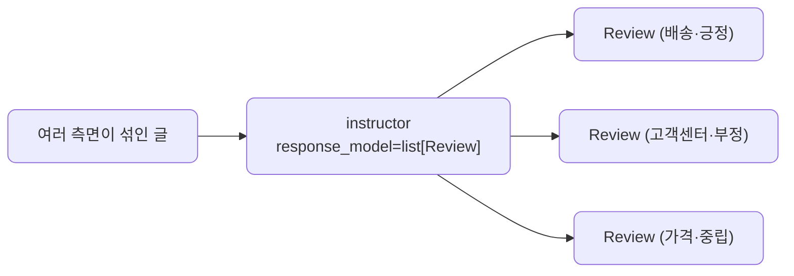

```text
=== 2. 여러 개를 한 번에 — list[Review] (JSON 모드) ===
글: 배송이 정말 빨라서 좋았어요. 다만 고객센터 응대는 불친절했습니다. 가격은 그냥 무난한 편이에요.

[클라우드] gemini/gemini-2.5-flash — 3개
  → Review(sentiment='긍정', confidence=0.9, keywords=['배송', '빠르다'])
  → Review(sentiment='부정', confidence=0.9, keywords=['고객센터', '응대', '불친절'])
  → Review(sentiment='중립', confidence=0.8, keywords=['가격', '무난하다'])

[Ollama Cloud] ollama/gemma4:31b-cloud — 3개
  → Review(sentiment='긍정', confidence=1.0, keywords=['배송', '빠름'])
  → Review(sentiment='부정', confidence=1.0, keywords=['고객센터', '불친절'])
  → Review(sentiment='중립', confidence=0.9, keywords=['가격', '무난함'])
```

### 5.2. 중첩 — ReviewReport

객체 안에 객체를 둘 수도 있습니다. 총평·측면별 분석·요약을 한 모델로 묶으면, instructor가 바깥 객체와 안쪽 목록을 한 호출로 모두 채워 검증합니다.

```python
class ReviewReport(BaseModel):
    overall: Literal["긍정", "부정", "중립"] = Field(description="글 전체의 총평")
    aspects: list[Review] = Field(description="측면별 분석 목록")
    summary: str = Field(description="글 전체를 한 줄로 요약")
```

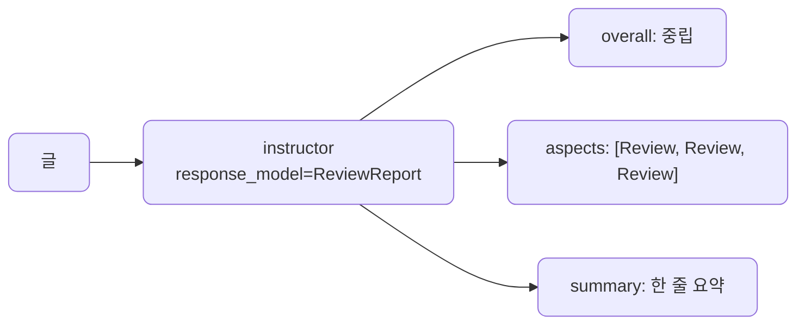

```text
=== 3. 중첩 모델 — ReviewReport ===
글: 배송이 정말 빨라서 좋았어요. 다만 고객센터 응대는 불친절했습니다. 가격은 그냥 무난한 편이에요.

[클라우드] gemini/gemini-2.5-flash — 총평 중립, 측면 3개
  요약: 배송은 빨라 좋았으나 고객센터 응대는 불친절했고, 가격은 무난한 편입니다.

[Ollama Cloud] ollama/gemma4:31b-cloud — 총평 중립, 측면 3개
  요약: 배송은 매우 만족스러우나 고객센터 응대는 아쉬우며 가격은 평이한 수준입니다.
```

스키마를 바꾸는 것만으로 추출하는 모양이 달라집니다. 코드는 `response_model`만 바뀝니다. 여러 개·중첩 같은 복잡한 스키마는 tool calling이 흔들려, 예제에서 양쪽 다 JSON 모드로 받습니다.

## 6. 실패를 다루기 — 예외와 폴백

재시도를 다 쓰고도 검증에 실패하면 instructor는 `InstructorRetryException`을 올립니다. 서비스는 이 예외를 잡아 대응합니다. lec06의 폴백을 구조화 출력으로 옮겨, 한 모델이 실패하면 다음 모델로 넘기는 추출 함수를 만들 수 있습니다.

```python
def extract_review_safe(text, models):
    last_exc = None
    for model in models:
        json_mode = model.startswith("ollama/")
        response_model = NormalizedReview if json_mode else Review
        try:
            return extract_review(text, model=model, response_model=response_model, json_mode=json_mode)
        except Exception as exc:
            last_exc = exc
    raise last_exc  # 모두 실패하면 마지막 예외를 올린다
```

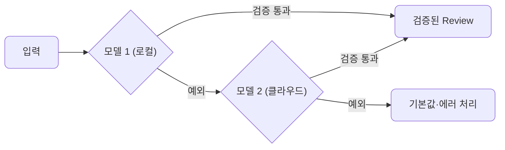

로컬을 먼저 시도하고 실패하면 클라우드로 넘기면, 비용을 아끼면서도 결과를 보장하는 쪽으로 기울일 수 있습니다. 끝내 모두 실패하면 예외를 올려, 호출부가 기본값으로 처리하거나 사용자에게 알리게 합니다.

## 7. 백엔드를 바꿀 때 — 모드 한 가지만 손봅니다

instructor가 스키마를 받아내는 방식에는 두 모드가 있습니다. 기본은 tool calling이고, 다른 하나는 JSON 모드입니다. 어느 쪽이 맞는지는 백엔드와 요청에 따라 갈립니다.

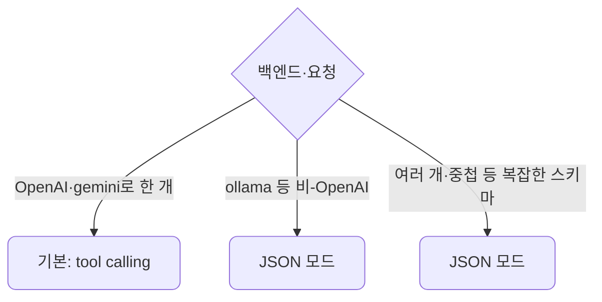

- 비-OpenAI 백엔드(ollama 등)는 모델마다 tool calling 지원이 달라, JSON 모드가 안전합니다. lec07에서 본 tool calling의 백엔드 편차가 여기서도 나타납니다.
- 여러 개나 중첩처럼 복잡한 스키마는 tool calling이 객체 하나를 전제로 해 흔들리므로, JSON 모드로 받습니다. 5절의 추출을 양쪽 다 JSON 모드로 돌린 이유입니다.

모드는 `instructor.from_litellm(litellm.completion, mode=instructor.Mode.JSON)`처럼 한 줄로 바꿉니다. 작은 로컬 모델이 `" 중립"`(앞에 공백)처럼 사소하게 흔들릴 때는 lec08의 정규화 모델을 함께 써 재시도 없이 흡수합니다. 3절의 ollama 결과가 `NormalizedReview`였던 것이 그 때문입니다.

## 8. Ollama 로컬과 클라우드

Ollama는 기본이 로컬이지만, 모델 이름 끝에 `-cloud`를 붙이면 같은 코드로 Ollama Cloud의 큰 모델을 부를 수 있습니다. 위 예제의 `gemma4:31b-cloud`가 그것입니다. 로컬에 내려받지 않고 Ollama의 GPU에서 도는 더 큰 모델이라 형식을 깔끔하게 지키는 편입니다. Ollama Cloud에는 무료 한도가 있고, 더 쓰면 유료 구독으로 올립니다. 그래서 예제 출력의 라벨도 로컬과 구분해 `Ollama Cloud`로 적습니다.

요금제는 무료부터 시작합니다. 무료에도 클라우드 모델 접근이 포함되어, 우리 예제의 `-cloud` 모델도 한도 안에서 돌 수 있습니다.

| 요금제 | 가격 | 클라우드 사용량 | 동시 실행 |
| --- | --- | --- | --- |
| Free | $0 | 한도 안에서 클라우드 모델 접근 | — |
| Pro | $20/월, 연 결제 $200 | Free의 50배 | 클라우드 모델 3개 |
| Max | $100/월 | Pro의 5배 | 클라우드 모델 10개 |

결제 방식이 클라우드 3사와 다릅니다. gemini·OpenAI·Claude는 쓴 입력·출력 토큰만큼 내는 종량제이지만, Ollama Cloud는 토큰당 과금이 아니라 월 정액 구독입니다. 요금제별 사용량 한도 안에서 쓰고, 한도를 넘으면 상위 요금제로 올립니다. 그래서 lec06에서 본 토큰 단위 비용 계산은 Ollama Cloud 사용량에는 그대로 적용되지 않습니다.

Pro부터 더 크고 강한 클라우드 모델과 비공개 모델 업로드·공유가 열립니다. 최신 요금은 [ollama.com/pricing](https://ollama.com/pricing)에서 확인합니다.

인증은 두 가지 방법이 있습니다.

| 방법 | 준비 | `.env` |
| --- | --- | --- |
| 로그인된 로컬 데몬 | 호스트에서 `ollama signin` | `OLLAMA_API_BASE`만. 데몬이 대신 인증 |
| API 키 | ollama.com 설정의 API keys에서 발급 | `OLLAMA_API_KEY`에 키를 넣음 |

- 로컬 모델만 쓰면 키도 로그인도 필요 없습니다.
- 클라우드 모델(`-cloud`)을 쓰려면 둘 중 하나가 필요합니다. 호스트에서 한 번 로그인해 두면 코드는 로컬 모델과 똑같이 `OLLAMA_API_BASE`만으로 동작합니다.
- 키로 직접 쓰려면 ollama.com 설정의 API keys에서 Add API Key로 발급해 `.env`의 `OLLAMA_API_KEY`에 넣습니다. 예제의 `targets`는 이 키가 있으면 호출에 함께 넘깁니다.

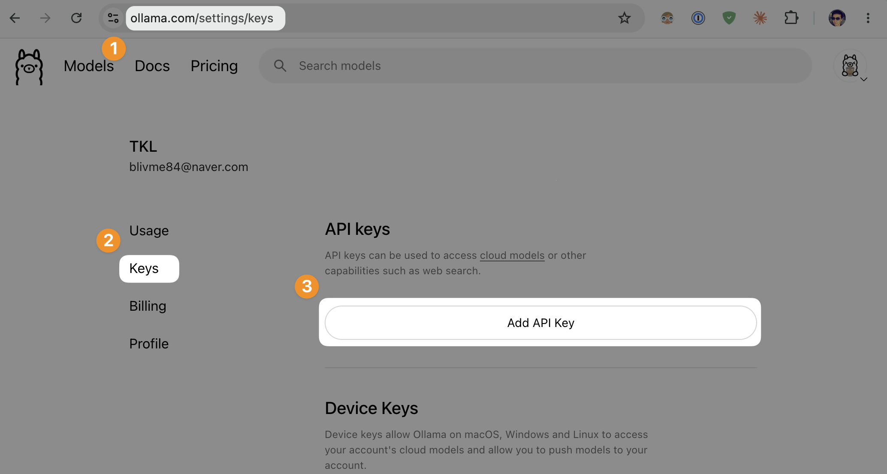
*ollama.com 설정의 Keys 메뉴를 열고 Add API Key를 누릅니다.*

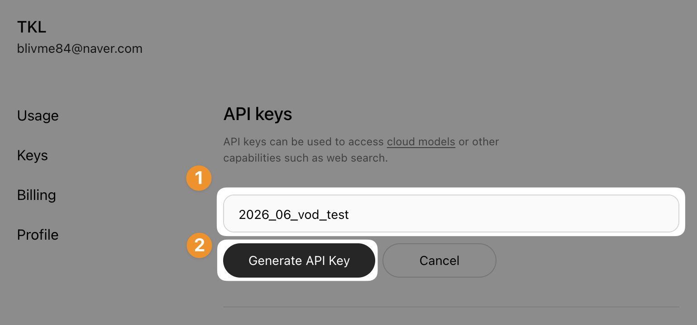
*키 이름을 정하고 Generate API Key를 누릅니다.*

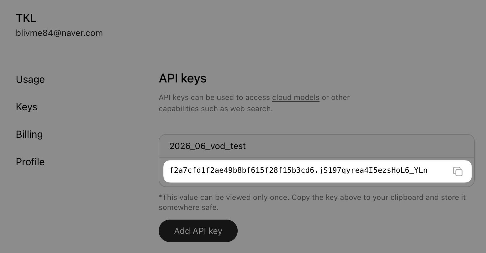
*발급된 키가 보입니다. 이 값은 그때 한 번만 보이니 바로 복사해 둡니다.*

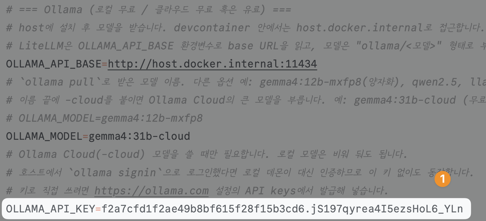
*복사한 키를 `.env`의 `OLLAMA_API_KEY`에 붙여넣습니다.*

`.env.sample`에 `OLLAMA_API_KEY` 항목을 두었습니다. 로컬 모델에는 비워 두고, 클라우드 모델을 쓸 때만 채웁니다.

## 9. 정리

- instructor는 Pydantic 모델을 출력 스키마로 받아 파싱·검증·재시도를 대신 처리합니다.
- 재시도는 타입뿐 아니라 우리가 `field_validator`로 정한 규칙으로도 부를 수 있습니다.
- `response_model`에 `list[Review]`나 중첩 모델을 주면, 여러 개나 복잡한 구조도 한 호출로 검증해 받습니다.
- 끝내 실패하면 예외가 나므로, 폴백이나 기본값으로 대응합니다. 로컬을 먼저 시도하고 클라우드로 넘기는 식입니다.
- 백엔드에 맞춰 모드만 손봅니다. 비-OpenAI 백엔드와 복잡한 스키마는 JSON 모드(lec07), 작은 로컬 모델은 정규화 모델(lec08)이 안정적입니다.
- Ollama는 기본이 로컬이고, `-cloud` 모델로 클라우드도 씁니다. 클라우드는 `ollama signin`이나 `OLLAMA_API_KEY`로 인증합니다.

## 10. S1을 마치며

이로써 S1의 한 바퀴가 끝납니다. 지금까지 거쳐 온 길은 다음과 같습니다.

- 환경을 맞추고 LLM을 어떻게 바라볼지 정했습니다.
- 출력을 조절하고 첫 호출을 보냈습니다.
- 프롬프트를 설계하고, 같은 코드로 프로바이더와 로컬 모델을 오갔습니다.
- 마지막으로 자연어 응답을 검증된 데이터로 바꾸는 데까지 왔습니다.

이 추출 함수는 다음 섹션부터 데이터와 에이전트를 다룰 때 반복해 쓰는 기본 부품이 됩니다.
