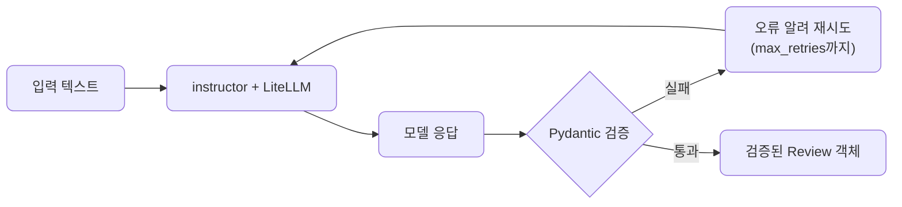
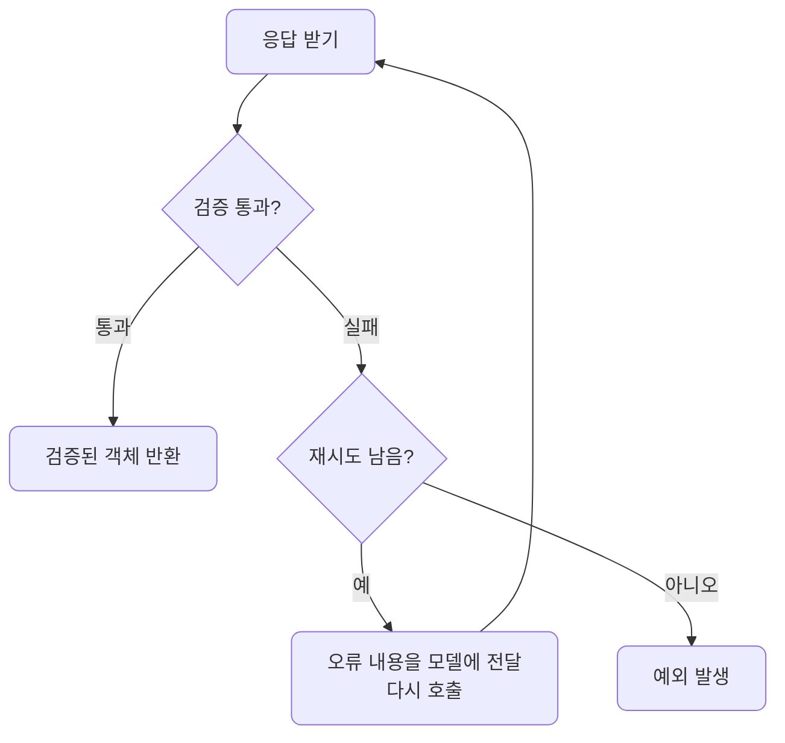
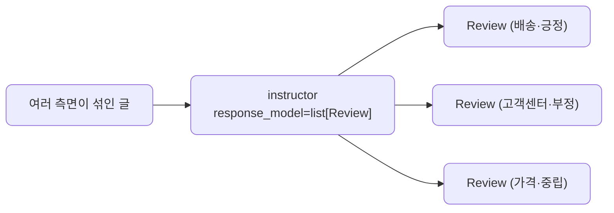
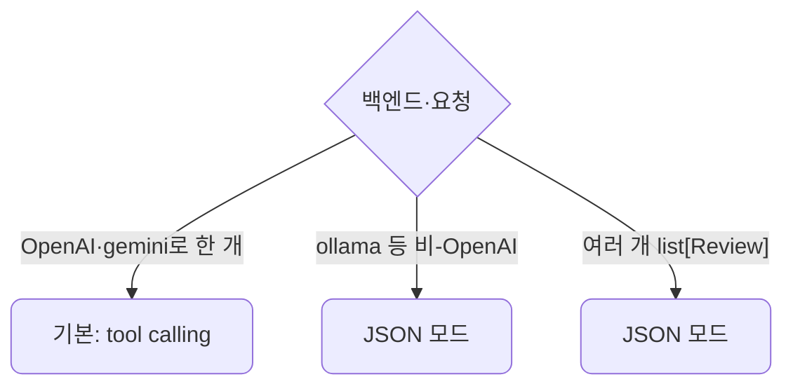

# lec09 — 구조화 출력 2

> - S1 개요: [docs/section1/README.md](../README.md)
> - 분량 18분
> - 산출물: 안전한 추출 함수

## 1. 목표

lec08에서 본 함정을 instructor로 해결합니다. Pydantic 모델을 출력 스키마로 넘기면 instructor가 파싱·검증·재시도를 대신 처리하므로, 호출 한 번으로 검증된 Pydantic 객체를 돌려받는 추출 함수를 만들 수 있습니다. 한 개뿐 아니라 여러 개를 목록으로 받는 법, 그리고 백엔드에 맞춰 모드를 고르는 법까지 봅니다.



## 2. instructor가 하는 일

instructor는 LLM 호출을 감싸서, 응답을 우리가 준 Pydantic 모델로 파싱하고 검증까지 해줍니다. lec08에서 손으로 짜야 했던 가드와 재시도 루프가 라이브러리 안으로 들어간 셈입니다. instructor도 LiteLLM 위에서 도므로, lec06에서 세운 프로바이더 독립 원칙이 구조화 출력에서도 유지됩니다.

| 단계 | lec08 수작업 가드 | lec09 instructor |
| --- | --- | --- |
| 파싱 | 모델 응답 문자열을 직접 `json.loads` | `response_model`로 자동 파싱 |
| 정리 | 코드블록·잡텍스트를 직접 잘라냄 | 라이브러리가 내부 처리 |
| 검증 | 필드·타입·범위를 손으로 확인 | Pydantic 모델 제약으로 자동 검증 |
| 재시도 | 실패 시 루프와 프롬프트를 직접 작성 | `max_retries`로 오류 피드백까지 자동 |
| 결과 타입 | dict 또는 직접 만든 객체 | 검증된 Pydantic 객체 |

lec08의 한 단위가 instructor에서는 인자 하나로 줄어듭니다. 그래서 이 단위는 모델·가드를 다시 만들지 않고, 그 위에서 무엇을 더 할 수 있는지에 집중합니다.

## 3. 추출 함수 만들기

받고 싶은 구조는 lec08의 `Review`를 그대로 씁니다. instructor를 LiteLLM에 붙이고 `response_model`로 그 모델을 넘기면, 검증된 객체를 바로 돌려받는 함수가 됩니다.

```python
import instructor
import litellm

client = instructor.from_litellm(litellm.completion)

def extract_review(text: str, model: str = "gemini/gemini-2.5-flash") -> Review:
    return client.chat.completions.create(
        model=model,
        messages=[{"role": "user", "content": f"다음 리뷰를 분석해줘.\n{text}"}],
        response_model=Review,
        max_retries=2,
    )
```

돌려받는 값은 문자열이나 dict가 아니라 검증을 통과한 `Review` 객체입니다. 속성으로 바로 접근할 수 있고 타입이 보장되며, lec08에서 직접 짜야 했던 파싱·정리·검증·재시도가 이 한 함수 안에 다 들어갑니다. 이 함수가 이 단위의 산출물입니다. [extract.py](../../../src/section1/lec09/extract.py)를 클라우드와 로컬에 돌린 결과입니다.

```text
=== 1. 검증된 Review 한 개 뽑기 ===
리뷰: 배송은 빨랐는데 포장이 너무 허술했어요.

[클라우드] gemini/gemini-2.5-flash  (재시도 0회)
  → Review(sentiment='부정', confidence=0.9, keywords=['배송', '포장', '허술'])

[로컬] ollama/gemma4:31b-cloud  (재시도 0회)
  → NormalizedReview(sentiment='부정', confidence=0.8, keywords=['배송', '포장'])
```

`model` 인자만 바꾸면 같은 함수가 클라우드와 로컬을 오갑니다. 로컬에 쓰인 모드와 모델 차이는 6절에서 다룹니다.

## 4. 재시도가 작동하는 방식

`max_retries`는 검증 실패 시 몇 번까지 다시 시도할지를 정합니다. 모델이 잘못된 값을 내면 instructor가 그 오류를 모델에 전달해 고쳐 답하도록 다시 호출하며, 지정한 횟수까지만 시도합니다.



끝내 실패하면 예외가 납니다. 서비스에서는 이 예외를 잡아 기본값으로 처리하거나 사용자에게 알리는 식으로 대응합니다.

## 5. 여러 개를 한 번에 — list[Review]

한 글에 여러 측면이 섞여 있을 때가 많습니다. `response_model`에 `list[Review]`를 주면 instructor가 한 호출로 여러 객체를 뽑아, 각각 검증된 목록으로 돌려줍니다.

```python
def extract_reviews(text: str, model: str = "gemini/gemini-2.5-flash") -> list[Review]:
    return client.chat.completions.create(
        model=model,
        messages=[{"role": "user", "content": f"다음 글의 리뷰들을 측면별로 분석해줘.\n{text}"}],
        response_model=list[Review],
        max_retries=2,
    )
```



```text
=== 2. 여러 개를 한 번에 — list[Review] (JSON 모드) ===
글: 배송이 정말 빨라서 좋았어요. 다만 고객센터 응대는 불친절했습니다. 가격은 그냥 무난한 편이에요.

[클라우드] gemini/gemini-2.5-flash — 3개
  → Review(sentiment='긍정', confidence=0.9, keywords=['배송', '빠름'])
  → Review(sentiment='부정', confidence=0.9, keywords=['고객센터', '불친절'])
  → Review(sentiment='중립', confidence=0.8, keywords=['가격', '무난'])

[로컬] ollama/gemma4:31b-cloud — 3개
  → Review(sentiment='긍정', confidence=1.0, keywords=['배송', '빠름'])
  → Review(sentiment='부정', confidence=1.0, keywords=['고객센터', '불친절'])
  → Review(sentiment='중립', confidence=0.9, keywords=['가격', '무난함'])
```

한 문장의 글에서 세 개의 검증된 `Review`가 나왔습니다. 스키마를 `Review`에서 `list[Review]`로 바꾼 것 말고는 코드가 같습니다.

## 6. 백엔드를 바꿀 때 — 모드 한 가지만 손봅니다

instructor가 스키마를 받아내는 방식에는 두 모드가 있습니다. 기본은 tool calling이고, 다른 하나는 JSON 모드입니다. 어느 쪽이 맞는지는 백엔드와 요청에 따라 갈립니다.



- 비-OpenAI 백엔드(ollama 등)는 모델마다 tool calling 지원이 달라, JSON 모드가 안전합니다. lec07에서 본 tool calling의 백엔드 편차가 여기서도 나타납니다.
- 여러 개(`list[Review]`)는 tool calling이 객체 하나를 전제로 해 흔들리므로, JSON 모드로 받습니다. 5절의 목록 추출을 양쪽 다 JSON 모드로 돌린 이유입니다.

모드는 `instructor.from_litellm(litellm.completion, mode=instructor.Mode.JSON)`처럼 한 줄로 바꿉니다. 작은 로컬 모델이 `" 중립"`처럼 사소하게 흔들릴 때는 lec08의 정규화 모델을 함께 써 재시도 없이 흡수합니다. 3절의 로컬 결과가 `NormalizedReview`였던 것이 그 때문입니다.

## 7. S1을 마치며

이로써 S1의 한 바퀴가 끝납니다. 지금까지 거쳐 온 길은 다음과 같습니다.

- 환경을 맞추고 LLM을 어떻게 바라볼지 정했습니다.
- 출력을 조절하고 첫 호출을 보냈습니다.
- 프롬프트를 설계하고, 같은 코드로 프로바이더와 로컬 모델을 오갔습니다.
- 마지막으로 자연어 응답을 검증된 데이터로 바꾸는 데까지 왔습니다.

이 추출 함수는 다음 섹션부터 데이터와 에이전트를 다룰 때 반복해 쓰는 기본 부품이 됩니다.

## 8. 정리

- instructor는 Pydantic 모델을 출력 스키마로 받아 파싱·검증·재시도를 대신 처리합니다.
- 결과로 검증된 Pydantic 객체를 바로 돌려받는 안전한 추출 함수를 얻습니다.
- `response_model`에 `list[Review]`를 주면 한 호출로 여러 객체를 목록으로 받습니다.
- 백엔드에 맞춰 모드만 손봅니다. 비-OpenAI 백엔드와 목록 추출은 JSON 모드(lec07)가, 작은 로컬 모델은 정규화 모델(lec08)이 안정적입니다.

## 9. 다음 섹션

[S2 — 데이터 & RAG 코어](../../plan/vod_plan.md)로 이어집니다. 여기서 만든 호출·추출 부품 위에 데이터 처리와 검색을 쌓습니다.
