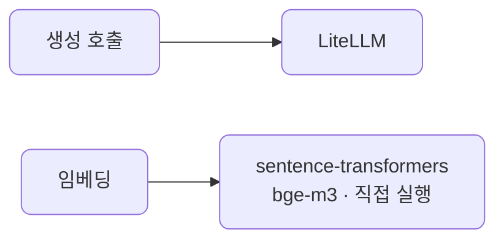
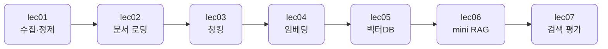

# S2 — 데이터 & RAG 코어

> 상위 계획: [docs/plan/vod_plan.md](../plan/vod_plan.md)의 S2 항목

RAG에 필요한 데이터 처리부터 검색·평가까지, mini RAG 한 바퀴를 직접 돌립니다. 원본 데이터를 모아 정제하고, 문서를 텍스트로 만들고, 검색에 알맞게 쪼개 임베딩하고, 벡터DB에 넣어 검색하고, 그 위에 생성과 출처 표시를 얹어 작은 RAG를 완성한 뒤, 검색 품질을 숫자로 평가하는 데까지 갑니다.

이 섹션을 마치면 문서 모음에서 질문에 맞는 근거를 찾아 답을 만들고 출처를 보여주는 mini RAG와, 그 검색을 평가하는 잣대가 손에 들어옵니다.

## 학습 방식

S1과 같습니다. 예제 코드는 이 저장소로 공유되며, devcontainer 안에서 실행해 결과를 관찰하고 핵심을 읽어 이해합니다. 손으로 바꿔보는 부분은 각 단위의 "직접 해보기"로 한정합니다.

```bash
# 예: 한 단위의 예제 실행 (devcontainer 터미널에서)
uv run python src/section2/lec06/mini_rag.py
```

## 관통하는 원칙

생성 호출은 S1처럼 LiteLLM을 경유합니다. mini RAG의 generation도 `litellm.completion` 하나로 두어, 클라우드와 로컬을 같은 코드로 오갑니다.

임베딩은 예외입니다. S1 개요에서 예고한 그 예외가 여기서 처음 등장합니다. 임베딩은 LiteLLM을 거치지 않고 sentence-transformers로 HF 모델(기본 bge-m3)을 직접 실행합니다. 키가 필요 없고 로컬에서 돌며, 모델은 최초 실행 시 자동으로 받습니다.



## 단위 구성

| 단위 | 분 | 주제 | 산출물 |
| --- | --- | --- | --- |
| [lec01](lec01/README.md) | 10 | 데이터 수집·정제 | 정제 스크립트 |
| [lec02](lec02/README.md) | 10 | 문서 로딩 | 텍스트 추출기 |
| [lec03](lec03/README.md) | 18 | 청킹 | 청킹 유틸 |
| [lec04](lec04/README.md) | 15 | 임베딩 | 임베딩 함수 |
| [lec05](lec05/README.md) | 13 | 벡터DB Chroma | Chroma 컬렉션 |
| [lec06](lec06/README.md) | 18 | mini RAG | 동작 mini RAG |
| [lec07](lec07/README.md) | 15 | 검색 평가 | 평가 노트북 |

합계 99분, 7단위입니다.

## 흐름

데이터가 한 방향으로 흐릅니다. 원본을 모아 정제한 다음, 문서를 텍스트로 만들고, 검색에 알맞게 쪼개 벡터로 바꿉니다. 그 벡터를 벡터DB에 넣어 검색하고, 검색 결과 위에 생성과 출처 표시를 얹어 mini RAG를 완성합니다. 마지막으로 검색이 얼마나 잘 맞히는지를 숫자로 평가합니다.



## 코드와 테스트

공유되는 예제 코드는 [src/section2](../../src/section2)에, 테스트는 [tests/section2](../../tests/section2)에 같은 `lecNN` 구조로 들어 있습니다. 이 저장소를 받아 devcontainer 안에서 그대로 실행하는 것이 기본이고, 손으로 바꿔보는 부분은 각 단위의 "직접 해보기"로 한정합니다.
