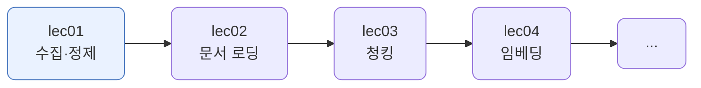
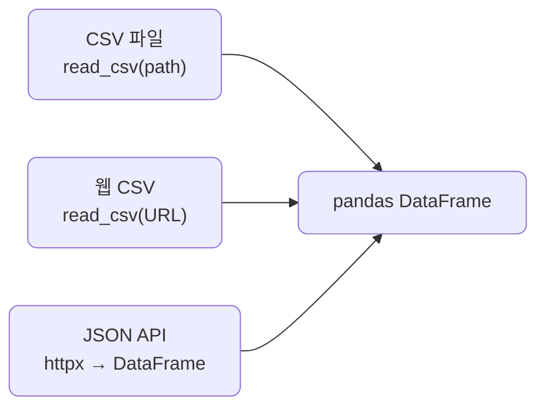
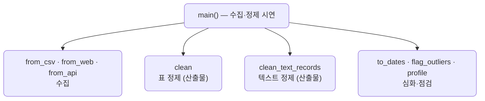

# lec01 — 데이터 수집·정제

> - S2 개요: [docs/section2/README.md](../README.md)
> - 분량 16분
> - 산출물: 정제 스크립트

## 1. 목표

RAG는 검색이 핵심이고, 검색 품질은 데이터 품질에서 시작합니다. 흩어진 원본을 한 DataFrame으로 모으고, 데이터 모양에 맞게 정제해 다음 단계가 믿고 쓸 데이터를 만듭니다.

- CSV·웹·API 세 갈래로 데이터를 모읍니다.
- 표 데이터와 텍스트를 각각의 방식으로 정제합니다.
- 결측·날짜·이상치를 한 걸음 더 다루고, 정제 전후를 숫자로 확인합니다.



## 2. 왜 수집·정제부터인가

검색·임베딩은 들어온 데이터를 그대로 받아 씁니다. 같은 제품이 `전자`·`전자제품`·`가전`으로 흩어져 있거나, 앞뒤 공백·중복·빈 값이 섞여 있으면 검색이 엉키고 결과를 신뢰하기 어렵습니다. 그래서 RAG 파이프라인의 첫 단추는 정제입니다. 들어가는 데이터가 깨끗해야 뒤가 깨끗합니다.

## 3. 어디서 모으나 — CSV · 웹 · API

데이터는 어디서 오든 결국 하나의 DataFrame으로 모읍니다. 형식과 접근 방법만 다릅니다.

```python
import pandas as pd
import httpx

def from_csv(path):
    return pd.read_csv(path)                        # 로컬 CSV 파일

def from_web(url):
    return pd.read_csv(url)                          # 웹에 올라온 CSV를 URL로 바로

def from_api(url):
    return pd.DataFrame(httpx.get(url).json())       # JSON API → DataFrame
```



여기서 "웹"은 HTTP로 받은 표나 CSV를 뜻합니다. PDF·HTML 문서를 열어 텍스트를 추출하는 일은 lec02의 몫입니다.

## 4. 표 데이터 정제

표로 들어온 데이터의 흔한 문제를 하나씩 처리합니다. `clean`이 첫 번째 산출물입니다.

| 원본의 문제 | 정제 처리 |
| --- | --- |
| 앞뒤 공백 (`" 텀블러"`) | `str.strip` |
| 완전히 같은 행 중복 | `drop_duplicates` |
| 같은 범주의 다른 표기 (`전자제품`·`가전`) | 표준값으로 매핑 |
| 숫자 칼럼에 문자·빈칸 | `to_numeric(errors="coerce")` |
| 필수 값(`name`·`price`) 결측 | 행 제거 |
| 비필수 값(`city`) 결측 | 그대로 둠 |

```python
def clean(df):
    df = df.copy()
    df.columns = df.columns.str.strip()
    for col in ["name", "category", "city"]:
        df[col] = df[col].str.strip()
    df = df.drop_duplicates()
    df["category"] = df["category"].replace(CATEGORY_MAP)
    df["price"] = pd.to_numeric(df["price"], errors="coerce")
    keep = df["name"].notna() & (df["name"] != "") & df["price"].notna()
    df = df[keep].reset_index(drop=True)
    df["price"] = df["price"].astype(int)
    return df
```


정제는 모든 결측을 버리는 일이 아닙니다. `name`·`price`처럼 없으면 안 되는 값만 행을 버리고, `city` 같은 부수 정보의 결측은 그대로 둡니다. 무엇이 필수인지는 데이터를 쓰는 쪽이 정합니다.

## 5. 텍스트 정제

RAG가 실제로 다루는 것은 대부분 텍스트입니다. 청킹·임베딩 전에 텍스트를 다듬어야 같은 문장이 공백 하나 때문에 다른 것으로 취급되지 않습니다. `clean_text_records`가 두 번째 산출물입니다.

```python
import re, unicodedata

def clean_text(text):
    text = unicodedata.normalize("NFKC", text)   # 전각·호환문자를 표준형으로
    text = re.sub(r"\s+", " ", text)             # 연속 공백·탭·개행을 한 칸으로
    return text.strip()

def clean_text_records(df, col="text", min_len=4):
    df = df.copy()
    df[col] = df[col].map(clean_text)
    df = df[df[col].str.len() >= min_len]         # 너무 짧거나 빈 행 제거
    return df.drop_duplicates(subset=[col]).reset_index(drop=True)
```


표 정제와 비슷하지만 초점이 다릅니다. 공백·개행이 섞인 같은 문장을 하나로 모으고(`NFKC` 정규화는 전각 `ＡＳＡＰ`를 `ASAP`로 폅니다), 의미 없는 짧은 조각을 걸러냅니다.

## 6. 결측·날짜·이상치 한 걸음 더

경량 정제에서 자주 만나는 세 가지를 보조 함수로 둡니다.

```python
def to_dates(series):
    # 여러 형식이 섞인 날짜를 datetime으로. 못 읽으면 NaT
    return pd.to_datetime(series, errors="coerce", format="mixed")

def flag_outliers(series):
    # IQR 바깥 값을 표시한다. 삭제가 아니라 검토 대상으로 골라낼 뿐
    q1, q3 = series.quantile(0.25), series.quantile(0.75)
    iqr = q3 - q1
    return (series < q1 - 1.5 * iqr) | (series > q3 + 1.5 * iqr)
```

- 결측: 필수 값은 행을 버리지만, 부수 값은 `fillna("미상")`처럼 채워 살릴 수도 있습니다. 버릴지 채울지는 그 값의 쓰임이 정합니다.
- 날짜: `to_datetime(errors="coerce")`는 `2026-01-03`·`2026/01/04`처럼 형식이 달라도 읽고, `bad-date`나 빈 값은 `NaT`로 둡니다.
- 이상치: IQR로 동떨어진 값을 표시합니다. 다만 이상치는 곧바로 버리지 않습니다. 비싼 노트북처럼 진짜 값일 수도 있어, 표시해 두고 사람이 판단합니다.

## 7. 예제 코드가 하는 일 및 결과

[collect.py](../../../src/section2/lec01/collect.py)는 세 소스에서 데이터를 모은 뒤, 일부러 지저분하게 둔 [raw_orders.csv](../../../src/section2/lec01/data/raw_orders.csv)와 [raw_docs.csv](../../../src/section2/lec01/data/raw_docs.csv)를 정제하고, 정제 전후를 `profile`로 비교합니다.



```bash
uv run python src/section2/lec01/collect.py
```

```text
=== 1. 수집 — CSV · 웹 · API ===
CSV : raw_orders.csv → 12행 5열
웹  : 244행 7열  ['total_bill', 'tip', 'sex', 'smoker']
API : 100행 4열  ['userId', 'id', 'title', 'body']

=== 2. 표 데이터 정제 + 프로파일 ===
정제 전: {'rows': 12, 'dups': 1, 'nulls': {'name': 1, 'price': 1, 'city': 1}}
정제 후: {'rows': 8, 'dups': 0, 'nulls': {'city': 1}}

[정제 후]
 id name category   price city
  1  텀블러       주방   12000   서울
  2  노트북       전자 1350000   부산
  3  머그컵       주방    8000   서울
  5  마우스       전자   25000  NaN
  6  텀블러       주방   12000   서울
  7  모니터       전자  450000   광주
 10 프라이팬       주방   33000   인천
 11   도마       주방   15000   서울


=== 3. 텍스트 정제 ===
원본 7건 → 정제 3건 (빈·짧은·중복 제거)
  · 배송이 빨라요. 좋습니다.
  · ASAP 로 처리 바랍니다
  · 환불은 7일 이내 가능합니다.

=== 4. 심화 — 날짜 파싱 · 이상치 점검 ===
날짜: 4건 중 2건 파싱, 2건 NaT
가격 이상치(IQR 바깥):
name   price
 노트북 1350000
 모니터  450000
```

읽어낼 점입니다.

- 세 소스가 형식은 달라도 모두 같은 DataFrame이 됩니다. CSV는 로컬, 웹은 URL의 CSV, API는 JSON입니다.
- 표 정제는 프로파일로 전후가 분명합니다. 12행·중복 1·결측 3에서, 8행·중복 0·결측 1로 줄었습니다. 남은 결측은 부수 정보인 `city` 하나입니다.
- 텍스트는 7건이 3건이 됩니다. 공백·개행만 다른 문장이 하나로 합쳐지고, 빈 값과 `ㅇㅋ` 같은 짧은 조각이 빠지며, 전각 `ＡＳＡＰ`가 `ASAP`로 펴집니다.
- 날짜는 형식이 달라도 읽고 잘못된 값은 `NaT`로 둡니다. 가격 이상치는 노트북·모니터가 표시되지만, 둘 다 진짜 값이라 버리지 않고 검토 대상으로만 남깁니다.

## 8. 정리

- RAG의 첫 단추는 정제입니다. 들어가는 데이터가 깨끗해야 검색·임베딩이 흔들리지 않습니다.
- 데이터는 CSV·웹·API 어디서 오든 하나의 DataFrame으로 모아 다룹니다.
- 표는 공백·중복·범주·숫자·결측을, 텍스트는 공백·정규화·짧은·중복을 정제합니다. 초점이 다릅니다.
- 결측은 버릴 수도 채울 수도 있고, 이상치는 표시해 사람이 판단합니다. 정제는 기계적 삭제가 아니라 판단입니다.
- 정제 전후는 `profile`로 행·중복·결측을 숫자로 비교해 확인합니다.
