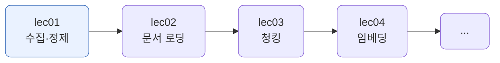
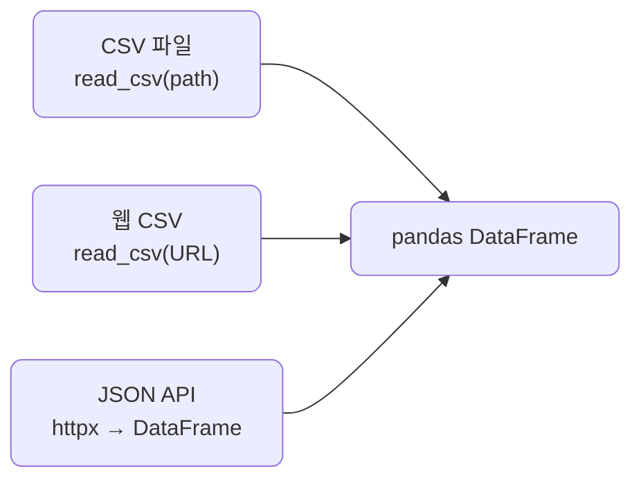
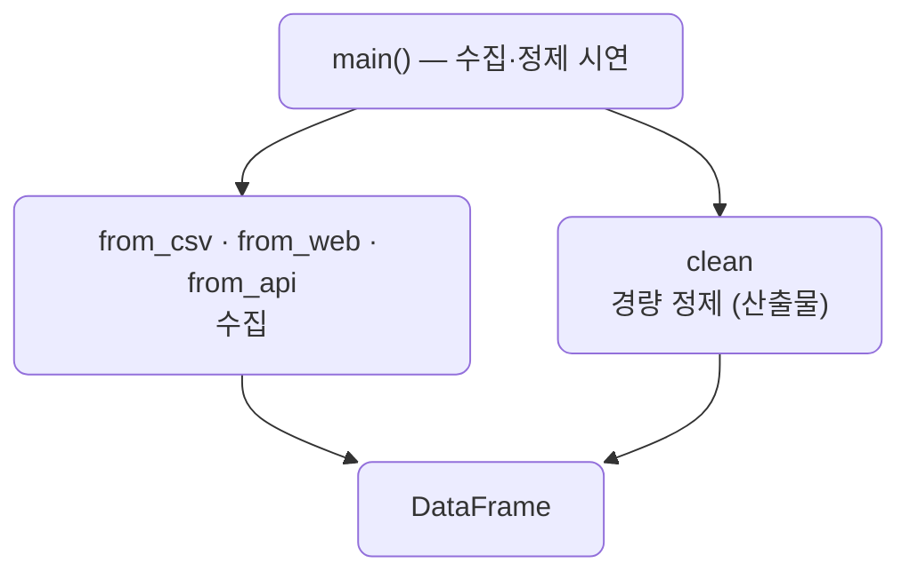

# lec01 — 데이터 수집·정제

> - S2 개요: [docs/section2/README.md](../README.md)
> - 분량 16분
> - 산출물: 정제 스크립트

## 1. 목표

RAG는 검색이 핵심이고, 검색 품질은 데이터 품질에서 시작합니다. 흩어진 원본을 한 DataFrame으로 모으고, 공백·중복·표기 흔들림·결측을 pandas로 가볍게 정제해 다음 단계가 믿고 쓸 데이터를 만듭니다.

- CSV·웹·API 세 갈래로 데이터를 모읍니다.
- pandas로 경량 정제를 한 번에 처리하는 함수를 만듭니다.
- PDF·HTML 문서에서 텍스트를 뽑는 일은 lec02로 미루고, 여기서는 표 형태 데이터에 집중합니다.



## 2. 왜 수집·정제부터인가

검색·임베딩은 들어온 데이터를 그대로 받아 씁니다. 같은 제품이 `전자`·`전자제품`·`가전`으로 흩어져 있거나, 앞뒤 공백·중복·빈 값이 섞여 있으면 검색이 엉키고 결과를 신뢰하기 어렵습니다. 그래서 RAG 파이프라인의 첫 단추는 정제입니다. 들어가는 데이터가 깨끗해야 뒤가 깨끗합니다.

## 3. 어디서 모으나 — CSV · 웹 · API

데이터는 어디서 오든 결국 하나의 DataFrame으로 모읍니다. 형식과 접근 방법만 다릅니다.

```python
import pandas as pd
import httpx

def from_csv(path):
    return pd.read_csv(path)                        # 로컬 CSV 파일

def from_web(url):
    return pd.read_csv(url)                          # 웹에 올라온 CSV를 URL로 바로

def from_api(url):
    return pd.DataFrame(httpx.get(url).json())       # JSON API → DataFrame
```



여기서 "웹"은 HTTP로 받은 표나 CSV를 뜻합니다. PDF·HTML 문서를 열어 텍스트를 추출하는 일은 lec02의 몫입니다.

## 4. pandas 경량 정제

수집한 데이터의 흔한 문제를 하나씩 처리합니다. `clean`이 이 단위의 산출물입니다.

| 원본의 문제 | 정제 처리 |
| --- | --- |
| 앞뒤 공백 (`" 텀블러"`) | `str.strip` |
| 완전히 같은 행 중복 | `drop_duplicates` |
| 같은 범주의 다른 표기 (`전자제품`·`가전`) | 표준값으로 매핑 |
| 숫자 칼럼에 문자·빈칸 | `to_numeric(errors="coerce")` |
| 필수 값(`name`·`price`) 결측 | 행 제거 |
| 비필수 값(`city`) 결측 | 그대로 둠 |

```python
def clean(df):
    df = df.copy()
    df.columns = df.columns.str.strip()
    for col in ["name", "category", "city"]:
        df[col] = df[col].str.strip()
    df = df.drop_duplicates()
    df["category"] = df["category"].replace(CATEGORY_MAP)
    df["price"] = pd.to_numeric(df["price"], errors="coerce")
    keep = df["name"].notna() & (df["name"] != "") & df["price"].notna()
    df = df[keep].reset_index(drop=True)
    df["price"] = df["price"].astype(int)
    return df
```


정제는 모든 결측을 버리는 일이 아닙니다. `name`·`price`처럼 없으면 안 되는 값만 행을 버리고, `city` 같은 부수 정보의 결측은 그대로 둡니다. 무엇이 필수인지는 데이터를 쓰는 쪽이 정합니다.

## 5. 예제 코드가 하는 일 및 결과

[collect.py](../../../src/section2/lec01/collect.py)는 세 소스에서 데이터를 모은 뒤, 일부러 지저분하게 둔 [raw_orders.csv](../../../src/section2/lec01/data/raw_orders.csv)를 정제해 결과를 보여줍니다.



```bash
uv run python src/section2/lec01/collect.py
```

```text
=== 1. 수집 — CSV · 웹 · API ===
CSV : raw_orders.csv → 12행 5열
웹  : 244행 7열  ['total_bill', 'tip', 'sex', 'smoker']
API : 100행 4열  ['userId', 'id', 'title', 'body']

=== 2. pandas 경량 정제 ===
원본 12행 → 정제 8행 (중복·결측 4행 제거)

[정제 후]
 id name category   price city
  1  텀블러       주방   12000   서울
  2  노트북       전자 1350000   부산
  3  머그컵       주방    8000   서울
  5  마우스       전자   25000  NaN
  6  텀블러       주방   12000   서울
  7  모니터       전자  450000   광주
 10 프라이팬       주방   33000   인천
 11   도마       주방   15000   서울
```

읽어낼 점입니다.

- 세 소스가 형식은 달라도 모두 같은 DataFrame이 됩니다. CSV는 로컬, 웹은 URL의 CSV, API는 JSON입니다. 수집 코드는 한 줄씩이고, 그 뒤 정제는 출처와 무관하게 똑같이 돕니다.
- 12행이 8행이 됐습니다. 완전히 같은 행(`텀블러` id6이 두 번)이 하나로 합쳐지고, 필수 값이 빈 세 행(가격이 빈 키보드·충전기, 이름이 빈 행)이 빠졌습니다.
- 범주가 `전자제품`·`가전`·`주방용품`에서 `전자`·`주방`으로 모였고, 앞뒤 공백이 사라졌으며, 가격이 정수가 됐습니다.
- `city`가 빈 `마우스` 행은 `NaN`으로 남아 있습니다. 필수가 아닌 결측은 버리지 않는다는 선택입니다.

## 6. 정리

- RAG의 첫 단추는 정제입니다. 들어가는 데이터가 깨끗해야 검색·임베딩이 흔들리지 않습니다.
- 데이터는 CSV·웹·API 어디서 오든 하나의 DataFrame으로 모아 같은 방식으로 다룹니다.
- 경량 정제는 공백 제거·중복 제거·범주 표준화·숫자 변환·필수 결측 제거의 묶음입니다.
- 무엇을 필수로 보고 무엇을 남길지는 데이터를 쓰는 쪽이 정합니다. 모든 결측을 버리지 않습니다.
