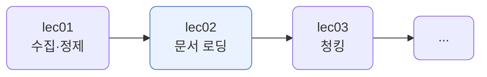
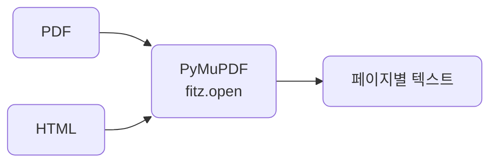
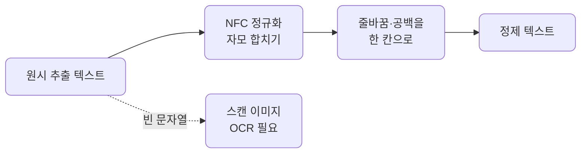
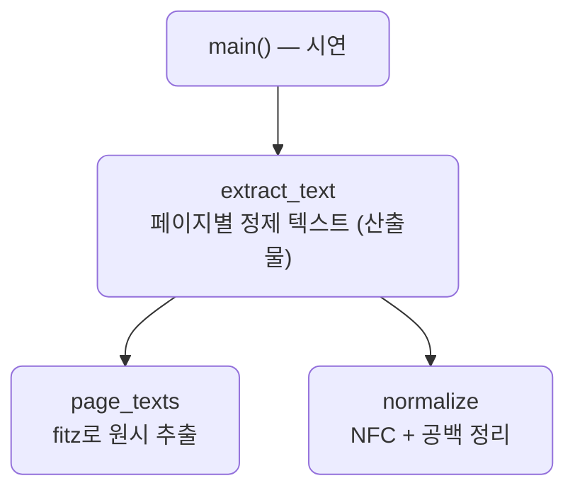

# lec02 — 문서 로딩

> - S2 개요: [docs/section2/README.md](../README.md)
> - 분량 15분
> - 산출물: 텍스트 추출기

## 1. 목표

RAG에 넣을 지식은 대개 PDF·HTML 같은 문서 안에 있습니다. 검색·청킹 전에 먼저 이 문서들에서 텍스트를 꺼내야 합니다. 추천 도구 하나로 PDF와 HTML을 같은 코드로 열고, 한국어 PDF에서 자주 만나는 함정을 흡수하는 추출기를 만듭니다.



## 2. 추천 도구 — PyMuPDF 하나로

문서 형식마다 라이브러리를 갈아끼우면 코드가 늘어집니다. 이 과정은 **PyMuPDF**(`import fitz`) 하나로 통일합니다. 빠르고, 텍스트 품질이 좋고, PDF뿐 아니라 HTML·EPUB도 같은 방식으로 엽니다.

| 도구 | 강점 | 이 과정에서 |
| --- | --- | --- |
| PyMuPDF (fitz) | 빠름, 텍스트 품질·다포맷 | 추천 |
| pdfplumber | 표·좌표 추출에 강함 | 표가 핵심일 때 |
| unstructured | 포맷 자동 분해 | 무거움, 대규모일 때 |

표가 핵심인 문서라면 pdfplumber를, 형식이 제각각인 대량 문서라면 unstructured를 고려합니다. 그 밖에는 fitz 하나로 충분합니다.

## 3. 같은 코드로 PDF·HTML 열기

`fitz.open`은 확장자를 보고 알아서 엽니다. 그래서 PDF든 HTML이든 페이지별 텍스트를 꺼내는 코드가 같습니다.

```python
import fitz

def page_texts(path):
    with fitz.open(path) as doc:
        return [page.get_text() for page in doc]
```



HTML에서 `<script>`·`<style>` 같은 비표시 요소는 본문에 섞이지 않습니다. fitz가 보이는 텍스트만 내주기 때문입니다. 다만 광고·내비게이션 같은 잡음이 많은 웹페이지라면, 본문만 추려내는 도구(예: trafilatura)를 따로 쓰는 편이 낫습니다.

## 4. 한국어 PDF 함정

PDF에서 꺼낸 텍스트는 그대로 쓰기 어렵습니다. 한국어에서 특히 자주 걸리는 함정과 처리는 다음과 같습니다.

| 함정 | 증상 | 처리 |
| --- | --- | --- |
| 줄바꿈 | 문장 중간에 개행이 들어감 | 공백으로 이어 붙임 |
| 자모 분리 (NFD) | 한글이 자모로 쪼개짐 | NFC 정규화 |
| 스캔·이미지 PDF | 추출 텍스트가 빈 문자열 | 빈 페이지로 표시해 OCR로 |
| 다단 레이아웃 | 단 순서가 뒤섞임 | 블록 좌표로 정렬 `get_text("blocks")` |
| 머리말·꼬리말 | 페이지마다 반복 잡음 | 반복되는 줄 제거 |

앞의 둘은 한 함수로 흡수합니다. 추출 텍스트를 `NFC`로 합치고, 줄바꿈·연속 공백을 한 칸으로 잇습니다.

```python
import re, unicodedata

def normalize(text):
    text = unicodedata.normalize("NFC", text)   # 자모로 쪼개진 한글을 합침
    return re.sub(r"\s+", " ", text).strip()    # 줄바꿈·연속 공백을 한 칸으로
```

자모 분리는 눈에 잘 안 띄지만 검색을 망칩니다. `환불`이 겉보기엔 같아도 자모로 쪼개져 저장되면, 합쳐진 글자와 다른 것으로 취급됩니다. `NFC`가 이를 한 글자로 합쳐, lec01의 텍스트 정제와 같은 결을 PDF에도 적용합니다.



## 5. 예제 코드가 하는 일 및 결과

[load.py](../../../src/section2/lec02/load.py)는 실제 문서를 읽습니다. 샘플은 한국어 위키백과 "검색 증강 생성" 글로, [rag.pdf](../../../src/section2/lec02/data/rag.pdf)는 위키백과 PDF 내보내기 10쪽, [rag.html](../../../src/section2/lec02/data/rag.html)은 같은 글의 전체 웹페이지, [scanned.pdf](../../../src/section2/lec02/data/scanned.pdf)는 PDF 1쪽을 이미지로 구운 스캔본 흉내입니다. 셋 다 같은 `extract_text`로 엽니다. 문서는 CC BY-SA이며, 스캔본은 `data/make_scanned.py`로 만듭니다.



```bash
uv run python src/section2/lec02/load.py
```

```text
=== 1. PDF 원시 추출 vs 정제 ===
1쪽 원시: '검색증강생성\n검색 증강 생성(Retrieval-augmented generation, ' ...
  개행 33개 — 줄을 접은 자리마다 끊깁니다
1쪽 정제: 검색증강생성 검색 증강 생성(Retrieval-augmented generation, RAG)은 대형 언어  ...

=== 2. 스캔본은 텍스트가 없습니다 ===
  rag.pdf    : 10쪽, 빈 페이지 0쪽
  scanned.pdf: 1쪽, 빈 페이지 1쪽  ← 스캔 이미지, OCR 필요

=== 3. HTML은 보일러플레이트까지 ===
  본문으로 이동 주 메뉴 주 메뉴 사이드바로 이동 숨기기 둘러보기 • 대문 • 최근 바뀜 • 요즘 화제 • 임의 문서로 사용자 모임 •
```

읽어낼 점입니다.

- 실제 위키백과 PDF도 원시 추출엔 문장 중간 개행이 33개 들어갑니다. 줄을 접은 자리입니다. `normalize`가 이를 공백으로 이어, 검색·청킹에 쓸 연속 텍스트로 만듭니다.
- 텍스트 PDF는 10쪽 모두 텍스트가 있지만, 그 1쪽을 이미지로 구운 `scanned.pdf`는 0자입니다. 스캔본은 추출로 안 나오니 빈 페이지로 잡아 OCR로 넘깁니다.
- HTML은 같은 코드로 열리지만, 본문 앞에 `본문으로 이동 · 주 메뉴 · 둘러보기` 같은 내비게이션이 잔뜩 딸려 옵니다. 웹페이지에서 본문만 원하면 이 보일러플레이트를 따로 걷어내야 합니다. trafilatura 같은 도구를 씁니다.

## 6. 정리

- 문서 로딩은 PyMuPDF 하나로 통일합니다. PDF·HTML을 같은 코드로 열고 페이지별 텍스트를 꺼냅니다.
- 한국어 PDF의 줄바꿈과 자모 분리는 `NFC` 정규화와 공백 정리로 한 번에 흡수합니다.
- 스캔·이미지 PDF는 텍스트가 없어 빈 페이지로 잡아내고, OCR로 넘깁니다.
- 여기서 만든 깨끗한 텍스트가 lec03 청킹의 입력이 됩니다.
