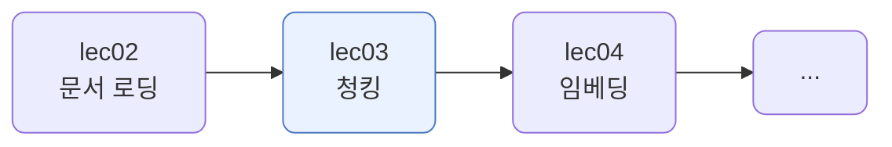
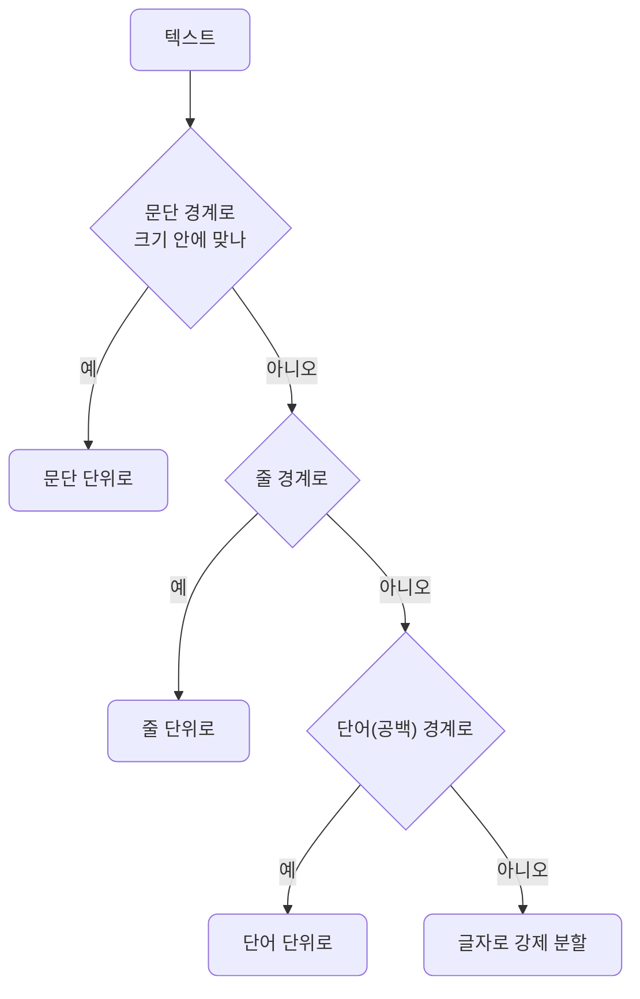
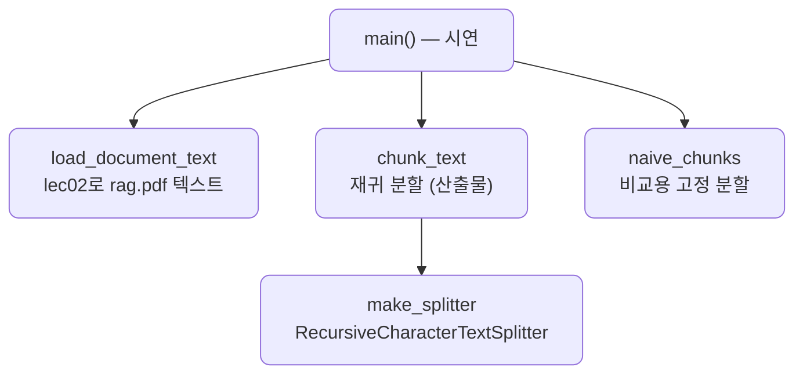

# lec03 — 청킹

> - S2 개요: [docs/section2/README.md](../README.md)
> - 분량 7분
> - 산출물: 청킹 유틸

## 1. 목표

lec02에서 뽑은 깨끗한 텍스트를 검색·임베딩에 알맞은 크기로 나눕니다. 핵심은 의미 단위를 지키며 자르고, 경계에서 맥락이 끊기지 않게 겹치는 것입니다.



## 2. 왜 청킹하나

문서를 통째로 다룰 수 없는 이유가 둘입니다.

- 임베딩 모델은 한 번에 담는 길이가 정해져 있습니다. 긴 문서는 잘라 넣어야 합니다.
- 검색의 단위가 곧 청크입니다. 너무 크면 한 청크에 여러 주제가 섞여 검색이 뭉툭해지고 관련 없는 내용까지 LLM에 딸려 갑니다. 너무 작으면 맥락이 끊겨 한 조각만으로는 뜻이 안 통합니다.

그래서 적당한 크기로, 의미가 끊기지 않게 자르는 것이 청킹입니다.

## 3. 단순 분할 vs 재귀 분할

가장 단순한 방법은 정해진 글자 수마다 끊는 것입니다. 하지만 그러면 단어·문장 중간이 잘립니다.

`RecursiveCharacterTextSplitter`는 큰 경계부터 시도합니다. 문단으로 잘라 크기 안에 들어가면 문단 단위로, 안 되면 줄, 그다음 단어, 마지막엔 글자로 내려갑니다. 가능한 한 큰 의미 단위를 통째로 살립니다.

```python
from langchain_text_splitters import RecursiveCharacterTextSplitter

SEPARATORS = ["\n\n", "\n", " ", ""]   # 문단 → 줄 → 단어 → 글자

def chunk_text(text, chunk_size=500, chunk_overlap=80):
    splitter = RecursiveCharacterTextSplitter(
        chunk_size=chunk_size, chunk_overlap=chunk_overlap, separators=SEPARATORS
    )
    return splitter.split_text(text)
```



우리 입력은 lec02에서 공백으로 합쳐진 한 덩어리라, 문단·줄 경계가 없어 단어 경계로 나뉩니다. 원문에 문단 구분이 남아 있으면 문단부터 자르므로, 청킹을 염두에 두면 로딩에서 문단 구조를 지나치게 뭉개지 않는 편이 낫습니다.

## 4. overlap — 경계에서 맥락 잇기

청크 경계는 맥락을 끊습니다. 질문의 답이 두 청크에 걸쳐 있으면 검색이 한쪽만 집어 놓칠 수 있습니다. overlap은 앞 청크의 끝 일부를 다음 청크 앞에 겹쳐 넣어, 경계에 걸친 내용도 한 청크 안에 온전히 들어가게 합니다.


대가는 중복입니다. 겹친 만큼 청크 수와 총 글자가 늘어 저장·검색 비용이 커집니다. 보통 청크 크기의 10~20%를 겹칩니다.

## 5. 크기·overlap 고르기

| 청크 크기 | 장점 | 단점 |
| --- | --- | --- |
| 작게 (예: 200) | 검색이 정밀함 | 맥락 부족, 청크 수 많음 |
| 크게 (예: 1000) | 맥락 풍부 | 검색이 뭉툭, 관련 없는 내용 섞임 |

보통 200~1000자에 overlap 10~20%로 시작합니다. 한국어는 글자 기준이라 같은 글자 수라도 영어보다 정보가 빽빽합니다. 무엇이 좋은지는 정답이 없고, 청크 크기·overlap 조합은 검색 품질을 좌우하므로 lec07의 검색 평가로 비교합니다.

## 6. 예제 코드가 하는 일 및 결과

[chunker.py](../../../src/section2/lec03/chunker.py)는 lec02의 추출기로 rag.pdf 텍스트를 가져와, 단순 분할과 재귀 분할을 비교하고 overlap·크기별 청크를 보여줍니다.



```bash
uv run python src/section2/lec03/chunker.py
```

```text
입력: rag.pdf 정제 텍스트 16407자

=== 1. 단순 고정 분할 vs 재귀 분할 ===
문장: 검색 증강 생성은 검색과 생성을 결합한 기술입니다.
  단순(8자): ['검색 증강 생성', '은 검색과 생성', '을 결합한 기술', '입니다.']
  재귀(8자): ['검색 증강', '생성은 검색과', '생성을 결합한', '기술입니다.']
  단순은 단어 중간을 끊지만, 재귀는 공백 경계를 지킵니다

=== 2. overlap — 경계에서 맥락 잇기 ===
overlap 0 : 57청크, 총 16351자
overlap 60: 70청크, 총 20090자  (겹친 만큼 늘어남)
  1·2번이 겹치는 부분(57자): '사용할 수 있 다.[2][3] 예를 들어, 이는 LLM 기반 챗봇이 내부 회사 데이터에 접근하거나 권위'

=== 3. 청크 크기별 ===
  size= 200: 137청크, 평균 191자
  size= 500:  39청크, 평균 491자
  size=1000:  18청크, 평균 980자
```

읽어낼 점입니다.

- 단순 분할은 `생성`을 `생성`·`은`으로 가르지만, 재귀 분할은 `생성은`을 한 청크에 둡니다. 공백 경계를 지키기 때문입니다.
- overlap을 60자 주면 청크가 57개에서 70개로, 총 글자가 16351에서 20090으로 늘어납니다. 늘어난 만큼이 겹친 부분이고, 1·2번 청크가 실제로 57자를 공유합니다.
- 청크 크기를 키울수록 청크 수가 줄고 한 청크가 길어집니다. 크기는 검색 정밀도와 맥락 사이의 선택입니다.

## 7. 정리

- 청킹은 검색·임베딩에 알맞은 크기로 자르는 일입니다. 너무 크면 검색이 뭉툭하고 너무 작으면 맥락이 끊깁니다.
- `RecursiveCharacterTextSplitter`는 문단 → 줄 → 단어 순으로 큰 경계부터 시도해 의미 단위를 지킵니다.
- overlap은 경계에 걸친 맥락을 살리는 대신 중복 비용을 더합니다. 보통 10~20%입니다.
- 크기·overlap에 정답은 없습니다. 조합에 따라 검색 품질이 달라지므로 lec07에서 평가로 고릅니다.
