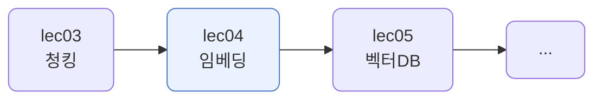
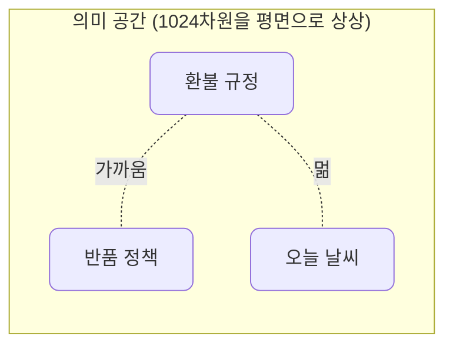
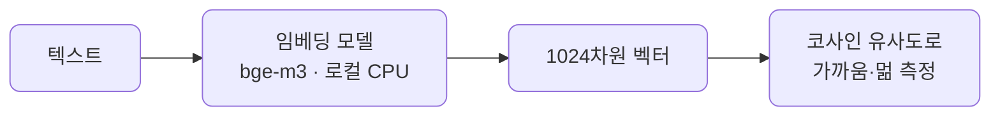
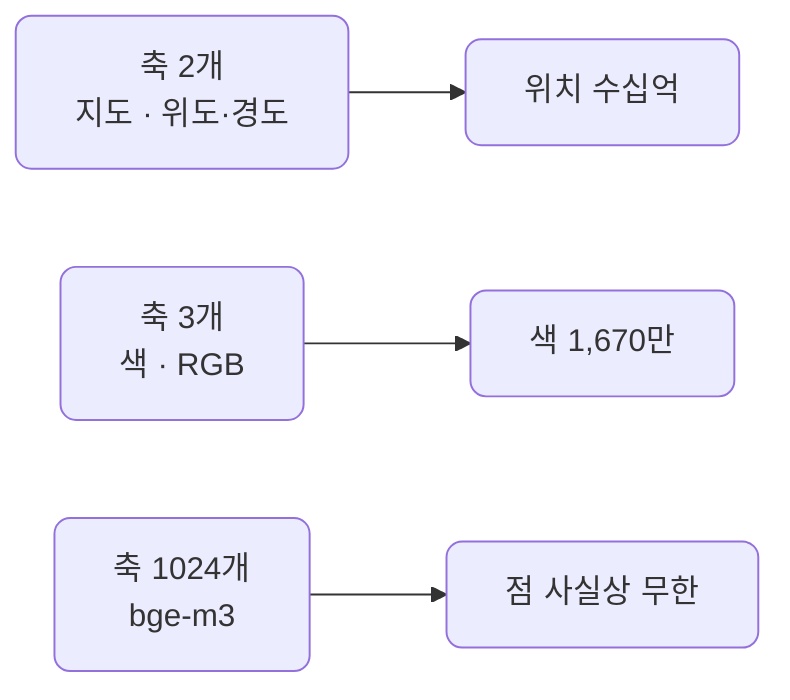
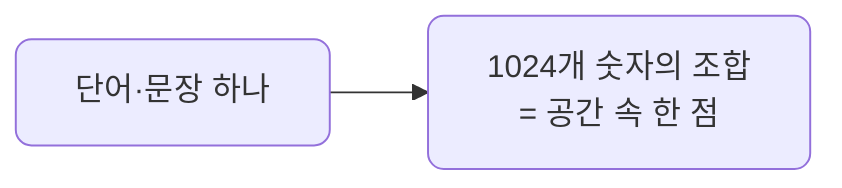
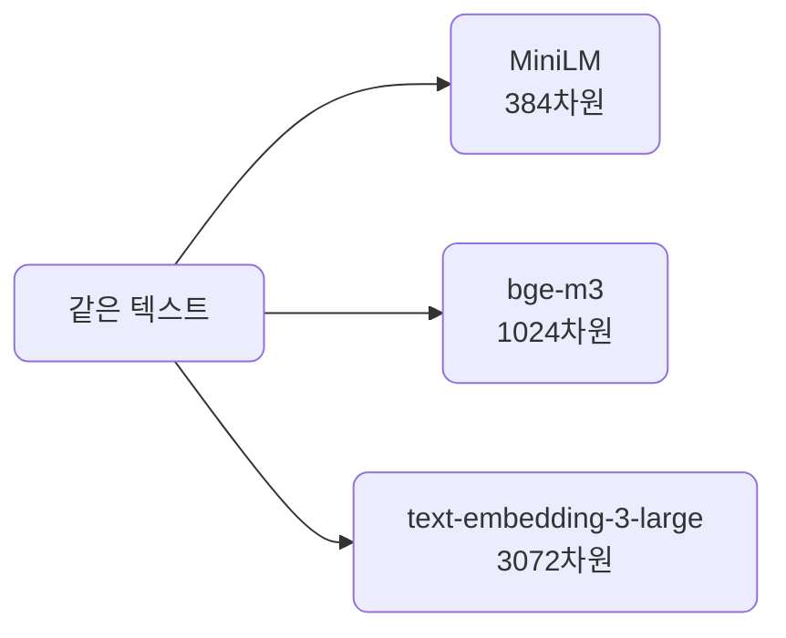
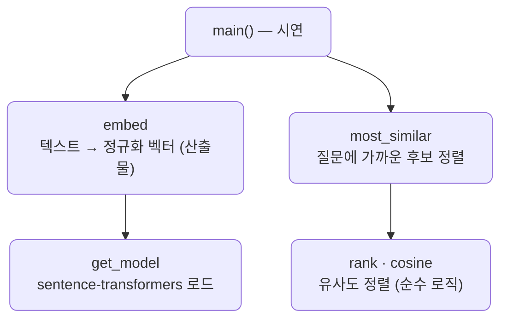

# lec04 — 임베딩

> - S2 개요: [docs/section2/README.md](../README.md)
> - 분량 9분
> - 산출물: 임베딩 함수

## 1. 목표

lec03의 청크를 의미를 담은 벡터로 바꿉니다. 비슷한 뜻의 문장은 벡터가 가깝고, 무관하면 멉니다. 이 가까움이 RAG 검색의 바탕입니다.



## 2. 임베딩이란 — 텍스트를 의미 좌표로

임베딩은 텍스트를 숫자 벡터로 바꾸는 것입니다. 벡터는 숫자를 여러 개 늘어놓은 것이고, 그 숫자들을 좌표로 보면 공간 속의 한 점입니다. `bge-m3`는 단어든 문장이든 길이에 상관없이 똑같이 1024개의 숫자, 즉 1024차원 공간의 한 점으로 찍습니다.

핵심은 이 점들이 아무렇게나 흩어지지 않는다는 것입니다. 모델은 대량의 글로 학습되며, 뜻이 비슷한 텍스트일수록 가까운 점에 찍도록 배웠습니다. 그래서 의미의 비슷함이 점 사이의 거리로 바뀝니다.



1024개의 숫자를 하나하나 해석할 필요는 없습니다. "5번째 숫자는 격식" 같은 식이 아닙니다. 개별 숫자가 아니라 전체가 가리키는 방향이 의미를 담고, 우리가 보는 것은 두 점이 얼마나 가까운가입니다. 지도에서 위도·경도 숫자 자체보다 두 도시가 붙어 있는지가 중요한 것과 같습니다.

가장 쓸모 있는 성질은 이것이 단어 일치가 아니라 의미 일치라는 점입니다. `환불`과 `반품`은 글자가 겹치지 않지만 벡터는 가깝습니다. 키워드 검색은 `환불`로 `반품` 문서를 놓치지만, 임베딩은 뜻으로 찾습니다. 이것을 의미 검색이라 합니다.

생성 LLM과 다른 점도 둘입니다. 하는 일이 다르고(텍스트 생성이 아니라 벡터 출력), 경로도 다릅니다. 임베딩은 LiteLLM을 거치지 않고 sentence-transformers로 HF 모델을 로컬 CPU에서 직접 돌립니다. S2 개요에서 예고한 그 예외입니다. 키가 필요 없고 데이터가 밖으로 나가지 않습니다.



### 2.1. 차원은 축의 수이지 담는 개수가 아닙니다

1024차원이라고 1024개만 표현하는 게 아닙니다. 1024는 좌표(축)의 수이고, 연속 공간은 적은 축으로도 점을 무수히 많이 담습니다.



축이 늘면 담을 수 있는 점은 곱으로 폭발합니다. 1024차원이면 세상 모든 단어·문장에 서로 다른 점을 주고도 남습니다. 단어 수가 1024보다 훨씬 많아도 문제가 없는 이유입니다.

차원은 단어가 아닙니다. "1번 축은 환불"이 아니라, 한 단어는 1024개 숫자 전체로 이뤄진 한 점입니다.



차원 수는 고정이 아닙니다. 어떤 임베딩 모델(알고리즘)을 쓰느냐에 따라 달라집니다.



차원이 클수록 미묘한 의미 차이를 더 잘 담지만 저장·계산은 무거워집니다. 모델마다 그 균형이 다릅니다.

## 3. bge-m3로 임베딩하기

모델은 `bge-m3`입니다. 다국어를 다루고 CPU에서 돌며, 최초 실행 시 자동으로 받습니다. `embed`가 이 단위의 산출물입니다.

```python
import os
from sentence_transformers import SentenceTransformer

_model = SentenceTransformer(os.environ.get("EMBEDDING_MODEL", "BAAI/bge-m3"))

def embed(texts):
    # 벡터를 정규화해 둔다. 그러면 코사인 유사도가 내적으로 끝난다.
    return _model.encode(texts, normalize_embeddings=True)
```

모델은 한 번만 로드해 재사용합니다. 다운로드는 수백 MB라 처음 한 번만 시간이 걸리고, 그 뒤 인코딩은 빠릅니다.

## 4. 유사도 — 검색의 바탕

두 벡터가 얼마나 같은 방향인지를 코사인 유사도로 잽니다. 정규화한 벡터에서는 내적이 곧 코사인입니다. 값이 1에 가까우면 비슷하고, 작으면 무관합니다.

```python
def cosine(a, b):
    return float(a @ b)   # 정규화 벡터의 내적 = 코사인 유사도
```

질문을 임베딩해 여러 청크와의 유사도를 재면, 가장 가까운 청크가 곧 검색 결과입니다. lec05에서는 이 일을 벡터DB가 수많은 청크에 대해 빠르게 해줍니다.

한 가지 주의가 있습니다. 유사도의 절대값은 모델마다 다릅니다. `bge-m3`는 무관한 한국어 문장도 0.4 안팎으로 나옵니다. 그래서 "0.7이면 관련 있다" 같은 고정 기준보다, 후보들 사이의 상대적 순서를 봅니다.

## 5. 예제 코드가 하는 일 및 결과

[embedder.py](../../../src/section2/lec04/embedder.py)는 텍스트를 벡터로 바꾸고, 문장 쌍의 유사도를 재고, 질문에 가까운 청크를 골라 봅니다.



```bash
uv run python src/section2/lec04/embedder.py
```

```text
=== 1. 텍스트 → 벡터 ===
문장 하나 → 1024차원 벡터
  앞 5개 값: [-0.007, -0.015, -0.041, 0.043, -0.044]

=== 2. 유사도 직관 — 비슷하면 가깝다 ===
  [비슷] 0.829  · 환불은 7일 이내 가능합니다. ↔ 반품 기한은 일주일입니다.
  [무관] 0.417  · 환불은 7일 이내 가능합니다. ↔ 오늘 서울 날씨는 맑습니다.

=== 3. 검색 맛보기 — 질문에 가까운 청크 고르기 ===
질문: 환불 기간이 어떻게 되나요?
  0.740  고객은 상품 수령일로부터 7일 이내에 환불을 요청할 수 있습니다.
  0.543  단순 변심의 경우 왕복 배송비는 고객이 부담합니다.
  0.480  신제품은 다음 분기에 출시될 예정입니다.
  0.454  회사는 매주 월요일에 전체 회의를 엽니다.
```

읽어낼 점입니다.

- 문장 하나가 1024개의 숫자로 바뀝니다. 이 숫자 배열이 그 문장의 의미 좌표입니다.
- 뜻이 비슷한 두 문장은 0.829, 무관한 두 문장은 0.417입니다. 같은 환불 주제끼리가 더 가깝습니다.
- 질문 `환불 기간`에 가장 가까운 것은 환불 청크(0.740)입니다. 배송비·회의·신제품 청크는 뒤로 밀립니다. 이것이 검색의 원리이고, lec05에서 벡터DB로 규모를 키웁니다.

## 6. 정리

- 임베딩은 텍스트를 의미 벡터로 바꿉니다. 비슷한 뜻은 벡터가 가깝습니다.
- 생성 LLM과 달리 임베딩은 LiteLLM을 거치지 않고 sentence-transformers로 로컬 실행합니다. 키가 필요 없습니다.
- 코사인 유사도로 질문에 가까운 청크를 고르는 것이 검색의 가장 단순한 형태입니다.
- 유사도 절대값보다 후보 사이의 상대 순서를 봅니다. 다음 단위에서 이 검색을 벡터DB로 옮깁니다.
