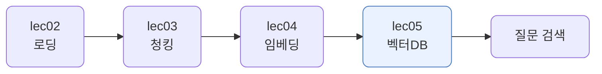
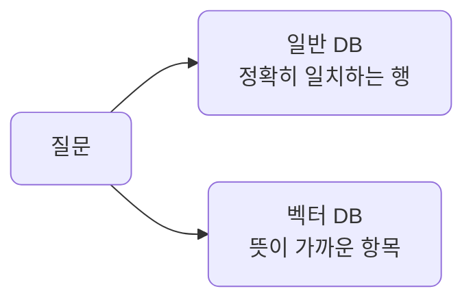
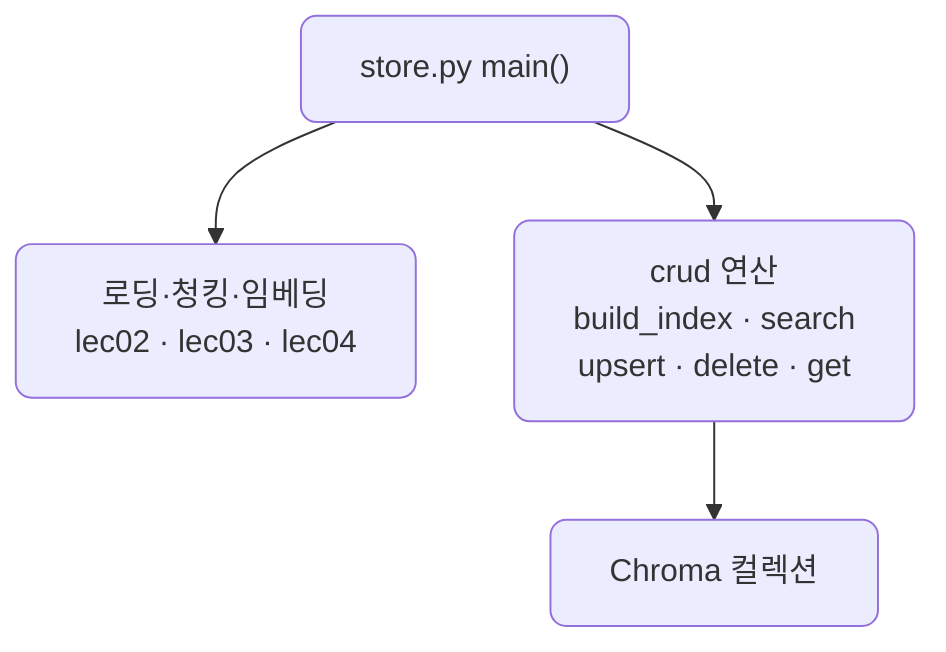
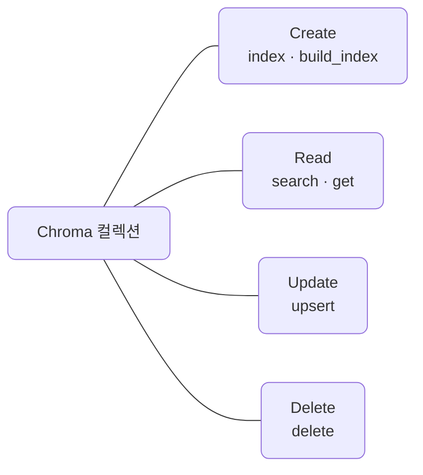
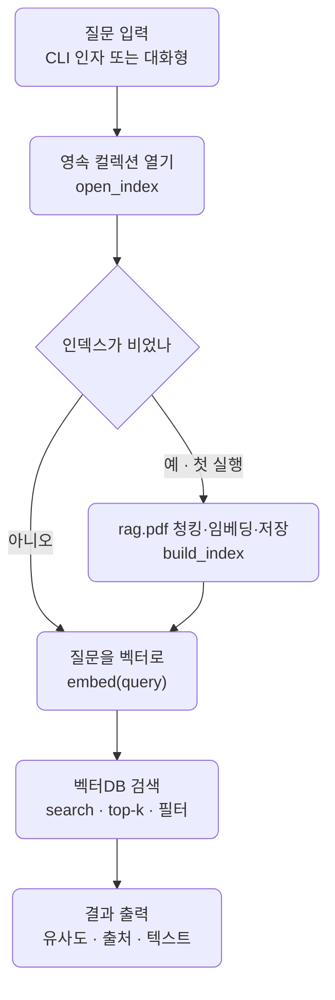

# lec05 — 벡터DB Chroma

> - S2 개요: [docs/section2/README.md](../README.md)
> - 분량 9분
> - 산출물: Chroma 컬렉션

## 1. 목표

lec02~04가 여기서 한 파이프라인으로 모입니다. rag.pdf를 로딩·청킹하고, 청크를 임베딩해 Chroma에 넣고, 질문으로 검색합니다.



## 2. 왜 벡터DB인가

벡터DB가 해주는 일은 둘입니다.

- 미리 계산한 임베딩을 저장합니다. 질문마다 문서를 다시 임베딩하지 않습니다. 무거운 인덱싱은 한 번만 합니다.
- 수많은 벡터 중 가까운 것을 빠르게 찾습니다. 전부와 일일이 비교하지 않고 근사 최근접 이웃(ANN) 인덱스로 순식간에 고릅니다.

질문이 올 때 임베딩하는 것은 질문 하나뿐이고, 무거운 일은 인덱싱 때 끝나 있습니다.

## 3. 일반 DB와의 차이

일반 DB는 조건에 정확히 맞는 행을 찾습니다. 벡터DB는 뜻이 가까운 항목을 찾습니다. 이것이 가장 큰 차이입니다.

| | 일반 DB (관계형 등) | 벡터 DB |
| --- | --- | --- |
| 저장 | 행·열, 키-값 | 벡터 + 문서 + 메타데이터 |
| 질의 | 정확히 일치·범위 (`WHERE x = 5`) | 가장 가까운 벡터 (의미 유사) |
| 찾는 것 | 조건에 맞는 행 | 뜻이 비슷한 항목 |
| 핵심 연산 | 인덱스로 정확 조회 | ANN으로 최근접 이웃 |



일반 DB에서 `환불`을 찾으면 그 단어가 든 행만 나옵니다. 벡터DB는 `반품`처럼 단어가 달라도 뜻이 가까우면 찾습니다. lec04의 의미 검색이 이것입니다. 그러면서도 벡터DB는 메타데이터 필터(일반 DB의 `WHERE`와 비슷)를 함께 지원해, "이 문서 안에서 의미가 가까운 것"처럼 둘을 섞어 씁니다.

## 4. add와 query

Chroma 컬렉션에 청크·임베딩·메타데이터를 add로 넣고, 질문 벡터로 가까운 것을 query로 찾습니다. 거리 기준은 코사인으로 두어 lec04의 유사도와 결을 맞춥니다.

```python
import chromadb
from section2.lec04.embedder import embed

col = chromadb.PersistentClient(path=".chroma").get_or_create_collection(
    "rag_docs", metadata={"hnsw:space": "cosine"}
)

# add — 청크를 임베딩해 저장 (lec04 embed로, LiteLLM 미경유)
col.add(ids=ids, documents=chunks, embeddings=embed(chunks), metadatas=metas)

# query — 질문 벡터에 가까운 k개
res = col.query(query_embeddings=[embed(question)], n_results=3)
```

임베딩은 컬렉션에 직접 만들어 넘깁니다. 그래야 우리 원칙대로 `bge-m3`를 로컬에서 직접 돌리는 임베딩을 그대로 씁니다.

## 5. CRUD — 저장만이 아니다

벡터DB도 일반 DB처럼 만들고·읽고·고치고·지웁니다. 한 번 쓰고 마는 저장소가 아니라, 원본 문서와 계속 맞춰야 하는 살아 있는 저장소이기 때문입니다.

| | 벡터DB 연산 | 언제 |
| --- | --- | --- |
| Create | `add` · `upsert` | 문서를 청킹·임베딩해 넣을 때 |
| Read | `query`(유사도) · `get`(id·조건) | 검색하거나 특정 청크를 꺼낼 때 |
| Update | `update` · `upsert` | 문서가 바뀌어 그 청크를 다시 임베딩할 때 |
| Delete | `delete` | 문서가 폐기되어 그 청크를 없앨 때 |

`update`·`delete`는 의미가 분명합니다. 위키 글이 수정되면 바뀐 청크만 다시 임베딩해 갱신하고, 문서가 빠지면 그 청크를 지워 검색에 안 나오게 합니다. 핵심은 청크 id를 문서·청크 번호로 키잉해 두는 것입니다. 그러면 그 문서의 청크만 골라 고치거나 지울 수 있고, 문서 전체를 다시 인덱싱할 필요가 없습니다.

이것이 lec01에서 말한 RAG의 갱신 이점입니다. 통째로 넣기는 한 글자만 바뀌어도 전체를 다시 보내야 하지만, 벡터DB는 바뀐 청크만 손봅니다.

## 6. 메타데이터 필터와 영속성

- 메타데이터 필터: `where`로 검색 범위를 좁힙니다. `where={"source": "rag.pdf"}`면 그 문서 안에서만 찾습니다. 부서·문서별로 검색을 가르는 데 씁니다.
- 영속성: `PersistentClient(path=...)`로 만들면 컬렉션이 디스크에 남아, 프로그램을 다시 켜도 인덱싱한 내용이 그대로입니다. 매번 다시 임베딩할 필요가 없습니다.

## 7. 예제 코드가 하는 일 및 결과

코드는 세 파일로 나뉩니다. `crud.py`가 벡터DB 연산(산출물)이고, `store.py`가 그 연산으로 rag.pdf를 인덱싱·시연하며, `query.py`가 터미널 조회 도구입니다.

### 7.1. store.py — rag.pdf 인덱싱·시연

[store.py](../../../src/section2/lec05/store.py)는 rag.pdf 청크와 공지 몇 건을 인덱싱하고, 검색·필터·CRUD·영속을 차례로 보여줍니다.



```bash
uv run python src/section2/lec05/store.py
```

```text
입력: rag.pdf 39 청크 + 공지 2건
컬렉션에 41개 저장

=== 검색 — 검색 증강 생성은 어떻게 동작하나요? ===
  0.731 [rag.pdf] 검색증강생성 검색 증강 생성(Retrieval-augmented ...
  0.666 [rag.pdf] 있다.[1][12] 모델은 검색된 관련 정보를 사용자의 원래 쿼리...
  0.636 [rag.pdf] 더 많은 정보 를 기반으로 하고 문맥적으로 근거 있는 응답을 생성...

=== 메타데이터 필터 — source=notice 안에서만 ===
  0.327 [notice] 사내 식당은 정오에 엽니다.
  0.288 [notice] 주차장은 지하 2층입니다.

=== CRUD — 문서가 바뀌면 갱신·삭제 ===
  갱신(upsert): 주차장은 지하 3층으로 바뀌었습니다.
  삭제(delete) 후 40개

=== 영속성 — 디스크에 저장하면 재시작해도 유지 ===
  새 클라이언트로 다시 열어도 1개 유지
```

읽어낼 점입니다.

- rag.pdf가 39개 청크로 인덱싱됩니다. 로딩·청킹·임베딩·저장이 한 번에 이어집니다.
- 질문에 가장 가까운 것은 RAG의 정의·동작을 설명하는 rag.pdf 청크이고 유사도가 0.731입니다. 단어가 정확히 같아서가 아니라 뜻이 가까워서 뽑힙니다.
- `source=notice` 필터를 걸면 관련 없는 공지 두 건만 나옵니다. 필터가 검색 범위를 그 출처로 제한합니다.
- 공지 하나를 `upsert`로 지하 3층으로 갱신하고 `delete`로 지우니, 41개가 40개로 줍니다. 바뀐 청크만 손보면 됩니다.
- 디스크에 저장하면 다시 열어도 개수가 유지됩니다. 한 번 인덱싱하면 끝입니다.

### 7.2. crud.py — CRUD 연산 (산출물)

[crud.py](../../../src/section2/lec05/crud.py)가 이 단위의 산출물입니다. Chroma 컬렉션에 대한 만들기·읽기·고치기·지우기를 함수로 모아 둡니다. 5절의 연산 표가 그대로 함수가 됩니다. store.py와 query.py가 이 연산들을 가져다 씁니다.



### 7.3. query.py — 터미널 Read CLI

검색은 한 번 인덱싱해 두고 여러 번 묻는 일이라, 별도의 터미널 도구로 두면 편합니다. [query.py](../../../src/section2/lec05/query.py)는 영속 컬렉션을 열어 질문으로 검색합니다. 비어 있으면 rag.pdf를 한 번 인덱싱하고, 그 뒤로는 디스크의 인덱스를 그대로 씁니다.

query.py가 하는 일은 질문을 받아 벡터로 바꾼 뒤 그 벡터로 검색하는 단계들입니다.



```bash
# 처음 한 번은 인덱싱하고 검색
uv run python src/section2/lec05/query.py "검색 증강 생성은 어떻게 동작하나요?"

# 그 뒤로는 인덱스를 재사용해 검색만
uv run python src/section2/lec05/query.py "RAG는 환각을 어떻게 줄이나요?" -k 2
```

```text
(인덱싱: rag.pdf 39 청크 → .../data/chroma_db)

질문: 검색 증강 생성은 어떻게 동작하나요?

[1] 0.731 · rag.pdf
검색증강생성 검색 증강 생성(Retrieval-augmented generation, RAG)은 대형 언어 모델 (LLM)이 새로운 정보를 검색하고 통합할 수 있도록 하는 기술이다.[1] RAG를 사용하면 LLM은 지정된 문서 집합을 참조할 때까지 사용자 쿼리에 응답하지 않는다. 이 문서들은 LLM의 기존 훈련 데이터의 정보를 보완한다.[2] ... (청크 원문이 끝까지 출력됩니다)

[2] 0.666 · rag.pdf
있다.[1][12] 모델은 검색된 관련 정보를 사용자의 원래 쿼리에 대한 프롬프트 엔지니어링을 통해 LLM에 공급한다. ...
```

검색 결과는 찾은 청크의 원문을 그대로 보여줍니다. 잘라 미리보기하지 않습니다. lec06 mini RAG에서는 이 청크를 LLM이 읽고 요약해 답하지만, 검색 도구인 query.py는 무엇을 찾았는지 원문으로 확인하는 것이 목적입니다.

영속 컬렉션이라 인덱싱은 처음 한 번뿐이고, 다음부터는 질문만 임베딩해 바로 검색합니다. 인덱스는 `.gitignore`된 `data/chroma_db`에 쌓입니다.

다만 임베딩 모델은 캐시돼 있어도 프로세스를 새로 띄울 때마다 디스크에서 메모리로 올리는 데 십수 초가 걸립니다. 질문을 인자로 주는 단발 실행은 매번 그 비용을 치릅니다. 인자 없이 실행하면 모델을 한 번만 로드하고 여러 질문을 받는 대화형 모드로 들어가, 두 번째 질문부터는 곧바로 답합니다.

```bash
uv run python src/section2/lec05/query.py        # 대화형 — 모델 1회 로드
```

## 8. 한계 — 답이 청크 경계에서 갈린다

검색의 단위가 청크라, 답에 필요한 정보가 여러 청크에 걸쳐 있으면 한 청크만으로는 답의 일부가 빠집니다. 고정 크기로 자르면 한 설명이 경계에서 갈리는 일이 생깁니다. 문장 중간에서 끊기는 것 자체는 뒤에 LLM이 정리하니 문제가 아니지만, 답에 필요한 내용이 갈려 나가는 것은 다뤄야 합니다.

청크를 키우면 더 완전해지지만 대가가 있습니다.

| 청크 크기 | 완전성 | 정밀도 |
| --- | --- | --- |
| 작게 | 답이 갈릴 수 있음 | 검색이 정밀함 |
| 크게 | 한 청크에 더 많이 담김 | 여러 주제가 섞여 뭉툭, 임베딩도 흐려짐 |

그래서 크기만 키우는 대신, 보통 다음을 함께 씁니다.

- 검색 개수 k를 늘려 갈린 조각을 함께 가져옵니다. 가장 간단합니다.
- overlap으로 경계에 걸친 내용을 어느 한 청크에 온전히 담습니다.
- 작게 검색하고 크게 돌려줍니다. 작은 청크로 정밀하게 찾되, LLM에는 그 앞뒤 이웃이나 상위 문단을 붙여 넓은 맥락을 줍니다. parent-document·sentence-window라 부르는 방식입니다.
- 의미가 바뀌는 지점에서 자르는 semantic chunking으로 한 덩어리가 갈릴 확률을 줄입니다.


무엇이 좋은지는 데이터마다 달라, lec07의 검색 평가로 Hit Rate@k를 재서 조합을 고릅니다. 다음 단위 lec06 mini RAG는 top-k 검색으로 답에 필요한 청크들을 함께 모아 LLM이 합성하게 해, 이 한계를 직접 다룹니다.

## 9. 정리

- 벡터DB는 미리 계산한 임베딩을 저장하고, ANN으로 가까운 벡터를 빠르게 찾습니다.
- 일반 DB가 정확히 일치하는 행을 찾는다면, 벡터DB는 뜻이 가까운 항목을 찾습니다. 메타데이터 필터로 둘을 섞습니다.
- add로 청크·임베딩·메타데이터를 넣고, query로 질문에 가까운 청크를 꺼냅니다.
- 저장만이 아니라 update·delete로 바뀐 청크만 갱신·삭제해 원본 문서와 맞춥니다.
- 영속 모드면 인덱싱이 디스크에 남아 재사용됩니다. 이 컬렉션이 다음 단위 mini RAG의 검색 부품이 됩니다.
