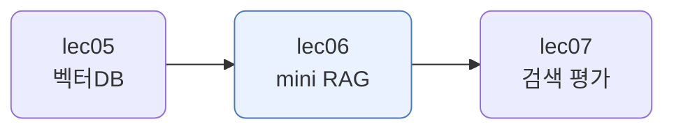
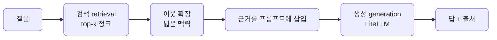
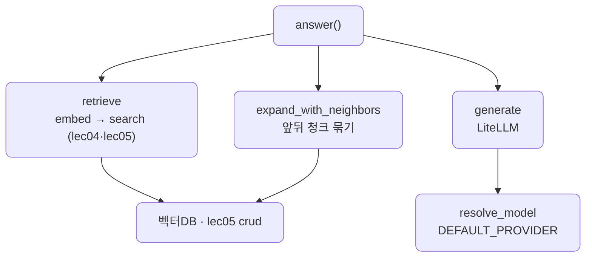

# lec06 — mini RAG

> - S2 개요: [docs/section2/README.md](../README.md)
> - 분량 18분
> - 산출물: 동작 mini RAG

## 1. 목표

lec05까지 만든 벡터DB 위에 생성과 출처 표시를 얹어 RAG 한 바퀴를 완성합니다. 질문에 맞는 근거를 검색해 LLM이 답을 쓰고, 그 답이 어느 청크에서 왔는지 보여줍니다. 데이터는 rag.pdf입니다.



## 2. RAG 한 바퀴 — retrieval → generation → 출처

지금까지는 인덱싱(미리 쌓기)과 검색만 했습니다. mini RAG는 그 검색 결과 위에 생성을 얹습니다.



검색은 lec04 임베딩과 lec05 벡터DB가, 생성은 S1의 LiteLLM이 맡습니다. 지금까지 만든 부품이 하나로 모이는 단위입니다.

## 3. 검색이 답을 모은다 — lec05 한계 다루기

lec05 8절에서 봤듯, 답에 필요한 정보가 청크 경계에서 갈릴 수 있습니다. mini RAG는 이를 두 가지로 다룹니다.

- top-k 검색: 가장 가까운 한 청크만 보지 않고 k개를 가져옵니다. 답이 여러 청크에 갈려 있어도 관련 청크는 함께 상위로 올라오므로 같이 모입니다.
- 이웃 확장: 검색된 청크의 앞뒤 청크를 함께 붙입니다. 작게 검색해 정밀하게 찾되, LLM에는 넓은 맥락을 줍니다.


청크 id가 `chunk_<번호>`라, 이웃은 번호를 ±1 해서 가져와 번호 순으로 잇습니다. 예제에서는 검색된 3개 청크가 이웃을 더해 6청크로 늘어 LLM에 전달됩니다.

## 4. 근거를 프롬프트에 넣기

검색한 청크를 번호를 붙여 프롬프트에 넣고, 근거 안에서만 답하고 출처 번호를 달도록 지시합니다. 모델이 아는 것을 지어내지 않고 준 근거에 기대게 하는 것이 핵심입니다.

```python
SYSTEM_PROMPT = (
    "너는 주어진 근거만으로 답하는 도우미다. 근거에 있는 내용으로만 한국어로 간결히 "
    "답하고, 근거에 없으면 모른다고 말한다. 답 끝에 사용한 근거 번호를 [n] 형태로 단다."
)

def build_messages(question, contexts):
    blocks = "\n\n".join(f"[{i + 1}] {c['text']}" for i, c in enumerate(contexts))
    return [
        {"role": "system", "content": SYSTEM_PROMPT},
        {"role": "user", "content": f"근거:\n{blocks}\n\n질문: {question}"},
    ]
```

## 5. 생성과 출처

생성은 S1처럼 LiteLLM을 경유합니다. `.env`의 `DEFAULT_PROVIDER`를 앞세우고 준비된 프로바이더로 넘어가므로, 클라우드든 로컬 Ollama든 같은 코드로 답을 만듭니다.

출처는 검색된 청크의 `source`와 청크 번호, 유사도로 보여줍니다. 답이 근거에서 왔음을 사람이 확인할 수 있어야 RAG가 신뢰를 얻습니다.

## 6. 예제 코드가 하는 일 및 결과

[mini_rag.py](../../../src/section2/lec06/mini_rag.py)는 질문을 받아 검색·이웃 확장·생성을 거쳐 답과 출처를 냅니다.



```bash
uv run python src/section2/lec06/mini_rag.py "검색 증강 생성은 어떻게 동작하나요?"
```

```text
질문: 검색 증강 생성은 어떻게 동작하나요?

답 (ollama/gemma4:31b-cloud):
사용자가 쿼리를 제출하면 RAG는 문서 검색기를 사용하여 사용 가능한 소스에서 관련 콘텐츠를
검색한 후, 검색된 정보를 모델의 응답에 통합합니다 [3]. 구체적으로는 참조 데이터를 거대한
벡터 공간 형태의 수치 표현인 LLM 임베딩으로 변환하여 벡터 데이터베이스에 저장하고 ...
최종적으로 LLM은 쿼리와 검색된 문서를 기반으로 출력을 생성합니다 [4][5].

검색한 근거 3개 (이웃 포함 6청크 전달):
  0.731 [rag.pdf #0] 검색증강생성 검색 증강 생성(Retrieval-augmented ...
  0.666 [rag.pdf #6] 있다.[1][12] 모델은 검색된 관련 정보를 사용자의 원래 쿼리...
  0.636 [rag.pdf #5] 더 많은 정보 를 기반으로 하고 문맥적으로 근거 있는 응답을 생성...
```

읽어낼 점입니다.

- 답이 rag.pdf의 내용으로 채워지고, 문장 끝에 근거 번호 `[3]` `[4][5]`가 붙습니다. 모델이 아는 것을 지어내지 않고 검색된 근거에 기대고 있습니다.
- 검색은 가장 가까운 3개 청크(#0·#6·#5)를 골랐고, 이웃을 더해 6청크를 LLM에 넘겼습니다. 갈린 내용이 함께 들어가도록 맥락을 넓힌 것입니다.
- 생성 모델은 `ollama/gemma4:31b-cloud`였지만, LiteLLM이라 `DEFAULT_PROVIDER`만 바꾸면 클라우드 모델로도 같은 코드가 돕니다.

## 7. 정리

- mini RAG는 검색(retrieval)으로 근거를 찾아 생성(generation)에 붙이고 출처를 보여주는 한 바퀴입니다.
- top-k 검색과 이웃 확장으로 답이 청크 경계에서 갈리는 lec05의 한계를 다룹니다.
- 근거만으로 답하고 출처 번호를 달게 해, 답이 어디서 왔는지 확인할 수 있게 합니다.
- 생성은 LiteLLM을 경유해 클라우드와 로컬을 같은 코드로 오갑니다. 이 검색이 얼마나 잘 맞히는지는 다음 단위에서 숫자로 평가합니다.
