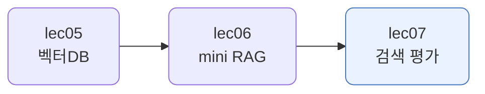
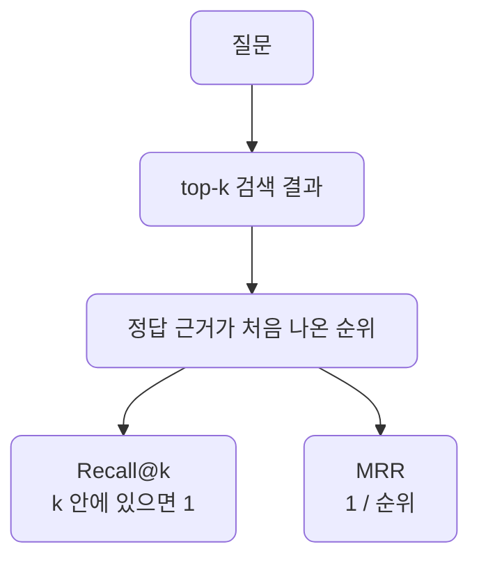
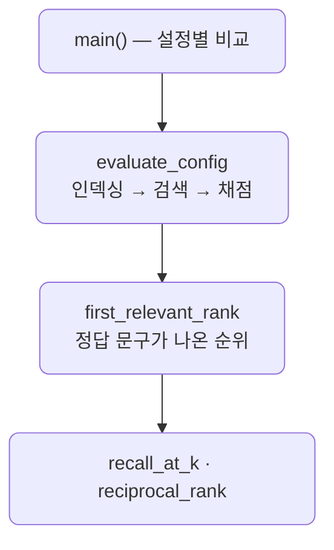

# lec07 — 검색 평가

> - S2 개요: [docs/section2/README.md](../README.md)
> - 분량 15분
> - 산출물: 평가 스크립트

## 1. 목표

mini RAG의 품질은 거의 검색이 정답 근거를 찾느냐에 달려 있습니다. 그래서 청킹·검색 설정을 감으로 고르지 않고, Recall@k와 MRR로 재서 숫자로 비교합니다. lec03에서 미뤄 둔 "청크 크기·overlap에 정답이 없다"를 여기서 측정으로 답합니다.



## 2. 무엇을 재나 — Recall@k와 MRR

질문마다 검색 결과에서 정답 근거가 몇 위에 나오는지를 보고, 그 순위로 두 지표를 계산합니다.



### 2.1. Recall@k — 상위 k 안에 정답이 있나

상위 k개 안에 정답 근거가 하나라도 있으면 1, 없으면 0으로 칩니다. 1위든 5위든 k 안에만 들면 똑같이 1이라, 순위의 질은 보지 않고 "빠뜨리지 않고 데려왔나"만 봅니다. 여러 질문의 평균이 적중률입니다. 5문항 중 4문항에서 찾으면 Recall@k는 0.80입니다.

### 2.2. MRR — 얼마나 위에서 찾았나

질문 하나의 점수는 정답이 처음 나온 순위의 역수, 즉 1/순위입니다. 1위면 1.0, 2위면 0.5, 3위면 0.33이고, 상위 k 안에 정답이 없으면 0입니다. 이를 여러 질문에 평균낸 것이 MRR입니다. 정답을 찾되 위쪽에 올릴수록 높아집니다.

두 지표는 보는 각도가 다릅니다. Recall@k는 k 안 어디든 들면 같은 점수라 순위의 질을 못 보고, MRR은 같은 적중이라도 1위로 올린 쪽에 더 높은 점수를 줍니다. 세 질문의 정답 순위가 이렇다고 해 봅니다.

| 질문 | 정답 순위 | Recall@5 | 1/순위 |
| --- | --- | --- | --- |
| Q1 | 1위 | 1 | 1.00 |
| Q2 | 4위 | 1 | 0.25 |
| Q3 | 5위 밖 | 0 | 0.00 |
| 평균 | | 0.67 | 0.42 |

Recall@5는 셋 중 둘을 찾아 0.67, MRR은 순위까지 반영해 0.42입니다. 둘을 함께 보면 정답을 빠뜨리지 않으면서 위로 올리는지 한눈에 드러납니다.

## 3. 평가셋 — 질문과 정답 근거

평가에는 정답이 정해진 질문 묶음이 필요합니다. 질문마다 정답 근거로 쓸 문구를 정해 두고, 검색된 청크 텍스트에 그 문구가 있으면 정답으로 칩니다.

```python
EVAL_SET = [
    {"q": "검색 증강 생성은 무엇인가요?", "answer": "새로운 정보를 검색"},
    {"q": "참조 데이터는 어디에 저장되나요?", "answer": "벡터 데이터베이스"},
    {"q": "검색된 정보는 어떻게 LLM에 전달되나요?", "answer": "프롬프트 엔지니어링"},
    ...
]
```

청크 경계는 설정마다 달라지지만 정답 문구는 그대로라, 어떤 청킹 설정이든 같은 잣대로 비교됩니다. PDF 추출의 군더더기 공백을 피하려고 공백을 지우고 맞춥니다.

## 4. 청킹 조합 비교

청크 크기와 overlap을 바꿔가며 같은 평가셋으로 점수를 냅니다. 인덱스를 설정마다 새로 만들어(다시 청킹·임베딩) 검색 품질을 잽니다.

크기는 완전성과 정밀도의 맞바꿈입니다. 너무 작으면 답이 갈려 정답을 놓쳐 Recall이 떨어지고, 너무 크면 한 청크에 여러 주제가 섞여 정답이 위로 잘 안 올라와 MRR이 떨어집니다.

## 5. 예제 코드가 하는 일 및 결과

[evaluate.py](../../../src/section2/lec07/evaluate.py)는 설정마다 인덱스를 만들고 평가셋을 검색해 Recall@k와 MRR을 표로 냅니다.



```bash
uv run python src/section2/lec07/evaluate.py
```

```text
평가셋 5문항, top-5 검색

 size overlap chunks  Recall@5   MRR
  300      50     66      0.80  0.80
  500      80     39      1.00  1.00
 1000     150     19      1.00  0.87
```

읽어낼 점입니다.

- 청크가 작은 300은 Recall@5가 0.80으로, 다섯 문항 중 하나를 놓칩니다. 답이 작은 청크로 갈려 상위 5개 밖으로 밀린 것입니다.
- 500은 Recall과 MRR이 모두 1.00입니다. 다섯 문항 모두 1위로 찾았습니다. lec03부터 써 온 기본 설정이 이 데이터에서 가장 좋습니다.
- 1000은 다 찾지만(Recall 1.00) MRR이 0.87로 떨어집니다. 청크가 커 여러 주제가 섞이니 정답이 1위가 아닌 경우가 생깁니다.
- 정답이 한 설정에 고정돼 있지 않습니다. 데이터와 질문에 따라 다르므로, 이렇게 숫자로 재서 고릅니다.

## 6. 정리

- 검색 평가는 정답이 정해진 질문 묶음으로 검색이 근거를 잘 가져오는지 재는 일입니다.
- Recall@k는 정답을 상위 k 안에 넣었는지, MRR은 얼마나 위에서 찾았는지를 봅니다.
- 청크 크기는 완전성과 정밀도의 맞바꿈이고, 좋은 설정은 데이터마다 달라 측정으로 고릅니다. 여기서는 500이 가장 좋았습니다.
- 이 잣대가 있으면 청킹·overlap·임베딩·검색 개수를 바꿀 때마다 좋아졌는지 나빠졌는지를 숫자로 확인할 수 있습니다. 이것으로 S2의 mini RAG 한 바퀴와 그 검색을 재는 잣대가 손에 들어옵니다.
