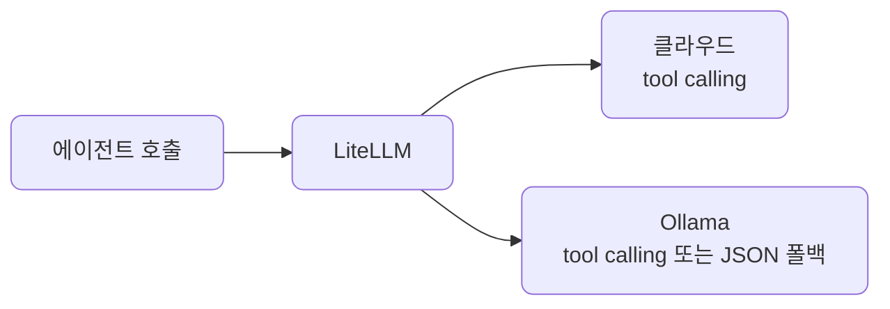
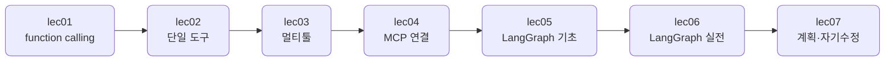

# S3 — Agent 구성: 빌드

> 상위 계획: [docs/plan/vod_plan.md](../plan/vod_plan.md)의 S3 항목

도구를 쓰는 에이전트를 "동작하게" 만드는 빌드 레이어입니다. 모델이 스스로 도구를 부르는 function calling에서 시작해, 한 도구 에이전트, 여러 도구를 라우팅하는 멀티툴 에이전트로 넓히고, LangGraph로 분기·루프가 있는 흐름까지 만듭니다. 마지막으로 반응형을 넘어 계획 수립과 자기수정 같은 다른 에이전트 패턴을 봅니다.

이 섹션을 마치면 도구를 호출해 일을 처리하고, 상태와 분기를 가진 그래프로 흐름을 제어하며, 계획·자기수정 같은 패턴까지 짜는 동작하는 에이전트가 손에 들어옵니다.

## 학습 방식

S1·S2와 같습니다. 예제 코드는 이 저장소로 공유되며, devcontainer 안에서 실행해 결과를 관찰하고 핵심을 읽어 이해합니다. 손으로 바꿔보는 부분은 각 단위의 "직접 해보기"로 한정합니다.

## 관통하는 원칙

모든 LLM 호출은 S1·S2처럼 LiteLLM을 경유합니다. function calling도 `litellm.completion`의 tool 인자로 두어, 클라우드와 로컬을 같은 코드로 오갑니다.

그래서 클라우드든 로컬 Ollama든 같은 코드로 오갑니다. 능력이 부족한 모델을 우아하게 강등하는 폴백은 S4의 하네스 엔지니어링에서 다룹니다.

## 단위 구성

| 단위 | 분 | 주제 | 산출물 |
| --- | --- | --- | --- |
| [lec01](lec01/README.md) | 24 | function calling 원리 | 단일 tool 호출 |
| [lec02](lec02/README.md) | 22 | 단일 도구 에이전트 | 동작 에이전트 |
| [lec03](lec03/README.md) | 20 | multi-tool agent | 멀티툴 에이전트 |
| [lec04](lec04/README.md) | 20 | MCP로 도구 연결 | MCP 연결 에이전트 |
| [lec05](lec05/README.md) | 22 | LangGraph 기초 | 최소 그래프 |
| [lec06](lec06/README.md) | 22 | LangGraph 실전 | 자동화 그래프 |
| [lec07](lec07/README.md) | 12 | 계획 수립과 자기수정 | 계획·자기수정 에이전트 |

합계 142분, 7단위입니다.

## 흐름

도구를 부르는 한 번의 호출에서 시작해 점점 넓힙니다. function calling 원리를 익히고, 한 도구로 end-to-end 에이전트를 만들고, 여러 도구를 라우팅합니다. 그다음 도구를 직접 짜는 대신 MCP 서버에 표준으로 연결하고, LangGraph로 상태·분기·루프가 있는 흐름을 짜며, 마지막으로 계획 수립과 자기수정 패턴을 봅니다.

## 코드와 테스트

공유되는 예제 코드는 [src/section3](../../src/section3)에, 테스트는 [tests/section3](../../tests/section3)에 같은 `lecNN` 구조로 들어 있습니다. 이 저장소를 받아 devcontainer 안에서 그대로 실행하는 것이 기본이고, 손으로 바꿔보는 부분은 각 단위의 "직접 해보기"로 한정합니다.
