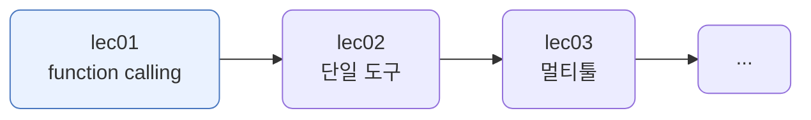
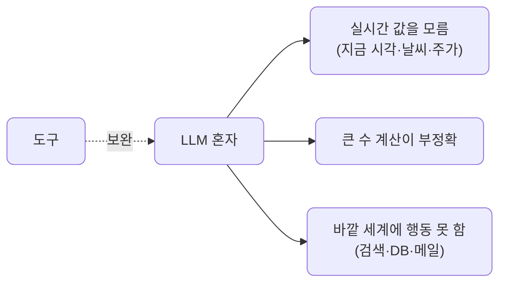
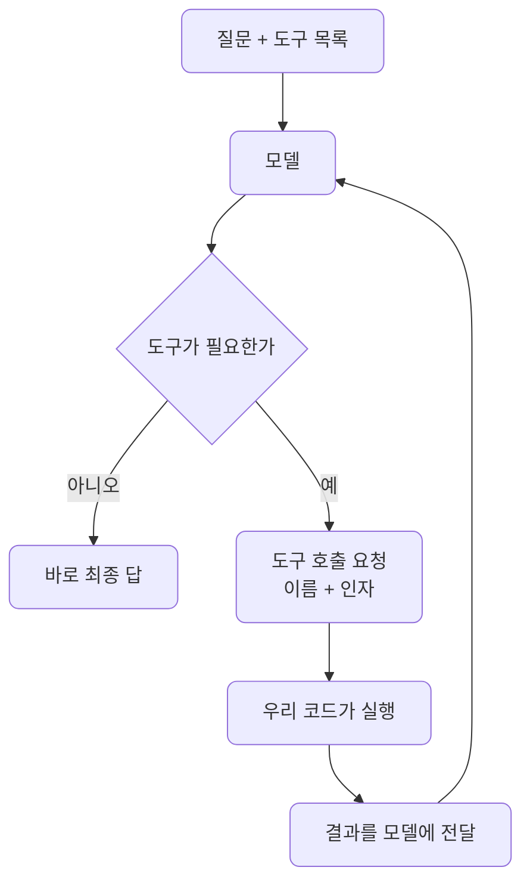
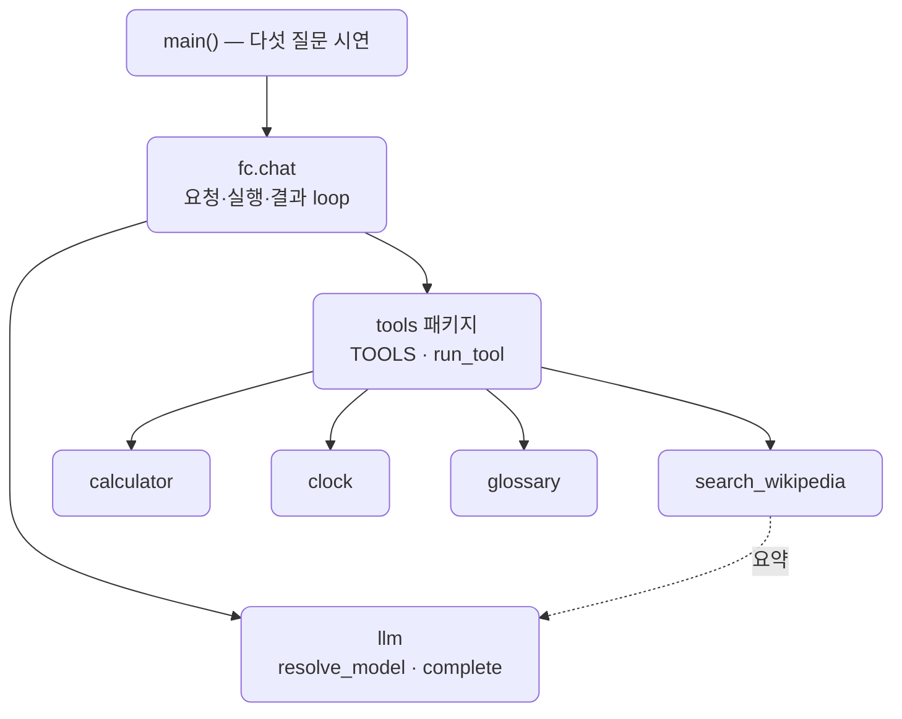
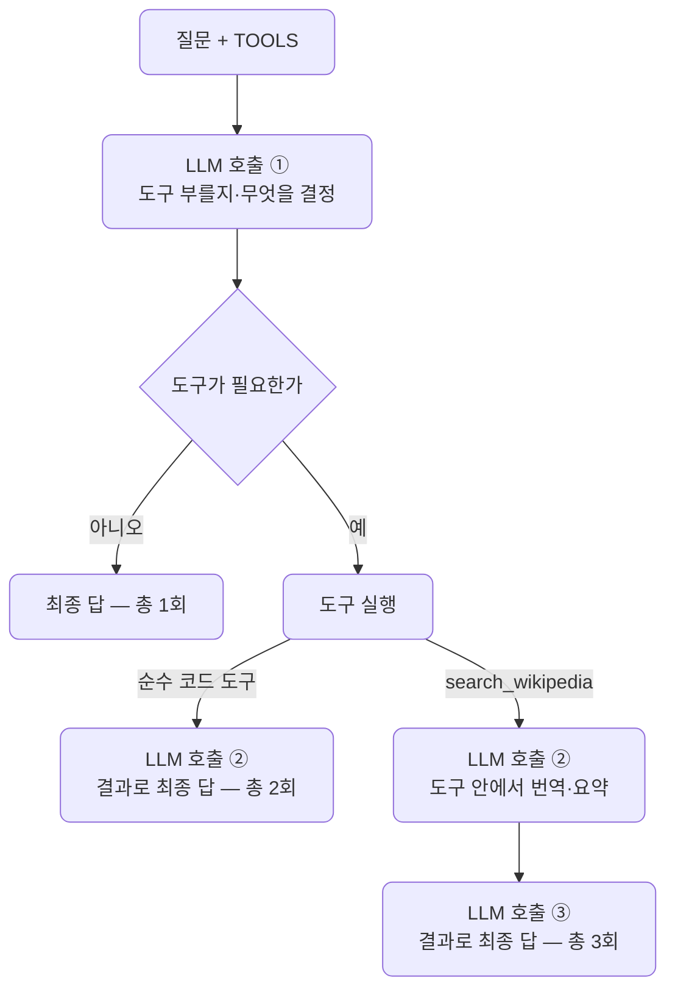

# lec01 — function calling 원리

> - S3 개요: [docs/section3/README.md](../README.md)
> - 분량 24분
> - 산출물: 단일 tool 호출

## 1. 목표

모델이 스스로 도구 호출을 결정하는 function calling의 원리를 익힙니다. 도구를 어떻게 설명해 모델에 주는지, 모델이 도구를 부르고 그 결과를 받아 답으로 잇는 한 바퀴가 어떻게 도는지를 봅니다. 이 한 바퀴가 S3의 모든 에이전트의 바탕입니다.



## 2. 왜 function calling인가

LLM은 글을 잘 다루지만 혼자서는 못 하는 일이 있습니다.



function calling은 이 빈틈을 도구로 메웁니다. 모델에 "이런 도구들이 있다"고 알려주면, 모델은 필요할 때 그 도구를 부르겠다고 요청합니다. 우리가 실행해 결과를 돌려주면, 모델은 그 결과를 바탕으로 답을 만듭니다.

## 3. 도구 스키마 — 모델에 도구를 설명하기

모델은 도구의 설명만 보고 언제 어떤 인자로 부를지 정합니다. 그래서 도구를 이름·설명·인자로 또렷이 적어 줍니다. 인자는 JSON Schema로 씁니다.

도구는 종류별로 한 파일에 두고 `tools/` 폴더에 모읍니다. 이 단위에는 네 도구가 있고, 앞 셋은 2절에서 본 LLM의 빈틈 하나씩을 메우며, 넷째는 외부 검색을 보탭니다.

| 도구 | 파일 | 메우는 빈틈 |
| --- | --- | --- |
| `calculate` | tools/calculator.py | 큰 수의 정확한 계산 |
| `current_time` | tools/clock.py | 실시간 값, 지금 시각 |
| `lookup_term` | tools/glossary.py | 모델 바깥의 지식 조회 |
| `search_wikipedia` | tools/search_wikipedia.py | 영문 위키 검색 + 한국어 요약 |

도구마다 실행 함수와 스키마를 한 파일에 두고, `tools/__init__.py`가 모아 `TOOLS`(스키마 목록)와 `run_tool`(이름→실행)로 내보냅니다. 도구를 늘리려면 파일을 더하고 등록 한 줄만 넣으면 됩니다.

스키마는 이름·설명·인자로 적습니다. `calculate`를 예로 보면 이렇습니다.

```python
SCHEMA = {
    "type": "function",
    "function": {
        "name": "calculate",
        "description": "두 수를 사칙연산한다. 정확한 산술이 필요할 때 쓴다.",
        "parameters": {
            "type": "object",
            "properties": {
                "a": {"type": "number", "description": "첫 번째 수"},
                "b": {"type": "number", "description": "두 번째 수"},
                "op": {"type": "string", "enum": ["add", "subtract", "multiply", "divide"]},
            },
            "required": ["a", "b", "op"],
        },
    },
}
```

설명이 곧 사용 설명서입니다. "정확한 산술이 필요할 때 쓴다"는 한 줄이 모델에게 이 도구를 언제 부를지 알려줍니다. 인자 이름·타입·필수 여부가 분명할수록 모델이 올바른 인자를 채웁니다.

## 4. 모델은 요청만, 실행은 우리 코드

가장 중요한 점입니다. 모델은 도구를 직접 실행하지 않습니다. "calculate를 a=73654, b=8921, op=multiply로 불러 달라"는 요청(tool_calls)만 내놓습니다. 실제 계산은 우리 코드가 합니다. 그래서 도구가 무엇을 하든(파일 읽기, DB 조회, 결제) 통제권은 우리에게 있습니다.

모델과 도구 실행은 서로 다른 곳에서 돕니다. 모델은 프로바이더가 있는 곳에서 돌고, 도구 실행은 언제나 내 Python 프로세스에서 돕니다.

| 무엇 | 어디서 도나 |
| --- | --- |
| 모델 — 부를지·어떤 인자로 결정 | 프로바이더 위치, 클라우드(gemini) 또는 로컬(Ollama) |
| 도구 실행 — `calculate` | 항상 내 코드, devcontainer·내 기기 |

예제의 흐름을 따라가 보면 이렇습니다.

```text
"73654 곱하기 8921"
  → [모델, 클라우드]  "calculate(73654, 8921, multiply) 불러 달라"   (요청만)
  → [내 코드, 로컬]   run_tool 실행 → 657067334                      (파이썬 곱셈)
  → [모델, 클라우드]  결과를 받아 "657,067,334입니다"로 문장화
```

657067334는 모델이 아니라 내 코드의 곱셈이 계산한 값입니다. 클라우드 모델이라도 내 코드를 직접 실행하지는 못하고 요청만 보냅니다. 받아서 실행할지, 어떻게 실행할지는 내 코드가 정합니다.


## 5. 한 바퀴 — 요청·실행·결과·답

모델은 결과를 받고 또 도구를 부를 수도 있습니다. 그래서 도구 호출이 멈출 때까지 도는 loop로 둡니다.



```python
def chat(question, max_steps=5):
    messages = [{"role": "user", "content": question}]
    for _ in range(max_steps):
        resp = litellm.completion(model=model, messages=messages, tools=TOOLS, **kwargs)
        msg = resp.choices[0].message
        messages.append(msg.model_dump())
        if not msg.tool_calls:        # 도구 요청이 없으면 그게 최종 답
            return msg.content
        for call in msg.tool_calls:   # 요청된 도구를 실행해 결과를 messages에 붙인다
            result = run_tool(call.function.name, json.loads(call.function.arguments))
            messages.append({"role": "tool", "tool_call_id": call.id, "content": str(result)})
```

`tool` 역할 메시지로 결과를 돌려주는 것이 핵심입니다. 모델은 그 결과를 읽고 다음을 정합니다.

## 6. LiteLLM로, 그리고 모델마다 다른 신뢰성

호출은 S1·S2처럼 LiteLLM을 경유합니다. `tools` 인자만 더하면 됩니다. 덕분에 클라우드든 로컬이든 같은 코드입니다.

function calling은 프로바이더마다 이름이 다를 뿐 같은 개념입니다. OpenAI·Anthropic·Gemini의 tools, 그리고 Ollama 모델 설명에 붙는 `tools` 태그가 모두 이것입니다. Ollama의 `tools` 태그는 그 모델이 도구 호출을 지원하도록 학습됐다는 표시이고, 태그가 없는 모델은 `tools`를 줘도 호출을 내놓지 못합니다.

다만 지원한다는 것과 잘한다는 것은 다릅니다. 도구를 제때 부르고 결과를 받아 깔끔히 마무리하는 능력은 모델마다 차이가 큽니다. 예를 들어 `gemma4:31b-cloud`는 도구는 부르지만 결과를 받은 뒤 자연어 답 대신 JSON을 다시 뱉고, 도구가 필요 없을 때도 없는 도구를 지어내 부릅니다. 반면 `minimax-m3:cloud`는 같은 Ollama여도 도구 호출과 마무리를 깔끔히 해냅니다. Ollama라 약한 것이 아니라 모델마다 다른 것입니다.

그래서 이 단위는 `.env`의 `DEFAULT_PROVIDER`가 가리키는 모델을 그대로 씁니다. 도구 호출에 강한 모델이면 클라우드든 로컬이든 같은 코드로 돕니다. 약한 모델까지 포함해 능력을 감지하고 우아하게 강등하는 처리는 S4의 하네스 엔지니어링에서 봅니다.

### 6.1. Ollama Cloud 모델 고르기

로컬 대신 Ollama Cloud 모델(`…:cloud`)을 쓸 때는 두 가지를 봅니다. 하나는 접근입니다. 일부 모델은 유료 구독이 있어야 하고, 없으면 호출이 403으로 막힙니다. 다른 하나는 앞에서 본 tool calling 신뢰성입니다.

| 모델 | 접근 | tool calling |
| --- | --- | --- |
| `gemma4:31b-cloud` | 무료 | 약함, 결과 후 JSON·없는 도구 환각 |
| `minimax-m3:cloud` | 무료 | 잘함, 다만 크고 호출당 사용량이 큼 |
| `minimax-m2.7:cloud`·`qwen3.5:cloud` | 구독 필요 | 접근이 막혀 확인 불가 |

무료이면서 작고 도구까지 잘 부르는 조합은 찾기 쉽지 않습니다. 도구 호출을 깔끔히 보고 싶다면 클라우드 프로바이더(gemini 등)나 minimax-m3:cloud가 무난합니다. `.env`의 `OLLAMA_MODEL`이나 `DEFAULT_PROVIDER`만 바꾸면 됩니다.

## 7. 예제 코드가 하는 일 및 결과

[fc.py](../../../src/section3/lec01/fc.py)는 네 도구를 두고 다섯 질문을 보냅니다. 질문마다 모델이 알맞은 도구를 고르고, 도구가 필요 없으면 부르지 않습니다. 쓰는 모델은 `.env`의 `DEFAULT_PROVIDER`를 따릅니다. 아래는 gemini로 돌린 예이고, `minimax-m3:cloud` 같은 도구에 강한 모델도 같은 흐름으로 동작합니다.



```bash
uv run python src/section3/lec01/fc.py
```

```text
(모델: gemini/gemini-2.5-flash)

질문: 73654 곱하기 8921은 얼마야?
  → 도구 호출: calculate({'a': 73654, 'op': 'multiply', 'b': 8921}) = 657067334
  답: 73654 곱하기 8921은 657,067,334입니다.
  LLM 호출 2회

질문: 지금 몇 시인지 알려줘.
  → 도구 호출: current_time({}) = 2026-06-09 10:59:56
  답: 지금은 2026년 6월 9일 10시 59분 56초입니다.
  LLM 호출 2회

질문: RAG가 뭐야? 한 문장으로.
  → 도구 호출: lookup_term({'term': 'RAG'}) = 검색 증강 생성. 외부 문서를 검색해 ...
  답: RAG는 검색 증강 생성으로, 외부 문서를 검색해 LLM 답변의 근거로 삼는 방법입니다.
  LLM 호출 2회

질문: 에펠탑에 대해 위키백과에서 찾아 알려줘.
  → 도구 호출: search_wikipedia({'query': 'Eiffel Tower'})
     = 에펠탑은 프랑스 파리의 샹드마르스에 위치한 격자형 탑입니다. 1887년부터 1889년까지 ...
       (출처: Eiffel Tower — https://en.wikipedia.org/wiki/Eiffel_Tower)
  답: 에펠탑은 프랑스 파리의 샹드마르스에 위치한 격자형 탑입니다. 1887년부터 ...
  LLM 호출 3회

질문: 안녕! 한 문장으로 인사해줘.
  → 도구 호출 없음 (모델이 직접 답함)
  답: 안녕하세요! 무엇을 도와드릴까요?
  LLM 호출 1회
```

질문마다 모델이 다른 도구를 골라 부르고, 인사처럼 필요 없으면 부르지 않습니다.

끝에 찍힌 LLM 호출 수가 도구 사용의 값을 보여줍니다. 도구가 필요 없으면 1회로 끝나고(바로 답), 도구를 한 번 쓰면 2회입니다. 도구를 부르겠다고 정하는 호출 한 번, 도구 결과를 받아 답하는 호출 한 번입니다. 위키 질문은 3회인데, 바깥 loop의 2회에 더해 search_wikipedia가 안에서 요약·번역에 LLM을 한 번 더 쓰기 때문입니다.

| 경우 | 도구 실행이 LLM을 쓰나 | LLM 호출 |
| --- | --- | --- |
| 도구 없음 | — | 1회 |
| 순수 코드 도구 (calculate·current_time·lookup_term) | 아니오 | 2회 |
| search_wikipedia | 예, 번역·요약 | 3회 |



도구를 쓸수록, 또 도구가 안에서 LLM을 쓸수록 호출이 늘어 비용과 시간이 커집니다. 각 파일이 무엇을 하는지 봅니다.

### 7.1. fc.py — 도구 호출 loop

질문을 모델에 보내고, 도구 호출이 멈출 때까지 실행·전달을 반복하는 `chat` loop가 있습니다. 도구 자체는 갖지 않고, `tools` 패키지의 `TOOLS`(스키마)와 `run_tool`(실행)을 가져다 씁니다. 프로바이더를 고르는 `resolve_model`은 도구와 함께 쓰려고 `llm.py`에 따로 두었습니다.

### 7.2. tools/calculator.py — calculate

두 수를 사칙연산합니다. LLM이 자주 틀리는 큰 수의 정확한 계산을 맡습니다. 첫 질문에서 모델이 `multiply`로 부르고, 우리 코드가 657067334를 계산해 돌려줍니다.

### 7.3. tools/clock.py — current_time

지금 날짜와 시각을 돌려줍니다. 모델은 현재 시각을 모르므로, 둘째 질문의 `2026-06-09 10:59:56`은 모델이 아니라 우리 기기의 시계에서 온 값입니다.

### 7.4. tools/glossary.py — lookup_term

작은 용어 사전에서 뜻을 찾습니다. 모델 바깥의 지식을 조회하는 가장 단순한 형태입니다. 셋째 질문에서 `RAG`의 뜻을 사전에서 꺼내 옵니다.

### 7.5. tools/search_wikipedia.py — search_wikipedia

한 단계 더 똑똑한 도구입니다. 모델이 `query`로 검색어를 정합니다. 영문 위키백과를 쓰므로 모델은 영어 검색어를 넘기는데, 넷째 질문에서 "에펠탑"을 `Eiffel Tower`로 옮겨 부른 것이 그 예입니다. 이것이 곧 모델이 검색어를 고르는 단계입니다. 도구는 영문 위키백과를 검색해 영어 요약을 가져오고, 그 내용을 다시 LiteLLM으로 한국어로 번역·요약해 출처와 함께 돌려줍니다. 영어 문서가 더 풍부하고 번역은 모델이 잘하므로 영문에서 찾아 한국어로 옮깁니다. 도구 안에서 네트워크 호출과 LLM 호출이 함께 일어나는, 도구가 작은 에이전트가 되는 경우입니다.

한 질문에 도구 하나를 고르는 이 단순한 경우를 넘어, 여러 도구를 한 작업에 엮는 라우팅은 lec03에서 깊이 다룹니다.

## 8. 정리

- function calling은 모델에 도구 목록을 주고, 모델이 필요할 때 어떤 도구를 어떤 인자로 부를지 정하게 하는 것입니다.
- 모델은 요청만 하고, 실행은 우리 코드가 합니다. 그래서 도구가 하는 일의 통제권은 우리에게 있습니다.
- 한 바퀴는 요청 → 실행 → 결과 전달 → 답이고, 도구 호출이 멈출 때까지 도는 loop로 둡니다.
- LiteLLM로 어느 프로바이더든 같은 코드로 부르되, 도구를 다루는 신뢰성은 모델마다 다릅니다. 이 도구 한 바퀴 위에 다음 단위부터 에이전트를 쌓습니다.
