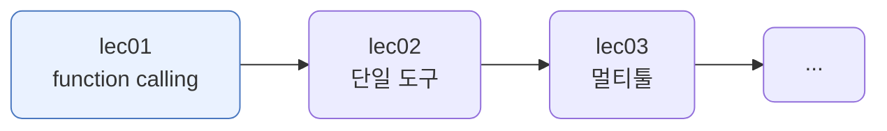
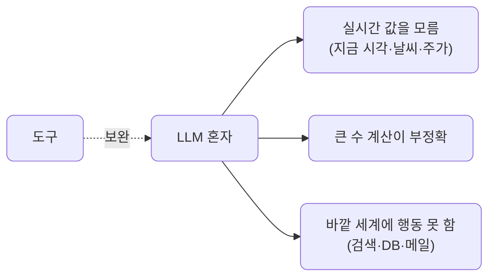
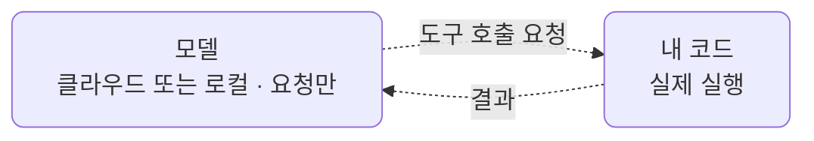
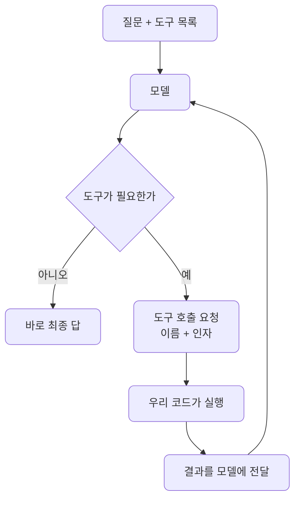
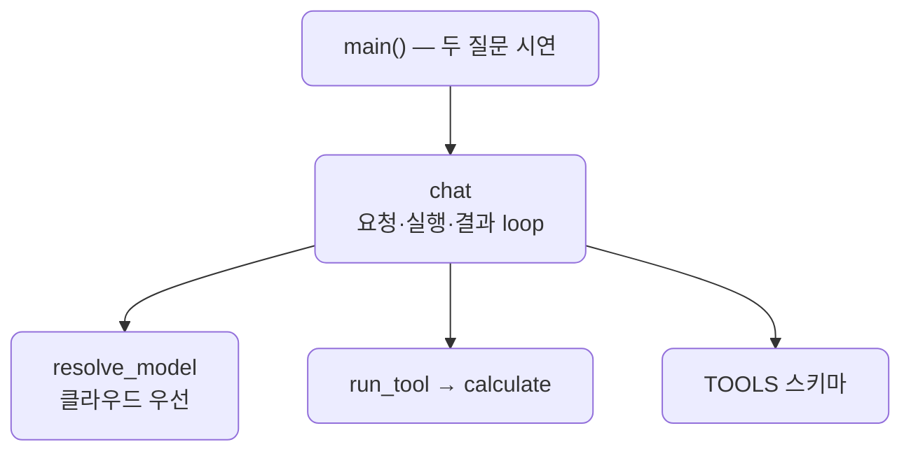

# lec01 — function calling 원리

> - S3 개요: [docs/section3/README.md](../README.md)
> - 분량 24분
> - 산출물: 단일 tool 호출

## 1. 목표

모델이 스스로 도구 호출을 결정하는 function calling의 원리를 익힙니다. 도구를 어떻게 설명해 모델에 주는지, 모델이 도구를 부르고 그 결과를 받아 답으로 잇는 한 바퀴가 어떻게 도는지를 봅니다. 이 한 바퀴가 S3의 모든 에이전트의 바탕입니다.



## 2. 왜 function calling인가

LLM은 글을 잘 다루지만 혼자서는 못 하는 일이 있습니다.



function calling은 이 빈틈을 도구로 메웁니다. 모델에 "이런 도구들이 있다"고 알려주면, 모델은 필요할 때 그 도구를 부르겠다고 요청합니다. 우리가 실행해 결과를 돌려주면, 모델은 그 결과를 바탕으로 답을 만듭니다.

## 3. 도구 스키마 — 모델에 도구를 설명하기

모델은 도구의 설명만 보고 언제 어떤 인자로 부를지 정합니다. 그래서 도구를 이름·설명·인자로 또렷이 적어 줍니다. 인자는 JSON Schema로 씁니다.

```python
TOOLS = [{
    "type": "function",
    "function": {
        "name": "calculate",
        "description": "두 수를 사칙연산한다. 정확한 산술이 필요할 때 쓴다.",
        "parameters": {
            "type": "object",
            "properties": {
                "a": {"type": "number", "description": "첫 번째 수"},
                "b": {"type": "number", "description": "두 번째 수"},
                "op": {"type": "string", "enum": ["add", "subtract", "multiply", "divide"]},
            },
            "required": ["a", "b", "op"],
        },
    },
}]
```

설명이 곧 사용 설명서입니다. "정확한 산술이 필요할 때 쓴다"는 한 줄이 모델에게 이 도구를 언제 부를지 알려줍니다. 인자 이름·타입·필수 여부가 분명할수록 모델이 올바른 인자를 채웁니다.

## 4. 모델은 요청만, 실행은 우리 코드

가장 중요한 점입니다. 모델은 도구를 직접 실행하지 않습니다. "calculate를 a=73654, b=8921, op=multiply로 불러 달라"는 요청(tool_calls)만 내놓습니다. 실제 계산은 우리 코드가 합니다. 그래서 도구가 무엇을 하든(파일 읽기, DB 조회, 결제) 통제권은 우리에게 있습니다.

모델과 도구 실행은 서로 다른 곳에서 돕니다. 모델은 프로바이더가 있는 곳에서 돌고, 도구 실행은 언제나 내 Python 프로세스에서 돕니다.

| 무엇 | 어디서 도나 |
| --- | --- |
| 모델 — 부를지·어떤 인자로 결정 | 프로바이더 위치, 클라우드(gemini) 또는 로컬(Ollama) |
| 도구 실행 — `calculate` | 항상 내 코드, devcontainer·내 기기 |

예제의 흐름을 따라가 보면 이렇습니다.

```text
"73654 곱하기 8921"
  → [모델, 클라우드]  "calculate(73654, 8921, multiply) 불러 달라"   (요청만)
  → [내 코드, 로컬]   run_tool 실행 → 657067334                      (파이썬 곱셈)
  → [모델, 클라우드]  결과를 받아 "657,067,334입니다"로 문장화
```

657067334는 모델이 아니라 내 코드의 곱셈이 계산한 값입니다. 클라우드 모델이라도 내 코드를 직접 실행하지는 못하고 요청만 보냅니다. 받아서 실행할지, 어떻게 실행할지는 내 코드가 정합니다.



## 5. 한 바퀴 — 요청·실행·결과·답

모델은 결과를 받고 또 도구를 부를 수도 있습니다. 그래서 도구 호출이 멈출 때까지 도는 loop로 둡니다.



```python
def chat(question, max_steps=5):
    messages = [{"role": "user", "content": question}]
    for _ in range(max_steps):
        resp = litellm.completion(model=model, messages=messages, tools=TOOLS, **kwargs)
        msg = resp.choices[0].message
        messages.append(msg.model_dump())
        if not msg.tool_calls:        # 도구 요청이 없으면 그게 최종 답
            return msg.content
        for call in msg.tool_calls:   # 요청된 도구를 실행해 결과를 messages에 붙인다
            result = run_tool(call.function.name, json.loads(call.function.arguments))
            messages.append({"role": "tool", "tool_call_id": call.id, "content": str(result)})
```

`tool` 역할 메시지로 결과를 돌려주는 것이 핵심입니다. 모델은 그 결과를 읽고 다음을 정합니다.

## 6. LiteLLM로, 그리고 모델마다 다른 신뢰성

호출은 S1·S2처럼 LiteLLM을 경유합니다. `tools` 인자만 더하면 됩니다. 덕분에 클라우드든 로컬이든 같은 코드입니다.

function calling은 프로바이더마다 이름이 다를 뿐 같은 개념입니다. OpenAI·Anthropic·Gemini의 tools, 그리고 Ollama 모델 설명에 붙는 `tools` 태그가 모두 이것입니다. Ollama의 `tools` 태그는 그 모델이 도구 호출을 지원하도록 학습됐다는 표시이고, 태그가 없는 모델은 `tools`를 줘도 호출을 내놓지 못합니다.

다만 지원한다는 것과 잘한다는 것은 다릅니다. 도구를 제때 정확히 부르는 능력은 모델마다 차이가 큽니다. 로컬 소형 모델은 불필요한데도 도구를 부르거나, 결과를 받고도 깔끔히 답하지 못하기도 합니다. 그래서 기초인 이 단위는 안정적인 클라우드 프로바이더를 앞세웁니다. 태그가 없는 모델까지 포함해 로컬에서 이걸 어떻게 다루는지는 lec06에서 봅니다.

## 7. 예제 코드가 하는 일 및 결과

[fc.py](../../../src/section3/lec01/fc.py)는 계산기 도구 하나를 두고, 도구가 필요한 질문과 필요 없는 질문을 각각 보냅니다.



```bash
uv run python src/section3/lec01/fc.py
```

```text
질문: 73654 곱하기 8921은 얼마야?
  → 도구 호출: calculate({'op': 'multiply', 'a': 73654, 'b': 8921}) = 657067334
  답 (gemini/gemini-2.5-flash): 73654 곱하기 8921은 657,067,334입니다.

질문: 안녕! 너는 무엇을 할 수 있어? 한 문장으로 답해.
  → 도구 호출 없음 (모델이 직접 답함)
  답 (gemini/gemini-2.5-flash): 저는 두 수를 사칙연산할 수 있습니다.
```

읽어낼 점입니다.

- 계산이 필요한 질문에는 모델이 `calculate`를 알맞은 인자로 부릅니다. 우리 코드가 실행한 657067334를 받아, 모델이 자연스러운 문장으로 답합니다.
- 도구가 필요 없는 인사에는 모델이 도구를 부르지 않고 바로 답합니다. 부를지 말지를 모델이 스스로 정한다는 것이 보입니다.
- 모델이 실행한 것이 아니라 요청만 했고, 실행은 우리 `run_tool`이 했습니다. 결과의 정확성은 도구가 보장합니다.

## 8. 정리

- function calling은 모델에 도구 목록을 주고, 모델이 필요할 때 어떤 도구를 어떤 인자로 부를지 정하게 하는 것입니다.
- 모델은 요청만 하고, 실행은 우리 코드가 합니다. 그래서 도구가 하는 일의 통제권은 우리에게 있습니다.
- 한 바퀴는 요청 → 실행 → 결과 전달 → 답이고, 도구 호출이 멈출 때까지 도는 loop로 둡니다.
- LiteLLM로 어느 프로바이더든 같은 코드로 부르되, 도구를 다루는 신뢰성은 모델마다 다릅니다. 이 도구 한 바퀴 위에 다음 단위부터 에이전트를 쌓습니다.
