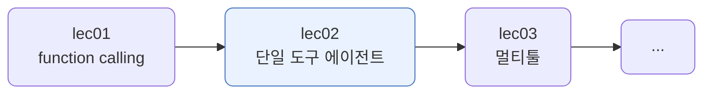
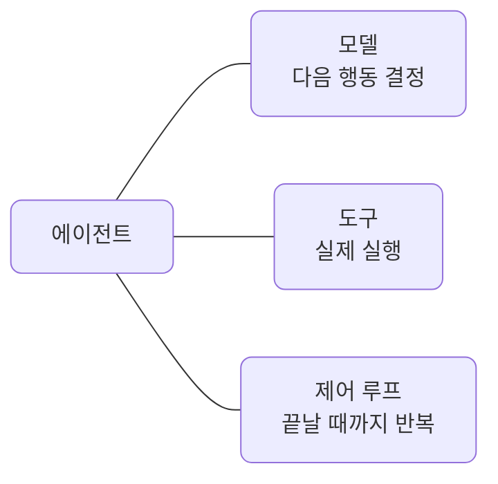
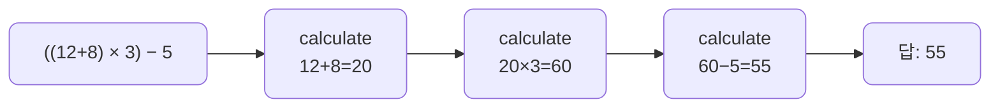
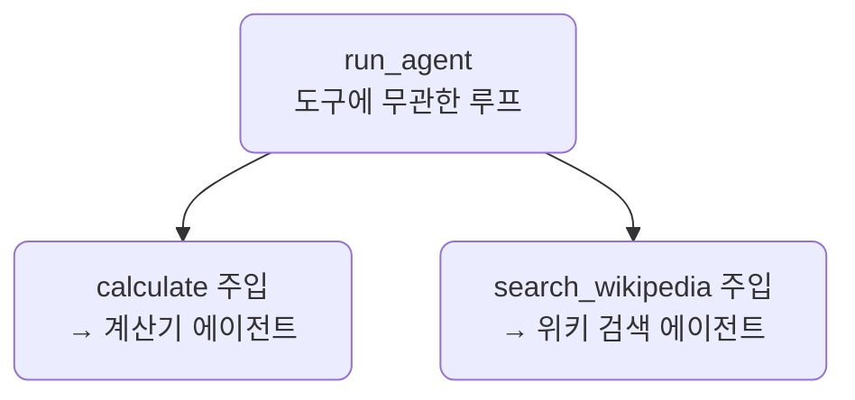
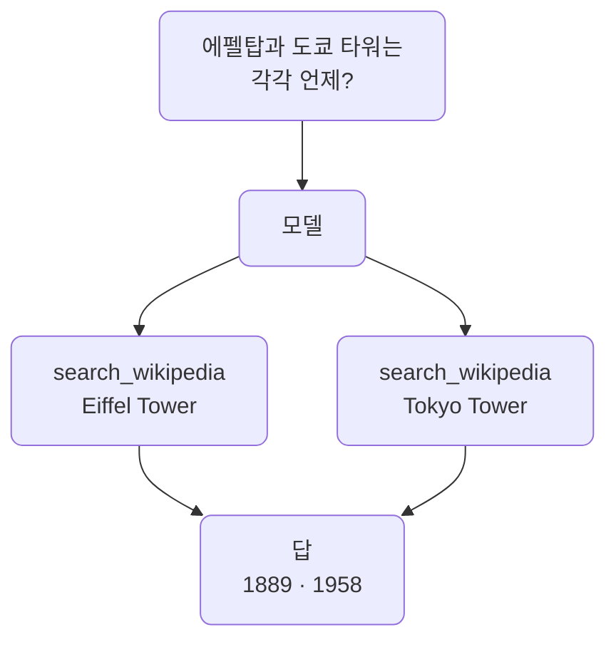
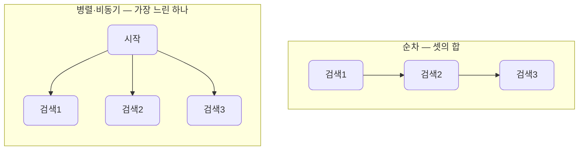
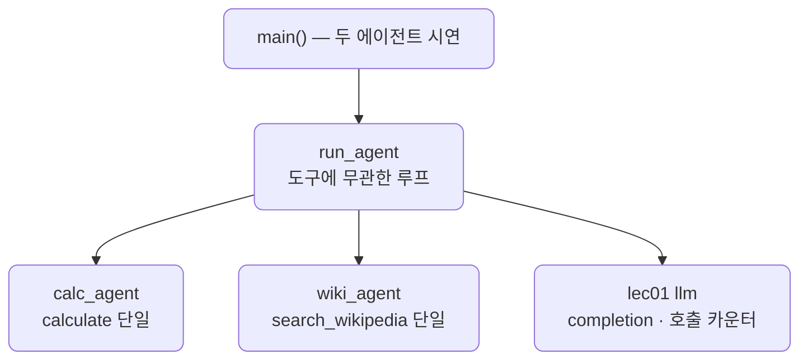

# lec02 — 단일 도구 에이전트

> - S3 개요: [docs/section3/README.md](../README.md)
> - 분량 16분
> - 산출물: 동작 에이전트

## 1. 목표

도구 하나로 한 작업을 끝까지 해내는 에이전트를 만듭니다. lec01에서 function calling 한 바퀴를 봤다면, 여기서는 모델이 도구를 필요한 만큼 반복해서 부르고 스스로 마무리하는 루프를 봅니다. 그리고 그 루프가 도구와 무관하다는 것, 곧 도구만 바꿔 끼우면 다른 에이전트가 된다는 것을 봅니다.



## 2. 에이전트란 — 모델 + 도구 + 제어 루프

에이전트는 세 가지가 맞물린 것입니다. 모델이 다음 행동을 정하고, 도구가 실제로 실행하고, 제어 루프가 작업이 끝날 때까지 이를 반복합니다.



여기서 중요한 것은 모델이 단계를 스스로 정한다는 점입니다. `((12+8) × 3) - 5`를 풀 때 "먼저 12+8, 그다음 ×3, 마지막에 -5" 같은 순서를 우리가 코드에 박지 않습니다. 모델이 매 스텝 다음에 무엇을 할지 정하고, 직전 결과를 보고 다음을 고릅니다. lec01의 데모는 질문마다 도구를 한 번 부르고 끝났지만, 에이전트는 한 번으로 끝나지 않는 작업을 루프로 끌고 갑니다.

## 3. 한 도구로 여러 스텝 — 계산기 에이전트

계산기 `calculate`는 한 번에 두 수만 다룹니다. 그래서 수식이 복잡하면 그 도구를 여러 번 부르게 됩니다.



루프는 단순합니다. 모델을 부르고, 도구 요청이 있으면 실행해 결과를 다시 넣고, 요청이 없으면 그때가 최종 답입니다. 모델이 끝없이 도구를 부르는 일을 막으려고 `max_steps`로 상한을 둡니다.

```python
def run_agent(task, tools, dispatch, system, max_steps=10):
    messages = [{"role": "system", "content": system}, {"role": "user", "content": task}]
    for _ in range(max_steps):
        msg = completion(model, messages, tools=tools, **kwargs).choices[0].message
        messages.append(msg.model_dump())
        if not msg.tool_calls:          # 더 부를 게 없으면 최종 답
            return msg.content
        for call in msg.tool_calls:     # 요청된 도구를 실행해 결과를 다시 넣는다
            result = dispatch(call.function.name, json.loads(call.function.arguments))
            messages.append({"role": "tool", "tool_call_id": call.id, "content": str(result)})
```

## 4. 같은 루프, 다른 도구 — 위키 검색 에이전트

`run_agent`는 특정 도구를 모릅니다. `tools`와 `dispatch`를 인자로 받을 뿐입니다. 그래서 도구만 바꿔 끼우면 다른 에이전트가 됩니다. 계산기 대신 lec01의 `search_wikipedia`를 넣으면, 같은 루프가 여러 주제를 차례로 찾는 검색 에이전트가 됩니다.



"에펠탑과 도쿄 타워는 각각 언제 지어졌나요?"처럼 주제가 둘이면, 에이전트가 `search_wikipedia`를 주제마다 한 번씩 부릅니다.



한 가지 더 볼 점은 비용입니다. `search_wikipedia`는 lec01에서 본 대로 안에서 다시 LLM으로 요약하므로, 도구를 두 번 부르면 LLM 호출은 그보다 더 늘어납니다.

### 4.1. 독립적인 호출은 병렬이 가능합니다

계산기와 다른 점이 하나 더 있습니다. 두 검색은 서로 독립적입니다. 에펠탑 결과가 도쿄 타워 검색에 쓰이지 않습니다. 그래서 모델이 한 응답에 두 호출을 함께 요청할 수도, 하나씩 요청할 수도 있습니다. 실제로 같은 질문에도 모델이 둘 다 한 번에 부를 때(LLM 4회)와 하나씩 부를 때(LLM 5회)가 갈립니다. 계산기는 직전 결과가 다음 입력이라 반드시 순서대로지만, 독립적인 호출은 병렬이 됩니다.

다만 우리 `run_agent`는 받은 도구 호출을 `for` 루프로 차례차례 실행합니다. 검색처럼 네트워크를 기다리는 도구라면, 독립 호출을 동시에 실행해 더 빠르게 만들 여지가 있습니다. 이 단위는 단순함을 위해 순차로 둡니다.

## 5. 도구 실행: 순차 → 병렬 → 비동기

4.1에서 봤듯 독립적인 도구 호출은 동시에 실행할 수 있습니다. 위키 검색 세 건을 세 방식으로 돌려, 걸리는 시간이 어떻게 달라지는지 [bench.py](../../../src/section3/lec02/bench.py)로 잽니다.



### 5.1. 동기 순차 — 지금 방식

하나가 끝나야 다음을 시작합니다. 시간은 세 검색의 합입니다. `run_agent`가 지금 도구 호출을 처리하는 방식이 이것입니다. 각 검색이 네트워크와 LLM 요약을 기다리는 동안 다른 검색은 놀고 있습니다.

```python
def run_sequential(queries):
    return [search_wikipedia(q) for q in queries]   # 하나씩, 차례로
```

### 5.2. 동기 병렬 (스레드) — agent.py만 바꾸면 됩니다

동기 도구는 그대로 두고, 부르는 쪽만 스레드 풀로 동시에 던집니다. 검색이 네트워크를 기다리는 동안 GIL을 놓으므로 여러 검색이 겹쳐 돕니다. 도구 코드는 한 글자도 바뀌지 않습니다.

```python
def run_threads(queries):
    with ThreadPoolExecutor(max_workers=len(queries)) as pool:
        return list(pool.map(search_wikipedia, queries))   # 같은 동기 도구를 동시에
```

다만 도구가 공유하는 상태, 예컨대 lec01의 호출 카운터는 스레드 안전하지 않으므로 락을 걸거나 근사로 두어야 합니다.

### 5.3. 비동기 도구 — 도구까지 바꿔야 합니다

가장 깔끔하게 가려면 도구 자체를 `async`로 만듭니다. `httpx.AsyncClient`와 `litellm.acompletion`으로 await하고, `asyncio.gather`로 한꺼번에 기다립니다. 도구를 손대야 하지만, 호출이 수백 건으로 늘어도 스레드보다 가볍게 확장됩니다.

```python
async def search_wikipedia_async(query, model, kwargs):
    async with httpx.AsyncClient(...) as client:
        hits = (await client.get(...))      # 네트워크도 await
    resp = await litellm.acompletion(...)    # LLM 요약도 await
    return ...

async def run_async(queries):
    return await asyncio.gather(*[search_wikipedia_async(q, ...) for q in queries])
```

```bash
uv run python src/section3/lec02/bench.py
```

```text
위키 검색 3건(Eiffel Tower, Tokyo Tower, Colosseum)을 세 방식으로:
  1. 동기 순차              : 27.9s
  2. 동기 병렬(스레드)         : 7.7s
  3. 비동기(gather)        : 9.6s
```

| 방식 | 도구 변형 | 시간(3건) | 핵심 |
| --- | --- | --- | --- |
| 동기 순차 | 없음 | ~28s | 셋의 합 |
| 동기 병렬(스레드) | agent.py만 | ~8s | 도구 그대로, 부르는 쪽만 |
| 비동기 도구 | 도구를 async로 | ~10s | 많을수록 가볍게 확장 |

병렬과 비동기는 "가장 느린 한 건"만큼만 걸려 순차의 합보다 훨씬 빠릅니다. 검색 세 건에서는 스레드와 비동기가 비슷하고, 둘의 차이는 실행마다의 변동입니다. 스레드는 도구를 안 고쳐도 되어 손쉽고, 비동기는 도구까지 바꿔야 하지만 호출이 많을 때, 또 FastAPI 같은 비동기 서버 안에서 더 자연스럽습니다. 단, 모두 독립적인 호출에만 통합니다. 계산기처럼 직전 결과가 다음 입력이면 순서를 바꿀 수 없습니다.

## 6. 예제 코드가 하는 일 및 결과

[agent.py](../../../src/section3/lec02/agent.py)는 같은 `run_agent`로 계산기 에이전트와 위키 검색 에이전트를 돌립니다.



```bash
uv run python src/section3/lec02/agent.py
```

```text
=== 계산기 에이전트 (단일 도구: calculate) ===
작업: ((12 + 8) 곱하기 3) 빼기 5는 얼마야?
  1단계: calculate(a=12, b=8, op=add) → 20
  2단계: calculate(a=20, b=3, op=multiply) → 60
  3단계: calculate(a=60, b=5, op=subtract) → 55
  답: 최종 결과는 55입니다.
  도구 3번 · LLM 4회

작업: 9 더하기 16은?
  1단계: calculate(a=9, b=16, op=add) → 25
  답: 9 더하기 16은 25입니다.
  도구 1번 · LLM 2회

=== 위키 검색 에이전트 (단일 도구: search_wikipedia) ===
작업: 에펠탑과 도쿄 타워는 각각 언제 지어졌나요?
  1단계: search_wikipedia(query=Eiffel Tower) → 에펠탑은 … 1887년부터 1889년까지 …
  2단계: search_wikipedia(query=Tokyo Tower) → 도쿄 타워는 1958년에 완공된 …
  답: 에펠탑은 1887년부터 1889년까지, 도쿄 타워는 1958년에 지어졌습니다.
  도구 2번 · LLM 4회

작업: 만리장성과 콜로세움은 각각 어느 나라에 있나요?
  1단계: search_wikipedia(query=Great Wall of China) → 만리장성은 중국의 …
  2단계: search_wikipedia(query=Colosseum) → 콜로세움은 이탈리아 로마 …
  답: 만리장성은 중국에, 콜로세움은 이탈리아에 있습니다.
  도구 2번 · LLM 4회
```

읽어낼 점입니다.

- 계산기 에이전트는 한 도구를 세 번 연쇄로 부릅니다. 모델이 매 스텝 다음 계산을 정하고, 직전 결과를 다음 호출의 인자로 씁니다. 단순한 작업은 한 번에 끝나(도구 1번) 루프가 작업 난이도에 맞춰 늘었다 줄었다 합니다.
- 위키 검색 에이전트는 같은 루프인데 도구만 바뀌었습니다. 주제가 둘이면 검색을 두 번 합니다. 코드의 `run_agent`는 한 글자도 다르지 않습니다.
- 같은 "도구 2번"이어도 위키 쪽은 LLM이 4회입니다. `search_wikipedia`가 결과를 요약하느라 안에서 LLM을 또 쓰기 때문입니다. 도구가 무엇을 하느냐에 따라 비용이 달라집니다.

## 7. 정리

- 에이전트는 모델 + 도구 + 제어 루프입니다. 모델이 행동을 정하고 도구가 실행하며, 루프가 작업이 끝날 때까지 반복합니다.
- 단계를 우리가 짜지 않습니다. 모델이 매 스텝 다음 행동을 스스로 정하고, `max_steps`가 끝없는 반복만 막습니다.
- 루프는 도구와 무관합니다. `run_agent`에 도구만 바꿔 끼우면 계산기 에이전트도, 검색 에이전트도 됩니다.
- 독립적인 도구 호출은 순차 대신 병렬·비동기로 실행해 시간을 줄일 수 있습니다. 스레드는 부르는 쪽만, 비동기는 도구까지 바꿉니다.
- LLM 호출 수는 작업의 단계 수와 도구의 내부 동작에 따라 늘어납니다. 도구를 하나에서 여럿으로 늘리고 무엇을 부를지 고르는 라우팅은 다음 단위에서 다룹니다.
