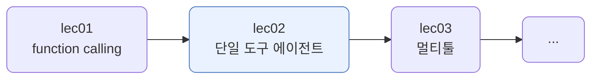
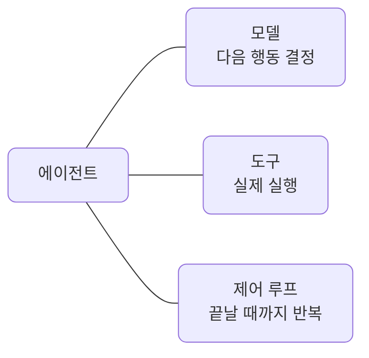
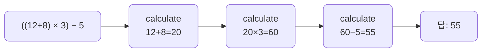
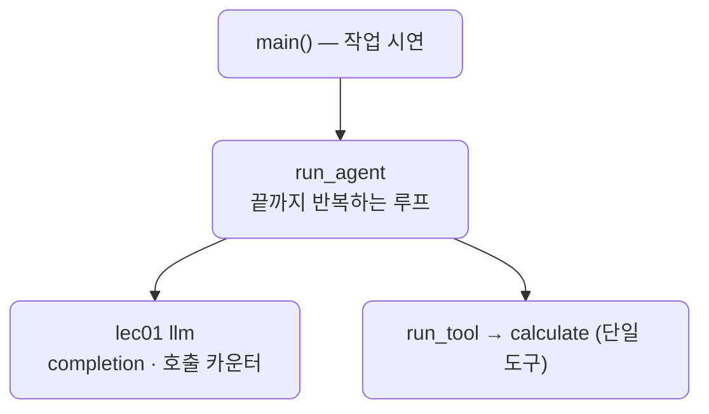

# lec02 — 단일 도구 에이전트

> - S3 개요: [docs/section3/README.md](../README.md)
> - 분량 16분
> - 산출물: 동작 에이전트

## 1. 목표

도구 하나로 한 작업을 끝까지 해내는 에이전트를 만듭니다. lec01에서 function calling 한 바퀴를 봤다면, 여기서는 모델이 도구를 필요한 만큼 반복해서 부르고 스스로 마무리하는 루프를 봅니다.



## 2. 에이전트란 — 모델 + 도구 + 제어 루프

에이전트는 세 가지가 맞물린 것입니다. 모델이 다음 행동을 정하고, 도구가 실제로 실행하고, 제어 루프가 작업이 끝날 때까지 이를 반복합니다.



lec01의 데모는 질문마다 도구를 한 번 부르고 끝났습니다. 에이전트는 한 번으로 끝나지 않는 작업도 다룹니다. 루프가 도구를 여러 번 부르며 한 걸음씩 나아갑니다.

## 3. 한 도구로 여러 스텝

도구가 하나여도, 작업이 여러 단계면 그 도구를 여러 번 부릅니다. 계산기 `calculate`는 한 번에 두 수만 다루므로, 수식이 복잡하면 자연히 여러 스텝이 됩니다.



모델이 매 스텝 다음 계산을 정하고, 직전 결과를 받아 다음 호출의 인자로 씁니다. 도구 호출이 더 없으면 그때가 최종 답입니다. 한 가지 안전장치를 둡니다. 모델이 끝없이 도구를 부르는 일을 막으려고 `max_steps`로 반복 횟수에 상한을 둡니다.

```python
def run_agent(task, max_steps=10):
    messages = [{"role": "system", "content": SYSTEM}, {"role": "user", "content": task}]
    for _ in range(max_steps):
        msg = completion(model, messages, tools=TOOLS, **kwargs).choices[0].message
        messages.append(msg.model_dump())
        if not msg.tool_calls:          # 더 부를 게 없으면 최종 답
            return msg.content
        for call in msg.tool_calls:     # 요청된 도구를 실행해 결과를 다시 넣는다
            result = run_tool(call.function.name, json.loads(call.function.arguments))
            messages.append({"role": "tool", "tool_call_id": call.id, "content": str(result)})
```

호출은 lec01의 `llm`(resolve_model·completion·호출 카운터)을 그대로 씁니다. 도구는 lec01의 `calculate` 하나만 둡니다.

## 4. 예제 코드가 하는 일 및 결과

[agent.py](../../../src/section3/lec02/agent.py)는 다단계 작업과 단일 단계 작업을 각각 에이전트에 맡깁니다.



```bash
uv run python src/section3/lec02/agent.py
```

```text
작업: ((12 + 8) 곱하기 3) 빼기 5는 얼마야?
  1단계: calculate(12, 8, add) = 20
  2단계: calculate(20, 3, multiply) = 60
  3단계: calculate(60, 5, subtract) = 55
  답 (gemini/gemini-2.5-flash): 최종 결과는 55입니다.
  도구 3번 호출 · LLM 4회

작업: 9 더하기 16은?
  1단계: calculate(9, 16, add) = 25
  답 (gemini/gemini-2.5-flash): 9 더하기 16은 25입니다.
  도구 1번 호출 · LLM 2회
```

읽어낼 점입니다.

- 한 도구를 세 번 연쇄로 부릅니다. 모델이 매 스텝 다음 계산을 정하고, 이전 결과를 받아 다음 인자로 씁니다. 이렇게 도구를 반복해 작업을 끝까지 끌고 가는 것이 에이전트의 루프입니다.
- LLM 호출은 4회입니다. 도구를 부르겠다고 정하는 호출 3번에 결과로 답하는 호출 1번입니다. 단순 작업은 호출 1번에 답 1번으로 2회입니다. 작업이 복잡할수록 루프가 더 돕니다.
- 도구는 `calculate` 하나뿐입니다. 여러 도구 중 무엇을 부를지 고르는 라우팅은 lec03에서 다룹니다.

## 5. 정리

- 에이전트는 모델 + 도구 + 제어 루프입니다. 모델이 행동을 정하고 도구가 실행하며, 루프가 작업이 끝날 때까지 반복합니다.
- 도구가 하나여도 작업이 여러 단계면 그 도구를 여러 번 부릅니다. lec01의 한 바퀴를 넘어 루프가 실제로 여러 번 돕니다.
- `max_steps`로 끝없는 반복을 막습니다. LLM 호출 수는 작업의 단계 수만큼 늘어납니다.
- 도구를 하나에서 여럿으로 늘리고, 무엇을 부를지 고르는 라우팅은 다음 단위에서 다룹니다.
