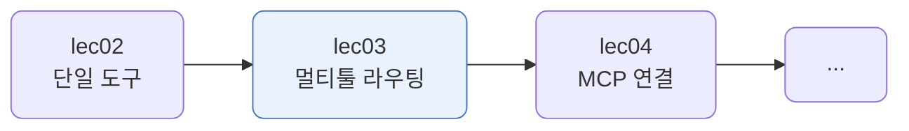
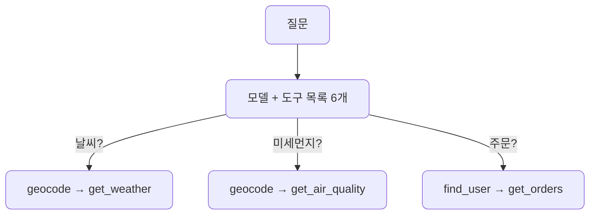
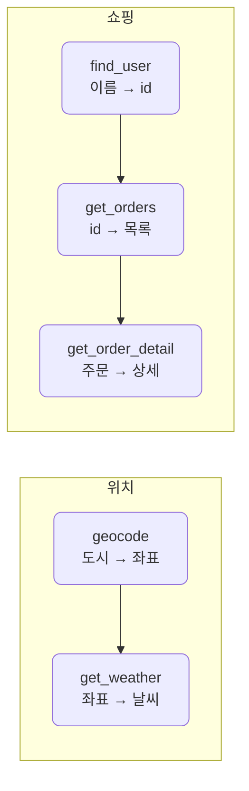
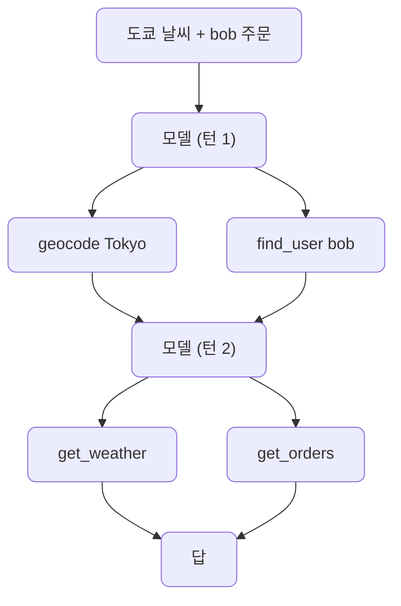
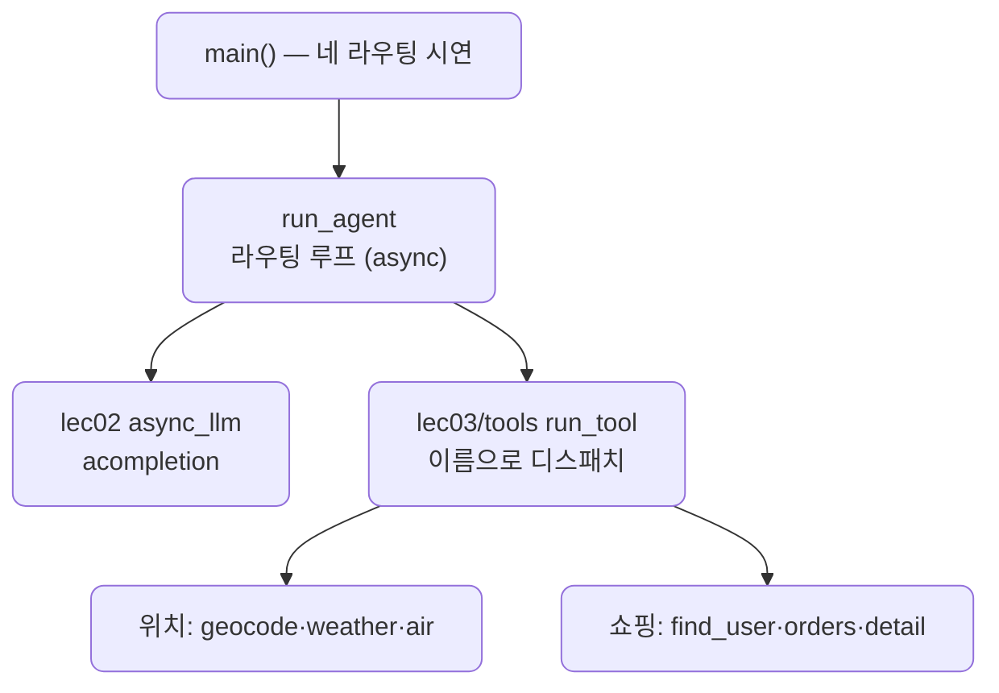

# lec03 — multi-tool agent

> - S3 개요: [docs/section3/README.md](../README.md)
> - 분량 20분
> - 산출물: 멀티툴 에이전트

## 1. 목표

도구가 여러 개일 때 모델이 질문에 맞는 도구를 고르는 라우팅을 다룹니다. lec02가 도구 하나짜리 에이전트였다면, 여기서는 도구 여섯 개를 한 에이전트에 주고, 질문에 따라 알맞은 도구로 가게 합니다. 도구들이 서로 이어지는 연계와, 독립적인 갈래를 동시에 실행하는 것까지 봅니다.



## 2. 라우팅이란 — 도구 목록에서 고르기

라우팅은 모델이 도구 목록을 보고 질문에 맞는 것을 고르는 일입니다. 우리가 if 문으로 분기하지 않습니다. 도구마다 스키마에 적은 설명(description)을 보고 모델이 무엇을 부를지 정합니다. 그래서 도구 설명을 잘 쓰는 것이 라우팅 품질을 좌우합니다.



## 3. 도구 — 두 도메인

서로 다른 두 도메인의 도구를 둡니다. 도메인이 다르면 모델이 라우팅할 거리가 분명해집니다.

| 도메인 | 도구 | 하는 일 | 출처 |
| --- | --- | --- | --- |
| 위치 | `geocode` | 도시 이름 → 위도·경도 | Open-Meteo (무료) |
| 위치 | `get_weather` | 좌표 → 기온·날씨 | Open-Meteo (무료) |
| 위치 | `get_air_quality` | 좌표 → 초미세먼지·등급 | Open-Meteo (무료) |
| 쇼핑 | `find_user` | 이름 → 사용자 id | 목 데이터 |
| 쇼핑 | `get_orders` | id → 주문 목록 | 목 데이터 |
| 쇼핑 | `get_order_detail` | 주문 id → 상세 | 목 데이터 |

위치 도구는 키 없이 쓰는 Open-Meteo를 부릅니다. `geocode`의 `name`은 영어로 줍니다. 검색이 영어로 더 잘 맞습니다. 쇼핑 도구는 네트워크 없이 사전으로 답해, 라우팅·연계에만 집중하게 합니다. 도구는 모두 [lec03/tools](../../../src/section3/lec03/tools)에 단원별로 새로 두었습니다.

도구는 결과를 dict가 아니라 dataclass로 돌려줍니다. `geocode`는 `Location`을, `get_weather`는 `Weather`를 돌려주는 식입니다. 타입으로 출력의 계약이 또렷해지고, 에이전트는 경계에서 `asdict`로 JSON으로 바꿔 모델에 넘깁니다. 없는 도시나 사용자는 `ToolError`로 올려, 성공 리턴 타입을 깨끗하게 둡니다. section1에서 Pydantic으로 LLM이 뱉은 JSON, 곧 못 믿을 입력을 검증했다면, 여기 dataclass는 반대로 우리가 만들어 모델에 보내는 출력의 계약입니다.

## 4. 연계 — 앞 도구의 결과가 다음 입력

도구들이 따로 노는 게 아니라 이어집니다. 날씨를 알려면 먼저 좌표가 필요하고, 주문 상세를 보려면 먼저 사용자와 주문을 찾아야 합니다. 앞 도구의 결과가 다음 도구의 입력이라 순서를 바꿀 수 없습니다.



모델이 이 순서를 스스로 짭니다. "철수의 첫 주문 상세"를 물으면 find_user → get_orders → get_order_detail로 세 단계를 이어 갑니다. 우리는 도구 설명에 "먼저 무엇을 부른다"를 적어 두기만 합니다.

## 5. 도메인 간 라우팅과 병렬

한 질문이 두 도메인에 걸치기도 합니다. "도쿄 날씨 어때? 그리고 bob 주문도 알려줘"는 위치 체인과 쇼핑 체인을 모두 탑니다. 두 체인은 서로 독립적이라, 모델이 한 턴에 둘 다 요청하면 lec02에서 본 `asyncio.gather`로 동시에 실행됩니다.



체인 안은 의존이라 순차지만, geocode 다음에야 weather입니다. 체인끼리는 독립이라 겹칩니다. 곧 라우팅이 갈래를 나누고, 그 갈래 중 독립적인 것을 async가 동시에 굴립니다. 에이전트 루프는 lec02의 async 그대로이고, 다른 점은 도구가 여섯 개로 늘고 이름으로 도구를 찾아 부르는 라우팅이 들어간 것입니다.

```python
results = await asyncio.gather(
    *[run_tool(c.function.name, args) for c, args in ...]   # 한 턴의 호출을 이름으로 찾아 동시에
)
```

## 6. 예제 코드가 하는 일 및 결과

[agent.py](../../../src/section3/lec03/agent.py)는 도구 여섯 개를 한 에이전트에 주고 네 가지 질문을 라우팅합니다.



```bash
uv run python src/section3/lec03/agent.py
```

```text
질문: 서울 날씨랑 미세먼지 알려줘
  → geocode(name=Seoul)
  → get_weather(latitude=37.566, longitude=126.9784)
  → get_air_quality(latitude=37.566, longitude=126.9784)
  답: 서울은 현재 대체로 맑으며, 기온은 18.3°C입니다. 초미세먼지는 24.9㎍/㎥로 보통입니다.
  도구 3번 · LLM 3회

질문: alice의 주문 내역 보여줘
  → find_user(name=alice)
  → get_orders(user_id=U001)
  답: alice의 주문 내역입니다: - 노트북 (주문번호: O100) - 마우스 (주문번호: O101)
  도구 2번 · LLM 3회

질문: 철수의 첫 주문 상세 알려줘
  → find_user(name=철수)
  → get_orders(user_id=U003)
  → get_order_detail(order_id=O300)
  답: 철수의 첫 주문은 모니터이며, 가격은 320000원이고 배송 완료되었습니다.
  도구 3번 · LLM 4회

질문: 도쿄 날씨 어때? 그리고 bob 주문도 알려줘
  → geocode(name=Tokyo)
  → find_user(name=bob)
  → get_weather(latitude=35.6895, longitude=139.69171)
  → get_orders(user_id=U002)
  답: 도쿄의 현재 날씨는 약한 이슬비이며, 기온은 19.2°C입니다. bob의 주문은 키보드(O200)입니다.
  도구 4번 · LLM 3회
```

읽어낼 점입니다.

- 같은 에이전트가 질문에 따라 위치 도구로도, 쇼핑 도구로도 갑니다. 우리가 분기를 짜지 않고, 모델이 도구 설명을 보고 고릅니다.
- 날씨는 geocode로 좌표를 먼저 얻어 넘기고, 주문은 find_user → get_orders로 이어 갑니다. "철수의 첫 주문 상세"는 세 단계까지 이어집니다. 앞 결과가 다음 입력입니다.
- 마지막 질문은 두 도메인에 걸칩니다. 모델이 geocode와 find_user를 한 턴에 함께 요청해, 두 독립 체인이 겹쳐 돕니다. LLM 3회는 턴 1의 두 호출, 턴 2의 두 호출, 그리고 답 한 번입니다.
- 호출 수는 모델이 도구 호출을 몇 턴에 나눠 요청하느냐로 정해집니다. 독립적인 두 호출을 한 턴에 묶으면(서울의 weather·air처럼) 턴이 줄어 LLM 호출도 줄고, 따로 요청하면 늘어납니다. 그래서 같은 질문이라도 실행마다 3회·4회로 조금씩 갈립니다. 다만 lec02에서 본 대로, 그 호출들을 동시에 굴리든 순차로 굴리든 호출 수 자체는 안 바뀝니다. 그건 실행 방식이 아니라 모델이 턴을 어떻게 묶느냐의 문제입니다.
- 기온·미세먼지 값은 실시간이라 실행할 때마다 다릅니다. 위 숫자는 한 번 실행한 예입니다.

## 7. 정리

- 라우팅은 모델이 도구 목록에서 질문에 맞는 도구를 고르는 일입니다. 도구 설명이 라우팅 품질을 좌우합니다.
- 도구는 이어집니다. 앞 도구의 결과가 다음 입력이면 순서를 바꿀 수 없고, 모델이 그 순서를 스스로 짭니다.
- 한 질문이 여러 도메인에 걸치면 독립적인 갈래로 나뉩니다. 그 갈래를 lec02의 async로 동시에 굴려 시간을 줄입니다.
- 도구를 직접 짜는 대신 표준 프로토콜로 외부 도구·데이터에 연결하는 길은 다음 단위에서 다룹니다.
