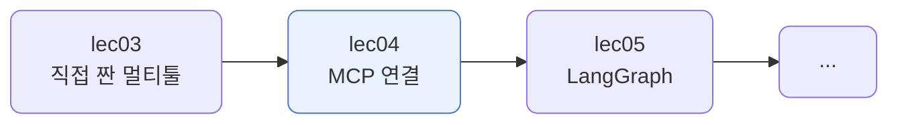
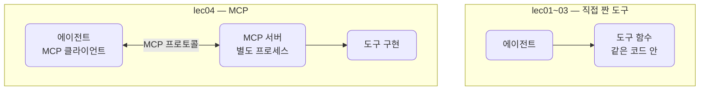
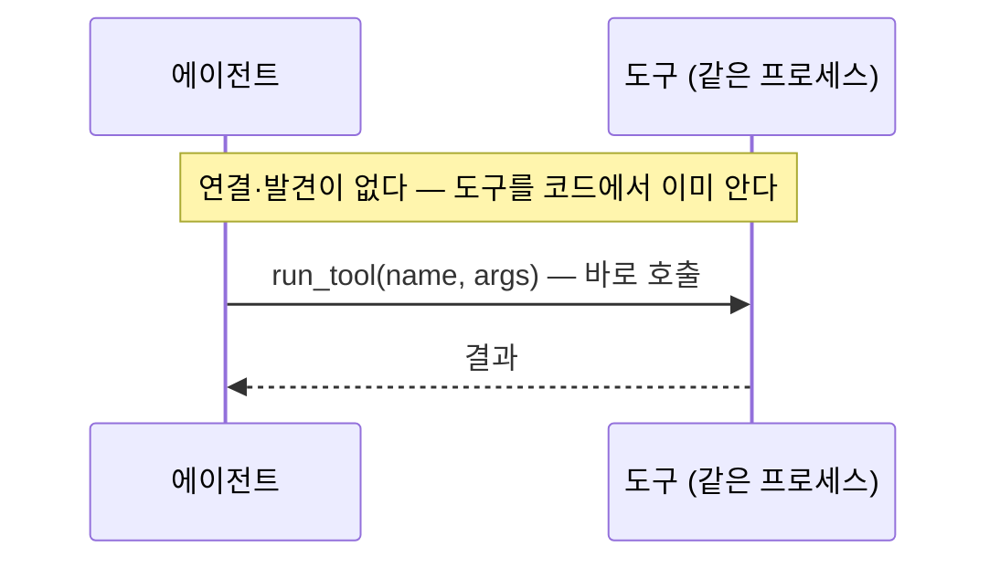
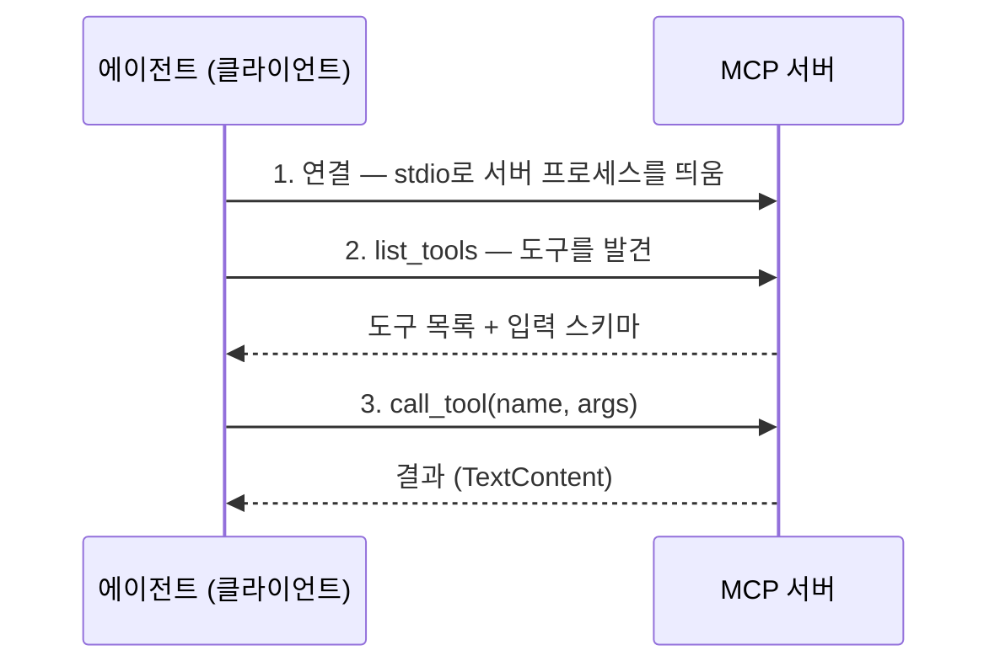
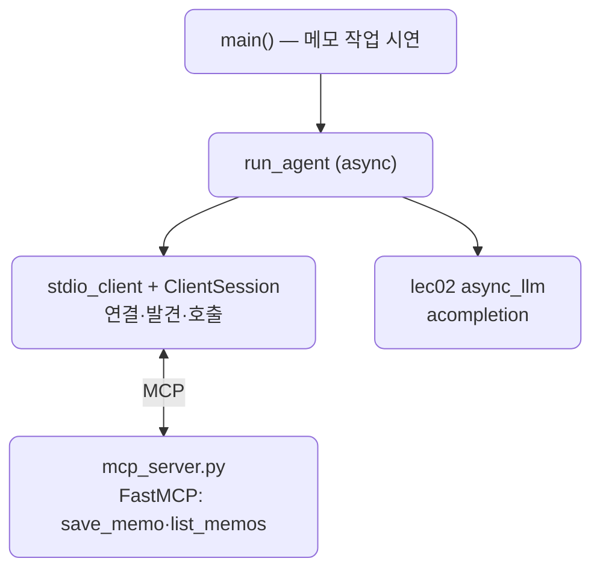

# lec04 — MCP로 도구 연결

> - S3 개요: [docs/section3/README.md](../README.md)
> - 분량 20분
> - 산출물: MCP 연결 에이전트

## 1. 목표

직접 짠 도구를 넘어, MCP(Model Context Protocol) 서버에 연결해 그 서버가 제공하는 도구를 에이전트가 쓰게 합니다. 도구를 매번 손으로 만들지 않고, 표준 규격으로 도구 서버를 꽂아 쓰는 방법을 봅니다. MCP 도구도 결국 모델에는 function calling으로 노출되므로, lec01~03에서 익힌 도구 호출 위에 한 층을 더하는 셈입니다.



## 2. MCP란 — 표준 규격으로 도구를 꽂는다

lec01~03에서는 도구를 우리 코드 안에 직접 짰습니다. MCP는 도구를 별도 서버에 두고, 에이전트가 표준 프로토콜로 그 서버에 연결해 도구를 발견하고 부르게 합니다. 도구의 구현과 목록이 에이전트 밖으로 빠집니다.



이렇게 하면 도구를 매번 손으로 짜지 않고, 이미 있는 MCP 서버를 꽂아 씁니다. 파일시스템·GitHub·데이터베이스 같은 MCP 서버가 공개되어 있고, 같은 방식으로 연결합니다. 서버는 어떤 언어로 짜도 되고, 여러 에이전트가 같은 서버를 나눠 씁니다. 모델 입장에서는 lec01~03과 똑같은 function calling이고, MCP는 그 도구의 출처와 연결 방식을 표준화한 한 층입니다.

## 3. 연결·발견·호출

lec01~03에서는 도구가 에이전트와 같은 프로세스에 있었습니다. 목록을 우리가 코드에 적었으니 발견할 것도 없고, 모델이 고른 도구를 함수로 바로 불렀습니다.



MCP는 도구가 별도 서버에 있어, 먼저 연결하고 어떤 도구가 있는지 발견한 뒤 호출합니다. 흐름이 세 단계로 늘어나는 대신, 도구의 구현과 목록이 에이전트 밖으로 빠집니다.



발견이 핵심입니다. 도구 목록을 우리가 적지 않고 서버에서 받습니다. 서버에 도구를 추가하면 에이전트 코드를 고치지 않아도 다음 연결에서 바로 보입니다. 서버는 살아 있는 프로세스라 상태를 들고 있을 수 있습니다. 우리 메모 서버는 save_memo로 쌓은 메모를 같은 세션 동안 list_memos로 돌려줍니다.

## 4. MCP 도구도 결국 function calling

MCP 도구라고 모델이 특별하게 다루지 않습니다. 서버가 준 입력 스키마(`inputSchema`)를 LiteLLM의 function 스키마로 옮기면, 모델은 lec01~03과 똑같이 도구를 고릅니다. 모델이 도구를 고르면, 우리가 직접 함수를 부르는 대신 `call_tool`로 서버에 위임합니다.

```python
def _to_schema(tool):                    # MCP 도구 → function 스키마
    return {"type": "function", "function": {
        "name": tool.name,
        "description": tool.description,
        "parameters": tool.inputSchema,   # 서버가 준 스키마가 곧 parameters
    }}

# 모델이 고른 도구를 서버에 위임한다
result = await session.call_tool(call.function.name, args)
messages.append({"role": "tool", "tool_call_id": call.id, "content": _result_text(result)})
```

다른 점은 도구의 실행이 우리 프로세스가 아니라 서버에서 일어난다는 것뿐입니다. lec01에서 본 "도구 실행은 우리 쪽"이 여기서는 "도구 실행은 MCP 서버 쪽"으로 바뀝니다.

### 4.1. 동기·병렬·비동기 — MCP는 비동기가 기본

lec02에서 본 순차·병렬·비동기는 MCP에도 적용됩니다. 다만 MCP의 파이썬 SDK는 비동기가 기본입니다. `ClientSession`도 `call_tool`도 코루틴이라, 우리 에이전트가 async인 까닭입니다. 독립적인 도구를 동시에 부르고 싶으면 한 세션에서 `call_tool`을 `asyncio.gather`로 묶으면 됩니다. MCP 프로토콜이 요청을 id로 구분해 다중화하기 때문입니다. 동기로 쓰려면 그 async를 감싸야 하고, 스레드는 이벤트 루프에 묶인 세션과 잘 맞지 않습니다. 그래서 MCP에서는 sync·thread보다 async가 자연스럽습니다.

## 5. 예제 코드가 하는 일 및 결과

[mcp_server.py](../../../src/section3/lec04/mcp_server.py)는 FastMCP로 메모 도구를 노출하는 작은 서버이고, [agent.py](../../../src/section3/lec04/agent.py)는 그 서버에 붙어 도구를 발견·호출하는 에이전트입니다.



```python
# mcp_server.py — FastMCP로 도구를 노출
mcp = FastMCP("memo")

@mcp.tool()
def save_memo(text: str) -> str:
    _memos.append(text)
    return f"저장했습니다. 현재 {len(_memos)}개."
```

```bash
uv run python src/section3/lec04/agent.py
```

```text
질문: 회의 메모로 'API 키 발급'과 '배포 일정 확인'을 저장하고, 전체 목록을 보여줘
  발견한 MCP 도구: ['save_memo', 'list_memos']
  → call_tool save_memo(text=API 키 발급)
  → call_tool save_memo(text=배포 일정 확인)
  → call_tool list_memos()
  답: 두 가지 회의 메모를 저장했습니다. 현재 메모는 API 키 발급, 배포 일정 확인입니다.
  도구 3번 · LLM 4회
```

읽어낼 점입니다.

- 도구 목록을 우리가 적지 않았습니다. `list_tools`로 서버에서 받아, 발견한 도구가 `['save_memo', 'list_memos']`로 찍힙니다. 서버에 도구를 추가하면 에이전트는 그대로 두어도 됩니다.
- save_memo를 두 번 부르고 list_memos로 봅니다. 서버가 상태를 들고 있어 같은 세션 동안 메모가 쌓입니다. 도구 실행이 서버 프로세스에서 일어납니다.
- 모델에게는 lec01~03과 똑같은 function calling입니다. 우리가 직접 함수를 부르는 자리를 `call_tool`이 대신해 서버로 넘길 뿐입니다.

## 6. 정리

- MCP는 도구를 별도 서버에 두고 표준 프로토콜로 연결하는 층입니다. 도구의 구현과 목록이 에이전트 밖으로 빠집니다.
- 흐름은 연결·발견·호출입니다. `list_tools`로 도구를 발견하므로, 서버에 도구를 더하면 에이전트 코드를 고치지 않아도 됩니다.
- 서버는 살아 있는 프로세스라 상태를 들 수 있고, 도구 실행이 서버에서 일어납니다.
- 모델에게는 여전히 function calling입니다. 서버가 준 스키마를 옮기고, 호출을 `call_tool`로 위임할 뿐입니다.
