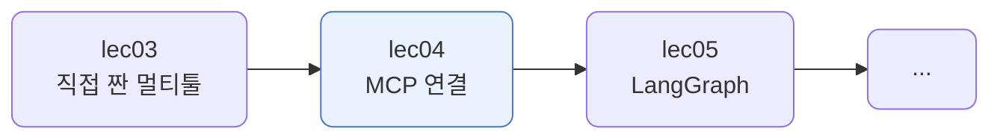
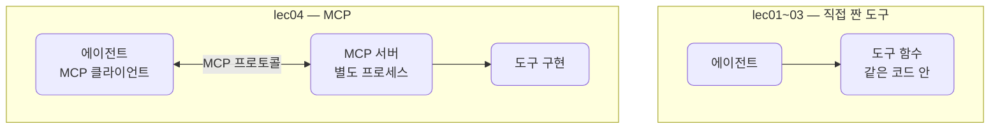
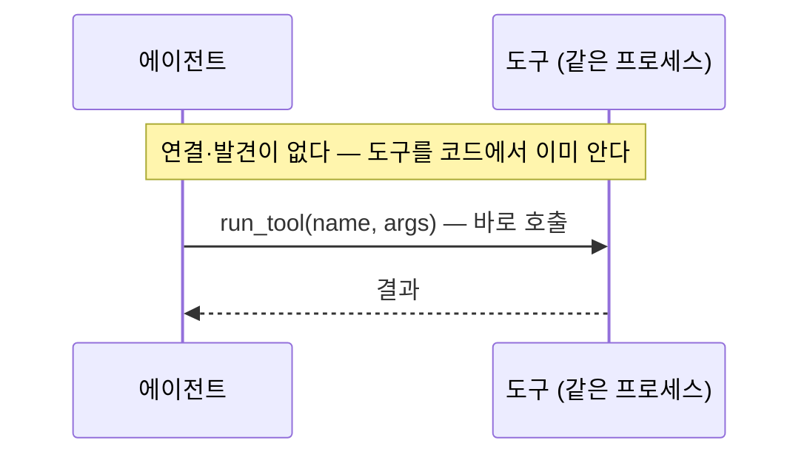
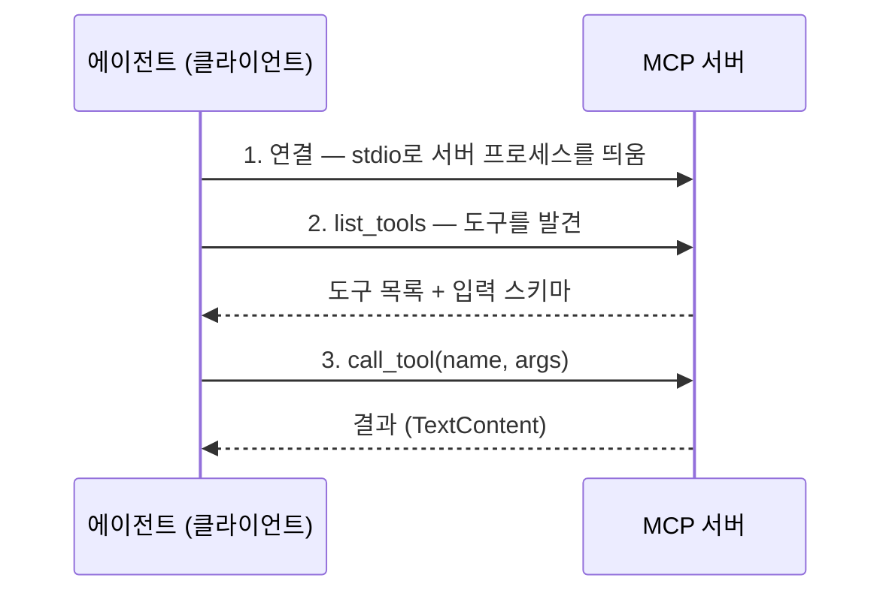
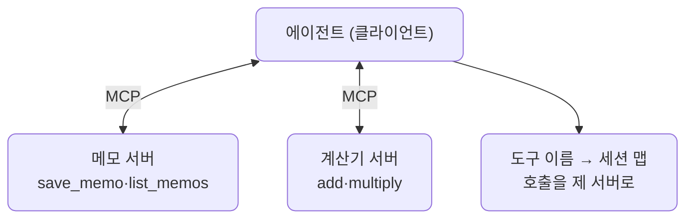
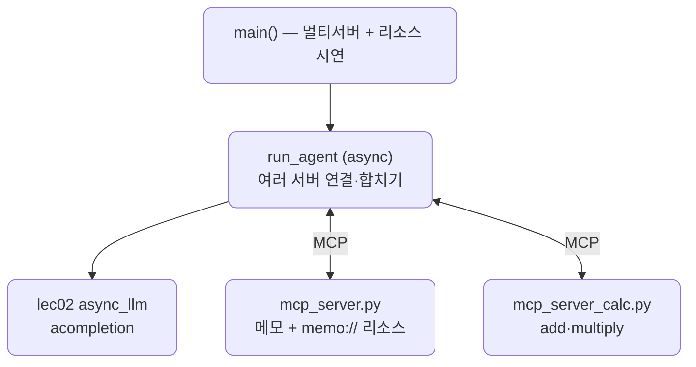

# lec04 — MCP로 도구 연결

> - S3 개요: [docs/section3/README.md](../README.md)
> - 분량 20분
> - 산출물: MCP 연결 에이전트

## 1. 목표

직접 짠 도구를 넘어, MCP(Model Context Protocol) 서버에 연결해 그 서버가 제공하는 도구를 에이전트가 쓰게 합니다. 도구를 매번 손으로 만들지 않고, 표준 규격으로 도구 서버를 꽂아 쓰는 방법을 봅니다. MCP 도구도 결국 모델에는 function calling으로 노출되므로, lec01~03에서 익힌 도구 호출 위에 한 층을 더하는 셈입니다.



## 2. MCP란 — 표준 규격으로 도구를 꽂는다

lec01~03에서는 도구를 우리 코드 안에 직접 짰습니다. MCP는 도구를 별도 서버에 두고, 에이전트가 표준 프로토콜로 그 서버에 연결해 도구를 발견하고 부르게 합니다. 도구의 구현과 목록이 에이전트 밖으로 빠집니다.



이렇게 하면 도구를 매번 손으로 짜지 않고, 이미 있는 MCP 서버를 꽂아 씁니다. 파일시스템·GitHub·데이터베이스 같은 MCP 서버가 공개되어 있고, 같은 방식으로 연결합니다. 서버는 어떤 언어로 짜도 되고, 여러 에이전트가 같은 서버를 나눠 씁니다. 모델 입장에서는 lec01~03과 똑같은 function calling이고, MCP는 그 도구의 출처와 연결 방식을 표준화한 한 층입니다.

## 3. 연결·발견·호출

lec01~03에서는 도구가 에이전트와 같은 프로세스에 있었습니다. 목록을 우리가 코드에 적었으니 발견할 것도 없고, 모델이 고른 도구를 함수로 바로 불렀습니다.



MCP는 도구가 별도 서버에 있어, 먼저 연결하고 어떤 도구가 있는지 발견한 뒤 호출합니다. 흐름이 세 단계로 늘어나는 대신, 도구의 구현과 목록이 에이전트 밖으로 빠집니다.



발견이 핵심입니다. 도구 목록을 우리가 적지 않고 서버에서 받습니다. 서버에 도구를 추가하면 에이전트 코드를 고치지 않아도 다음 연결에서 바로 보입니다. 서버는 살아 있는 프로세스라 상태를 들고 있을 수 있습니다. 우리 메모 서버는 save_memo로 쌓은 메모를 같은 세션 동안 list_memos로 돌려줍니다.

## 4. MCP 도구도 결국 function calling

MCP 도구라고 모델이 특별하게 다루지 않습니다. 서버가 준 입력 스키마(`inputSchema`)를 LiteLLM의 function 스키마로 옮기면, 모델은 lec01~03과 똑같이 도구를 고릅니다. 모델이 도구를 고르면, 우리가 직접 함수를 부르는 대신 `call_tool`로 서버에 위임합니다.

```python
def _to_schema(tool):                    # MCP 도구 → function 스키마
    return {"type": "function", "function": {
        "name": tool.name,
        "description": tool.description,
        "parameters": tool.inputSchema,   # 서버가 준 스키마가 곧 parameters
    }}

# 모델이 고른 도구를 서버에 위임한다
result = await session.call_tool(call.function.name, args)
messages.append({"role": "tool", "tool_call_id": call.id, "content": _result_text(result)})
```

다른 점은 도구의 실행이 우리 프로세스가 아니라 서버에서 일어난다는 것뿐입니다. lec01에서 본 "도구 실행은 우리 쪽"이 여기서는 "도구 실행은 MCP 서버 쪽"으로 바뀝니다.

### 4.1. 동기·병렬·비동기 — MCP는 비동기가 기본

lec02에서 본 순차·병렬·비동기는 MCP에도 적용됩니다. 다만 MCP의 파이썬 SDK는 비동기가 기본입니다. `ClientSession`도 `call_tool`도 코루틴이라, 우리 에이전트가 async인 까닭입니다. 독립적인 도구를 동시에 부르고 싶으면 한 세션에서 `call_tool`을 `asyncio.gather`로 묶으면 됩니다. MCP 프로토콜이 요청을 id로 구분해 다중화하기 때문입니다. 동기로 쓰려면 그 async를 감싸야 하고, 스레드는 이벤트 루프에 묶인 세션과 잘 맞지 않습니다. 그래서 MCP에서는 sync·thread보다 async가 자연스럽습니다.

## 5. 여러 서버를 합친다

서버를 하나만 붙이라는 법은 없습니다. 에이전트가 여러 MCP 서버에 동시에 붙어, 각 서버의 도구를 한 목록으로 합칠 수 있습니다. 실제로 파일시스템 서버, GitHub 서버, 데이터베이스 서버를 함께 꽂아 쓰는 식입니다.



발견 단계에서 모든 서버의 `list_tools`를 모아 하나의 도구 목록으로 만듭니다. 어느 도구가 어느 서버 것인지 이름→세션 맵에 적어 두었다가, 모델이 도구를 고르면 그 도구의 서버로 `call_tool`을 보냅니다. 모델은 도구가 어느 서버에서 오는지 모릅니다. lec03의 라우팅이 한 에이전트 안의 도구들 사이였다면, 여기서는 여러 서버의 도구를 합쳐 그 위에서 라우팅합니다.

```python
async with AsyncExitStack() as stack:
    owner = {}                                   # 도구 이름 → 세션
    for params in servers:                       # 서버마다 연결·발견
        session = await connect(stack, params)
        for tool in (await session.list_tools()).tools:
            tools.append(_to_schema(tool))
            owner[tool.name] = session
    ...
    result = await owner[name].call_tool(name, args)   # 그 도구의 서버로 위임
```

## 6. 도구만이 아니다 — 리소스

MCP 서버가 주는 것은 도구만이 아닙니다. 세 가지 기본 요소가 있습니다.

| 요소 | 무엇 | 메모 서버의 예 |
| --- | --- | --- |
| 도구 (Tools) | 모델이 부르는 행동, 부수효과가 있음 | `save_memo` |
| 리소스 (Resources) | 읽기 전용 데이터, URI로 가리킴 | `memo://all` |
| 프롬프트 (Prompts) | 재사용 프롬프트 템플릿 | 이 단원 범위 밖 |

도구가 "행동"이라면 리소스는 "데이터"입니다. 클라이언트가 `read_resource`로 가져와 맥락에 넣습니다. 부수효과 없이 읽기만 합니다. 메모 서버는 저장된 메모 전체를 `memo://all` 리소스로 노출합니다.

```python
# 서버: 읽기 전용 리소스
@mcp.resource("memo://all")
def all_memos() -> str:
    return "\n".join(f"- {m}" for m in _memos)

# 클라이언트: 발견하고 읽는다
listed = await session.list_resources()
content = await session.read_resource("memo://all")
```

## 7. 전송과 생태계

우리는 서버를 자식 프로세스로 띄우는 stdio 전송을 썼습니다. MCP에는 다른 전송도 있습니다.

| 전송 | 서버 위치 | 쓰임 |
| --- | --- | --- |
| stdio | 로컬 자식 프로세스 | 내 컴퓨터에서 도는 서버, 우리 예제 |
| HTTP/SSE | 원격 | 네트워크 너머의 서버 |

MCP가 표준이라 좋은 점은, 서버를 코드가 아니라 설정으로 꽂는다는 것입니다. Claude Desktop이나 IDE는 `mcpServers` 설정에 서버를 적어 두면 같은 방식으로 연결합니다.

```json
{
  "mcpServers": {
    "memo": { "command": "python", "args": ["src/section3/lec04/mcp_server.py"] },
    "filesystem": { "command": "npx", "args": ["-y", "@modelcontextprotocol/server-filesystem", "/workspace"] }
  }
}
```

우리 메모 서버와 공개된 파일시스템 서버를 똑같이 한 줄로 선언합니다. 이미 나와 있는 서버를 가져다 꽂으면 도구를 직접 짤 일이 줄어듭니다. 이것이 표준 규격으로 꽂는다는 말의 실체입니다.

## 8. 예제 코드가 하는 일 및 결과

[mcp_server.py](../../../src/section3/lec04/mcp_server.py)와 [mcp_server_calc.py](../../../src/section3/lec04/mcp_server_calc.py)는 도구를 노출하는 두 MCP 서버이고, [agent.py](../../../src/section3/lec04/agent.py)는 두 서버에 붙어 도구를 합쳐 쓰는 에이전트입니다.



```bash
uv run python src/section3/lec04/agent.py
```

```text
=== 여러 서버에 붙어 도구를 합쳐 라우팅 ===
질문: 메모로 '배포 일정 확인'을 저장하고, 12 곱하기 8을 계산해줘
  합친 MCP 도구: ['save_memo', 'list_memos', 'add', 'multiply']
  → call_tool save_memo(text=배포 일정 확인)
  → call_tool multiply(a=12, b=8)
  답: '배포 일정 확인'을 저장했습니다. 12 곱하기 8은 96입니다.
  도구 2번 · LLM 2회

=== 도구로 저장하고, 리소스로 읽기 ===
리소스 목록: ['memo://all']
read memo://all →
- 리소스로도 읽힌다
```

읽어낼 점입니다.

- 두 서버의 도구가 `['save_memo', 'list_memos', 'add', 'multiply']` 한 목록으로 합쳐집니다. 모델은 어느 도구가 어느 서버 것인지 모릅니다.
- 모델이 메모 저장과 곱셈을 한 번에 요청하고, 각 호출이 제 서버로 갑니다. save_memo는 메모 서버로, multiply는 계산기 서버로 갑니다.
- 도구로 저장한 메모를 리소스 `memo://all`로 다시 읽습니다. 도구는 행동이고 리소스는 데이터라, 같은 서버가 둘을 함께 노출합니다.

## 9. 정리

- MCP는 도구를 별도 서버에 두고 표준 프로토콜로 연결하는 층입니다. 도구의 구현과 목록이 에이전트 밖으로 빠집니다.
- 흐름은 연결·발견·호출입니다. `list_tools`로 발견하므로 서버에 도구를 더해도 에이전트 코드를 고치지 않습니다.
- 서버는 여럿을 한꺼번에 붙여 도구를 합칠 수 있고, 도구 외에 리소스 같은 데이터도 노출합니다.
- 전송과 설정이 표준이라, 이미 나온 서버를 코드가 아니라 설정으로 꽂아 씁니다. 모델에게는 여전히 function calling입니다.
