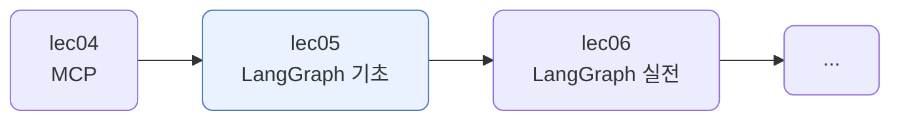
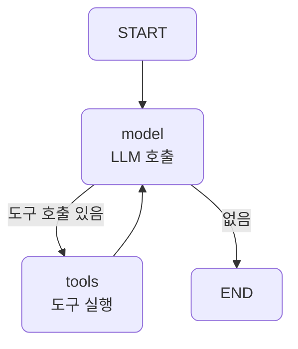
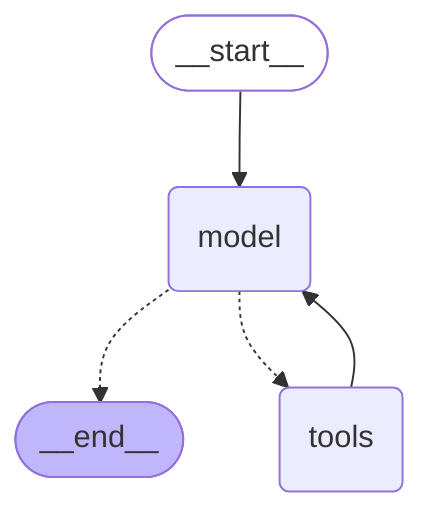

# lec05 — LangGraph 기초

> - S3 개요: [docs/section3/README.md](../README.md)
> - 분량 18분
> - 산출물: 최소 그래프

## 1. 목표

LangGraph의 상태·노드·엣지 개념으로 에이전트 흐름을 그래프로 표현하는 최소 예제를 만듭니다. lec02~03에서 손으로 짠 제어 루프를 그래프로 옮겨, 흐름을 눈에 보이게 합니다. 도구는 lec03 것을 그대로 쓰고, 바뀌는 것은 흐름의 표현뿐입니다.



## 2. 상태·노드·엣지 — 그래프의 세 부품

LangGraph는 흐름을 세 부품으로 짭니다.

| 부품 | 무엇 | 우리 그래프의 예 |
| --- | --- | --- |
| 상태 (State) | 노드 사이를 흐르는 데이터 | `messages`, 리듀서로 누적 |
| 노드 (Node) | 상태를 받아 갱신하는 함수 | `model`(LLM 호출), `tools`(도구 실행) |
| 엣지 (Edge) | 노드를 잇는 선, 조건부도 가능 | `model`→(조건)→`tools`/END, `tools`→`model` |

상태는 노드가 돌려준 값을 리듀서로 합칩니다. 우리는 `messages`를 `operator.add`로 이어 붙여 대화가 쌓이게 합니다. 조건 엣지는 분기를 만듭니다. `model` 다음에 도구 호출이 있으면 `tools`로, 없으면 END로 갑니다.

```python
class State(TypedDict):
    messages: Annotated[list, operator.add]   # 노드가 돌려준 messages를 이어 붙임
```

## 3. 손으로 짠 루프 → 그래프

lec02~03에서는 같은 흐름을 `for` 루프와 `if` 문으로 짰습니다. 흐름이 코드 안에 숨어 있었습니다.

```python
for _ in range(max_steps):                 # 루프가 코드 안에
    msg = (await acompletion(...)).choices[0].message
    if not msg.tool_calls:                 # 분기도 if 문으로
        return msg.content
    for call in msg.tool_calls:
        ... run_tool ...                   # 도구 실행 후 다시 위로
```

LangGraph는 그 흐름을 노드와 엣지로 드러냅니다. 루프는 되돌아오는 엣지가 되고, 분기는 조건 엣지가 됩니다.

```python
graph = StateGraph(State)
graph.add_node("model", call_model)
graph.add_node("tools", run_tools)
graph.add_edge(START, "model")
graph.add_conditional_edges("model", should_continue, {"tools": "tools", END: END})  # 분기
graph.add_edge("tools", "model")           # 루프 = 되돌아오는 엣지
app = graph.compile()
```



`call_model`은 도구 목록과 함께 모델을 부르고, `should_continue`는 도구 호출이 남았는지 보고 `tools` 또는 END를 돌려줍니다. `run_tools`는 lec03의 도구를 실행해 결과를 상태에 누적합니다. 도구도, 직렬화도 lec03 그대로입니다.

## 4. 그래프가 스스로 그린다

그래프를 컴파일하면 그 구조를 mermaid로 뽑을 수 있습니다. 우리가 그림을 그리는 게 아니라, 그래프가 자기 모습을 그립니다.

```python
print(APP.get_graph().draw_mermaid())
```



실선은 고정 엣지, 점선은 조건 엣지입니다. `model`에서 점선이 둘로 갈라져 `tools` 또는 END로 가고, `tools`에서 `model`로 실선이 돌아옵니다. 위에서 우리가 그린 그림과 같은 흐름입니다. 노드와 엣지가 코드에 또렷이 박혀 있으니 도구가 이렇게 자동으로 그려집니다.

## 5. 예제 코드가 하는 일 및 결과

[graph.py](../../../src/section3/lec05/graph.py)는 위 그래프를 짜고, lec03의 멀티툴 작업을 그래프로 돌립니다.

```bash
uv run python src/section3/lec05/graph.py
```

```text
질문: 서울 날씨 알려주고, alice 주문 내역도 보여줘
  도구 자취: ['geocode', 'find_user', 'get_weather', 'get_orders']
  답: 서울은 현재 기온은 17.5°C 이고 대체로 맑습니다.
      Alice님의 주문 내역은 - 노트북(O100), 마우스(O101)입니다.
```

읽어낼 점입니다.

- 도구는 lec03 그대로입니다. 같은 멀티툴 라우팅·연계가 일어나고, 바뀐 것은 제어 흐름을 `for` 루프 대신 그래프로 표현한 것뿐입니다.
- 자취를 보면 `model`과 `tools`를 두 바퀴 돕니다. geocode·find_user를 부르고, 그 결과로 weather·orders를 부른 뒤 답합니다. `tools`→`model` 엣지가 이 루프를 만듭니다.
- 분기는 `should_continue` 조건 엣지가 정합니다. 도구 호출이 더 없을 때 END로 가 끝납니다.

## 6. 정리

- LangGraph는 흐름을 상태·노드·엣지로 짭니다. 코드 안에 숨던 루프와 분기가 그래프로 드러납니다.
- 손으로 짠 제어 루프를 그래프로 옮겼습니다. 도구는 lec03 그대로이고, 표현만 바뀝니다.
- 조건 엣지가 분기를, 되돌아오는 엣지가 루프를 만듭니다. 상태는 리듀서로 누적합니다.
- 그래프는 스스로 다이어그램을 그립니다. 분기와 루프가 복잡해질수록 이 가시성이 값을 합니다. 분기·루프가 더 있는 실전 그래프는 다음 단위에서 다룹니다.
