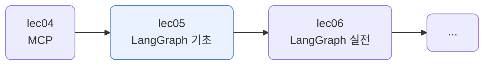
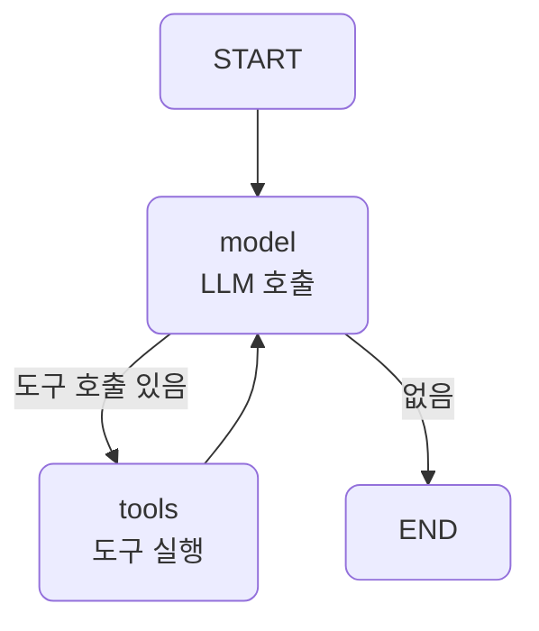
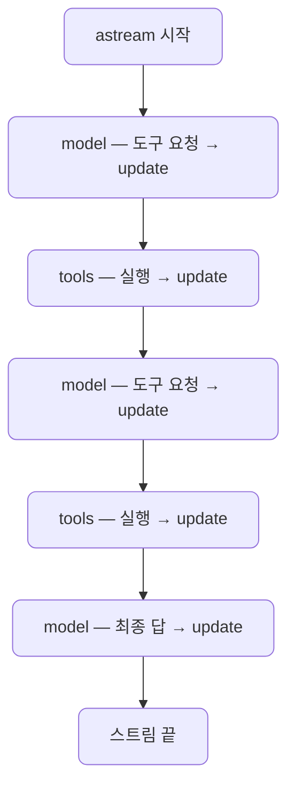
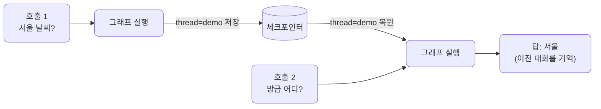

# lec05 — LangGraph 기초

> - S3 개요: [docs/section3/README.md](../README.md)
> - 분량 22분
> - 산출물: 최소 그래프

## 1. 목표

LangGraph의 상태·노드·엣지 개념으로 에이전트 흐름을 그래프로 표현하는 최소 예제를 만듭니다. lec02~03에서 손으로 짠 제어 루프를 그래프로 옮겨, 흐름을 눈에 보이게 합니다. 도구는 lec03 것을 그대로 쓰고, 바뀌는 것은 흐름의 표현뿐입니다.



## 2. 상태·노드·엣지 — 그래프의 세 부품

LangGraph는 흐름을 세 부품으로 짭니다.

| 부품 | 무엇 | 우리 그래프의 예 |
| --- | --- | --- |
| 상태 (State) | 노드 사이를 흐르는 데이터 | `messages`, 리듀서로 누적 |
| 노드 (Node) | 상태를 받아 갱신하는 함수 | `model`(LLM 호출), `tools`(도구 실행) |
| 엣지 (Edge) | 노드를 잇는 선, 조건부도 가능 | `model`→(조건)→`tools`/END, `tools`→`model` |

상태는 노드가 돌려준 값을 리듀서로 합칩니다. 채널마다 리듀서를 지정합니다. 우리 상태는 두 채널을 둡니다. `messages`는 대화를, `tools_used`는 부른 도구 이름을 모읍니다. 둘 다 `operator.add`로 이어 붙입니다.

```python
class State(TypedDict):
    messages: Annotated[list, operator.add]         # 대화를 이어 붙임
    tools_used: Annotated[list[str], operator.add]  # 부른 도구 이름을 이어 붙임
```

노드는 갱신할 채널만 부분적으로 돌려주고, 리듀서가 기존 값과 합칩니다. `tools` 노드가 `{"tools_used": ["geocode"]}`를 돌려주면 `operator.add`가 기존 목록 뒤에 붙입니다. 메시지 채널에는 LangChain의 `add_messages` 리듀서가 흔히 쓰이지만, 같은 id면 갱신하고 아니면 추가하는 식입니다. 우리 메시지는 OpenAI dict라 단순한 `operator.add`를 씁니다.

조건 엣지는 분기를 만듭니다. `model` 다음에 도구 호출이 있으면 `tools`로, 없으면 END로 갑니다.

## 3. 손으로 짠 루프 → 그래프

lec02~03에서는 같은 흐름을 `for` 루프와 `if` 문으로 짰습니다. 흐름이 코드 안에 숨어 있었습니다.

```python
for _ in range(max_steps):                 # 루프가 코드 안에
    msg = (await acompletion(...)).choices[0].message
    if not msg.tool_calls:                 # 분기도 if 문으로
        return msg.content
    for call in msg.tool_calls:
        ... run_tool ...                   # 도구 실행 후 다시 위로
```

LangGraph는 그 흐름을 노드와 엣지로 드러냅니다. 루프는 되돌아오는 엣지가 되고, 분기는 조건 엣지가 됩니다.

```python
graph = StateGraph(State)
graph.add_node("model", call_model)
graph.add_node("tools", run_tools)
graph.add_edge(START, "model")
graph.add_conditional_edges("model", should_continue, {"tools": "tools", END: END})  # 분기
graph.add_edge("tools", "model")           # 루프 = 되돌아오는 엣지
app = graph.compile()
```



`call_model`은 도구 목록과 함께 모델을 부르고, `should_continue`는 도구 호출이 남았는지 보고 `tools` 또는 END를 돌려줍니다. `run_tools`는 lec03의 도구를 실행해 결과를 상태에 누적합니다. 도구도, 직렬화도 lec03 그대로입니다.

## 4. 그래프가 스스로 그린다

그래프를 컴파일하면 그 구조를 mermaid로 뽑을 수 있습니다. 우리가 그림을 그리는 게 아니라, 그래프가 자기 모습을 그립니다.

```python
print(APP.get_graph().draw_mermaid())
```


실선은 고정 엣지, 점선은 조건 엣지입니다. `model`에서 점선이 둘로 갈라져 `tools` 또는 END로 가고, `tools`에서 `model`로 실선이 돌아옵니다. 위에서 우리가 그린 그림과 같은 흐름입니다. 노드와 엣지가 코드에 또렷이 박혀 있으니 도구가 이렇게 자동으로 그려집니다.

## 5. 노드별로 도는 과정을 본다 — 스트리밍

`ainvoke`는 최종 상태만 돌려줍니다. `astream`은 노드가 끝날 때마다 그 노드의 갱신을 내줍니다. 그래프가 걸어가는 과정을 그대로 볼 수 있습니다.

```python
async for update in APP.astream(initial, stream_mode="updates"):
    for node, delta in update.items():   # 어느 노드가 무엇을 갱신했는지
        ...
```

`stream_mode="updates"`는 각 노드가 돌려준 상태 변화를 내줍니다. model이 도구를 요청하고, tools가 실행하고, 다시 model로 돌아오는 한 걸음 한 걸음이 찍힙니다. 결과만 보는 게 아니라 흐름을 관찰합니다.



## 6. 호출 간 기억 — 체크포인트

손으로 짠 루프는 호출이 끝나면 상태가 사라집니다. 다음 질문을 하려면 이전 대화를 직접 다시 넘겨야 합니다. LangGraph는 체크포인터를 붙이면 `thread_id`별로 상태를 저장해, 다음 호출이 이어 가게 합니다.

```python
app = build_graph(checkpointer=MemorySaver())
config = {"configurable": {"thread_id": "demo"}}

await app.ainvoke(_initial("서울 날씨 알려줘"), config)
# 둘째 호출 — 이전 대화를 다시 넘기지 않는다
state = await app.ainvoke(
    {"messages": [{"role": "user", "content": "방금 어디 날씨 물어봤지?"}]}, config
)
# → "서울 날씨를 물어보셨습니다."
```

둘째 호출에 이전 대화를 싣지 않았는데도 "서울"을 기억합니다. 같은 `thread_id`의 저장된 상태를 체크포인터가 불러와 이어 붙이기 때문입니다. 여기서는 메모리에 담는 `MemorySaver`를 썼지만, DB에 담는 체크포인터로 바꾸면 프로세스를 껐다 켜도 대화가 이어집니다.



체크포인터를 고르는 것은 모델이 아니라 우리 코드입니다. `thread_id`가 대화를 가릅니다. 그것을 사용자나 세션 id에 매핑해 두면 그 사람의 대화만 이어지고, 다른 `thread_id`는 완전히 별개라 서로를 모릅니다. 모델은 체크포인터의 존재조차 모르고 복원된 메시지만 받을 뿐, 어느 체크포인트를 쓸지 판단하지 않습니다. 한 `thread_id` 안에는 노드를 지날 때마다 스냅샷이 하나씩 쌓여 여럿이 됩니다. 기본은 가장 최신을 불러오고, 필요하면 과거 스냅샷으로 되감을 수도 있습니다.

[graph.py](../../../src/section3/lec05/graph.py)는 위 그래프를 짜고, 기본 실행·스트리밍·체크포인트를 차례로 보입니다.

```bash
uv run python src/section3/lec05/graph.py
```

```text
=== 기본 실행 ===
tools_used: ['geocode', 'find_user', 'get_weather', 'get_orders']
답: 서울 날씨는 구름 조금이며, 온도는 17.5도입니다. Alice님 주문: 노트북(O100), 마우스(O101)

=== 스트리밍 (노드별로 도는 과정) ===
질문: 도쿄 날씨 알려주고, bob 주문도 보여줘
  [model] 도구 요청 → geocode, find_user
  [tools] 실행 → ['geocode', 'find_user']
  [model] 도구 요청 → get_weather, get_orders
  [tools] 실행 → ['get_weather', 'get_orders']
  [model] 최종 답

=== 체크포인트 (호출 간 기억) ===
둘째 질문 답: 서울 날씨를 물어보셨습니다.
```

읽어낼 점입니다.

- 도구는 lec03 그대로입니다. `tools_used` 채널에 부른 도구가 쌓여, 자취를 따로 모으지 않아도 상태에 남습니다.
- 스트리밍을 보면 `model`→`tools`→`model`→`tools`→`model`로 그래프가 걸어갑니다. model이 도구를 요청하고 tools가 실행하기를 두 바퀴 돈 뒤 마지막에 답합니다. `tools`→`model` 엣지가 이 루프입니다.
- 체크포인트 덕에 둘째 질문이 첫째를 기억합니다. 이전 대화를 다시 넘기지 않았는데 "서울"을 답합니다.

## 8. 왜 LangGraph인가 — 정리

손으로 짠 루프로도 같은 일을 합니다. LangGraph로 옮겨 얻는 것은 흐름을 다루는 도구들입니다.

| | 손으로 짠 루프 | LangGraph |
| --- | --- | --- |
| 흐름 | `for`·`if` 안에 숨음 | 노드·엣지로 드러남 |
| 그림 | 직접 그림 | `draw_mermaid`로 자동 |
| 과정 관찰 | print를 박음 | `stream`으로 노드별 |
| 기억 | 직접 상태 관리 | 체크포인터 + `thread_id` |
| 분기·루프 | `if`·`while` | 조건 엣지·되돌아오는 엣지 |

- 흐름을 상태·노드·엣지로 짜면, 코드 안에 숨던 루프와 분기가 그래프로 드러나고 스스로 그려집니다.
- 상태는 리듀서로 누적하고 채널을 여럿 둘 수 있습니다. 스트리밍으로 과정을 보고, 체크포인터로 호출 간 기억을 얻습니다.
- 도구는 lec03 그대로입니다. 바뀐 것은 흐름의 표현뿐인데, 그 표현이 가시성·스트리밍·기억을 딸려 옵니다.
- 분기와 루프가 더 많은 실전 그래프는 다음 단위에서 다룹니다.
