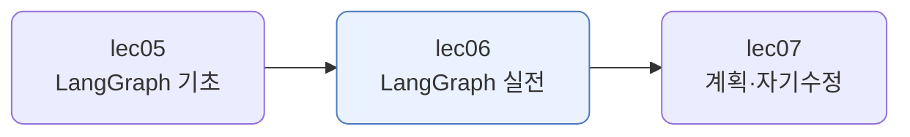
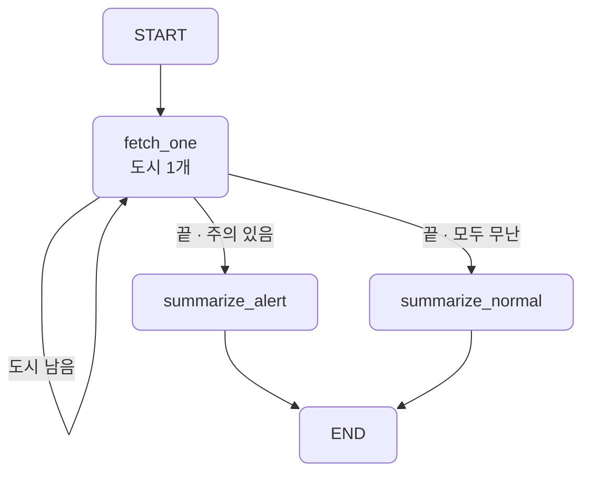
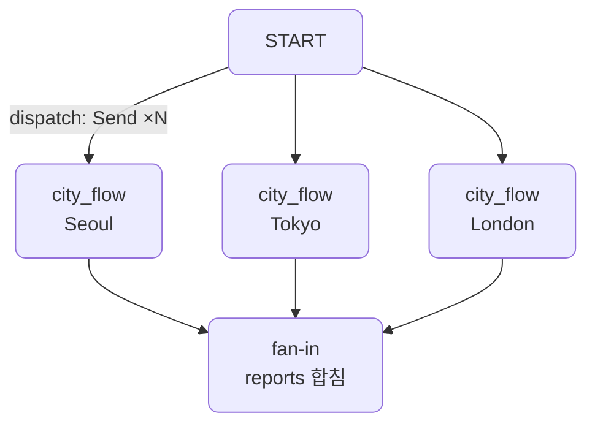
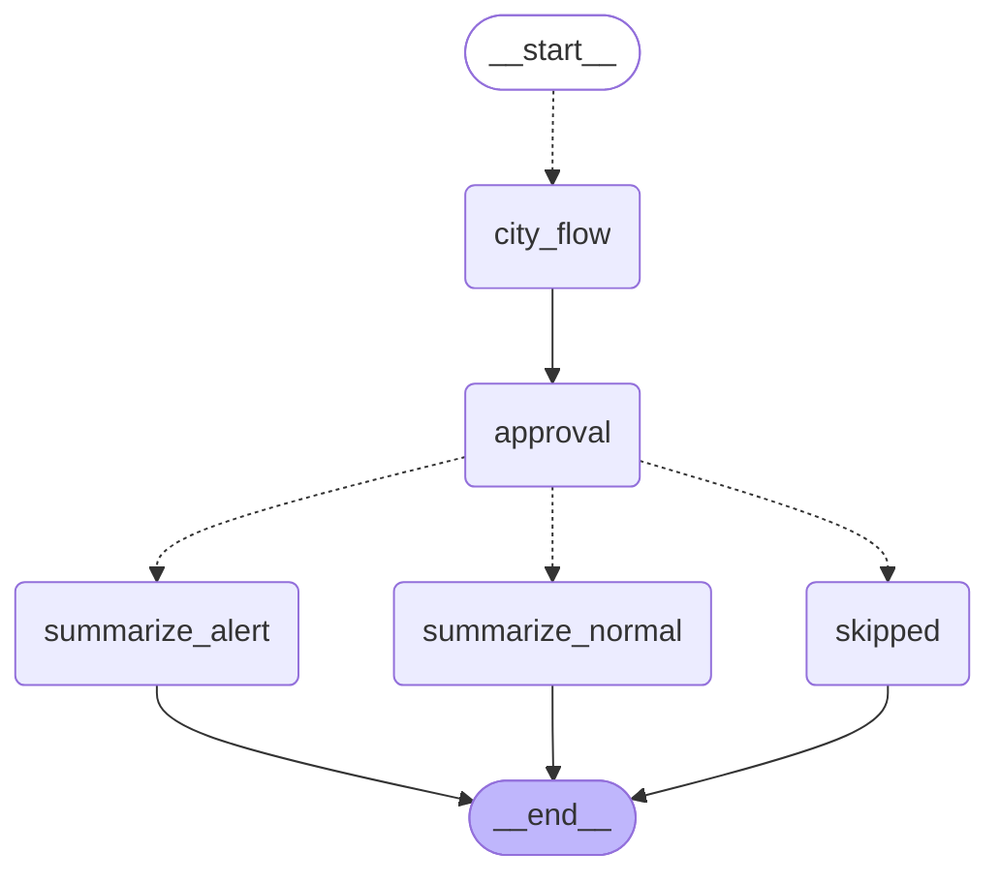

# lec06 — LangGraph 실전

> - S3 개요: [docs/section3/README.md](../README.md)
> - 분량 22분
> - 산출물: 자동화 그래프

## 1. 목표

분기와 루프가 있는 흐름을 LangGraph로 짭니다. 조건에 따라 도구를 반복 호출하거나 갈래를 나누는 자동화 그래프를 만들고, 병렬·서브그래프·재시도·사람 개입 같은 실전 패턴을 더합니다. lec05의 그래프가 모델이 운전하는 에이전트였다면, 여기서는 흐름을 우리가 설계합니다.



## 2. 모델이 운전하나, 우리가 설계하나

lec05의 그래프는 에이전트였습니다. 모델이 매 스텝 무엇을 할지 정했습니다. lec06은 다릅니다. 흐름을 우리가 노드와 엣지로 설계하고, 도구는 정해진 자리에서 자동으로 불립니다. 그래프가 에이전트가 아니라 워크플로 엔진이 됩니다.

| | lec05 (기초) | lec06 (실전) |
| --- | --- | --- |
| 흐름을 정하는 주체 | 모델이 매 스텝 | 우리가 노드·엣지로 |
| 그래프 성격 | 에이전트 루프 | 워크플로 자동화 |
| 도구 호출 | 모델이 고름 | 정해진 자리에서 자동 |
| 루프·분기 | model↔tools 한 루프 | 우리가 짠 루프 + 갈래 |

여기서는 도시 목록의 날씨 브리핑을 자동으로 만듭니다. 먼저 순차 루프로 기본형을 짜고, 그다음 실전 패턴으로 끌어올립니다.

## 3. 순차 루프 + 분기 — 한 조건 엣지로

[graph.py](../../../src/section3/lec06/graph.py)의 기본형입니다. `fetch_one`이 도시 하나의 날씨를 가져와 `index`를 한 칸 밀고, `route`가 어디로 갈지 정합니다.

```python
def route(state):
    if state["index"] < len(state["cities"]):
        return "fetch_one"          # 루프: 다음 도시로 되돌아감
    if any(r["warn"] for r in state["reports"]):
        return "summarize_alert"    # 갈래: 주의 도시 있음
    return "summarize_normal"       # 갈래: 모두 무난
```

한 조건 엣지가 셋을 가립니다. 도시가 남았으면 `fetch_one`으로 되돌아가 루프를 돌고, 다 처리했으면 비·눈 도시가 있는지 보고 알림형·일반형으로 갈래를 나눕니다.



이 기본형을 [briefing.py](../../../src/section3/lec06/briefing.py)에서 실전 패턴으로 키웁니다. 도시를 하나씩 도는 대신 한꺼번에 병렬로 처리하고, 한 도시 처리를 서브그래프로 떼고, 실패를 재시도하고, 발송 전 사람의 승인을 받습니다.

## 4. 병렬 fan-out과 서브그래프

순차 루프는 도시를 하나씩 처리합니다. lec02에서 본 것처럼, 서로 독립적인 일은 동시에 하는 게 빠릅니다. LangGraph는 `Send`로 한꺼번에 흩뿌립니다. `dispatch`가 도시마다 `Send`를 만들어 `city_flow`로 보내면 모두 병렬로 돕니다. 끝나면 결과가 리듀서로 합쳐집니다. 흩뿌렸다 다시 모으는 이 합류를 fan-in이라 합니다.

```python
def dispatch(state):
    return [Send("city_flow", {"city": c, "reports": []}) for c in state["cities"]]

graph.add_conditional_edges(START, dispatch, ["city_flow"])  # Send fan-out
graph.add_edge("city_flow", "approval")                      # 모두 끝나면 fan-in
```



`city_flow`는 도시 하나를 처리하는 작은 그래프입니다. 그래프를 컴파일해 노드로 끼웁니다. 큰 그래프를 작은 그래프의 조립으로 짤 수 있습니다.

```python
city = StateGraph(CityState)
city.add_node("fetch", fetch_city, retry=RetryPolicy(max_attempts=3))
city.add_edge(START, "fetch"); city.add_edge("fetch", END)
CITY_FLOW = city.compile()

graph.add_node("city_flow", CITY_FLOW)   # 서브그래프를 노드로
```

## 5. 재시도와 에러 처리

자동화는 실패를 견뎌야 합니다. `city_flow`의 `fetch` 노드에 `RetryPolicy`를 달면, 일시적 네트워크 오류로 실패할 때 자동으로 다시 시도합니다.

```python
graph.add_node("fetch", fetch_city, retry=RetryPolicy(max_attempts=3))
```

없는 도시처럼 다시 시도해도 소용없는 실패는 `ToolError`로 잡아 실패 보고로 남깁니다. 한 도시가 실패해도 전체가 멈추지 않고, 나머지 도시의 브리핑은 그대로 나옵니다.

```python
async def fetch_city(state):
    try:
        loc = await geocode(state["city"])      # 네트워크 오류면 RetryPolicy가 재시도
        weather = await get_weather(loc.latitude, loc.longitude)
        report = {"city": ..., "warn": ...}
    except ToolError as exc:                     # 없는 도시 등은 실패 보고로
        report = {"city": state["city"], "error": str(exc), "warn": False}
    return {"reports": [report]}
```

## 6. 사람 개입 — interrupt

자동화라도 중요한 순간에는 사람의 결정을 받아야 합니다. 브리핑을 발송하기 전, `approval` 노드가 `interrupt`로 그래프를 멈춥니다. 그래프는 상태를 저장한 채 멈추고, 무엇을 물어보는지 돌려줍니다.

```python
def approval(state):
    warned = [r["city"] for r in state["reports"] if r.get("warn")]
    ok = interrupt({"질문": "브리핑을 발송할까요?", "주의_도시": warned})  # 여기서 멈춤
    return {"approved": bool(ok)}
```

사람이 결정하면 `Command(resume=...)`로 같은 자리에서 재개합니다. 승인이면 요약으로, 거절이면 발송을 건너뜁니다. 멈췄다 이어 가려면 상태가 저장돼 있어야 하므로, 그래프를 체크포인터와 함께 컴파일합니다. lec05에서 쓴 그 체크포인터입니다.

```python
out = await app.ainvoke(initial, config)       # approval에서 멈춤
if "__interrupt__" in out:
    out = await app.ainvoke(Command(resume=True), config)  # 사람 승인 → 재개
```

## 7. 예제 코드가 하는 일 및 결과

[briefing.py](../../../src/section3/lec06/briefing.py)는 네 패턴을 한 그래프에 엮습니다. 병렬로 모으고, 실패는 견디고, 발송 전 멈춰 승인을 받고, 갈래로 요약합니다.



```bash
uv run python src/section3/lec06/briefing.py
```

```text
=== 병렬 수집 → 사람 승인 → 발송 ===
병렬로 수집한 보고:
Seoul: 17.4도, 흐림
Nowhereville123: 조회 실패
Tokyo: 18.4도, 대체로 맑음

[중단] 승인 요청: {'질문': '브리핑을 발송할까요?', '주의_도시': []}
[사람] 승인 → 재개

브리핑: 현재 서울은 17.4도로 흐린 날씨를 보이고 있습니다. 도쿄는 18.4도에 대체로 맑겠습니다.
```

읽어낼 점입니다.

- 세 도시를 `Send`로 한꺼번에 흩뿌려 병렬로 모읍니다. `city_flow` 서브그래프가 도시마다 한 번씩 돕니다.
- `Nowhereville123`은 없는 도시라 조회에 실패하지만, 실패 보고로 남고 전체는 멈추지 않습니다. 일시적 네트워크 오류였다면 `RetryPolicy`가 다시 시도했을 것입니다.
- `approval`에서 그래프가 멈추고 승인을 요청합니다. 사람이 승인하자 `Command`로 재개해 요약을 만듭니다. 거절했다면 발송을 건너뛰었을 것입니다.

## 8. 정리

- 실전 그래프는 흐름을 우리가 설계합니다. 노드·엣지로 루프와 분기를 직접 짜고, 한 조건 엣지가 루프와 분기를 함께 정할 수 있습니다.
- `Send`로 독립적인 일을 병렬로 흩뿌리고, 서브그래프로 한 조각을 떼어 노드로 합성합니다.
- `RetryPolicy`로 일시적 실패를 재시도하고, 잡을 수 있는 오류는 갈무리해 전체가 멈추지 않게 합니다.
- `interrupt`로 사람의 결정을 받고 `Command`로 재개합니다. 멈췄다 이어 가려면 체크포인터가 받쳐 줍니다.
