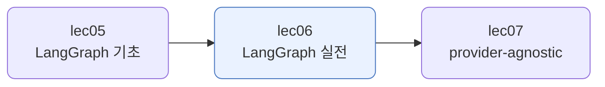
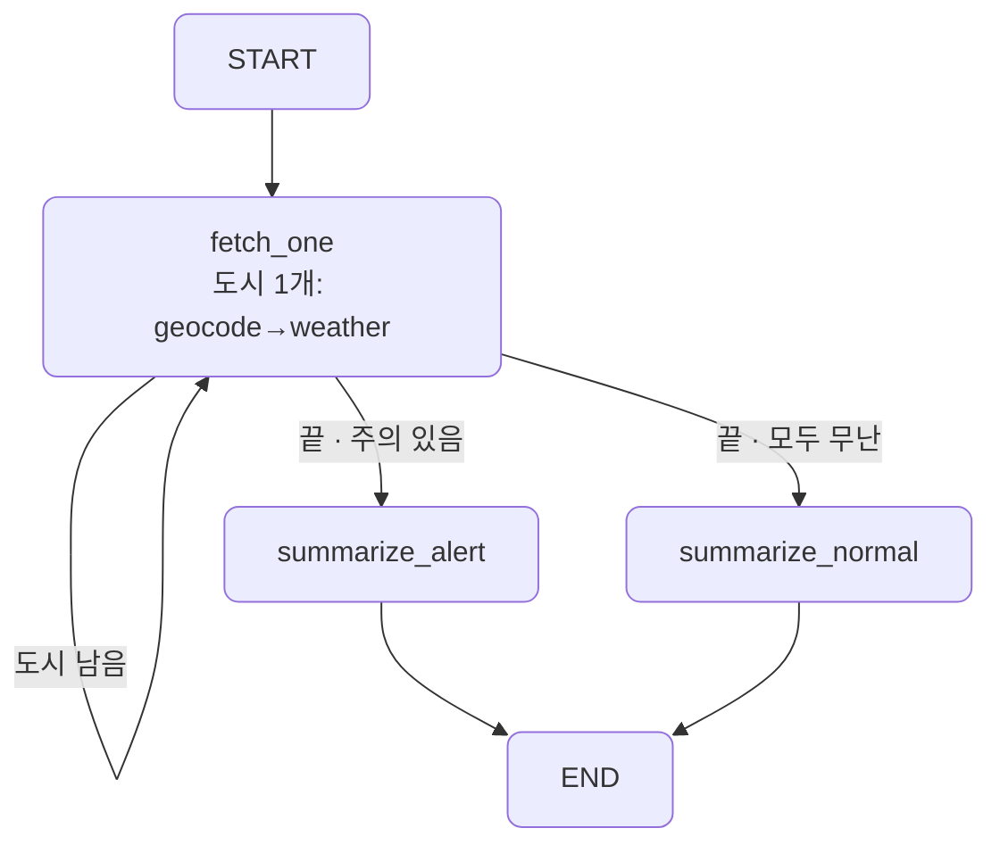
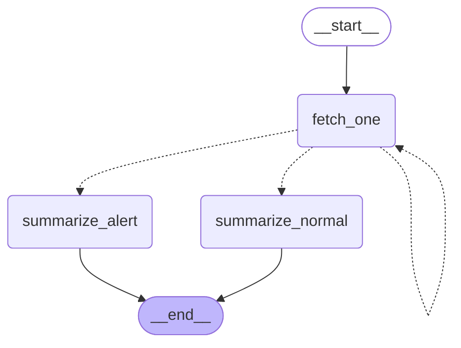

# lec06 — LangGraph 실전

> - S3 개요: [docs/section3/README.md](../README.md)
> - 분량 18분
> - 산출물: 자동화 그래프

## 1. 목표

분기와 루프가 있는 흐름을 LangGraph로 짭니다. 조건에 따라 도구를 반복 호출하거나 갈래를 나누는 자동화 그래프를 만듭니다. lec05의 그래프가 모델이 운전하는 에이전트였다면, 여기서는 흐름을 우리가 설계합니다.



## 2. 모델이 운전하나, 우리가 설계하나

lec05의 그래프는 에이전트였습니다. 모델이 매 스텝 무엇을 할지 정했습니다. lec06은 다릅니다. 흐름을 우리가 노드와 엣지로 설계하고, 도구는 정해진 자리에서 자동으로 불립니다. 그래프가 에이전트가 아니라 워크플로 엔진이 됩니다.

| | lec05 (기초) | lec06 (실전) |
| --- | --- | --- |
| 흐름을 정하는 주체 | 모델이 매 스텝 | 우리가 노드·엣지로 |
| 그래프 성격 | 에이전트 루프 | 워크플로 자동화 |
| 도구 호출 | 모델이 고름 | 정해진 자리에서 자동 |
| 루프·분기 | model↔tools 한 루프 | 우리가 짠 루프 + 갈래 |

여기서는 도시 목록의 날씨 브리핑을 자동으로 만듭니다. 도시를 하나씩 도는 루프와, 주의 도시 유무로 갈래를 나누는 분기를 우리가 짭니다.

## 3. 루프와 분기 — 한 조건 엣지로

`fetch_one`은 도시 하나의 날씨를 가져와 보고에 더하고 `index`를 한 칸 밉니다. 그다음 `route`가 어디로 갈지 정합니다.

```python
def route(state):
    if state["index"] < len(state["cities"]):
        return "fetch_one"          # 루프: 다음 도시로 되돌아감
    if any(r["warn"] for r in state["reports"]):
        return "summarize_alert"    # 갈래: 주의 도시 있음
    return "summarize_normal"       # 갈래: 모두 무난
```

한 조건 엣지가 셋을 가립니다. 도시가 남았으면 `fetch_one`으로 되돌아가 루프를 돌고, 다 처리했으면 비·눈 도시가 있는지 보고 알림형·일반형 요약으로 갈래를 나눕니다. 루프도 분기도 같은 `route` 하나가 정합니다.



lec05에서는 모델이 매 스텝을 정했습니다. 여기서는 `route`가, 곧 우리가 정합니다. 도구(geocode·weather)는 `fetch_one`이라는 정해진 자리에서 자동으로 불리고, 모델은 마지막 요약에서만 씁니다.

## 4. 그래프가 스스로 그린다

lec05처럼 그래프가 자기 모습을 그립니다. 자동화의 구조가 그대로 드러납니다.



`fetch_one`에서 자기 자신으로 가는 점선이 루프입니다. 거기서 `summarize_alert`·`summarize_normal`로 갈라지는 두 점선이 분기입니다. 점선은 조건 엣지라, `route`가 그때그때 하나를 고릅니다.

## 5. 예제 코드가 하는 일 및 결과

[graph.py](../../../src/section3/lec06/graph.py)는 도시 목록을 받아, 노드별로 도는 과정을 보이며 브리핑까지 자동으로 만듭니다.

```bash
uv run python src/section3/lec06/graph.py
```

```text
=== 자동화 실행: ['Seoul', 'Tokyo', 'London'] ===
  [fetch_one] Seoul 처리 (index→1)
  [fetch_one] Tokyo 처리 (index→2)
  [fetch_one] London 처리 (index→3)
  [summarize_normal] 갈래 선택

수집한 보고:
Seoul: 17.5도, 흐림
Tokyo: 18.5도, 대체로 맑음
London: 18.1도, 대체로 맑음

브리핑: 현재 서울은 17.5도로 흐린 날씨를 보이며, 도쿄와 런던은 18도 안팎의 기온 속에 대체로 맑습니다.
```

읽어낼 점입니다.

- 모델이 아니라 우리가 흐름을 짰습니다. `fetch_one`이 도시를 하나씩 처리하고, `route`가 다음 갈래를 정합니다.
- 루프가 세 번 돕니다. `index`가 1·2·3으로 밀리며 `fetch_one`이 자기 자신으로 되돌아옵니다. 도시마다 geocode·weather가 자동으로 불립니다.
- 이 실행은 세 도시 모두 비가 없어 `summarize_normal`로 갔습니다. 한 도시라도 비·눈이면 `summarize_alert`로 갑니다. 날씨는 실시간이라 그날에 따라 갈래가 달라집니다.

## 6. 정리

- 실전 그래프는 흐름을 우리가 설계합니다. 모델이 매 스텝을 정하는 에이전트와 달리, 노드·엣지로 루프와 분기를 직접 짭니다.
- 한 조건 엣지가 루프와 분기를 함께 정할 수 있습니다. 남은 일이 있으면 되돌아가고, 끝났으면 조건에 따라 갈래를 나눕니다.
- 도구는 정해진 자리에서 자동으로 불립니다. 모델은 그래프의 한 노드(요약)로 들어갑니다.
- 같은 그래프 그림이 자동화의 구조를 그대로 보여 줍니다. 루프는 되돌아오는 엣지, 분기는 여러 갈래의 조건 엣지입니다.
