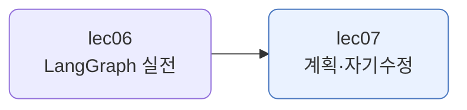
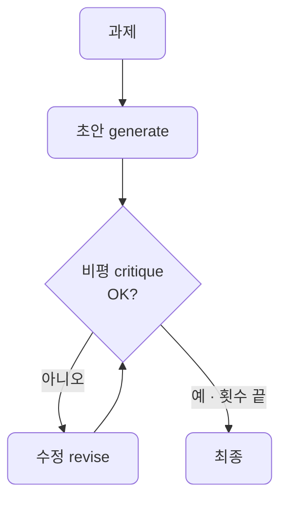

# lec07 — 계획 수립과 자기수정

> - S3 개요: [docs/section3/README.md](../README.md)
> - 분량 12분
> - 산출물: 계획·자기수정 에이전트

## 1. 목표

에이전트의 두 가지 아키텍처를 다룹니다. 먼저 전체 계획을 세우고 실행하는 계획 수립(plan-and-execute)과, 자기 출력을 비평하고 고치는 자기수정(reflection)입니다. 둘 다 LangGraph 없이 우리 async 루프로 짜서, 이것이 프레임워크가 아니라 패턴임을 봅니다.



## 2. 반응형, 그리고 또 다른 두 패턴

지금까지의 에이전트는 반응형이었습니다. 모델이 매 스텝 결과를 보고 다음 행동을 즉흥으로 정했습니다. lec02~03의 도구 루프가 그랬습니다. 이번에는 행동을 정하는 시점이 다른 두 패턴을 봅니다.

| 패턴 | 행동을 정하는 시점 | 핵심 |
| --- | --- | --- |
| 반응형 (lec02~03) | 매 스텝 즉흥 | 결과를 보고 다음 행동을 고름 |
| 계획 수립 | 처음에 전체 계획 | 선계획 후 그대로 실행 |
| 자기수정 | 만든 뒤 다시 봄 | 자기 출력을 비평하고 고침 |

같은 일도 어느 패턴으로 푸느냐에 따라 흐름이 다릅니다. 패턴은 프레임워크가 아니라 흐름의 모양이라, LangGraph로도 plain 코드로도 짤 수 있습니다. 여기서는 plain async로 짜 그 점을 분명히 합니다.

## 3. 계획 수립 — plan-and-execute

먼저 과제를 단계로 쪼개는 계획을 세우고, 그 계획대로 단계를 차례로 실행한 뒤, 결과를 종합합니다. 반응형이 한 걸음씩 즉흥으로 가는 것과 달리, 길을 먼저 그려 두고 갑니다. 길이 복잡할수록 흐트러지지 않습니다.


```python
async def run(task):
    steps = await make_plan(task)        # 1. 과제를 단계로 쪼갬
    results = []
    for step in steps:                   # 2. 단계마다 실행 (앞 결과를 참고)
        results.append(await acomplete(_msg(EXECUTOR, ...)))
    return await acomplete(_msg(SYNTH, ...))   # 3. 종합
```

[plan_execute.py](../../../src/section3/lec07/plan_execute.py)를 실행한 결과입니다.

```text
과제: 초보자에게 RAG가 무엇인지 설명하는 짧은 글을 써줘.

세운 계획:
  1. LLM은 학습된 지식만 알아 최신 정보에 약하다
  2. RAG는 외부에서 정보를 찾아 LLM에 제공한다
  3. 질문과 관련된 문서를 자료에서 검색한다
  4. 찾은 정보로 더 정확한 답을 만든다

종합한 글:
대규모 언어 모델(LLM)은 학습된 지식에만 의존하여 최신 정보나 특정 질문에 약합니다. RAG는
이 한계를 넘으려고 외부 정보를 검색해 제공합니다. 질문을 받으면 먼저 방대한 자료에서 관련
문서를 찾고, 그 정보를 모델에 함께 넘겨 더 정확하고 풍부한 답을 만듭니다.
```

모델이 먼저 네 단계의 계획을 세우고, 그 순서대로 채운 뒤 한 편의 글로 합쳤습니다. 계획이 눈에 보이니, 어디서 어긋났는지도 보기 쉽습니다.

## 4. 자기수정 — reflection

한 번에 잘 쓰기는 어렵습니다. 사람도 초안을 쓰고 다시 읽고 고칩니다. 자기수정 에이전트는 그 과정을 모델이 스스로 합니다. 초안을 만들고, 자기 출력을 비평하고, 비평을 반영해 고칩니다. 충분히 좋아지거나 정해진 횟수에 이르면 멈춥니다.



```python
async def run(task, max_rounds=2):
    draft = await acomplete(_msg(WRITER, task))   # 초안
    for _ in range(max_rounds):
        critique = await acomplete(_msg(CRITIC, ...))    # 비평
        if _is_satisfied(critique):                      # OK면 멈춤
            break
        draft = await acomplete(_msg(REVISER, ...))      # 수정
    return draft
```

[reflection.py](../../../src/section3/lec07/reflection.py)를 최대공약수 함수로 돌리면, 코드가 눈에 띄게 좋아집니다.

```text
=== 초안 ===
def gcd(a, b):
    a, b = abs(a), abs(b)
    while b:
        a, b = b, a % b
    return a

=== 1차 비평 ===
입력 타입 검증이 없습니다. 정수가 아닌 값이 와도 걸러지지 않습니다.

=== 1차 수정 ===
def gcd(a, b):
    if not isinstance(a, int) or not isinstance(b, int):
        raise TypeError("정수만 받습니다")
    ...

=== 2차 비평 ===
타입 힌트를 더하면 가독성이 좋아집니다.

=== 2차 수정 ===
def gcd(a: int, b: int) -> int:
    ...
```

스스로 비평한 점이 다음 수정에 반영됩니다. 1차에서 타입 검증을, 2차에서 타입 힌트를 더해, 초안보다 단단한 코드가 됩니다. 비평이 OK를 내거나 횟수가 차면 멈춥니다.

## 5. 정리

- 반응형 말고도 에이전트를 짜는 패턴이 있습니다. 계획 수립은 길을 먼저 그리고, 자기수정은 만든 뒤 다시 봅니다.
- 계획 수립은 과제를 단계로 쪼개 선계획한 뒤 실행하고 종합합니다. 계획이 눈에 보여 흐트러지지 않습니다.
- 자기수정은 초안을 비평하고 고치기를 반복합니다. 한 번에 못 낸 품질을 반복으로 끌어올립니다.
- 둘 다 LangGraph 없이 plain 코드로 짰습니다. 패턴은 흐름의 모양이라 프레임워크에 매이지 않습니다.
