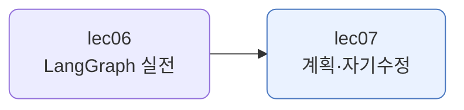
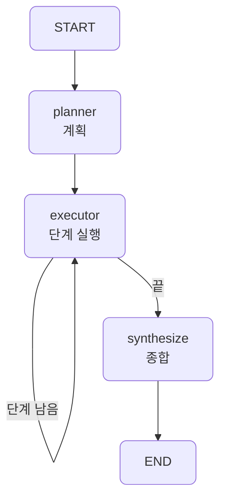
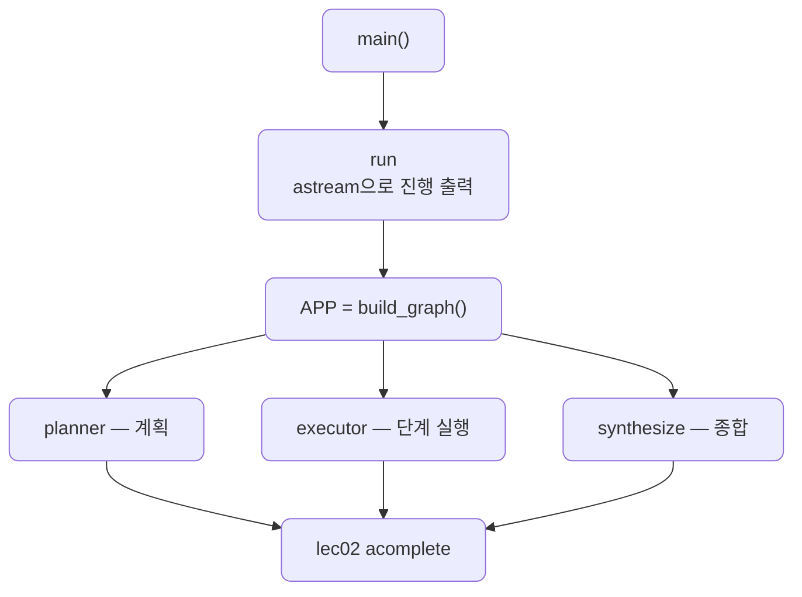
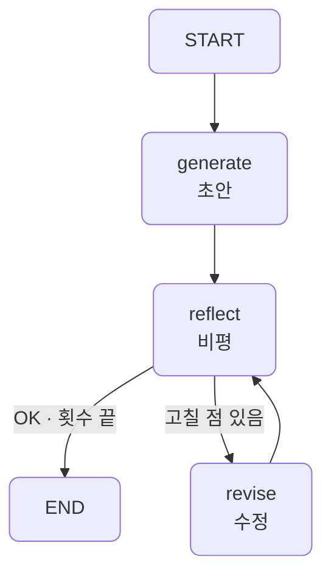
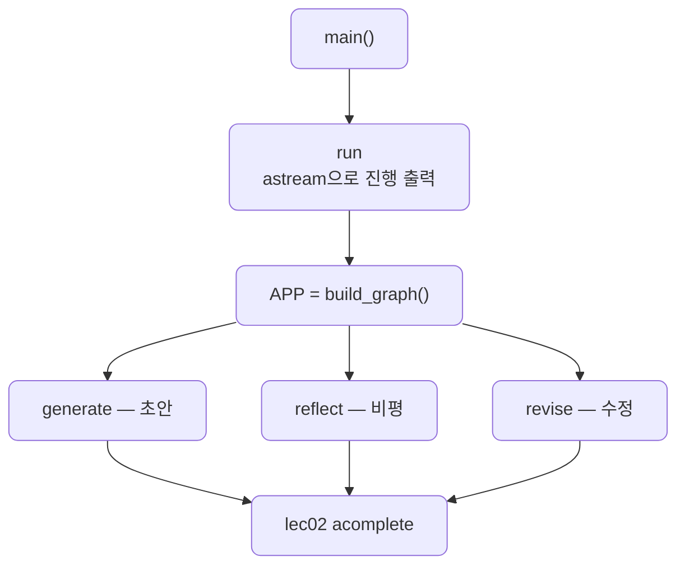

# lec07 — 계획 수립과 자기수정

> - S3 개요: [docs/section3/README.md](../README.md)
> - 분량 12분
> - 산출물: 계획·자기수정 에이전트

## 1. 목표

에이전트의 두 가지 아키텍처를 다룹니다. 먼저 전체 계획을 세우고 실행하는 계획 수립(plan-and-execute)과, 자기 출력을 비평하고 고치는 자기수정(reflection)입니다. 둘 다 LangGraph로 짭니다. lec05~06에서 익힌 상태·조건 엣지·루프를, 단일 에이전트가 아니라 이런 에이전트 아키텍처를 짜는 데 다시 씁니다.



## 2. 반응형, 그리고 또 다른 두 패턴

지금까지의 에이전트는 반응형이었습니다. 모델이 매 스텝 결과를 보고 다음 행동을 즉흥으로 정했습니다. lec02~03의 도구 루프가 그랬습니다. 이번에는 행동을 정하는 시점이 다른 두 패턴을 봅니다.

| 패턴 | 행동을 정하는 시점 | 핵심 |
| --- | --- | --- |
| 반응형 (lec02~03) | 매 스텝 즉흥 | 결과를 보고 다음 행동을 고름 |
| 계획 수립 | 처음에 전체 계획 | 선계획 후 그대로 실행 |
| 자기수정 | 만든 뒤 다시 봄 | 자기 출력을 비평하고 고침 |

두 패턴 모두 본질이 흐름입니다. 계획대로 단계를 도는 루프, 만족할 때까지 고치는 루프. 흐름이 핵심이라 plain 코드로도 짤 수 있지만, 루프와 분기가 또렷한 LangGraph가 잘 맞습니다. 흐름이 for·if에 숨는 대신 노드·엣지로 드러나고, 그래프가 스스로 그려집니다.

## 3. 계획 수립 — plan-and-execute

먼저 과제를 단계로 쪼개는 계획을 세우고(`planner`), 그 계획대로 단계를 하나씩 실행하며(`executor`), 단계가 다 끝나면 `synthesize`로 종합합니다. `executor`는 단계가 남는 동안 자기 자신으로 되돌아옵니다. lec06에서 본 카운터 루프입니다.

```python
def route(state):
    if state["step"] < len(state["plan"]):
        return "executor"      # 루프: 다음 단계로
    return "synthesize"        # 끝: 종합으로

graph.add_edge("planner", "executor")
graph.add_conditional_edges("executor", route, {"executor": "executor", "synthesize": "synthesize"})
```



코드는 노드 셋과 그것을 잇는 `build_graph`, 그래프를 돌리는 `run`으로 이뤄집니다. `planner`는 과제를 단계 목록으로 쪼개 상태의 `plan`에 넣고, `executor`는 `plan[step]`을 실행해 `results`에 더하며 `step`을 한 칸 밉니다. `synthesize`는 단계 결과들을 한 편의 글로 합칩니다. 셋 다 lec02의 `acomplete`로 모델을 부르고, `run`은 `astream`으로 노드가 도는 과정을 찍습니다.



단계는 앞 결과에 기대므로 순차로 돕니다. lec06의 도시들이 서로 독립이라 `Send`로 병렬이던 것과 대비됩니다. [plan_execute.py](../../../src/section3/lec07/plan_execute.py)를 실행한 결과입니다.

```text
과제: 초보자에게 RAG가 무엇인지 설명하는 짧은 글을 써줘.
  [planner] 5단계 계획 수립
  [executor] 1단계까지 실행
  [executor] 2단계까지 실행
  [executor] 3단계까지 실행
  [executor] 4단계까지 실행
  [executor] 5단계까지 실행
  [synthesize] 종합

세운 계획:
  1. RAG(Retrieval-Augmented Generation)는 대규모 언어 모델(LLM)의 답변 능력을 향상시키는 기술입니다.
  2. LLM은 방대한 정보를 학습했지만, 최신 정보나 아주 특정 분야의 지식에는 한계가 있거나 잘못된 정보를 지어낼(환각) 수 있습니다.
  3. RAG는 이런 문제를 해결하기 위해, LLM이 질문을 받으면 먼저 외부 데이터베이스나 문서에서 가장 관련성 높은 정보를 *찾아옵니다* (Retrieval).
  4. 그리고 이 찾아온 정보를 LLM의 입력으로 *함께 제공하여* 더 정확하고 신뢰할 수 있는 답변을 *생성하게* 만듭니다 (Augmented Generation).
  5. 쉽게 말해, 똑똑한 학생이 답을 모를 때 시험 중에 참고 자료를 *찾아보고* (검색), 그 자료를 바탕으로 정답을 *작성하는* 것과 같습니다.

종합한 글:
RAG(Retrieval-Augmented Generation)는 대규모 언어 모델(LLM)의 답변 능력을 향상시키는 기술입니다. LLM은 방대한 데이터를 학습했지만, 최신 정보나 아주 특정 분야의 지식에는 한계가 있거나 사실과 다른 내용을 생성(환각)하기도 합니다. RAG는 이러한 문제점을 보완하기 위해 외부 정보를 활용합니다.

사용자가 질문을 하면, RAG는 먼저 외부 데이터베이스나 문서에서 질문과 가장 관련성이 높은 정보를 *찾아옵니다*. 이 과정이 바로 '검색(Retrieval)' 단계입니다. 이어서 RAG는 이렇게 찾아온 정보를 마치 참고 자료처럼 LLM의 입력 프롬프트에 함께 넣어줍니다. 덕분에 LLM은 단순히 학습된 지식뿐만 아니라 외부의 정확한 정보까지 활용하여 더욱 신뢰성 있고 사실에 기반한 답변을 *생성하게* 되는데, 이 과정이 '강화된 생성(Augmented Generation)'입니다.

쉽게 말해, RAG는 똑똑한 학생이 답을 모를 때 시험 중에 참고 자료를 찾아보고(검색), 그 자료를 바탕으로 정답을 작성하는 것과 같습니다. 덕분에 LLM은 더 정확하고 믿을 수 있는 답변을 제공할 수 있게 됩니다.
```

모델이 먼저 다섯 단계 계획을 세우고, executor 루프가 단계마다 한 칸씩 돌며 채운 뒤, 종합합니다. 계획이 상태에 남아 있어 어디까지 왔는지가 또렷합니다.

## 4. 자기수정 — reflection

한 번에 잘 쓰기는 어렵습니다. 사람도 초안을 쓰고 다시 읽고 고칩니다. 자기수정은 그 과정을 그래프로 짭니다. `generate`로 초안을 만들고 `reflect`로 비평한 뒤, 충분히 좋거나 횟수가 차면 끝내고, 아니면 `revise`로 고쳐 다시 `reflect`로 돌아옵니다. 되돌아오는 엣지가 만드는 사이클입니다.

```python
def route(state):
    if _is_satisfied(state["critique"]) or state["rounds"] >= MAX_ROUNDS:
        return END
    return "revise"

graph.add_conditional_edges("reflect", route, {"revise": "revise", END: END})
graph.add_edge("revise", "reflect")   # 사이클
```



코드는 노드 셋과 `build_graph`, `run`으로 이뤄집니다. `generate`는 초안을, `reflect`는 비평을, `revise`는 고친 초안을 만듭니다. 셋 다 lec02의 `acomplete`로 모델을 부릅니다. `build_graph`가 `reflect` 뒤에 `route`로 갈래를 두어 사이클을 만들고, `run`은 `astream`으로 진행을 찍습니다.



[reflection.py](../../../src/section3/lec07/reflection.py)를 최대공약수 함수로 돌리면, 비평이 다음 수정에 반영되어 코드가 단단해집니다.

```text
과제: 파이썬으로 두 정수의 최대공약수를 구하는 함수를 작성해줘.
  [generate] 초안 갱신
  [reflect] 비평 → 고칠 점 있음
  [revise] 초안 갱신
  [reflect] 비평 → 고칠 점 있음
  [revise] 초안 갱신
  [reflect] 비평 → 고칠 점 있음

최종:
def gcd(a: int, b: int) -> int:
    """
    두 정수의 최대공약수(GCD)를 유클리드 호제법을 사용하여 계산합니다.
    GCD는 일반적으로 양수로 정의되므로, 결과는 항상 음이 아닌 정수입니다.
    ...
    Raises:
        TypeError: 입력값이 정수가 아닐 경우 발생합니다.
    """
    # 런타임 타입 유효성 검사
    if not isinstance(a, int) or not isinstance(b, int):
        raise TypeError("gcd() 함수의 인자는 정수여야 합니다.")

    # GCD는 일반적으로 양수로 정의되므로, 입력의 절댓값을 취합니다.
    a = abs(a)
    b = abs(b)

    while b:
        a, b = b, a % b
    return a

if __name__ == "__main__":
    print(f"gcd(48, 18) = {gcd(48, 18)}")   # 6
    print(f"gcd(-12, 8) = {gcd(-12, 8)}")   # 4 (절댓값 처리)
    # ... 0·서로소·타입 오류 등 더 많은 케이스
```

`reflect`가 매번 "고칠 점 있음"을 내 `revise`로 갔다가 다시 `reflect`로 돌아왔고, `rounds`가 `MAX_ROUNDS`(여기서는 2)에 닿아 멈췄습니다. 비평이 "OK"였다면 그 자리에서 곧장 끝났을 것입니다. 한 바퀴씩 돌며 초안에 없던 타입 검증·절댓값 처리·타입 힌트·docstring·테스트 케이스가 더해져 코드가 단단해졌습니다.

## 5. 정리

- 반응형 말고도 에이전트를 짜는 패턴이 있습니다. 계획 수립은 길을 먼저 그리고, 자기수정은 만든 뒤 다시 봅니다.
- 계획 수립은 planner → executor 루프 → synthesize입니다. 한 조건 엣지가 단계 루프와 종료를 가릅니다.
- 자기수정은 generate → reflect → revise의 사이클입니다. 만족하거나 횟수가 차면 멈춥니다.
- 두 패턴은 흐름이라 plain으로도 짤 수 있지만, lec05~06의 상태·조건 엣지·루프로 짜면 흐름이 그래프로 드러나고 스스로 그려집니다.
